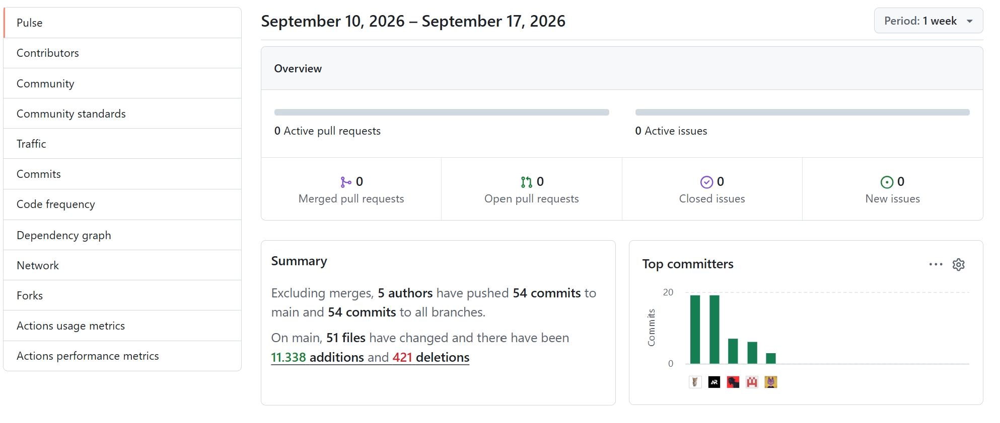

  

Universidad Peruana de Ciencias Aplicadas

Carrera de Ingeniería de Software

**1ACC0238**

**Aplicaciones para Dispositivos Móviles**

NRC

**13984**

**Informe del Trabajo Final**

Docente

**Quevedo Velasco, David Gerardo**

Equipo

**Yachiqo**

Proyecto

**SpotGo**

**Integrantes**

<table style="width: auto; border-collapse: collapse; text-align: center;">
  <thead>
    <tr>
      <th style="padding: 8px; border: 1px solid #666; text-align: center;">Código</th>
      <th style="padding: 8px; border: 1px solid #666; text-align: center;">Apellidos, Nombres</th>
    </tr>
  </thead>
  <tbody>
    <tr>
      <td style="padding: 8px; border: 1px solid #666; text-align: center;">U20241E177</td>
      <td style="padding: 8px; border: 1px solid #666; text-align: center;">Ruiz Mideyros, Adrian</td>
    </tr>
    <tr>
      <td style="padding: 8px; border: 1px solid #666; text-align: center;">U202317099</td>
      <td style="padding: 8px; border: 1px solid #666; text-align: center;">Rojas Tello, Nestor Alonso</td>
    </tr>
    <tr>
      <td style="padding: 8px; border: 1px solid #666; text-align: center;">U20241D995</td>
      <td style="padding: 8px; border: 1px solid #666; text-align: center;">Contreras Rojas, Cesar Jair</td>
    </tr>
    <tr>
      <td style="padding: 8px; border: 1px solid #666; text-align: center;">U20241D932</td>
      <td style="padding: 8px; border: 1px solid #666; text-align: center;">Carhuaz Centeno, Briguite Eryka</td>
    </tr>
    <tr>
      <td style="padding: 8px; border: 1px solid #666; text-align: center;">U20231B120</td>
      <td style="padding: 8px; border: 1px solid #666; text-align: center;">Cotrina Siclla, Sofia Alessandra</td>
    </tr>
  </tbody>
</table>

**Período 202620**

**Setiembre 2026**

---

# Registro de versiones del informe

| Versión | Fecha | Autor | Descripción de modificación |
| --- | --- | --- | --- |
| 0.1.0 | 1/9/26 | @AdrixRyz | docs: agregar estructura inicial de la documentación |
| 0.1.1 | 1/9/26 | @AdrixRyz | docs: agregar los puntos de Startup Profile |

# Project Report Collaboration Insights

**Repositorio de la documentación del proyecto:** [https://github.com/yachiqo-upc/spotgo-docs](https://github.com/yachiqo-upc/spotgo-docs)

A continuación, se detallan las actividades realizadas en cada entrega, la participación de los miembros del equipo, y las evidencias correspondientes.

**AV1**

# Contenido

**Registro de versiones del informe**

**Project Report Collaboration Insights**

**Contenido**

**Student Outcome**

**Objetivos SMART**

[**Capítulo I: Presentación**](10-chap-1.md)  
1.1. Startup Profile  
1.1.1. Descripción de la Startup  
1.1.2. Perfiles de integrantes del equipo  
1.2. Solution Profile  
1.2.1. Antecedentes y problemática  
1.2.2. Lean UX Process  
1.2.2.1. Lean UX Problem Statements  
1.2.2.2. Lean UX Assumptions  
1.2.2.3. Lean UX Hypothesis Statements  
1.2.2.4. Lean UX Canvas  
1.3. Segmentos objetivo  

[**Capítulo II: Requirements Development and Software Solution Design**](20-chap-2.md)  
2.1. Competidores  
2.1.1. Análisis competitivo  
2.1.2. Estrategias y tácticas frente a competidores  
2.2. Entrevistas  
2.2.1. Diseño de entrevistas  
2.2.2. Registro de entrevistas  
2.2.3. Análisis de entrevistas  
2.3. Needfinding  
2.3.1. User Personas  
2.3.2. User Task Matrix  
2.3.3. User Journey Mapping  
2.3.4. Empathy Mapping  
2.3.5. Big Picture EventStorming  
2.3.6. Ubiquitous Language  
2.4. Requirements specification  
2.4.1. User Stories  
2.4.2. Impact Mapping  
2.4.3. Product Backlog  
2.5. Strategic-Level Domain-Driven Design  
2.5.1. EventStorming  
2.5.1.1. Candidate Context Discovery  
2.5.1.2. Domain Message Flows Modeling  
2.5.1.3. Bounded Context Canvases  
2.5.2. Context Mapping  
2.5.3. Software Architecture  
2.5.3.1. Software Architecture Context Level Diagrams  
2.5.3.2. Software Architecture Container Level Diagrams  
2.5.3.3. Software Architecture Deployment Diagrams  
2.6. Tactical-Level Domain-Driven Design  
[**2.6.1. Bounded Context: <Bounded Context 1 Name>**](21-bounded-1.md)  
2.6.1.1. Domain Layer  
2.6.1.2. Interface Layer  
2.6.1.3. Application Layer  
2.6.1.4. Infrastructure Layer  
2.6.1.5. Bounded Context Software Architecture Component Level Diagrams  
2.6.1.6. Bounded Context Software Architecture Code Level Diagrams  
2.6.1.6.1. Bounded Context Domain Layer Class Diagrams  
2.6.1.6.2. Bounded Context Database Design Diagram  
[**2.6.2. Bounded Context: <Bounded Context 2 Name>**](22-bounded-2.md)  
2.6.2.1. Domain Layer  
2.6.2.2. Interface Layer  
2.6.2.3. Application Layer  
2.6.2.4. Infrastructure Layer  
2.6.2.5. Bounded Context Software Architecture Component Level Diagrams  
2.6.2.6. Bounded Context Software Architecture Code Level Diagrams  
2.6.2.6.1. Bounded Context Domain Layer Class Diagrams  
2.6.2.6.2. Bounded Context Database Design Diagram  
[**2.6.3. Bounded Context: <Bounded Context 3 Name>**](23-bounded-3.md)  
2.6.3.1. Domain Layer  
2.6.3.2. Interface Layer  
2.6.3.3. Application Layer  
2.6.3.4. Infrastructure Layer  
2.6.3.5. Bounded Context Software Architecture Component Level Diagrams  
2.6.3.6. Bounded Context Software Architecture Code Level Diagrams  
2.6.3.6.1. Bounded Context Domain Layer Class Diagrams  
2.6.3.6.2. Bounded Context Database Design Diagram  
[**2.6.4. Bounded Context: <Bounded Context 4 Name>**](24-bounded-4.md)  
2.6.4.1. Domain Layer  
2.6.4.2. Interface Layer  
2.6.4.3. Application Layer  
2.6.4.4. Infrastructure Layer  
2.6.4.5. Bounded Context Software Architecture Component Level Diagrams  
2.6.4.6. Bounded Context Software Architecture Code Level Diagrams  
2.6.4.6.1. Bounded Context Domain Layer Class Diagrams  
2.6.4.6.2. Bounded Context Database Design Diagram  

[**Conclusiones**](70-conclusions.md)  
[**Glosario**](80-glossary.md)  
[**Bibliografía**](90-bibliography.md)  
[**Anexos**](99-annexes.md)

# Student Outcome

| Criterio específico | Acciones realizadas | Conclusiones |
| --- | --- | --- |
| Actualiza conceptos y conocimientos necesarios para su desarrollo profesional y en especial para su proyecto en soluciones de software | **Ruiz Mideyros, Adrian (U20241E177)** **AV1:** Text  **Rojas Tello, Nestor Alonso (U202317099)** **AV1:** Text  **Contreras Rojas, Cesar Jair (U20241D995)** **AV1:** Text  **Carhuaz Centeno, Briguite Eryka (U20241D932)** **AV1:** Text  **Cotrina Siclla, Sofia Alessandra (U20231B120)** **AV1:** Text | **AV1:** Text |
| Reconoce la necesidad del aprendizaje permanente para el desempeño profesional y el desarrollo de proyectos en soluciones de software. | **Ruiz Mideyros, Adrian (U20241E177)** **AV1:** Text  **Rojas Tello, Nestor Alonso (U202317099)** **AV1:** Text  **Contreras Rojas, Cesar Jair (U20241D995)** **AV1:** Text  **Carhuaz Centeno, Briguite Eryka (U20241D932)** **AV1:** Text  **Cotrina Siclla, Sofia Alessandra (U20231B120)** **AV1:** Text | **AV1:** Text |

# Objetivos SMART
