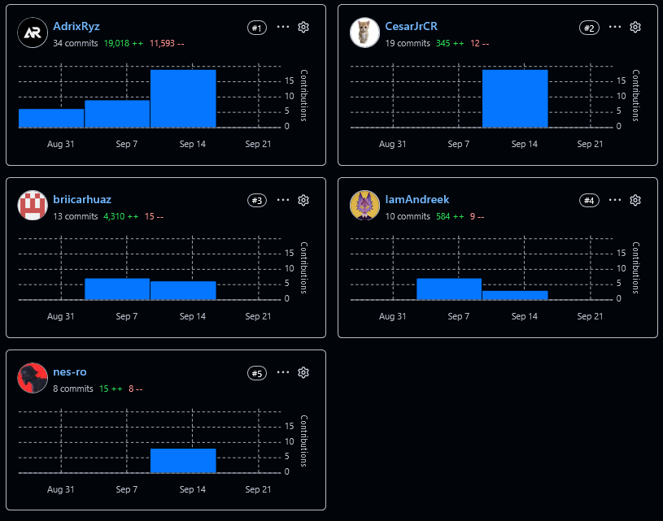
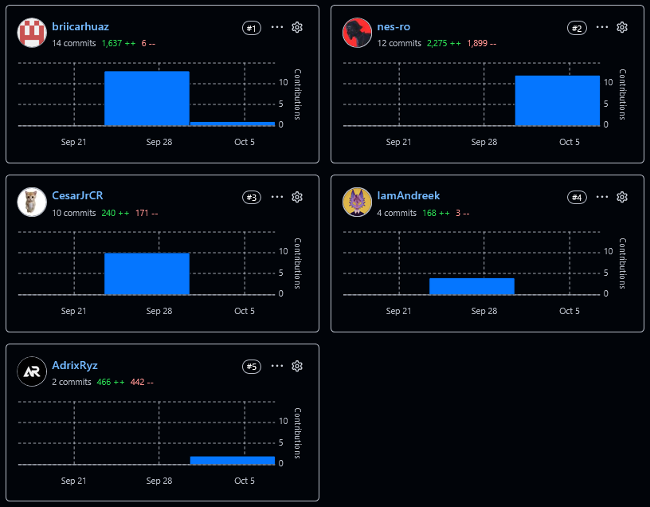

Universidad Peruana de Ciencias Aplicadas

Carrera de Ingeniería de Software

**1ACC0238**

**Aplicaciones para Dispositivos Móviles**

NRC

**13984**

**Informe del Trabajo Final**

Docente

**Quevedo Velasco, David Gerardo**

Equipo

**Yachiqo**

Proyecto

**SpotGo**

**Integrantes**

<table style="width: auto; border-collapse: collapse; text-align: center;">
  <thead>
    <tr>
      <th style="padding: 8px; border: 1px solid #666; text-align: center;">Código</th>
      <th style="padding: 8px; border: 1px solid #666; text-align: center;">Apellidos, Nombres</th>
    </tr>
  </thead>
  <tbody>
    <tr>
      <td style="padding: 8px; border: 1px solid #666; text-align: center;">U20241E177</td>
      <td style="padding: 8px; border: 1px solid #666; text-align: center;">Ruiz Mideyros, Adrian</td>
    </tr>
    <tr>
      <td style="padding: 8px; border: 1px solid #666; text-align: center;">U202317099</td>
      <td style="padding: 8px; border: 1px solid #666; text-align: center;">Rojas Tello, Nestor Alonso</td>
    </tr>
    <tr>
      <td style="padding: 8px; border: 1px solid #666; text-align: center;">U20241D995</td>
      <td style="padding: 8px; border: 1px solid #666; text-align: center;">Contreras Rojas, Cesar Jair</td>
    </tr>
    <tr>
      <td style="padding: 8px; border: 1px solid #666; text-align: center;">U20241D932</td>
      <td style="padding: 8px; border: 1px solid #666; text-align: center;">Carhuaz Centeno, Briguite Eryka</td>
    </tr>
    <tr>
      <td style="padding: 8px; border: 1px solid #666; text-align: center;">U20231B120</td>
      <td style="padding: 8px; border: 1px solid #666; text-align: center;">Cotrina Siclla, Sofia Alessandra</td>
    </tr>
  </tbody>
</table>

**Período 202620**

**Octubre 2026**

---

# Registro de versiones del informe

| Versión | Fecha | Autor | Descripción de modificación |
| --- | --- | --- | --- |
| 0.1.0 | 04/09/26 | @AdrixRyz | docs: copiar y ajustar todos los puntos previos de SpotGo hasta Requirements specification al nuevo proyecto |
| 0.1.1 | 10/09/26 | @briicarhuaz | docs: agregar todos los puntos de EventStorming |
| 0.1.2 | 12/09/26 | @IamAndreek | docs: agregar los puntos de Context Mapping y Software Architecture |
| 0.1.3 | 14/09/26 | @CesarJrCR | docs: agregar parte de los puntos de Tactical-Level Domain-Driven Design |
| 0.1.4 | 15/09/26 | @nes-ro | docs: agregar parte de los puntos de Tactical-Level Domain-Driven Design |
| 0.1.5 | 16/09/26 | @AdrixRyz | docs: revisar todos los puntos agregados del AV1 |
| 0.2.0 | 29/09/26 | @nes-ro | docs: corregir los errores del AV1 |
| 0.2.1 | 30/09/26 | @IamAndreek | docs: agregar todos los puntos de Style Guidelines |
| 0.2.2 | 30/09/26 | @IamAndreek | docs: agregar todos los puntos de Information Arquitecture |
| 0.2.3 | 01/10/26 | @briicarhuaz | docs: agregar todos los puntos de Landing Page UI Design |
| 0.2.4 | 02/10/26 | @briicarhuaz | docs: agregar todos los puntos de Mobile Applications UX/UI Design |
| 0.2.5 | 03/10/26 | @CesarJrCR | docs: agregar todos los puntos de Software Configuration Management |
| 0.2.6 | 05/10/26 | @nes-ro | docs: agregar todos los puntos de Sprint 1 |
| 0.2.7 | 06/10/26 | @AdrixRyz | docs: realizar correciones finales para el TB1 |

# Project Report Collaboration Insights

**Repositorio de la documentación del proyecto:** [https://github.com/yachiqo-upc/spotgo-docs](https://github.com/yachiqo-upc/spotgo-docs)

**AV1**

*Report Insights AV1*

**TB1**

*Report Insights TB1*

# Contenido

**Registro de versiones del informe**

**Project Report Collaboration Insights**

**Contenido**

**Student Outcome**

**Objetivos SMART**

[**Capítulo I: Presentación**](10-chap-1.md)  
1.1. Startup Profile  
1.1.1. Descripción de la Startup  
1.1.2. Perfiles de integrantes del equipo  
1.2. Solution Profile  
1.2.1. Antecedentes y problemática  
1.2.2. Lean UX Process  
1.2.2.1. Lean UX Problem Statements  
1.2.2.2. Lean UX Assumptions  
1.2.2.3. Lean UX Hypothesis Statements  
1.2.2.4. Lean UX Canvas  
1.3. Segmentos objetivo  

[**Capítulo II: Requirements Development and Software Solution Design**](20-chap-2.md)  
2.1. Competidores  
2.1.1. Análisis competitivo  
2.1.2. Estrategias y tácticas frente a competidores  
2.2. Entrevistas  
2.2.1. Diseño de entrevistas  
2.2.2. Registro de entrevistas  
2.2.3. Análisis de entrevistas  
2.3. Needfinding  
2.3.1. User Personas  
2.3.2. User Task Matrix  
2.3.3. User Journey Mapping  
2.3.4. Empathy Mapping  
2.3.5. Big Picture EventStorming  
2.3.6. Ubiquitous Language  
2.4. Requirements specification  
2.4.1. User Stories  
2.4.2. Impact Mapping  
2.4.3. Product Backlog  
2.5. Strategic-Level Domain-Driven Design  
2.5.1. EventStorming  
2.5.1.1. Candidate Context Discovery  
2.5.1.2. Domain Message Flows Modeling  
2.5.1.3. Bounded Context Canvases  
2.5.2. Context Mapping  
2.5.3. Software Architecture  
2.5.3.1. Software Architecture Context Level Diagrams  
2.5.3.2. Software Architecture Container Level Diagrams  
2.5.3.3. Software Architecture Deployment Diagrams  
2.6. Tactical-Level Domain-Driven Design  
[**2.6.1. Bounded Context: Profiles & Vehicles Management**](21-bounded-1.md)  
2.6.1.1. Domain Layer  
2.6.1.2. Interface Layer  
2.6.1.3. Application Layer  
2.6.1.4. Infrastructure Layer  
2.6.1.5. Bounded Context Software Architecture Component Level Diagrams  
2.6.1.6. Bounded Context Software Architecture Code Level Diagrams  
2.6.1.6.1. Bounded Context Domain Layer Class Diagrams  
2.6.1.6.2. Bounded Context Database Design Diagram  
[**2.6.2. Bounded Context: Identity & Access Management**](22-bounded-2.md)  
2.6.2.1. Domain Layer  
2.6.2.2. Interface Layer  
2.6.2.3. Application Layer  
2.6.2.4. Infrastructure Layer  
2.6.2.5. Bounded Context Software Architecture Component Level Diagrams  
2.6.2.6. Bounded Context Software Architecture Code Level Diagrams  
2.6.2.6.1. Bounded Context Domain Layer Class Diagrams  
2.6.2.6.2. Bounded Context Database Design Diagram  
[**2.6.3. Bounded Context: Parking Infrastructure**](23-bounded-3.md)  
2.6.3.1. Domain Layer  
2.6.3.2. Interface Layer  
2.6.3.3. Application Layer  
2.6.3.4. Infrastructure Layer  
2.6.3.5. Bounded Context Software Architecture Component Level Diagrams  
2.6.3.6. Bounded Context Software Architecture Code Level Diagrams  
2.6.3.6.1. Bounded Context Domain Layer Class Diagrams  
2.6.3.6.2. Bounded Context Database Design Diagram  
[**2.6.4. Bounded Context: Payments & Billing**](24-bounded-4.md)  
2.6.4.1. Domain Layer  
2.6.4.2. Interface Layer  
2.6.4.3. Application Layer  
2.6.4.4. Infrastructure Layer  
2.6.4.5. Bounded Context Software Architecture Component Level Diagrams  
2.6.4.6. Bounded Context Software Architecture Code Level Diagrams  
2.6.4.6.1. Bounded Context Domain Layer Class Diagrams  
2.6.4.6.2. Bounded Context Database Design Diagram  
[**2.6.5. Bounded Context: Occupancy & Monitoring**](25-bounded-5.md)  
2.6.5.1. Domain Layer  
2.6.5.2. Interface Layer  
2.6.5.3. Application Layer  
2.6.5.4. Infrastructure Layer  
2.6.5.5. Bounded Context Software Architecture Component Level Diagrams  
2.6.5.6. Bounded Context Software Architecture Code Level Diagrams  
2.6.5.6.1. Bounded Context Domain Layer Class Diagrams  
2.6.5.6.2. Bounded Context Database Design Diagram  

[**Capítulo III: Solution UI/UX Design**](30-chap-3.md)  
3.1. Product Design  
3.1.1. Style Guidelines  
3.1.1.1. General Style Guidelines  
3.1.2. Information Architecture  
3.1.2.1. Organization Systems  
3.1.2.2. Labelling Systems  
3.1.2.3. SEO Tags and Meta Tags  
3.1.2.4. Searching Systems  
3.1.2.5. Navigation Systems  
3.1.3. Landing Page UI Design  
3.1.3.1. Landing Page Wireframe  
3.1.3.2. Landing Page Mock-up  
3.1.4. Mobile Applications UX/UI Design  
3.1.4.1. Mobile Applications Wireframes  
3.1.4.2. Mobile Applications Wireflow Diagrams  
3.1.4.3. Mobile Applications Mock-ups  
3.1.4.4. Mobile Applications User Flow Diagrams  
3.1.4.5. Mobile Applications Prototyping  

[**Capítulo IV: Product Implementation & Validation**](40-chap-4.md)  
4.1. Software Configuration Management  
4.1.1. Software Development Environment Configuration  
4.1.2. Source Code Management  
4.1.3. Source Code Style Guide & Conventions  
4.1.4. Software Deployment Configuration  
4.2. Landing Page & Mobile Application Implementation  
[**4.2.1. Sprint 1**](41-sprint-1.md)  
4.2.1.1. Sprint Planning 1  
4.2.1.2. Aspect Leaders and Collaborators  
4.2.1.3. Sprint Backlog 1  
4.2.1.4. Development Evidence for Sprint Review  
4.2.1.5. Testing Suite Evidence for Sprint Review  
4.2.1.6. Execution Evidence for Sprint Review  
4.2.1.7. Services Documentation Evidence for Sprint Review  
4.2.1.8. Software Deployment Evidence for Sprint Review  
4.2.1.9. Team Collaboration Insights during Sprint  

[**Conclusiones**](70-conclusions.md)  
[**Glosario**](80-glossary.md)  
[**Bibliografía**](90-bibliography.md)  
[**Anexos**](99-annexes.md)

# Student Outcome

El curso contribuye al cumplimiento del Student Outcome ABET:

**ABET - EAC - Student Outcome 7**

**Criterio:** La capacidad de adquirir y aplicar nuevos conocimientos según sea necesario, utilizando estrategias de aprendizaje apropiadas.

En el siguiente cuadro se describen las acciones realizadas y las conclusiones de los integrantes del equipo que sustentan el logro del ABET - EAC - Student Outcome 7.

| Criterio específico | Acciones realizadas | Conclusiones |
| --- | --- | --- |
| Actualiza conceptos y conocimientos necesarios para su desarrollo profesional y en especial para su proyecto en soluciones de software | **Ruiz Mideyros, Adrian (U20241E177)** **AV1:** Durante esta entrega he asumido la organización y consolidación de los contenidos iniciales de SpotGo hasta Requirements Specification. También he ido arreglando la documentación, haciéndola más consistente y adecuada. **TB1:** He revisado todos los puntos agregados para esta entrega, verificando la coherencia general de la documentación y la integración de los nuevos contenidos.  **Rojas Tello, Nestor Alonso (U202317099)** **AV1:** Mi participación se ha concentrado en aplicar conceptos de Domain-Driven Design a la perspectiva táctica. He incorporado la parte asignada y he revisado cómo expresarla dentro de la documentación del proyecto. **TB1:** He corregido los errores identificados en AV1 y he documentado el Sprint 1: Sprint Planning, Aspect Leaders and Collaborators, Sprint Backlog, Development Evidence, Testing Suite Evidence, Execution Evidence, Services Documentation Evidence, Software Deployment Evidence y Team Collaboration Insights during Sprint.  **Contreras Rojas, Cesar Jair (U20241D995)** **AV1:** He completado mi participación incorporando la parte asignada de Tactical-Level Domain-Driven Design, ampliando el diseño táctico y documentando sus elementos principales. **TB1:** He desarrollado Software Configuration Management, incluyendo Software Development Environment Configuration, Source Code Management, Source Code Style Guide & Conventions y Software Deployment Configuration.  **Carhuaz Centeno, Briguite Eryka (U20241D932)** **AV1:** He trabajado en los contenidos y evidencias de EventStorming, organizando eventos, relaciones y procesos relevantes para la solución. **TB1:** He desarrollado Landing Page UI Design y Mobile Applications UX/UI Design, incluyendo wireframes, wireflows, mock-ups, user flows y prototyping.  **Cotrina Siclla, Sofia Alessandra (U20231B120)** **AV1:** Mi aporte se ha enfocado en explicar la estructura y las relaciones de la solución mediante Context Mapping y Software Architecture. **TB1:** He desarrollado Style Guidelines e Information Architecture, incluyendo General Style Guidelines, Organization Systems, Labelling Systems, SEO Tags and Meta Tags, Searching Systems y Navigation Systems. | **AV1:** Durante esta entrega, el equipo ha aplicado conocimientos de Lean UX, investigación de usuarios, especificación de requisitos, EventStorming, Context Mapping, arquitectura de software y Tactical-Level Domain-Driven Design. Estos aportes han permitido definir mejor el problema, los requisitos, el dominio y la estructura de la solución. **TB1:** Durante esta entrega, el equipo ha incorporado conocimientos de diseño UI/UX, arquitectura de información, configuración de software, control de código fuente, despliegue, pruebas, documentación de servicios y planificación de sprints. Estos aprendizajes han permitido avanzar desde el diseño de la solución hacia su implementación y validación inicial. |
| Reconoce la necesidad del aprendizaje permanente para el desempeño profesional y el desarrollo de proyectos en soluciones de software. | **Ruiz Mideyros, Adrian (U20241E177)** **AV1:** Al integrar las primeras secciones he comprendido que no basta con describir SpotGo, sino que debo aplicar técnicas para justificar la propuesta y convertirla en requisitos. Esto me ha permitido reconocer la importancia de seguir fortaleciendo mis conocimientos de análisis y comunicación de soluciones de software. **TB1:** La revisión de los nuevos contenidos me permitió identificar la importancia de mantener una visión general del proyecto y de seguir aprendiendo para detectar inconsistencias entre sus diferentes capítulos y entregables.  **Rojas Tello, Nestor Alonso (U202317099)** **AV1:** La elaboración de la parte táctica me ha mostrado que DDD requiere estudiarse con profundidad para representar correctamente las responsabilidades y reglas de cada contexto. También he identificado la necesidad de relacionar el diseño táctico con las decisiones estratégicas. **TB1:** Al corregir AV1 y documentar Sprint 1, he reforzado mis conocimientos sobre planificación, seguimiento del trabajo, evidencias de desarrollo, pruebas, servicios y despliegue. Este proceso también me mostró la importancia de conservar trazabilidad entre las historias y los resultados del sprint.  **Contreras Rojas, Cesar Jair (U20241D995)** **AV1:** Completar una parte de Tactical-Level Domain-Driven Design ha representado una oportunidad para seguir aprendiendo a detallar reglas, clases y componentes. Al desarrollar esta parte, he aplicado los conceptos revisados y he documentado lo aprendido. **TB1:** El desarrollo de Software Configuration Management me permitió profundizar en las prácticas necesarias para organizar el entorno, el código, las convenciones de desarrollo y el despliegue. Reconocí que estos conocimientos deben actualizarse continuamente para trabajar de forma ordenada.  **Carhuaz Centeno, Briguite Eryka (U20241D932)** **AV1:** Al trabajar con EventStorming he reconocido que comprender el dominio requiere analizarlo desde diferentes perspectivas. También he aplicado una técnica para ordenar eventos y procesos, identificando la necesidad de seguir aprendiendo métodos de análisis. **TB1:** Al desarrollar los artefactos de UI/UX, amplié mis conocimientos sobre la forma de convertir las necesidades de los usuarios en flujos, pantallas y prototipos. Esta experiencia me permitió reconocer la importancia de seguir aprendiendo sobre diseño centrado en el usuario.  **Cotrina Siclla, Sofia Alessandra (U20231B120)** **AV1:** Al elaborar Context Mapping y Software Architecture he comprendido que las decisiones de diseño deben explicar cómo se organizan las responsabilidades y relaciones de la solución. Esta experiencia me ha permitido reconocer la necesidad de continuar desarrollando mis conocimientos de arquitectura. **TB1:** El trabajo con Style Guidelines e Information Architecture me permitió aprender a justificar decisiones visuales, etiquetas, navegación, búsqueda y metadatos. También reconocí la necesidad de seguir actualizando mis conocimientos para diseñar productos más consistentes y accesibles. | **AV1:** El trabajo ha permitido reconocer que una solución de software requiere aprendizaje continuo y colaboración entre áreas. Cada integrante ha profundizado en una perspectiva específica y ha aplicado ese aprendizaje a un entregable concreto, identificando conocimientos que seguimos desarrollando en las siguientes etapas. **TB1:** El equipo reconoció que el aprendizaje permanente también comprende mejorar la forma de planificar, diseñar, implementar, probar, documentar y desplegar una solución. La experiencia de TB1 permitió aplicar nuevos conocimientos en entregables concretos y detectar aspectos que deberán seguir fortaleciéndose durante los próximos sprints. |

# Objetivos SMART

**Ruiz Mideyros, Adrian (U20241E177)**

- Durante mi primer año como profesional, participaré en la implementación de al menos 3 servicios REST utilizando Spring Boot o ASP.NET Core, incluyendo pruebas automatizadas y documentación OpenAPI, con el propósito de prepararme para trabajar como desarrollador backend.
- Durante los doce meses posteriores a mi graduación, conseguiré al menos 2 certificaciones relacionadas con el desarrollo de soluciones con IA y aplicaré lo aprendido en al menos 2 proyectos, documentando los resultados en mi portafolio profesional.

**Rojas Tello, Nestor Alonso (U202317099)**

- Durante los primeros doce meses posteriores a mi graduación, completaré al menos 2 cursos certificados de especialización en Machine Learning y Data Science, aplicando Python, estadística y análisis de datos en un proyecto documentado en mi portafolio profesional, con el propósito de fortalecer mis competencias para desempeñarme como científico de datos.
- Durante los primeros dieciocho meses posteriores a mi graduación, desarrollaré y publicaré en mi portafolio al menos 2 proyectos de Machine Learning con conjuntos de datos reales, incluyendo limpieza de datos, análisis exploratorio y evaluación de modelos mediante métricas adecuadas para cada problema, con el propósito de demostrar mi capacidad para transformar datos en soluciones que apoyen la toma de decisiones.

**Contreras Rojas, Cesar Jair (U20241D995)**

- Durante mi primer año posterior a mi graduación quisiera crear un aplicativo el cual implemente herramientas de diseño para el diagramado C4, de clases y de base de datos con el fin de facilitar el diseño de dichos diagramas y que facilite la comprensión de estos y la conexión que hay entre estas 3 capas de diseño.
- Durante el primer año posterior a mi graduación, conseguiré por lo menos 2 certificaciones relacionadas al desarrollo de soluciones con Inteligencia Artifical.

**Carhuaz Centeno, Briguite Eryka (U20241D932)**

- Durante los primeros doce meses posteriores a mi graduación, participaré en el diseño e implementación de al menos 3 servicios REST utilizando Spring Boot o ASP.NET Core, incorporando pruebas automatizadas y documentación mediante OpenAPI, evidenciando mi trabajo a través de repositorios o proyectos profesionales, con el propósito de fortalecer mis competencias y desarrollarme profesionalmente como Backend Developer.
- Durante los doce meses posteriores a mi graduación, obtendré al menos 2 certificaciones relacionadas con Inteligencia Artificial aplicada al desarrollo de software y utilizaré los conocimientos adquiridos en al menos 2 proyectos prácticos, documentando los resultados y tecnologías utilizadas en mi portafolio profesional, con el propósito de ampliar mi perfil como desarrolladora y adquirir competencias en el uso de IA dentro de soluciones de software.

**Cotrina Siclla, Sofia Alessandra (U20231B120)**

- Durante mi primer año tras la graduación, completaré 1 programa de especialización en Machine Learning centrado en Python, obteniendo el certificado correspondiente, con el propósito de adquirir los fundamentos técnicos y teóricos necesarios para ingresar al campo de la Inteligencia Artificial.
- Para el cierre de mis primeros 18 meses como profesional, desarrollaré al menos 2 modelos predictivos utilizando Python, documentando el código y los resultados obtenidos en mi portafolio público, con el objetivo de demostrar mi experiencia práctica y orientar definitivamente mi perfil hacia roles en Inteligencia Artificial.
