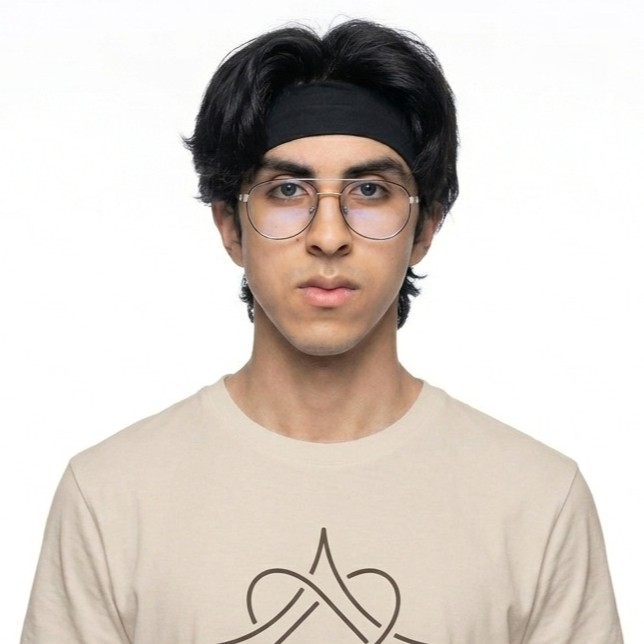
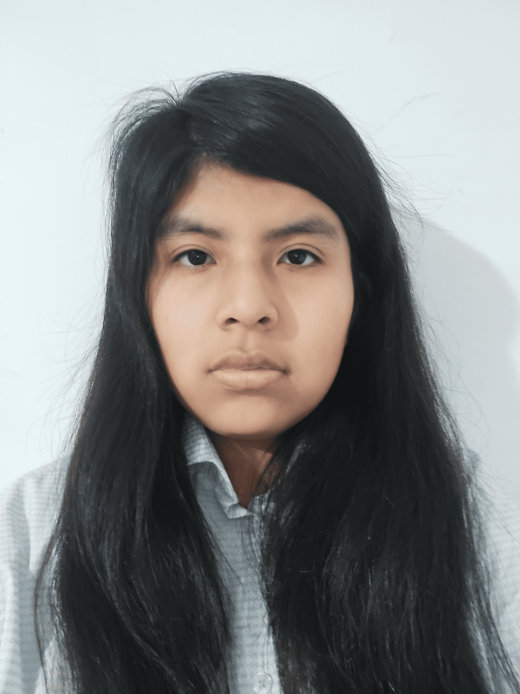

# Capítulo I: Presentación

## 1.1. Startup Profile

### 1.1.1. Descripción de la Startup

**Nombre de la Startup**

Yachiqo

**Descripción**

Yachiqo es una startup de ingeniería de software especializada en el diseño y desarrollo de soluciones móviles nativas y multiplataforma adaptables a cualquier sector o modelo de negocio. Nuestra propuesta combina arquitecturas distribuidas orientadas al dominio (Domain-Driven Design), persistencia local de datos y servicios web RESTful para transformar necesidades operativas en aplicaciones móviles robustas, escalables y con un alto enfoque en accesibilidad e internacionalización.

**Visión**

Ser la empresa de tecnología referente en América Latina en la creación de soluciones móviles versátiles, liderando la transformación digital en diversas industrias mediante la aplicación de arquitecturas de software modernas e innovación continua.

**Misión**

Empoderar a organizaciones y usuarios finales mediante el desarrollo de experiencias móviles intuitivas, seguras y de alto rendimiento que resuelvan problemas del mundo real en cualquier contexto de negocio.

**Propuesta de valor**

Ofrecemos un ecosistema de desarrollo móvil flexible y a medida para cualquier caso de uso: combinamos rendimiento nativo, sincronización de datos en tiempo real y componentes de accesibilidad universal para garantizar aplicaciones de calidad profesional orientadas a maximizar la satisfacción del usuario.

**Características principales**

- Desarrollo de aplicaciones móviles nativas y multiplataforma con Kotlin, Flutter y KMP para todo tipo de dispositivos.
- Modelado del negocio con Domain-Driven Design para adaptar la solución a las reglas de cualquier industria.
- Almacenamiento de datos local en el dispositivo para garantizar su uso continuo en entornos sin conexión a internet.
- Integración con servicios web RESTful propios para la sincronización y consumo de información en tiempo real.
- Diseño inclusivo con soporte de internacionalización (i18n) y accesibilidad (a11y) para todo tipo de público.
- Conexión con SDKs y servicios de terceros como pasarelas de pago, mapas y notificaciones push.
- Investigación e integración autónoma de tecnologías emergentes para resolver retos técnicos específicos.

### 1.1.2. Perfiles de integrantes del equipo

| Foto | Integrante | Descripción |
| :---: | :---: | :---: |
|  | Ruiz Mideyros, Adrian (U20241E177) | Estudiante de Ingeniería de Software con experiencia en desarrollo web y videojuegos con dominio de Java, C#, Python, JS, C++ y SQL. Perfil proactivo enfocado en resolver problemas, capaz de adaptarse a proyectos en constante cambio, con un alto aprendizaje continuo y una actitud colaborativa ante cualquier situación. |
|  | Rojas Tello, Nestor Alonso (U202317099) | Estudiante de Ingeniería de Software. Tengo conocimientos en C++, Python, JavaScript y CSS. Me considero una persona colaborativa, responsable y con disposición para resolver dudas y proponer soluciones ante cualquier desafío. |
|  | Contreras Rojas, Cesar Jair (U20241D995) | Estudiante de ingeniería de Software. He practicado con Python, C++, Java entre otros. Me considero alguien responsable, colaborativo, amable y dispuesto a ayudar a mis compañeros, soy alguien que se esfuerza por encontrar soluciones a problemas. |
|  | Carhuaz Centeno, Briguite Eryka (U20241D932) | Descripción faltante. |
|  | Cotrina Siclla, Sofia Alessandra (U20231B120) | Descripción faltante. |

## 1.2. Solution Profile

### 1.2.1. Antecedentes y problemática

### 1.2.2. Lean UX Process

#### *1.2.2.1. Lean UX Problem Statements*

#### *1.2.2.2. Lean UX Assumptions*

#### *1.2.2.3. Lean UX Hypothesis Statements*

#### *1.2.2.4. Lean UX Canvas*

## 1.3. Segmentos objetivo
