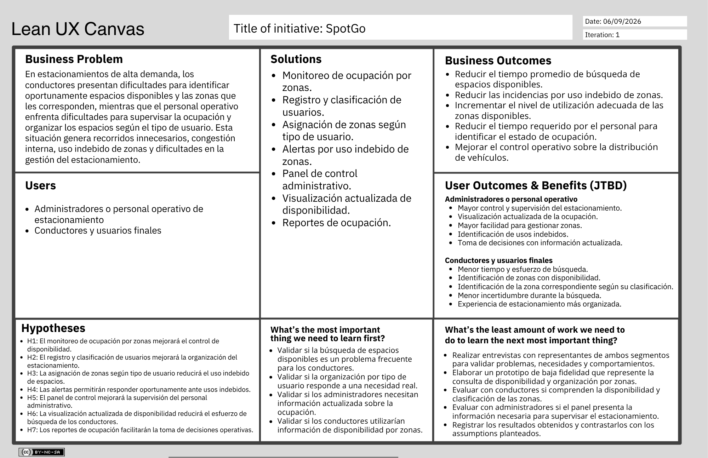

# Capítulo I: Presentación

## 1.1. Startup Profile

### 1.1.1. Descripción de la Startup

**Nombre de la Startup**

Yachiqo

**Descripción**

Yachiqo es una startup de ingeniería de software especializada en el diseño y desarrollo de soluciones móviles nativas y multiplataforma adaptables a cualquier sector o modelo de negocio. Nuestra propuesta combina arquitecturas distribuidas orientadas al dominio (Domain-Driven Design), persistencia local de datos y servicios web RESTful para transformar necesidades operativas en aplicaciones móviles robustas, escalables y con un alto enfoque en accesibilidad e internacionalización.

**Visión**

Ser la empresa de tecnología referente en América Latina en la creación de soluciones móviles versátiles, liderando la transformación digital en diversas industrias mediante la aplicación de arquitecturas de software modernas e innovación continua.

**Misión**

Empoderar a organizaciones y usuarios finales mediante el desarrollo de experiencias móviles intuitivas, seguras y de alto rendimiento que resuelvan problemas del mundo real en cualquier contexto de negocio.

**Propuesta de valor**

Ofrecemos un ecosistema de desarrollo móvil flexible y a medida para cualquier caso de uso: combinamos rendimiento nativo, sincronización de datos en tiempo real y componentes de accesibilidad universal para garantizar aplicaciones de calidad profesional orientadas a maximizar la satisfacción del usuario.

**Características principales**

- Desarrollo de aplicaciones móviles nativas y multiplataforma con Kotlin, Flutter y KMP para todo tipo de dispositivos.
- Modelado del negocio con Domain-Driven Design para adaptar la solución a las reglas de cualquier industria.
- Almacenamiento de datos local en el dispositivo para garantizar su uso continuo en entornos sin conexión a internet.
- Integración con servicios web RESTful propios para la sincronización y consumo de información en tiempo real.
- Diseño inclusivo con soporte de internacionalización (i18n) y accesibilidad (a11y) para todo tipo de público.
- Conexión con SDKs y servicios de terceros como pasarelas de pago, mapas y notificaciones push.
- Investigación e integración autónoma de tecnologías emergentes para resolver retos técnicos específicos.

### 1.1.2. Perfiles de integrantes del equipo

| Foto | Integrante | Descripción |
| :---: | :---: | :---: |
|  | Ruiz Mideyros, Adrian (U20241E177) | Estudiante de Ingeniería de Software con experiencia en desarrollo web y videojuegos con dominio de Java, C#, Python, JS, C++ y SQL. Perfil proactivo enfocado en resolver problemas, capaz de adaptarse a proyectos en constante cambio, con un alto aprendizaje continuo y una actitud colaborativa ante cualquier situación. |
|  | Rojas Tello, Nestor Alonso (U202317099) | Estudiante de Ingeniería de Software. Tengo conocimientos en C++, Python, JavaScript y CSS. Me considero una persona colaborativa, responsable y con disposición para resolver dudas y proponer soluciones ante cualquier desafío. |
|  | Contreras Rojas, Cesar Jair (U20241D995) | Estudiante de ingeniería de Software. He practicado con Python, C++, Java entre otros. Me considero alguien responsable, colaborativo, amable y dispuesto a ayudar a mis compañeros, soy alguien que se esfuerza por encontrar soluciones a problemas. |
|  | Carhuaz Centeno, Briguite Eryka (U20241D932) | Descripción faltante. |
|  | Cotrina Siclla, Sofia Alessandra (U20231B120) | Descripción faltante. |

## 1.2. Solution Profile

### 1.2.1. Antecedentes y problemática

Actualmente, los estacionamientos ubicados en establecimientos con alta afluencia de vehículos enfrentan dificultades relacionadas con la disponibilidad, distribución y gestión de sus espacios. Esta situación afecta tanto a los conductores que buscan estacionarse como al personal encargado de administrar y supervisar el estacionamiento.

En periodos de alta demanda, la falta de información actualizada sobre la ocupación puede provocar que los conductores recorran diferentes zonas en busca de un espacio disponible. Asimismo, la ausencia de una organización adecuada según el tipo de usuario puede ocasionar el uso indebido de determinadas zonas y dificultar la supervisión por parte del personal operativo.

La problemática asociada a la búsqueda de estacionamiento ha sido estudiada en diferentes entornos urbanos. Assemi, Baker y Paz (2020), a partir de una investigación realizada con conductores en una zona urbana de alta densidad, encontraron que el 35 % de los participantes empleó más de cinco minutos buscando estacionamiento. Los autores señalan además que disponer de información confiable y en tiempo real sobre estacionamientos puede contribuir a disminuir el tiempo total de viaje y la congestión asociada a la búsqueda de espacios. Asimismo, investigaciones recientes evidencian que la dificultad para encontrar espacios disponibles influye en el comportamiento de búsqueda de los conductores y que esta actividad puede generar efectos relacionados con congestión y emisiones adicionales.

Para comprender y delimitar la problemática se aplica la técnica 5W2H, considerando las preguntas Who, What, When, Where, Why, How y How Much.

**Técnica 5W2H**

1. ¿Quiénes están involucrados o afectados? (Who?)

El problema afecta principalmente a dos grupos de usuarios. Por un lado, se encuentran los conductores que utilizan estacionamientos de alta demanda, incluyendo clientes, taxistas y otros usuarios autorizados, quienes pueden experimentar dificultades para identificar espacios disponibles o ubicarse en las zonas que les corresponden.

Por otro lado, se encuentran los administradores y el personal operativo de los estacionamientos, quienes son responsables de supervisar la ocupación, gestionar el flujo de vehículos y mantener una adecuada distribución de los espacios.

Asimismo, las empresas e instituciones que ofrecen servicios de estacionamiento pueden verse afectadas debido a que una gestión ineficiente puede repercutir negativamente en la experiencia de sus clientes y en la calidad percibida del servicio.

2. ¿Qué ocurre o qué problema se presenta? (What?)

Los estacionamientos con alta afluencia de vehículos presentan dificultades para gestionar eficientemente sus espacios disponibles y organizar su utilización según el tipo de usuario.

La falta de información actualizada sobre la ocupación dificulta que los conductores identifiquen rápidamente dónde existen espacios disponibles, provocando recorridos innecesarios dentro del estacionamiento.

Asimismo, una clasificación insuficiente de las zonas destinadas a clientes, taxistas y otros usuarios autorizados puede generar desorden, uso indebido de espacios y dificultades para el personal responsable de supervisar la operación.

Como consecuencia, pueden producirse demoras, congestión interna y una experiencia poco organizada tanto para los conductores como para el personal encargado de la gestión del estacionamiento.

3. ¿Cuándo se presenta el problema? (When?)

El problema se presenta principalmente durante periodos de alta demanda, como las mañanas y tardes de días laborales, así como durante fines de semana y feriados en establecimientos que reciben una gran cantidad de vehículos.

También puede presentarse durante eventos especiales, como conciertos, partidos, ferias u otras actividades que incrementan temporalmente la afluencia de personas y vehículos.

En estas situaciones, el incremento de la ocupación dificulta la identificación de espacios disponibles y puede generar una mayor circulación de vehículos dentro del estacionamiento, además de complicar la supervisión y organización de las zonas.

4. ¿Dónde sucede? (Where?)

El problema puede presentarse en estacionamientos con alta afluencia y rotación de vehículos, como los ubicados en centros comerciales, supermercados, aeropuertos, universidades, oficinas corporativas, hospitales y otros establecimientos similares.

También puede ocurrir en estacionamientos públicos o privados donde la supervisión de la disponibilidad y distribución de espacios depende principalmente de procesos manuales o donde los usuarios no disponen de información actualizada sobre la ocupación.

5. ¿Por qué ocurre? (Why?)

El problema ocurre principalmente por la falta de mecanismos que permitan conocer de manera oportuna la disponibilidad de espacios y gestionar su distribución según el tipo de usuario.

En algunos estacionamientos, el control depende de procesos manuales o de la supervisión directa del personal, lo que dificulta mantener información actualizada sobre la ocupación.

Asimismo, la ausencia de una clasificación clara de zonas para clientes, taxistas y otros usuarios autorizados puede provocar el uso inadecuado de espacios, dificultades en la distribución de vehículos y una mayor complejidad en la administración del estacionamiento.

6. ¿Cómo se manifiesta el problema? (How?)

El problema se manifiesta cuando los conductores ingresan al estacionamiento y deben recorrer diferentes zonas para identificar un espacio disponible sin contar con información actualizada sobre su ubicación.

Paralelamente, el personal operativo debe supervisar el ingreso de vehículos, la ocupación de espacios y el cumplimiento de las zonas asignadas a los diferentes tipos de usuario.

Durante los periodos de alta demanda, esta situación puede generar recorridos innecesarios, acumulación de vehículos, ocupación indebida de determinadas zonas y dificultades para mantener una distribución organizada de los espacios.

7. ¿Cuánto cuesta o cuál es la magnitud? (How Much?)

La magnitud del problema varía según factores como la capacidad del estacionamiento, el nivel de ocupación y los periodos de mayor demanda. La evidencia revisada muestra que la búsqueda de estacionamiento puede incrementar el tiempo de circulación y contribuir a la congestión vehicular.

Para el contexto peruano, la magnitud específica del problema será contrastada mediante las entrevistas realizadas a los segmentos objetivo.

**Objetivos de la solución**

La solución propuesta busca alcanzar los siguientes objetivos:

- Reducir el tiempo requerido por los conductores para identificar espacios disponibles.
- Facilitar la organización y distribución de espacios según los diferentes tipos de usuario.
- Proporcionar al personal operativo información actualizada sobre la ocupación del estacionamiento.
- Reducir incidencias relacionadas con el uso indebido de zonas asignadas.
- Facilitar la supervisión del flujo y distribución de vehículos.
- Mejorar la experiencia de los conductores durante el proceso de estacionamiento.
- Proporcionar información que facilite la toma de decisiones operativas por parte de los administradores.

**Restricciones preliminares**

La propuesta considera inicialmente las siguientes restricciones:

- La solución estará orientada principalmente a estacionamientos con alta afluencia de vehículos.
- La disponibilidad de información en tiempo real dependerá de los mecanismos de monitoreo e integración implementados en el estacionamiento.
- La solución se enfocará inicialmente en la gestión y visualización de disponibilidad por zonas, evitando garantizar la disponibilidad futura de un espacio específico.
- La clasificación de usuarios dependerá de los tipos de usuario previamente configurados para cada estacionamiento.
- La solución requerirá conectividad para aquellas funcionalidades que necesiten sincronización con los servicios backend.
- El alcance inicial estará centrado en administradores, personal operativo y conductores, considerando a clientes, taxistas y otros usuarios autorizados como tipos de conductores cuando corresponda.

### 1.2.2. Lean UX Process

El Lean UX Process permite establecer y validar las principales suposiciones relacionadas con el problema, los usuarios, los resultados esperados y las funcionalidades propuestas.

A partir del análisis inicial del dominio de estacionamientos de alta demanda, se establecen el Lean UX Problem Statement, los principales assumptions y los Hypothesis Statements que posteriormente serán contrastados mediante investigación y validación con representantes de los segmentos objetivo.

#### *1.2.2.1. Lean UX Problem Statements*

El estado actual de la gestión de estacionamientos de alta demanda se ha enfocado principalmente en controlar el ingreso y salida de vehículos y administrar la disponibilidad general de espacios. Sin embargo, los conductores continúan enfrentando dificultades para identificar oportunamente espacios disponibles, mientras que los administradores y el personal operativo presentan dificultades para supervisar la ocupación y organizar los espacios según los diferentes tipos de usuario.

Las soluciones y procesos utilizados actualmente no siempre permiten integrar eficientemente información actualizada sobre la ocupación con una organización de zonas destinada a clientes, taxistas y otros usuarios autorizados.

Nuestra solución abordará esta brecha mediante una plataforma inteligente de gestión de estacionamientos que permita monitorear la ocupación, organizar zonas según el tipo de usuario y proporcionar información que facilite la identificación y administración de espacios disponibles.

Nuestro enfoque inicial estará dirigido a administradores y personal operativo de estacionamientos de alta demanda, así como a conductores que utilizan estos espacios.

Sabremos que la solución es exitosa cuando observemos una reducción en el tiempo requerido por los conductores para identificar espacios disponibles, una disminución de incidencias relacionadas con el uso indebido de zonas y una mejora en el control de ocupación por parte del personal administrativo.

#### *1.2.2.2. Lean UX Assumptions*

**Business Assumptions**

- Creemos que los estacionamientos ubicados en zonas de alta demanda necesitan mejorar la administración y distribución de sus espacios disponibles.
- Creemos que una gestión más eficiente de los espacios puede mejorar la calidad del servicio ofrecido por los establecimientos.
- Creemos que los administradores valorarán una solución que les permita obtener información actualizada sobre la ocupación del estacionamiento.
- Creemos que los conductores valorarán una solución que reduzca el esfuerzo requerido para encontrar un espacio disponible.
- Creemos que los establecimientos estarán dispuestos a adoptar una solución digital si esta contribuye a mejorar la organización de sus estacionamientos.
- Creemos que la información obtenida sobre la ocupación puede generar valor adicional para los administradores al facilitar la toma de decisiones operativas.

**Business Outcome Assumptions**

- Creemos que la implementación de la solución permitirá reducir el tiempo promedio empleado por los conductores para identificar espacios disponibles.
- Creemos que la solución permitirá mejorar la organización y distribución de los espacios del estacionamiento.
- Creemos que la clasificación de zonas permitirá disminuir las incidencias relacionadas con el uso indebido de espacios.
- Creemos que la disponibilidad de información actualizada permitirá mejorar el control y supervisión del estacionamiento.
- Creemos que el análisis de información de ocupación permitirá optimizar la utilización de los espacios disponibles.
- Creemos que una gestión más organizada contribuirá a mejorar la eficiencia del servicio ofrecido a los usuarios.

**User Assumptions**

***Administradores y personal operativo***

- Creemos que los administradores y el personal operativo necesitan consultar frecuentemente el estado de ocupación del estacionamiento.
- Creemos que necesitan identificar las zonas que corresponden a cada tipo de usuario.
- Creemos que necesitan detectar situaciones en las que un vehículo utilice una zona que no le corresponde.
- Creemos que necesitan disponer de información actualizada para tomar decisiones relacionadas con la distribución de los vehículos.
- Creemos que requieren una forma sencilla de supervisar el funcionamiento general del estacionamiento durante su jornada laboral.

***Conductores y usuarios finales***

- Creemos que los conductores necesitan identificar rápidamente las zonas que cuentan con disponibilidad.
- Creemos que los conductores desean reducir los recorridos innecesarios dentro del estacionamiento.
- Creemos que los conductores necesitan conocer qué zonas pueden utilizar según su clasificación.
- Creemos que los conductores valorarán recibir información actualizada sobre la disponibilidad de espacios.
- Creemos que una experiencia de estacionamiento más organizada reducirá la frustración asociada a la búsqueda de espacios.

**User Outcome and Benefit Assumptions**

***Administradores y personal operativo***

- Creemos que los administradores podrán tener mayor control y supervisión sobre la operación del estacionamiento.
- Creemos que podrán visualizar la ocupación de las diferentes zonas de manera actualizada.
- Creemos que podrán gestionar con mayor facilidad las zonas correspondientes a cada tipo de usuario.
- Creemos que podrán identificar con mayor rapidez posibles usos indebidos de las zonas.
- Creemos que podrán tomar decisiones operativas utilizando información actualizada sobre la ocupación.
- Creemos que podrán analizar el comportamiento de la ocupación mediante información histórica.

***Conductores y usuarios finales***

- Creemos que los conductores podrán identificar espacios disponibles con mayor rapidez.
- Creemos que podrán reducir el tiempo y esfuerzo destinados a recorrer el estacionamiento.
- Creemos que podrán identificar con mayor claridad la zona que les corresponde.
- Creemos que podrán reducir la incertidumbre asociada a la búsqueda de estacionamiento.
- Creemos que tendrán una experiencia de estacionamiento más organizada.

**Feature Assumptions**

- **FA01 - Monitoreo de ocupación por zonas:** Creemos que el monitoreo de ocupación por zonas permitirá al personal operativo conocer con mayor precisión la disponibilidad existente en el estacionamiento.

- **FA02 - Registro y clasificación de usuarios:** Creemos que el registro y clasificación de usuarios permitirá diferenciar entre clientes, taxistas y otros usuarios autorizados para gestionar adecuadamente las zonas correspondientes.

- **FA03 - Asignación de zonas según tipo de usuario:** Creemos que la asignación de zonas según el tipo de usuario permitirá reducir el uso indebido de espacios y mejorar la distribución de vehículos.

- **FA04 - Sistema de alertas por uso indebido:** Creemos que un sistema de alertas permitirá al personal operativo identificar oportunamente posibles usos indebidos de las zonas del estacionamiento.

- **FA05 - Panel de control para administradores:** Creemos que un panel de control permitirá a los administradores supervisar de manera centralizada la ocupación y distribución de las diferentes zonas.

- **FA06 - Visualización actualizada de disponibilidad:** Creemos que proporcionar información actualizada sobre la disponibilidad permitirá a los conductores identificar con mayor rapidez las zonas en las que pueden encontrar espacios disponibles.

- **FA07 - Reportes de ocupación:** Creemos que los reportes de ocupación permitirán a los administradores analizar patrones de utilización del estacionamiento y utilizar esta información para apoyar sus decisiones operativas.

#### *1.2.2.3. Lean UX Hypothesis Statements*

A partir de los Feature Assumptions identificados, se plantean los siguientes Hypothesis Statements. Cada hipótesis relaciona un resultado esperado del negocio con los usuarios, beneficios y funcionalidades propuestas.

- **HS01 - Monitoreo de ocupación por zonas:** Creemos que lograremos mejorar el control sobre la ocupación del estacionamiento si los administradores y el personal operativo pueden conocer oportunamente la disponibilidad de las diferentes zonas mediante una funcionalidad de monitoreo de ocupación por zonas.

- **HS02 - Registro y clasificación de usuarios:** Creemos que lograremos mejorar la organización de los usuarios dentro del estacionamiento si el personal operativo puede identificar y clasificar a los conductores según categorías como clientes, taxistas u otros usuarios autorizados mediante una funcionalidad de registro y clasificación de usuarios.

- **HS03 - Asignación de zonas según tipo de usuario:** Creemos que lograremos reducir las incidencias relacionadas con el uso indebido de espacios si los conductores pueden identificar las zonas que les corresponden y el personal operativo puede gestionar su distribución mediante una funcionalidad de asignación de zonas según el tipo de usuario.

- **HS04 - Sistema de alertas por uso indebido:** Creemos que lograremos mejorar la capacidad de respuesta del personal operativo ante el uso incorrecto de determinadas zonas si los administradores reciben información sobre posibles incidencias mediante un sistema de alertas por uso indebido.

- **HS05 - Panel de control para administradores:** Creemos que lograremos mejorar la eficiencia en la supervisión del estacionamiento si los administradores y el personal operativo pueden consultar de manera centralizada la ocupación, distribución e incidencias mediante un panel de control administrativo.

- **HS06 - Visualización actualizada de disponibilidad:** Creemos que lograremos reducir el tiempo y esfuerzo requerido para encontrar estacionamiento si los conductores pueden identificar las zonas que presentan disponibilidad mediante una funcionalidad de visualización actualizada de ocupación.

- **HS07 - Reportes de ocupación:** Creemos que lograremos mejorar la toma de decisiones relacionadas con la utilización de los espacios si los administradores pueden analizar información histórica y patrones de ocupación mediante una funcionalidad de generación de reportes.

#### 1.2.2.4. Lean UX Canvas

El Lean UX Canvas sintetiza los principales elementos identificados durante el proceso Lean UX, incluyendo el problema de negocio, los segmentos objetivo, los resultados esperados, los beneficios para los usuarios, las soluciones propuestas y las hipótesis que deberán ser validadas durante el desarrollo del proyecto.

**Canva Link:** [https://canva.link/i0pin0nnlvbg3rd](https://canva.link/i0pin0nnlvbg3rd)

*Figura 1 (Lean UX Canvas)*

## 1.3. Segmentos objetivo

La solución está dirigida inicialmente a dos segmentos objetivo relacionados directamente con la problemática: los administradores o miembros del personal operativo de estacionamientos y los conductores que utilizan estos espacios.

Para contextualizar estos segmentos en el entorno peruano, se consideran estadísticas oficiales del Ministerio de Transportes y Comunicaciones (MTC) relacionadas con el parque automotor y las licencias de conducir. Estas características serán complementadas y contrastadas mediante las entrevistas realizadas a representantes de cada segmento.

**Primer Segmento Objetivo: Administradores o personal operativo de estacionamiento**

Este segmento está conformado por las personas responsables de supervisar, controlar o administrar las operaciones realizadas dentro de estacionamientos con alta afluencia de vehículos.

- Datos demográficos:
  - **Edad:** Personas adultas en edad laboral. No se establece inicialmente un rango etario específico debido a que la pertenencia al segmento se determina principalmente por su función dentro de la operación del estacionamiento y no por su edad.
  - **Ocupación:** Personal de seguridad, supervisores, operadores o administradores responsables de la gestión y supervisión de estacionamientos.
  - **País de residencia:** Perú.
- Datos conductuales:
  - **Dominio:** Poseen conocimientos relacionados con la operación de estacionamientos, supervisión de espacios y control del flujo de vehículos, cuyo nivel específico será contrastado mediante las entrevistas.
  - **Necesidades:** Supervisar la ocupación, controlar el flujo de vehículos, identificar incidencias y mantener una adecuada organización de las zonas.
  - **Beneficios buscados:** Mejorar la organización del estacionamiento, reducir el esfuerzo requerido para supervisar la ocupación y disponer de información actualizada para tomar decisiones operativas.
- Interacción esperada con la solución:
  - **Frecuencia de uso:** Se espera un uso frecuente durante la jornada laboral debido a las responsabilidades de supervisión y administración.
  - **Principales actividades:** Consultar ocupación, supervisar zonas, clasificar usuarios, identificar incidencias y analizar información relacionada con la utilización de los espacios.

**Segundo Segmento Objetivo: Conductores y usuarios finales**

Este segmento está conformado por personas que utilizan estacionamientos en establecimientos de alta afluencia. Dentro de este segmento pueden existir diferentes tipos de conductores, como clientes, taxistas y otros usuarios autorizados, cuya clasificación permitirá determinar las zonas que pueden utilizar.

- Datos demográficos:
  - **Edad:** Personas adultas habilitadas para conducir. Según estadísticas del MTC, durante 2025 se emitieron 801 474 licencias de conducir en el Perú, de las cuales 256 252 correspondieron a nuevas licencias, lo que permite contextualizar la magnitud del segmento de conductores en el país.
  - **Ocupación:** Diversa, debido a que comprende visitantes, compradores, trabajadores, taxistas y otros usuarios de los establecimientos.
  - **País de residencia:** Perú.
- Datos conductuales:
  - **Dominio:** Poseen conocimientos básicos relacionados con el uso de estacionamientos y la identificación de señalización y zonas disponibles.
  - **Necesidades:** Encontrar un espacio disponible, identificar la zona que les corresponde y reducir recorridos innecesarios dentro del estacionamiento.
  - **Beneficios buscados:** Reducir el tiempo y esfuerzo dedicado a encontrar estacionamiento, identificar zonas disponibles y contar con una experiencia más organizada.
- Interacción esperada con la solución:
  - **Frecuencia de uso:** Se espera que utilicen la solución cada vez que accedan a un estacionamiento que forme parte de la plataforma.
  - **Principales actividades:** Consultar disponibilidad, identificar zonas habilitadas según su clasificación y utilizar la información proporcionada para dirigirse hacia una zona con disponibilidad.

**Relación entre los segmentos objetivo**

Ambos segmentos participan en un mismo proceso, pero presentan necesidades diferentes.

Los administradores y el personal operativo necesitan información que les permita supervisar, organizar y controlar el estacionamiento. Por su parte, los conductores necesitan información que les permita identificar zonas disponibles y reducir el esfuerzo requerido para encontrar estacionamiento.

La solución propuesta busca conectar ambas necesidades mediante información actualizada sobre la ocupación y una organización de los espacios basada en los tipos de usuario.

Las características inicialmente planteadas para ambos segmentos constituyen supuestos preliminares y deberán ser contrastadas mediante las entrevistas de Needfinding y fuentes estadísticas relacionadas con el dominio. Los resultados obtenidos permitirán posteriormente construir los User Personas y demás artefactos correspondientes al proceso de Needfinding.
