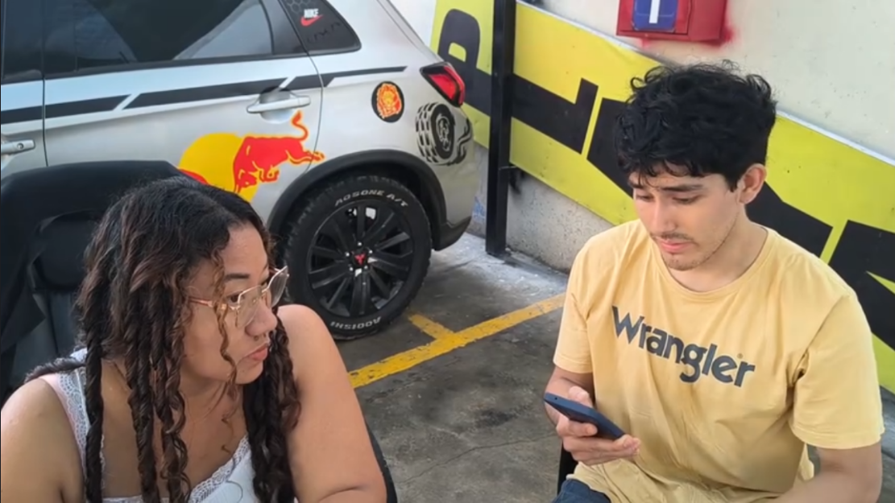
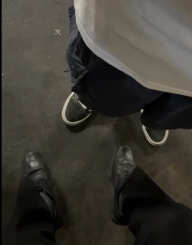
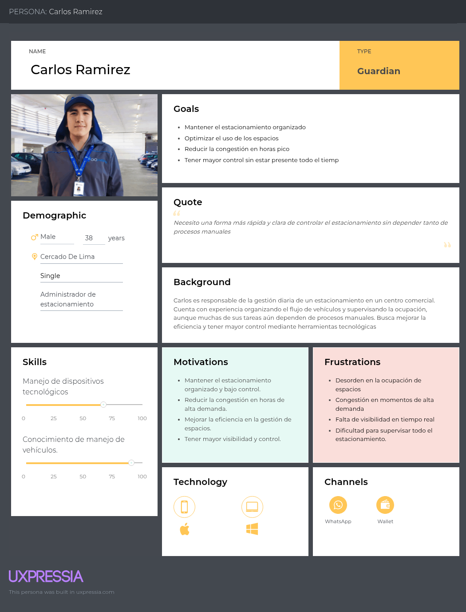
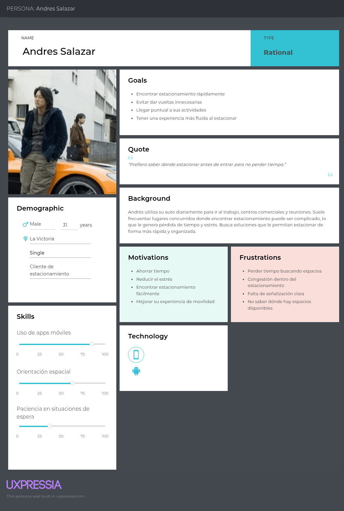
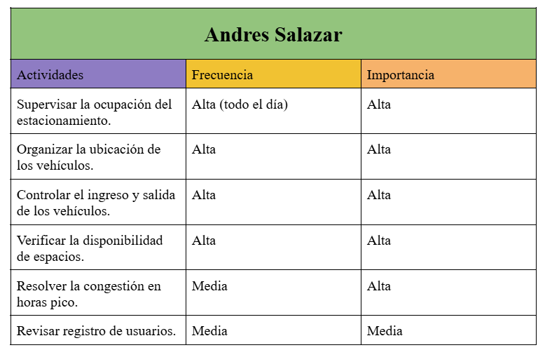
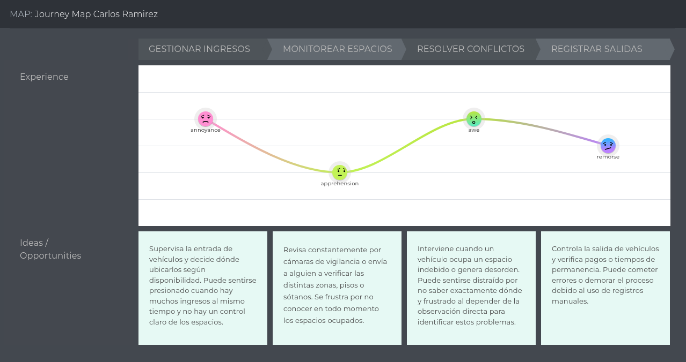
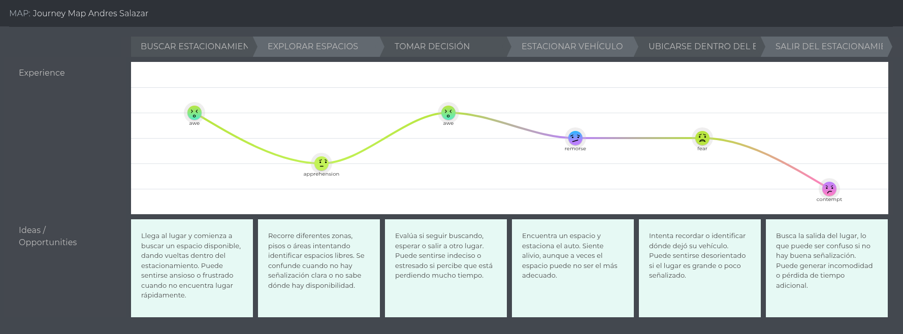
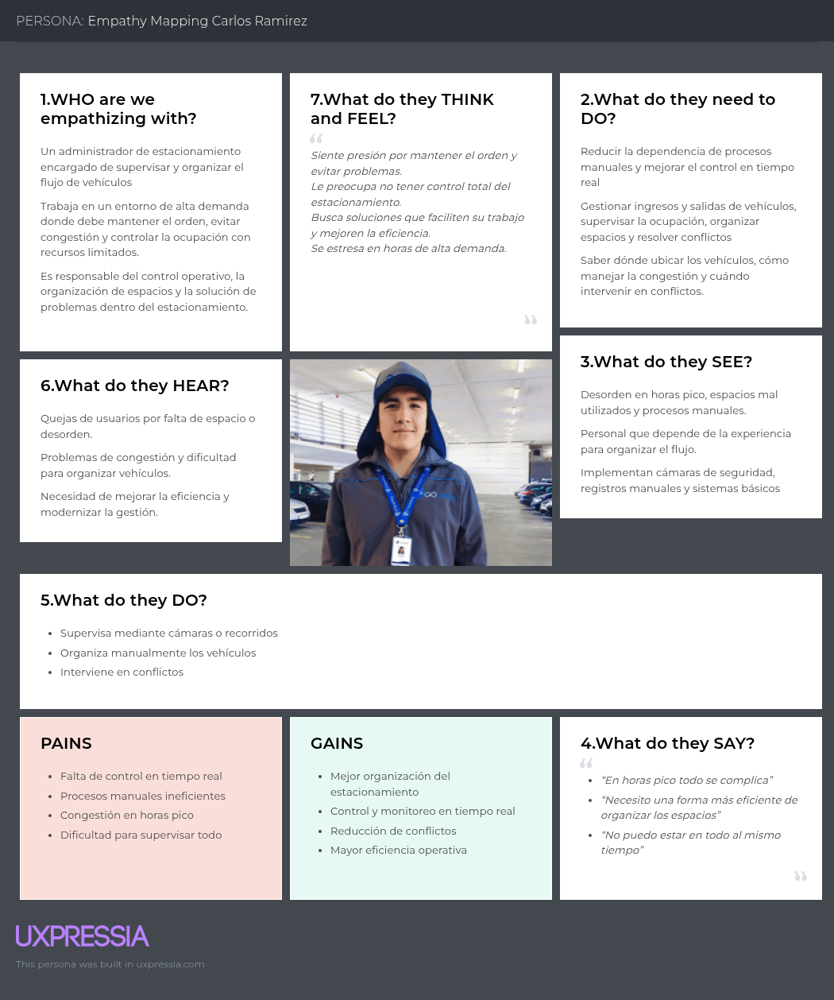
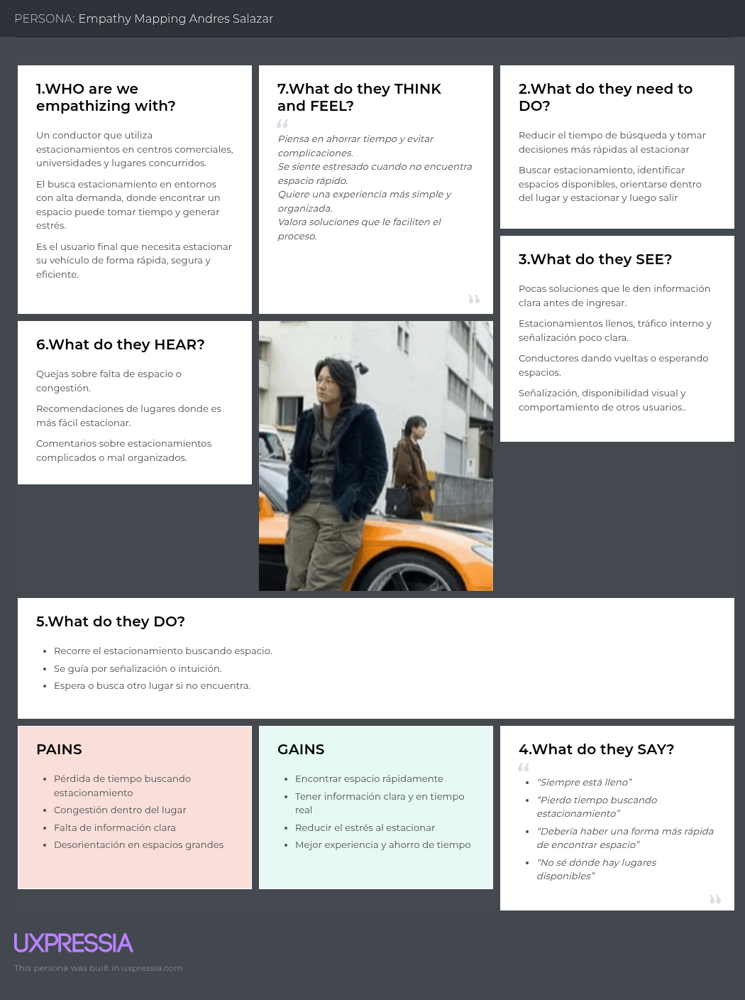
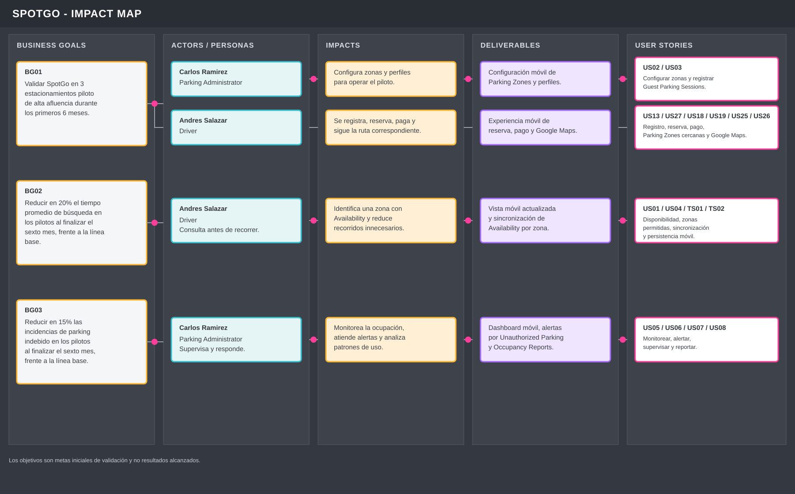

# Capítulo II: Requirements Development and Software Solution Design

## 2.1. Competidores

### 2.1.1. Análisis competitivo

**Competitive Analysis Landscape**

*¿Por qué llevar a cabo este análisis?*

Permite identificar cómo funcionan las soluciones actuales de estacionamiento, detectar sus fortalezas y limitaciones, y determinar oportunidades de diferenciación para SpotGo, especialmente en la organización por zonas, clasificación de usuarios y monitoreo de ocupación.

*Logos*

| SpotGo | Apparka | iPark | Parkopedia |
| --- | --- | --- | --- |
|  |  |  |  |

*Perfil*

|     | SpotGo | Apparka | iPark | Parkopedia |
| --- | --- | --- | --- | --- |
| Overview | Aplicación móvil y servicios backend para organizar estacionamientos por zonas y perfiles, consultar disponibilidad, reservar y pagar espacios, administrar suscripciones y comprobantes electrónicos, y permitir que el Driver abra la ruta hacia su destino en Google Maps. | Empresa peruana de gestión de estacionamientos con app para ubicación, disponibilidad, pagos, reservas y servicios empresariales. | Solución peruana en la nube para gestión digital de estacionamientos, pagos, registro vehicular y control operativo. | Plataforma global de datos de estacionamiento con información estática, disponibilidad dinámica, reservas, pagos e integraciones. |
| Ventaja competitiva | Integra clasificación por perfiles, sensores por Parking Spot, monitoreo actualizado, reservas, pagos, integración con Google Maps y apoyo operativo desde una experiencia móvil. | Amplia presencia en Perú, operación directa de estacionamientos y servicios digitales integrados. | Integra gestión administrativa, pagos digitales, control vehicular y aforo en tiempo real. | Cobertura global, gran volumen de datos y fuerte integración con vehículos y servicios de movilidad. |

*Perfil de marketing*

|     | SpotGo | Apparka | iPark | Parkopedia |
| --- | --- | --- | --- | --- |
| Mercado Objetivo | Operadores de estacionamientos de alta demanda y conductores que utilizan estos espacios. | Conductores urbanos que buscan optimizar tiempo en estacionar. | Operadores y empresas que administran estacionamientos. | Conductores, fabricantes de vehículos, operadores y servicios de movilidad. |
| Estrategias de Marketing | Pruebas piloto con operadores de estacionamientos y alianzas con centros comerciales, universidades y empresas. | Presencia física nacional, app móvil, servicios empresariales y alianzas con distintos tipos de establecimientos. | Venta B2B orientada a digitalización y mejora operativa. | Alianzas con fabricantes, integración mediante APIs y presencia internacional. |

*Perfil de producto*

|     | SpotGo | Apparka | iPark | Parkopedia |
| --- | --- | --- | --- | --- |
| Productos y Servicios | Aplicación móvil para disponibilidad por zonas, perfiles de usuario, reservas, pagos digitales, suscripciones, facturación electrónica e integración con Google Maps; incluye monitoreo por sensores, alertas, reportes y funciones operativas. | Ubicación, disponibilidad, pagos, reservas, abonados y administración de estacionamientos. | Registro vehicular, pagos, facturación, aforo y portal administrativo. | Datos de parking, disponibilidad, reservas, pagos y APIs. |
| Precios y costos | Modelo preliminar basado en suscripción para operadores de estacionamientos; los costos de implementación dependerán de los mecanismos de monitoreo requeridos. | Tarifas variables según estacionamiento, servicio o modalidad de abonado. | Modelo de suscripción con planes según capacidad y requerimientos. | Gratuito para usuarios finales; servicios B2B y licenciamiento de datos. |
| Canales de distribución | App móvil, Landing Page y servicios backend integrados con la infraestructura del estacionamiento. | App móvil, web y red física de estacionamientos. | Plataforma web, app e integraciones con dispositivos. | Web, app, APIs y sistemas integrados en vehículos. |

*Análisis SWOT*

|     | SpotGo | Apparka | iPark | Parkopedia |
| --- | --- | --- | --- | --- |
| Fortalezas | Organización por tipo de usuario, monitoreo por zonas y alertas integradas. | Presencia nacional, operación de estacionamientos y servicios digitales. | Gestión cloud, pagos digitales y aforo en tiempo real. | Cobertura global, datos dinámicos e integración vehicular. |
| Debilidades | Producto nuevo y aún en proceso de validación. | Menor enfoque en clasificación interna de usuarios por zonas. | Puede requerir mayor configuración e integración operativa. | Menor enfoque en gestión interna de zonas por usuario. |
| Oportunidades | Digitalización de estacionamientos de alta demanda. | Expansión de servicios digitales y empresariales. | Escalamiento hacia más operadores y verticales. | Mayor integración con movilidad conectada y vehículos. |
| Amenazas | Competidores consolidados con mayor infraestructura y alcance. | Nuevas soluciones digitales y plataformas globales. | Soluciones más simples o especializadas. | Competidores locales con enfoque operativo específico. |

### 2.1.2. Estrategias y tácticas frente a competidores

1. Organización por zonas según tipo de usuario.
   - SpotGo busca diferenciarse mediante la clasificación de conductores y la asignación de zonas específicas, facilitando una distribución más ordenada y con el objetivo de reducir posibles usos indebidos.

2. Monitoreo actualizado de ocupación.
   - La solución ofrecerá información actualizada sobre la disponibilidad por zonas, permitiendo a conductores y personal operativo tomar decisiones con mayor rapidez.

3. Gestión centralizada para administradores.
   - La aplicación móvil administrativa permitirá consultar ocupación, distribución de zonas e incidencias desde un único entorno, facilitando la supervisión operativa.

4. Experiencia de búsqueda enfocada en disponibilidad.
   - Los conductores podrán consultar qué zonas presentan disponibilidad y cuáles pueden utilizar según su clasificación, con el objetivo de reducir recorridos innecesarios.

5. Modelo modular y adaptable.
   - La solución podrá implementarse progresivamente según las necesidades y características de cada estacionamiento, buscando reducir las barreras de adopción.

6. Analítica para soporte de decisiones.
   - Los reportes de ocupación permitirán identificar patrones de uso, periodos de alta demanda y comportamiento de las diferentes zonas.

## 2.2. Entrevistas

### 2.2.1. Diseño de entrevistas

**Primer Segmento Objetivo (Administradores o personal operativo de estacionamiento)**

1. ¿Cuáles son los principales retos que enfrenta en la gestión del estacionamiento?
2. ¿Cómo organizan actualmente la distribución de espacios dentro del estacionamiento?
3. ¿De qué manera registran y diferencian a los usuarios como clientes o colaboradores?
4. ¿Qué situaciones ocurren cuando un vehículo ocupa un espacio que no le corresponde?
5. ¿Cómo monitorean la ocupación de las diferentes zonas del estacionamiento?
6. ¿Qué problemas se presentan con mayor frecuencia en horas de alta demanda?
7. ¿Qué dificultades enfrentan los vigilantes para mantener el orden?
8. ¿Qué herramientas o sistemas utilizan actualmente para la gestión del estacionamiento?
9. ¿Qué limitaciones o inconvenientes encuentran en el sistema actual?
10. ¿Cómo cree que la visualización en tiempo real de la ocupación podría ayudar en la gestión?
11. ¿Qué tipo de alertas o notificaciones considera necesarias para mejorar el control?
12. ¿Cómo influye el registro de usuarios en la organización del estacionamiento?
13. ¿Qué beneficios esperaría obtener de un sistema inteligente de estacionamiento?
14. ¿De qué manera considera que se podría reducir el tiempo de búsqueda de espacios?
15. ¿Cómo evaluaría la implementación de una solución como SpotGo en su entorno?

**Segundo Segmento Objetivo (Conductores y usuarios finales)**

1. ¿Cómo suele ser su experiencia al buscar estacionamiento en lugares concurridos?
2. ¿En qué tipos de lugares encuentra más dificultades para estacionar y por qué?
3. ¿Cuánto tiempo suele invertir en encontrar un espacio disponible?
4. ¿Qué siente o piensa cuando no logra encontrar estacionamiento rápidamente?
5. ¿Qué acciones suele tomar cuando no encuentra un espacio libre?
6. ¿Cómo describiría la organización de los estacionamientos que frecuenta?
7. ¿Qué tan fácil le resulta orientarse dentro de un estacionamiento grande?
8. ¿Cómo cree que una aplicación podría ayudarle durante la búsqueda de estacionamiento?
9. ¿Qué tipo de información le gustaría recibir antes de ingresar a un estacionamiento?
10. ¿Qué información le sería útil mientras busca un espacio dentro del lugar?
11. ¿Cómo prefiere visualizar la disponibilidad de espacios: por zonas o de otra forma?
12. ¿Qué opinión tiene sobre la existencia de zonas exclusivas dentro de un estacionamiento?
13. ¿Qué problemas ha tenido relacionados con la señalización dentro del estacionamiento?
14. ¿Cómo mejoraría su experiencia al momento de estacionar?
15. ¿Qué valor le daría a un sistema que reduzca el tiempo de búsqueda de espacios?

### 2.2.2. Registro de entrevistas

**Needfinding Interviews Link:** [https://upcedupe-my.sharepoint.com/:v:/g/personal/u20241e177_upc_edu_pe/IQBqZCnYsXk5TbTE0vg1_trYAcXeX9iY3VyxVWvInncaOEI?nav=eyJyZWZlcnJhbEluZm8iOnsicmVmZXJyYWxBcHAiOiJPbmVEcml2ZUZvckJ1c2luZXNzIiwicmVmZXJyYWxBcHBQbGF0Zm9ybSI6IldlYiIsInJlZmVycmFsTW9kZSI6InZpZXciLCJyZWZlcnJhbFZpZXciOiJNeUZpbGVzTGlua0NvcHkifX0&e=bKCoNf](https://upcedupe-my.sharepoint.com/:v:/g/personal/u20241e177_upc_edu_pe/IQBqZCnYsXk5TbTE0vg1_trYAcXeX9iY3VyxVWvInncaOEI?nav=eyJyZWZlcnJhbEluZm8iOnsicmVmZXJyYWxBcHAiOiJPbmVEcml2ZUZvckJ1c2luZXNzIiwicmVmZXJyYWxBcHBQbGF0Zm9ybSI6IldlYiIsInJlZmVycmFsTW9kZSI6InZpZXciLCJyZWZlcnJhbFZpZXciOiJNeUZpbGVzTGlua0NvcHkifX0&e=bKCoNf)

**Primer Segmento Objetivo (Administradores o personal operativo de estacionamiento)**

**Entrevista 1**

| Screenshot: |  |
| --- | --- |
| Inicia: | 00:00 |
| Duración:| 4:50 |
| Nombre completo: | Cecilia Lopez |
| Edad: | 31 años |
| Distrito: | Cercado de Lima |
| Resumen: | Cecilia nos indica que la gestión del estacionamiento se basa en organización manual y registro mediante boletas y tablas, sin asignación de zonas específicas, ya que los vehículos ocupan cualquier espacio disponible. El monitoreo se realiza con cámaras y control físico, y en horas de alta demanda surgen dificultades para movilizar vehículos debido al espacio reducido. Aunque el sistema actual funciona, depende en gran medida de la intervención manual, incluso solicitando llaves para reorganizar los autos. Considera que un sistema inteligente podría mejorar la organización, visibilidad y control, además de aportar beneficios para atraer más clientes. |

**Entrevista 2**

| Screenshot: |  |
| --- | --- |
| Inicia: | 04:50 |
| Duración:| 5:04 |
| Nombre completo: | Reinaldo Torres |
| Edad: | 42 años |
| Distrito: | Breña |
| Resumen: | Nos comenta que la gestión de su estacionamiento combina métodos manuales y digitales, registrando a los clientes sin asignación fija de espacios, ya que ocupan cualquier lugar disponible. El monitoreo se realiza mediante un aplicativo que permite control remoto, pero en horas de alta demanda surgen problemas de congestión y necesidad de movilizar vehículo. Él nos destaca que un sistema en tiempo real mejoraría significativamente la gestión, permitiendo mayor control y reducción de pérdidas económicas. También resalta la importancia de alertas, especialmente para pagos, y considera que la implementación de una solución inteligente sería beneficiosa, aunque requeriría capacitación del personal. |

**Entrevista 3**

| Screenshot: |  |
| --- | --- |
| Inicia: | 10:44 |
| Duración:| 6:18 |
| Nombre completo: | Juan Vega |
| Edad: | 30 años |
| Distrito: | La Victoria |
| Resumen: | La entrevista a Juan Vega, un administrador de estacionamientos de 30 años, expone las dificultades de una gestión basada en procesos manuales, registros en papel y vigilancia visual, lo que genera desorden en horas pico y un control ineficiente de los espacios reservados. Debido a la falta de un sistema en tiempo real, el personal debe realizar rondas a pie y vocear placas para gestionar la ocupación, una carga operativa que el administrador busca eliminar. En este contexto, la aplicación "SpotGo" es recibida con gran optimismo, ya que el uso de sensores para detectar ocupación y un mapa en vivo permitiría automatizar la supervisión de lugares, mejorar el control de pagos y proyectar una imagen mucho más profesional y organizada de la empresa. |

**Segundo Segmento Objetivo (Conductores y usuarios finales)**

**Entrevista 1**

| Screenshot: |  |
| --- | --- |
| Inicia: | 17:02 |
| Duración:| 3:51 |
| Nombre completo: | Emiliano Lozano |
| Edad: | 51 años |
| Distrito: | San Martin de Porres |
| Resumen: | Emiliano nos señala que, como taxista, cuenta con un espacio asignado dentro del estacionamiento, lo que facilita su experiencia y evita dificultades para encontrar lugar. La organización se apoya en señalización básica como carteles, y en algunos casos utilizan conos para asegurar sus espacios. En momentos de alta demanda, otros usuarios ocupan sus espacios, obligándolos a esperar o buscar alternativas. Además, señala que los clientes tienen más dificultades para estacionar. Considera que una solución tecnológica con señales o alertas podría mejorar la organización. |

**Entrevista 2**

| Screenshot: |  |
| --- | --- |
| Inicia: | 20:54 |
| Duración:| 7:06 |
| Nombre completo: | Angel Pariona |
| Edad: | 23 años |
| Distrito: | Lince |
| Resumen: | Angel menciona que encuentra difícil hallar estacionamiento debido a zonas no autorizadas o cocheras ocupadas, especialmente cerca de cines y parques de agua, demorando entre 10 a 15 minutos. Califica la organización actual como muy poco ordenada porque los vehículos no respetan los espacios y generan bloqueos ante la falta de fiscalización municipal. Ante la falta de espacio, da vueltas por las cuadras o se aleja un poco más, calificando la situación de frustrante por la pérdida de tiempo. Considera que una aplicación sería muy útil si le señala zonas libres, muestra la seguridad del lugar y permite reservar espacios. Sugiere medir mejor los tiempos y buscar estacionamiento en horas punta, valorando que un sistema así reduciría significativamente el tiempo de búsqueda en Lima. |

**Entrevista 3**

| Screenshot: |  |
| --- | --- |
| Inicia: | 28:00 |
| Duración:| 3:58 |
| Nombre completo: | Jorge Luis |
| Edad: |  |
| Distrito: |  |
| Resumen: |  |

### 2.2.3. Análisis de entrevistas

**Primer Segmento Objetivo (Administradores o personal operativo de estacionamiento)**

Este segmento es clave porque son responsables de la organización, control y funcionamiento del estacionamiento. Las entrevistas realizadas evidencian cómo se gestionan actualmente estos espacios y las principales limitaciones que enfrentan, así como la oportunidad de mejora mediante soluciones tecnológicas.

*¿Quienes son?*
Se trata de administradores y personal operativo encargados de supervisar el estacionamiento y organizar el flujo de vehículos.
- Utilizan una combinación de métodos manuales y sistemas básicos (boletas, registros, aplicativos).
- Se encargan del control de ingresos, ocupación y organización de los vehículos.
- En muchos casos, deben intervenir directamente para reordenar los autos.

*¿Qué les preocupa y anhelan?*
- Desorden en la ocupación: No existen zonas definidas, los usuarios ocupan cualquier espacio disponible.
- Congestión en horas pico: Dificultad para movilizar vehículos en espacios reducidos.
- Dependencia de procesos manuales: Uso de boletas, registros y control físico. 
- Necesidad de control: Buscan mayor visibilidad sin tener que estar presentes todo el tiempo.
- Pérdidas operativas: Riesgo de errores en cobros o control del tiempo de permanencia.

*Requisitos del producto*
- Eficiente, permitiendo una mejor organización del estacionamiento.
- Clara y visual, mostrando la ocupación por zonas en tiempo real.
- Con alertas, para detectar uso indebido de espacios o eventos importantes.
- De fácil control remoto, para que el administrador supervise sin estar presente.
- Apoyo a la gestión, reduciendo la dependencia de procesos manuales.

**Segundo Segmento Objetivo (Conductores y usuarios finales (clientes))**

Este segmento es fundamental porque son quienes utilizan directamente el estacionamiento y experimentan los problemas al momento de buscar un espacio. Las entrevistas realizadas evidencian dificultades relacionadas con el tiempo de búsqueda, la organización del lugar y la falta de información clara, lo que impacta en su experiencia.

*¿Quienes son?*
Se trata de conductores que utilizan estacionamientos en centros comerciales, universidades u otros espacios concurridos.
- Buscan estacionar de forma rápida, segura y sencilla.
- Su experiencia varía según el nivel de congestión y organización del lugar.
- Dependen de la señalización, su conocimiento del lugar o apoyo del personal.
- En algunos casos, recurren a alternativas como estacionar en la calle.

*¿Qué les preocupa y anhelan?*
- Tiempo de búsqueda elevado: Puede tomar varios minutos encontrar un espacio, especialmente en horas pico.
- Congestión y desorden: Tráfico interno y mala organización en entradas, salidas o pisos.
- Falta de orientación: Dificultad para ubicarse dentro del estacionamiento o encontrar salidas.
- Información limitada: No conocen disponibilidad, tarifas o condiciones antes de ingresar.
- Estrés y frustración: Sensaciones negativas cuando no encuentran espacio rápidamente. 

*Requisitos del producto*
- Rápida y eficiente, reduciendo el tiempo de búsqueda de espacios.
- Visual y clara, mostrando disponibilidad por zonas o pisos.
- Informativa, incluyendo datos como espacios libres, tarifas y horarios.
- Fácil de usar, con una interfaz intuitiva que ayude a la orientación.
- Con apoyo en tiempo real, guiando al usuario dentro del estacionamiento.

## 2.3. Needfinding

### 2.3.1. User Personas

**Primer Segmento Objetivo (Administradores o personal operativo de estacionamiento)**

*Figura 2 (User Persona 1)*

**Segundo Segmento Objetivo (Conductores y usuarios finales)**

*Figura 3 (User Persona 2)*

### 2.3.2. User Task Matrix

**Primer Segmento Objetivo (Administradores o personal operativo de estacionamiento)**

*Figura 4 (User Task Matrix 1)*

**Segundo Segmento Objetivo (Conductores y usuarios finales)**

*Figura 5 (User Task Matrix 2)*

### 2.3.3. User Journey Mapping

**Primer Segmento Objetivo (Administradores o personal operativo de estacionamiento)**

*Figura 6 (User Journey Map 1)*

**Segundo Segmento Objetivo (Conductores y usuarios finales)**

*Figura 7 (User Journey Map 2)*

### 2.3.4. Empathy Mapping

**Primer Segmento Objetivo (Administradores o personal operativo de estacionamiento)**

*Figura 8 (Empathy Map 1)*

**Segundo Segmento Objetivo (Conductores y usuarios finales)**

*Figura 9 (Empathy Map 2)*

### 2.3.5. Big Picture EventStorming

Se utilizó la guía Step-by-Step Guide de Philippe Bourgau, proporcionada en la rúbrica del Final Problem Statement, para llevar a cabo el proceso de Big Picture Event Storming, siguiendo sus etapas:

- Open
- Explore
- Close

**Miro Board Link:** [https://miro.com/welcomeonboard/V2xyaEY4TCtuVTdxSEYvWlJwdFNGZkkvNmJnSDc2dUhrWkQ4MjlvOFB2dVQzd3hadHFBVXpROVE4UGFDbVI3NXY1NDFuam5BMVg3R1hKZEswQWV3TThSN09OOXpNNklYZDlJV2R6Z2hjSFNhMzdnWWd5bFhjK2t6My9sb3FHWm9nbHpza3F6REdEcmNpNEFOMmJXWXBBPT0hdjE=?share_link_id=707342021580](https://miro.com/welcomeonboard/V2xyaEY4TCtuVTdxSEYvWlJwdFNGZkkvNmJnSDc2dUhrWkQ4MjlvOFB2dVQzd3hadHFBVXpROVE4UGFDbVI3NXY1NDFuam5BMVg3R1hKZEswQWV3TThSN09OOXpNNklYZDlJV2R6Z2hjSFNhMzdnWWd5bFhjK2t6My9sb3FHWm9nbHpza3F6REdEcmNpNEFOMmJXWXBBPT0hdjE=?share_link_id=707342021580)

El modelo actualizado excluye OCR, inteligencia artificial, lectura automática de placas y cualquier identificación automática del vehículo. Para conductores no registrados, el Parking Administrator ingresa manualmente la placa dentro de una Guest Reservation; ese dato pertenece únicamente al registro de la Reservation. Los Occupancy Sensors solo detectan la ocupación física del Parking Spot.

### 2.3.6. Ubiquitous Language

- **Parking Spot (Espacio de estacionamiento):** Espacio físico individual dentro de un estacionamiento destinado a la ubicación de un solo vehículo.
- **Vehicle (Vehículo):** Medio de transporte asociado a un Driver, identificado mediante un registro de la cuenta y utilizado para ocupar un Parking Spot. Un Driver puede registrar varios Vehicles y seleccionarlos en sus Reservations. El Vehicle no almacena placas como dato permanente.
- **Parking Zone (Zona de estacionamiento):** Área del estacionamiento que agrupa múltiples *Parking Spots* y puede estar asociada a uno o más tipos de usuario definidos por la administración.
- **User Profile (Perfil de usuario):** Clasificación asignada a un Driver que determina las zonas del estacionamiento que puede utilizar. El perfil pertenece al Driver y puede representar categorías como *Visitor*, *Taxi Driver* o *Staff*; no pertenece al Vehicle.
- **Occupancy Status (Estado de ocupación):** Estado físico actual de un *Parking Spot*, utilizado para determinar su disponibilidad operativa. Puede ser *Available*, *Occupied* o *Unavailable*. El estado *Reserved* pertenece a la Reservation y no reemplaza el estado físico del espacio.
- **Reservation Status (Estado de reserva):** Estado comercial y operativo de una *Reservation*. Puede ser *Reserved*, *Active*, *Completed*, *Cancelled*, *No-show* u *Overstayed*.
- **Zone Assignment (Asignación de zona):** Proceso mediante el cual se determina qué *Parking Zone* corresponde a un conductor según su *User Profile*.
- **Unauthorized Parking (Estacionamiento indebido):** Situación que ocurre cuando un vehículo utiliza un *Parking Spot* o una *Parking Zone* sin una Reservation o Zone Assignment válida para su User Profile.
- **Occupancy Monitoring (Monitoreo de ocupación):** Proceso mediante el cual el sistema obtiene y mantiene actualizada, en un máximo de 5 segundos, la información sobre la ocupación de los espacios y zonas del estacionamiento a partir de sensores instalados en cada *Parking Spot*.

- **Occupancy Sensor (Sensor de ocupación):** Dispositivo instalado en un *Parking Spot* para detectar si el espacio está disponible u ocupado y comunicar el cambio de estado al sistema.
- **Sensor Health (Salud del sensor):** Estado operativo de un *Occupancy Sensor*, utilizado para identificar si el dispositivo comunica datos correctamente o requiere revisión. Cuando el sensor no comunica datos confiables, el *Occupancy Status* correspondiente es *Unavailable*.
- **Digital Parking Map (Mapa digital del estacionamiento):** Representación de la infraestructura del estacionamiento que identifica sus Parking Spots, Parking Zones, accesos y destinos de navegación.
- **Availability (Disponibilidad):** Información que indica la existencia de espacios libres dentro de una *Parking Zone*.
- **Reservation (Reserva):** Registro mediante el cual un Driver registrado o un conductor invitado obtiene el uso de un *Parking Spot* dentro de una *Parking Zone* en una fecha, hora de inicio y duración determinadas. Las Reservations de Drivers registrados se asocian con el Driver y un Vehicle de su cuenta, y requieren el Digital Payment correspondiente; una Guest Reservation es creada por un Parking Administrator para un conductor no registrado y conserva la placa ingresada manualmente únicamente dentro del registro de la Reservation.
- **Parking Session (Sesión de estacionamiento):** Registro de la ocupación real de un *Parking Spot*, iniciado cuando el sensor detecta ocupación durante una Reservation y finalizado cuando el sensor detecta la salida o el administrador cierra la operación.
- **Virtual Receipt (Comprobante virtual):** Confirmación digital de una reserva o pago que contiene la información necesaria para identificar la operación y el espacio asignado.
- **Check-in / Check-out (Ingreso / Salida):** Eventos que marcan el inicio y el final de la estadía de un vehículo en el estacionamiento. En este proyecto, la asociación entre la Reservation y el Vehicle se simula mediante la Reservation, mientras que los sensores solo confirman la ocupación física del Parking Spot.
- **Digital Payment (Pago digital):** Transacción económica realizada desde la aplicación móvil para pagar una estadía, una reserva o un servicio contratado.
- **Payment Token (Token de pago):** Referencia segura administrada por el servicio interno de pagos que permite reutilizar un método de pago autorizado sin almacenar los datos completos de la tarjeta.
- **Outstanding Balance (Saldo pendiente):** Importe que no pudo cobrarse mediante el Payment Token y que debe regularizarse antes de crear nuevas Reservations.
- **Subscription (Suscripción):** Plan de acceso periódico de SpotGo. Puede corresponder a *Free*, *Plus Monthly* por 30 días o *Plus Annual* por 12 meses, con descuentos fijos por operación, prioridad de reserva, acceso a zonas especiales y condiciones de renovación definidas para cada plan. *Free* aplica 0 %, *Plus Monthly* aplica 10 % y *Plus Annual* aplica 15 %.
- **Electronic Invoice (Comprobante electrónico):** Documento tributario generado a partir de una operación registrada, como una boleta o factura electrónica.
- **Nearby Parking Zones (Parking Zones cercanas):** Parking Zones que SpotGo muestra alrededor de la ubicación del Driver mediante la integración con Google Maps API.
- **External Navigation Link (Enlace de navegación externa):** Enlace que abre Google Maps con una Parking Zone como destino para que la aplicación de Google Maps calcule y muestre la ruta.
- **Unauthorized Parking Alert (Alerta por estacionamiento indebido):** Notificación generada cuando un Parking Spot aparece ocupado sin una Reservation válida. La alerta identifica el Parking Spot y el momento del evento, pero no identifica automáticamente el Vehicle.
- **Dashboard (Panel de control):** Interfaz utilizada por administradores y personal operativo para consultar la ocupación, gestionar zonas, identificar incidencias y revisar información relacionada con el estacionamiento.
- **Occupancy Report (Reporte de ocupación):** Información histórica o resumida sobre la utilización de los espacios y zonas del estacionamiento, utilizada para apoyar decisiones operativas.
- **Parking Administrator (Administrador de estacionamiento):** Usuario encargado de gestionar la configuración, supervisión y organización de las zonas y usuarios del estacionamiento.
- **Tenant (Cliente B2B):** Estacionamiento o entidad operativa registrada en SpotGo, con su propia configuración de zonas, perfiles, usuarios y facturación del servicio.
- **SuperAdmin (Administrador de plataforma):** Usuario encargado de registrar *Tenants*, administrar configuraciones de clientes B2B y consultar la facturación asociada al servicio de SpotGo.
- **Driver (Conductor):** Usuario registrado que administra su User Profile y sus Vehicles, consulta disponibilidad, crea Reservations y consulta Parking Zones cercanas.
- **Guest Driver (Conductor invitado):** Conductor no registrado para quien un Parking Administrator crea una Guest Reservation. No tiene una cuenta ni un Vehicle persistente en SpotGo.
- **Guest Reservation (Reserva para conductor invitado):** Reservation creada por un Parking Administrator para un Guest Driver. Conserva la placa ingresada manualmente únicamente como parte del registro de la Reservation.

## 2.4. Requirements specification

La especificación de requisitos de SpotGo se construye a partir de la problemática, las entrevistas, los User Personas, el Ubiquitous Language y las hipótesis definidas en los capítulos anteriores. Su propósito es traducir las necesidades de los conductores y del personal de estacionamiento en comportamientos verificables del producto.

El producto principal es una aplicación móvil con experiencias diferenciadas para los siguientes actores:

- **Driver:** consulta la disponibilidad por Parking Zone e identifica las zonas que puede utilizar según su User Profile.
- **Parking Administrator:** configura Parking Zones y perfiles, supervisa el Occupancy Status, atiende incidencias y consulta Occupancy Reports desde la aplicación móvil.
- **SuperAdmin:** registra Tenants B2B y habilita la configuración inicial de nuevos estacionamientos.
- **Public Visitor:** consulta la propuesta de valor en la Landing Page y accede al destino oficial de la aplicación móvil sin autenticarse.
- **Developer:** implementa los servicios RESTful, integra los sensores de ocupación y desarrolla las capacidades técnicas que permiten sincronizar la aplicación móvil, conservar información local y documentar los contratos de integración.

La solución también contempla una Landing Page estática como producto digital de apoyo para comunicar la propuesta de valor de SpotGo. La Landing Page no reemplaza la aplicación móvil ni se considera parte del flujo operativo del estacionamiento.

El alcance funcional se concentra en la organización por zonas, la clasificación de Drivers mediante User Profiles, el registro de Vehicles, la visualización actualizada de disponibilidad, el monitoreo de ocupación, las alertas por uso indebido y los reportes operativos. También incluye Guest Reservations para conductores no registrados, Reservations para Drivers registrados, Digital Payments, Subscriptions, Electronic Invoices y la consulta de Parking Zones cercanas mediante Google Maps, con apertura de la ruta en la aplicación de Google Maps.

El Occupancy Monitoring se realizará mediante un *Occupancy Sensor* instalado en cada *Parking Spot*. La solución debe operar en estacionamientos interiores y exteriores y comunicar los cambios de *Occupancy Status*, dejándolos disponibles para la aplicación móvil en un máximo de 5 segundos. Cada *Parking Spot* tendrá capacidad para un solo vehículo y cada *Vehicle* podrá mantener como máximo un *Parking Spot* activo. Los sensores únicamente detectan si el espacio está ocupado; no identifican el vehículo que lo ocupa. No se utilizarán OCR, inteligencia artificial ni lectura automática de placas. Para una Guest Reservation, el Parking Administrator ingresa manualmente la placa y el dato se conserva únicamente en el registro de esa Reservation.

Las Reservations se crean para un *Parking Spot* específico dentro de una *Parking Zone*, con fecha, hora de inicio y duración. Para una Reservation de un Driver registrado, el Digital Payment debe aprobarse antes de asignar el Reservation Status *Reserved*. El Driver puede llegar en cualquier momento dentro del periodo reservado; si el sensor mantiene un Sensor Health operativo y nunca registra ocupación durante todo ese periodo, la Reservation se marca como *No-show* y se devuelve el importe pagado cuando corresponda. Una llegada tardía no modifica la hora final ni el importe de la Reservation.

La duración mínima de una Reservation corresponde a una fracción de cobro configurada por el estacionamiento. No existe una duración máxima global, pero la hora final debe permanecer dentro del horario operativo del estacionamiento. Una Reservation puede crearse como máximo 3 días calendario antes de su hora de inicio y no puede solaparse con otra Reservation o Parking Spot activo del mismo Vehicle. Durante el proceso de pago, el espacio seleccionado mantiene un bloqueo temporal para evitar asignaciones simultáneas.

La ocupación física y la reserva se controlan como estados independientes. El Occupancy Status puede ser *Available*, *Occupied* o *Unavailable*, mientras que el Reservation Status puede ser *Reserved*, *Active*, *Completed*, *Cancelled*, *No-show* u *Overstayed*. Si el Driver se retira antes de la hora final, el Parking Spot puede quedar físicamente *Available*, pero la Reservation continúa protegida hasta su finalización y no genera devolución.

Al superar la hora final de la Reservation se aplica una tolerancia de 5 minutos. Si el Parking Spot continúa ocupado después de la tolerancia, el sistema calcula el sobretiempo según la fracción configurada por el estacionamiento y, cuando la Reservation pertenece a un Driver registrado con un Payment Token autorizado, realiza el cobro adicional mediante el servicio interno de pagos. Los descuentos fijos definidos para cada Subscription también se aplican a estos cobros. Si el cobro falla, se registra un Outstanding Balance, se notifica al Driver, se permiten nuevos intentos con el mismo u otro método y se bloquean nuevas Reservations hasta regularizarlo.

Cuando el sensor registra la salida del vehículo, la Parking Session se cierra. Al concluir la Reservation, el sistema marca su Reservation Status como *Completed* si no existe sobretiempo pendiente; si existió sobretiempo, conserva el registro del cobro adicional y completa la operación cuando el saldo correspondiente queda regularizado.

Las Reservations pueden cancelarse, modificarse o extenderse según la disponibilidad. Una cancelación antes del inicio devuelve el importe pagado cuando corresponda; una cancelación después del inicio o una salida anticipada no genera devolución. Una modificación actualiza el horario o espacio únicamente cuando la nueva asignación es válida y cualquier diferencia de precio queda confirmada. Una extensión no puede afectar una Reservation posterior. Si un espacio reservado está ocupado antes del inicio o por una estadía excedida, el sistema busca un Parking Spot disponible y compatible, notifica al Driver y actualiza la Reservation, el Virtual Receipt y el destino disponible para abrirlo en Google Maps. Si no existe una alternativa, se ofrecen otros estacionamientos o la cancelación con devolución completa cuando exista un importe pagado.

Los conductores no registrados no generan cuentas ni Vehicles persistentes por sí mismos. El Parking Administrator debe crearles una Guest Reservation, ingresar manualmente la placa y asignarles un Parking Spot y un periodo de uso autorizado, sin utilizar espacios ya reservados. La placa se conserva únicamente en la Reservation. Las incidencias de sensores marcan el espacio como *Unavailable*, bloquean nuevas Reservations y requieren resolución administrativa; las Reservations afectadas se reasignan o reciben devolución completa cuando exista un importe pagado.

Los planes se organizan como *Free*, *Plus Monthly* y *Plus Annual*. Free permite reservar sin descuento (0 %) y sin zonas especiales. Plus Monthly ofrece prioridad para nuevas Reservations, acceso a zonas especiales y un descuento fijo del 10 % por reserva y por fracción u hora. La prioridad se aplica entre solicitudes que todavía no fueron confirmadas y no desplaza Reservations ya pagadas. Plus Annual conserva esos beneficios y aplica un descuento fijo del 15 % por reserva y por fracción u hora. Estos porcentajes representan descuentos por operación y se aplican también al sobretiempo; no se acumulan con otro descuento de la misma operación.

El sistema envía notificaciones por inicio próximo, inicio y finalización de Reservation, sobretiempo, reasignaciones, pagos exitosos o fallidos, devoluciones y saldos pendientes. Las acciones realizadas por un Parking Administrator se conservan en una bitácora de auditoría con el usuario, la acción, la fecha, la hora y los datos modificados.

De acuerdo con las decisiones de alcance ya establecidas, no se incluyen en esta versión las integraciones municipales ni un panel web administrativo independiente.

Las User Stories de SpotGo se organizan por capacidades funcionales, técnicas y de investigación para mantener claridad, trazabilidad y verificabilidad. La Landing Page se mantiene como producto digital complementario y el resto de capacidades operativas, comerciales y administrativas se especifica para la aplicación móvil y sus servicios backend. La tabla de trazabilidad al final de esta sección relaciona las capacidades del producto con los requisitos definidos.

### 2.4.1. User Stories

Las siguientes User Stories especifican los requisitos funcionales, técnicos y de investigación del alcance mobile-first. Cada historia se relaciona con una Epic, tiene una prioridad de negocio y contiene criterios de aceptación comprobables. La prioridad **High** identifica capacidades directamente vinculadas con los Business Goals; **Medium** corresponde a capacidades de soporte; y **Low** corresponde a documentación o capacidades complementarias.

Los criterios de aceptación se expresan con la estructura Gherkin **Given - When - Then**, se redactan en tiempo presente y tercera persona, y describen resultados observables sin fijar detalles innecesarios de interfaz. Las Technical Stories utilizan el rol Developer cuando la capacidad no tiene interacción directa con un usuario final. Las Spike Stories expresan una investigación que debe cerrarse con resultados documentados y evidencia suficiente para reducir la incertidumbre.

**Epics**

| Epic ID | Title | Description |
| --- | --- | --- |
| E1 | Driver Mobile Experience | Capacidades móviles que permiten al Driver registrarse, consultar Availability, consultar Parking Zones cercanas, reservar y pagar un servicio, y abrir una ruta externa en Google Maps. |
| E2 | Parking Organization and Profiles | Configuración de Parking Spots, Parking Zones, User Profiles, Vehicles registrados y Guest Reservations por parte del Parking Administrator. |
| E3 | Occupancy Monitoring and Operations | Monitoreo de Occupancy Status mediante sensores por Parking Spot, dashboard operativo, alertas por Unauthorized Parking y Occupancy Reports. |
| E4 | Digital Presence and Mobile Quality | Landing Page estática, accesibilidad e internacionalización de los productos digitales de SpotGo. |
| E5 | Services and Technical Enablement | Servicios RESTful, integración de sensores, autenticación, persistencia local, sincronización, documentación y validaciones técnicas necesarias para la aplicación móvil. |
| E6 | Monetization and Billing | Reservations, pagos digitales, cobros adicionales, devoluciones, suscripciones, confirmaciones asíncronas, comprobantes electrónicos y consulta de facturación B2C y B2B. |

**User Stories**

***US01 - Consult Availability by Zone***

| Campo | Especificación |
| --- | --- |
| Story ID | US01 |
| User | Driver |
| Priority | High |
| Epic | E1 - Driver Mobile Experience |
| Title | Consult Availability by Zone |
| Description | **As a** Driver, **I want** to consult current Availability by Parking Zone, **so that** I can identify where a Parking Spot may be available. |
| Acceptance Criteria | **Scenario 1: Zone with availability** **Given** una Parking Zone contiene al menos un Parking Spot con Occupancy Status *Available*, Sensor Health operativo y sin una Reservation vigente **When** el Driver solicita la Availability actual **Then** la aplicación informa la cantidad de Parking Spots disponibles y el momento de la última actualización.  **Scenario 2: Zone without availability** **Given** todos los Parking Spots de una Parking Zone están *Occupied*, tienen una Reservation con Reservation Status *Reserved* o *Active*, o están *Unavailable* **When** el Driver solicita la Availability actual **Then** la aplicación informa que la zona no tiene Parking Spots disponibles y no ofrece espacios *Unavailable* para reservar.  **Scenario 3: Manual refresh** **Given** el Driver visualiza una Availability previamente sincronizada **When** solicita una actualización de la información **Then** la aplicación obtiene el estado más reciente disponible y muestra el momento de la nueva actualización. |

***US02 - Configure Parking Zones***

| Campo | Especificación |
| --- | --- |
| Story ID | US02 |
| User | Parking Administrator |
| Priority | High |
| Epic | E2 - Parking Organization and Profiles |
| Title | Configure Parking Zones |
| Description | **As a** Parking Administrator, **I want** to create Parking Zones, associate them with User Profiles and configure their operating rules, **so that** the parking facility can organize its Parking Spots and apply consistent reservation and billing conditions. |
| Acceptance Criteria | **Scenario 1: Valid zone configuration** **Given** existen Parking Spots registrados y los datos de la zona son válidos **When** el Parking Administrator crea una Parking Zone y asocia los Parking Spots seleccionados **Then** el sistema guarda la relación entre la zona, sus espacios y los User Profiles autorizados.  **Scenario 2: Conflicting spot assignment** **Given** un Parking Spot ya pertenece a otra Parking Zone **When** el Parking Administrator intenta guardarlo en una nueva zona **Then** el sistema identifica el conflicto y no guarda la nueva relación hasta que la asignación sea resuelta.  **Scenario 3: Operating rules configuration** **Given** el Parking Administrator proporciona un horario operativo válido y una unidad de fracción de cobro positiva **When** guarda las reglas de la Parking Zone o del estacionamiento **Then** el sistema solo permite Reservations dentro del horario operativo y calcula el tiempo adicional utilizando la fracción configurada. |

***US03 - Create Guest Reservation***

| Campo | Especificación |
| --- | --- |
| Story ID | US03 |
| User | Parking Administrator |
| Priority | High |
| Epic | E2 - Parking Organization and Profiles |
| Title | Create Guest Reservation |
| Description | **As a** Parking Administrator, **I want** to create a Reservation for a driver who arrives without a registered SpotGo account, **so that** the driver can use an authorized Parking Spot without creating a persistent Driver or Vehicle record. |
| Acceptance Criteria | **Scenario 1: Valid guest reservation** **Given** un conductor no registrado llega al estacionamiento, el Parking Administrator tiene autorización para operar y existe un Parking Spot disponible **When** el Parking Administrator selecciona el Parking Spot, define el periodo autorizado e ingresa manualmente la placa **Then** el sistema crea una Guest Reservation, conserva la placa únicamente en el registro de la Reservation y no crea una cuenta Driver ni un Vehicle persistente.  **Scenario 2: Reserved or unavailable spot conflict** **Given** el Parking Spot solicitado tiene una Reservation vigente o está *Unavailable* **When** el Parking Administrator intenta crear la Guest Reservation **Then** el sistema rechaza la operación y solicita seleccionar un Parking Spot disponible.  **Scenario 3: Required guest data** **Given** falta un dato obligatorio del periodo, del Parking Spot o de la placa requerida para la Guest Reservation **When** el Parking Administrator intenta confirmar la operación **Then** el sistema rechaza la Reservation y conserva sin cambios los registros existentes. |

***US04 - View Permitted Zones***

| Campo | Especificación |
| --- | --- |
| Story ID | US04 |
| User | Driver |
| Priority | High |
| Epic | E1 - Driver Mobile Experience |
| Title | View Permitted Zones |
| Description | **As a** Driver, **I want** to know which Parking Zones are permitted for my User Profile, **so that** I can use only the areas assigned to my category. |
| Acceptance Criteria | **Scenario 1: Profile with permitted zones** **Given** el Driver tiene un User Profile activo y existen Parking Zones asociadas **When** la aplicación consulta la información del perfil **Then** el sistema devuelve las zonas permitidas junto con su Availability actual.  **Scenario 2: No permitted zone available** **Given** el Driver no tiene una Parking Zone permitida con Availability **When** la aplicación consulta las zonas correspondientes **Then** el sistema informa que no hay disponibilidad en las zonas autorizadas y no incluye zonas no permitidas. |

***US05 - Monitor Occupancy by Zone***

| Campo | Especificación |
| --- | --- |
| Story ID | US05 |
| User | Parking Administrator |
| Priority | High |
| Epic | E3 - Occupancy Monitoring and Operations |
| Title | Monitor Occupancy by Zone |
| Description | **As a** Parking Administrator, **I want** to monitor the Occupancy Status of Parking Spots grouped by Parking Zone, **so that** I can supervise the current operation of the parking facility. |
| Acceptance Criteria | **Scenario 1: Current monitoring data** **Given** los *Occupancy Sensors* transmiten el estado actual de los *Parking Spots* en un estacionamiento interior o exterior **When** el Parking Administrator solicita el monitoreo actual **Then** el sistema agrupa la información por *Parking Zone* y muestra por separado el Occupancy Status (*Available*, *Occupied* o *Unavailable*) y el Reservation Status de cada espacio cuando corresponda.  **Scenario 2: Occupancy change within the maximum time** **Given** un *Occupancy Sensor* instalado en un *Parking Spot* detecta un cambio de ocupación **When** el sistema recibe el evento del sensor **Then** actualiza el Occupancy Status, recalcula la Availability de la Parking Zone relacionada y deja la información disponible para la aplicación móvil en un máximo de 5 segundos.  **Scenario 3: Sensor unavailable** **Given** un *Occupancy Sensor* deja de transmitir datos confiables **When** el sistema detecta la incidencia **Then** marca el Parking Spot como *Unavailable*, bloquea nuevas Reservations, evita cobros automáticos basados en lecturas no confiables, notifica al Parking Administrator y activa la revisión de Reservations afectadas. |

***US06 - Generate Operational Alerts***

| Campo | Especificación |
| --- | --- |
| Story ID | US06 |
| User | Parking Administrator |
| Priority | High |
| Epic | E3 - Occupancy Monitoring and Operations |
| Title | Generate Operational Alerts |
| Description | **As a** Parking Administrator, **I want** to receive alerts about unauthorized parking and critical capacity conditions, **so that** I can review incidents and react before the operation is affected. |
| Acceptance Criteria | **Scenario 1: Unauthorized or unvalidated occupancy detected** **Given** un Parking Spot tiene Occupancy Status *Occupied* y no existe una Reservation que autorice su uso **When** el sistema valida la ocupación contra las autorizaciones registradas **Then** crea una Unauthorized Parking Alert con la Parking Zone, el Parking Spot y el momento del evento, la clasifica como ocupación no validada y no intenta identificar el vehículo mediante imágenes o datos de placas.  **Scenario 2: Reservation conflict detected** **Given** una Reservation futura tiene asignado un Parking Spot que continúa ocupado por una Parking Session anterior **When** el sistema detecta el conflicto **Then** inicia la búsqueda de un Parking Spot disponible y compatible, conserva el registro de la incidencia y notifica al Parking Administrator y al Driver cuando la reasignación o la alternativa sea confirmada.  **Scenario 3: High capacity detected** **Given** la ocupación total del estacionamiento supera el 95 por ciento de los Parking Spots operativos disponibles para uso **When** el sistema evalúa el nivel de ocupación **Then** crea una alerta crítica de High Capacity y la pone a disposición del Parking Administrator.  **Scenario 4: Alert resolution** **Given** existe una alerta operativa pendiente **When** el Parking Administrator registra que la incidencia fue revisada **Then** el sistema cambia el estado de la alerta a resuelta y conserva su historial. |

***US07 - Use the Operational Mobile Dashboard***

| Campo | Especificación |
| --- | --- |
| Story ID | US07 |
| User | Parking Administrator |
| Priority | High |
| Epic | E3 - Occupancy Monitoring and Operations |
| Title | Use the Operational Mobile Dashboard |
| Description | **As a** Parking Administrator, **I want** to consult a centralized operational summary and live occupancy map in the mobile application, **so that** I can review occupancy, Availability and pending incidents in one place. |
| Acceptance Criteria | **Scenario 1: Current operational summary** **Given** el Parking Administrator tiene acceso autorizado y existen datos operativos **When** solicita el resumen actual **Then** el sistema devuelve la cantidad total de Parking Spots, la Availability por Parking Zone, las Reservations activas, los saldos pendientes y las alertas operativas pendientes.  **Scenario 2: Color-coded zone detail** **Given** el Parking Administrator solicita información de una Parking Zone específica **When** el sistema procesa la consulta **Then** devuelve el mapa de ocupación de la zona con los Parking Spots diferenciados por Occupancy Status, Reservation Status y Sensor Health, y permite filtrar la vista por User Profile o Parking Zone.  **Scenario 3: Administrative audit** **Given** el Parking Administrator realiza una modificación sobre una configuración, asignación, Reservation o incidencia **When** el sistema confirma la operación **Then** registra el usuario, la acción, la fecha, la hora y los datos anteriores y nuevos en la bitácora de auditoría. |

***US08 - Generate Occupancy Reports***

| Campo | Especificación |
| --- | --- |
| Story ID | US08 |
| User | Parking Administrator |
| Priority | Medium |
| Epic | E3 - Occupancy Monitoring and Operations |
| Title | Generate Occupancy Reports |
| Description | **As a** Parking Administrator, **I want** to consult Occupancy Reports grouped by period and Parking Zone, **so that** I can identify usage patterns and support operational decisions. |
| Acceptance Criteria | **Scenario 1: Period with historical data** **Given** existen registros de Occupancy Status, Reservations y Parking Sessions para el periodo solicitado **When** el Parking Administrator genera el Occupancy Report **Then** el sistema agrupa los datos por Parking Zone y periodo e informa los patrones de utilización, Reservations no utilizadas, sobretiempos e incidencias disponibles.  **Scenario 2: Period without data** **Given** no existen registros para el periodo solicitado **When** el Parking Administrator genera el Occupancy Report **Then** el sistema informa que no hay datos disponibles y no infiere valores inexistentes. |

***US09 - Authenticate and Access Mobile Functions by Role***

| Campo | Especificación |
| --- | --- |
| Story ID | US09 |
| User | Driver, Parking Administrator or SuperAdmin |
| Priority | Medium |
| Epic | E5 - Services and Technical Enablement |
| Title | Authenticate and Access Mobile Functions by Role |
| Description | **As a** Driver, Parking Administrator or SuperAdmin, **I want** to access SpotGo with my authorized account, **so that** I can use only the capabilities related to my role. |
| Acceptance Criteria | **Scenario 1: Valid access** **Given** la cuenta está activa y las credenciales son válidas **When** el usuario solicita acceso a SpotGo **Then** el sistema autentica al usuario, crea una sesión válida y habilita las capacidades asociadas con su rol.  **Scenario 2: Invalid or expired access** **Given** las credenciales son inválidas o la sesión ya no es válida **When** el usuario solicita acceso a información protegida **Then** el sistema rechaza la solicitud y no entrega datos de ocupación, perfiles o zonas restringidas. |

***US10 - Support Accessibility and Languages in the Mobile Application***

| Campo | Especificación |
| --- | --- |
| Story ID | US10 |
| User | Driver or Parking Administrator |
| Priority | Medium |
| Epic | E4 - Digital Presence and Mobile Quality |
| Title | Support Accessibility and Languages in the Mobile Application |
| Description | **As a** Driver or Parking Administrator, **I want** the mobile application to support accessibility and Spanish/English language options, **so that** I can use SpotGo according to my needs and language preference. |
| Acceptance Criteria | **Scenario 1: Language selection** **Given** el usuario selecciona español o inglés como idioma de la aplicación **When** la aplicación carga la información del producto **Then** muestra los textos y estados del dominio en el idioma seleccionado, y utiliza español como fallback cuando no existe una traducción.  **Scenario 2: Assistive technology** **Given** el usuario utiliza una tecnología de asistencia **When** consulta el contenido y las acciones de la aplicación móvil **Then** la aplicación expone nombres accesibles, estados comprensibles y un orden de navegación lógico. |

***US11 - Communicate the Value Proposition on the Landing Page***

| Campo | Especificación |
| --- | --- |
| Story ID | US11 |
| User | Public Visitor |
| Priority | Medium |
| Epic | E4 - Digital Presence and Mobile Quality |
| Title | Communicate the Value Proposition on the Landing Page |
| Description | **As a** Public Visitor, **I want** to understand the problem, value proposition and main capabilities of SpotGo through a fast static Landing Page, **so that** I can evaluate the product and access the mobile application. |
| Acceptance Criteria | **Scenario 1: Public content** **Given** el Public Visitor accede a la Landing Page pública **When** el contenido se carga **Then** la página comunica el problema, la propuesta de valor y las capacidades principales de SpotGo sin requerir autenticación.  **Scenario 2: Mobile viewport** **Given** el Public Visitor accede desde un dispositivo móvil **When** consulta la Landing Page **Then** el contenido permanece legible, se adapta al tamaño disponible y mantiene un acceso claro a la información de la aplicación móvil. |

***US12 - Navigate from the Landing Page to the Mobile Product***

| Campo | Especificación |
| --- | --- |
| Story ID | US12 |
| User | Public Visitor |
| Priority | Medium |
| Epic | E4 - Digital Presence and Mobile Quality |
| Title | Navigate from the Landing Page to the Mobile Product |
| Description | **As a** Public Visitor, **I want** to navigate between the sections of the Landing Page and reach the mobile product destination, **so that** I can continue from product information to the application. |
| Acceptance Criteria | **Scenario 1: Section navigation** **Given** el Public Visitor solicita una sección disponible de la Landing Page **When** se procesa la navegación **Then** el sistema dirige al contenido correspondiente sin perder el contexto de la página.  **Scenario 2: Mobile product destination** **Given** el Public Visitor solicita acceder al producto móvil **When** se procesa el enlace de acceso **Then** la Landing Page dirige al destino oficial de descarga o acceso de la aplicación móvil. |

***US13 - Register Client Account***

| Campo | Especificación |
| --- | --- |
| Story ID | US13 |
| User | Driver |
| Priority | High |
| Epic | E1 - Driver Mobile Experience |
| Title | Register Client Account |
| Description | **As a** Driver, **I want** to create an account in the SpotGo mobile application, **so that** I can use the parking services. |
| Acceptance Criteria | **Scenario 1: Successful registration** **Given** el Driver proporciona datos personales obligatorios y un correo electrónico no registrado **When** envía la solicitud de registro **Then** el sistema crea la cuenta activa y asigna el User Profile *Visitor* por defecto.  **Scenario 2: Existing email or invalid data** **Given** el correo electrónico ya está registrado o falta un dato obligatorio **When** el Driver envía la solicitud de registro **Then** el sistema rechaza la operación, informa la causa y no crea una cuenta duplicada. |

***US14 - Register B2B Tenant***

| Campo | Especificación |
| --- | --- |
| Story ID | US14 |
| User | SuperAdmin |
| Priority | High |
| Epic | E2 - Parking Organization and Profiles |
| Title | Register B2B Tenant |
| Description | **As a** SuperAdmin, **I want** to register a parking facility as a Tenant, **so that** its administrator can configure and operate SpotGo for that facility. |
| Acceptance Criteria | **Scenario 1: Successful Tenant registration** **Given** el SuperAdmin proporciona la información obligatoria de un estacionamiento que no está registrado y los datos del Parking Administrator **When** confirma el registro del Tenant **Then** el sistema crea el Tenant, habilita su configuración inicial y envía una invitación de acceso al Parking Administrator registrado.  **Scenario 2: Missing required information** **Given** falta el nombre del estacionamiento u otro dato obligatorio **When** el SuperAdmin intenta confirmar el registro **Then** el sistema rechaza la operación y no crea el Tenant incompleto. |

***US15 - Assign Staff Profile***

| Campo | Especificación |
| --- | --- |
| Story ID | US15 |
| User | Parking Administrator |
| Priority | High |
| Epic | E2 - Parking Organization and Profiles |
| Title | Assign Staff Profile |
| Description | **As a** Parking Administrator, **I want** to assign or revoke the Staff User Profile for a registered Driver, **so that** the Driver can access the restricted Parking Zones defined for staff with any Vehicle associated with the account. |
| Acceptance Criteria | **Scenario 1: Assign Staff profile** **Given** el Driver tiene una cuenta registrada y el Parking Administrator tiene autorización para modificar perfiles **When** asigna el User Profile *Staff* al Driver **Then** el sistema actualiza el perfil del Driver y aplica las zonas permitidas para Staff a sus Reservations.  **Scenario 2: Revoke Staff profile** **Given** un Driver tiene el User Profile *Staff* activo **When** el Parking Administrator revoca ese perfil **Then** el sistema devuelve el Driver al User Profile *Visitor* por defecto y retira las autorizaciones exclusivas de Staff. |

***US16 - Upload Parking Croquis***

| Campo | Especificación |
| --- | --- |
| Story ID | US16 |
| User | Parking Administrator |
| Priority | Medium |
| Epic | E2 - Parking Organization and Profiles |
| Title | Upload Parking Croquis |
| Description | **As a** Parking Administrator, **I want** to upload the croquis of the parking facility, **so that** the system can use it as the basis for a Digital Parking Map. |
| Acceptance Criteria | **Scenario 1: Valid croquis** **Given** el Parking Administrator selecciona un archivo de imagen PNG o JPG válido **When** lo envía para configuración **Then** el sistema acepta el archivo y lo deja disponible para el proceso de generación del mapa.  **Scenario 2: Invalid format** **Given** el archivo seleccionado es un PDF, un documento de texto o un formato no admitido **When** el Parking Administrator intenta enviarlo **Then** el sistema rechaza el archivo e informa que el formato no es válido. |

***US17 - Generate Digital Parking Map***

| Campo | Especificación |
| --- | --- |
| Story ID | US17 |
| User | Parking Administrator |
| Priority | Medium |
| Epic | E2 - Parking Organization and Profiles |
| Title | Generate Digital Parking Map |
| Description | **As a** Parking Administrator, **I want** the system to process the uploaded croquis, **so that** it can initialize the Digital Parking Map, Parking Spots and Parking Zones. |
| Acceptance Criteria | **Scenario 1: Map generation** **Given** existe un croquis válido y el Parking Administrator ha definido la infraestructura necesaria **When** el Parking Administrator inicia la generación **Then** el sistema crea el mapa base, registra los Parking Spots definidos y los inicializa con Occupancy Status *Available* hasta recibir datos operativos.  **Scenario 2: Unclear croquis** **Given** la información del croquis no es suficiente para configurar los elementos del estacionamiento **When** el Parking Administrator inicia la generación **Then** el sistema no publica un mapa incompleto, informa la limitación y permite continuar con una configuración manual. |

***US27 - Register Vehicle***

| Campo | Especificación |
| --- | --- |
| Story ID | US27 |
| User | Driver |
| Priority | High |
| Epic | E1 - Driver Mobile Experience |
| Title | Register Vehicle |
| Description | **As a** Driver, **I want** to register a Vehicle from my account, **so that** I can select it when I make a Reservation. |
| Acceptance Criteria | **Scenario 1: Successful vehicle registration** **Given** el Driver tiene una cuenta activa y proporciona la información obligatoria del Vehicle **When** guarda el registro desde la vista de vehículos **Then** el sistema crea el Vehicle, lo asocia con el Driver y lo deja disponible para seleccionarlo en una Reservation. El Vehicle no almacena la placa como dato permanente.  **Scenario 2: Invalid or duplicated vehicle** **Given** falta información obligatoria o el Vehicle ya está asociado con la cuenta del Driver **When** el Driver intenta guardar el registro **Then** el sistema rechaza la operación, informa la causa y conserva los registros existentes. |

***US18 - Manage Reservations and Virtual Receipts***

| Campo | Especificación |
| --- | --- |
| Story ID | US18 |
| User | Driver |
| Priority | High |
| Epic | E1 - Driver Mobile Experience |
| Title | Manage Reservations and Virtual Receipts |
| Description | **As a** Driver, **I want** to reserve a Parking Spot within a permitted Parking Zone and manage the reservation during its lifecycle, **so that** I can use the assigned space for my registered Vehicle and receive updated operation records. |
| Acceptance Criteria | **Scenario 1: Successful reservation** **Given** el Driver tiene un Vehicle registrado, un método de pago válido, existe una Parking Zone permitida y dicha zona contiene un Parking Spot *Available* con Sensor Health operativo **When** el Driver selecciona el Vehicle, elige la Parking Zone, selecciona el Parking Spot, indica una fecha, hora de inicio y duración válidas, y completa el Digital Payment **Then** el sistema crea la Reservation con Reservation Status *Reserved*, bloquea el espacio para otros Drivers y genera un Virtual Receipt con la zona, el espacio, el Vehicle seleccionado y la vigencia.  **Scenario 2: Vehicle required** **Given** el Driver no tiene un Vehicle registrado en su cuenta **When** intenta iniciar una Reservation **Then** el sistema no permite continuar y solicita registrar un Vehicle antes de seleccionar un espacio.  **Scenario 3: Space no longer available** **Given** el Parking Spot seleccionado dejó de estar *Available* o fue reservado por otro Driver antes de confirmar la Reservation **When** el Driver intenta finalizar la operación **Then** el sistema libera cualquier bloqueo temporal, no crea una Reservation para ese espacio e informa que debe seleccionar otra alternativa.  **Scenario 4: Payment rejected** **Given** el servicio interno de pagos rechaza el Digital Payment de la Reservation **When** el sistema recibe el resultado de la operación **Then** libera el bloqueo temporal, no confirma la Reservation ni genera el Virtual Receipt.  **Scenario 5: No-show and refund** **Given** una Reservation pagada tiene Sensor Health operativo y el sensor nunca registra Occupancy Status *Occupied* durante todo el periodo reservado **When** finaliza el periodo reservado **Then** el sistema marca la Reservation como *No-show*, libera el Parking Spot y devuelve el importe pagado.  **Scenario 6: Late arrival within the reserved period** **Given** una Reservation tiene Reservation Status *Reserved* y el Driver llega después de la hora de inicio, pero antes de la hora final **When** el Occupancy Sensor registra la ocupación del Parking Spot **Then** el sistema cambia la Reservation a *Active*, registra la Parking Session y mantiene la hora final y el importe originales.  **Scenario 7: Cancellation before start** **Given** una Reservation pagada aún no ha iniciado **When** el Driver solicita cancelarla **Then** el sistema cambia el Reservation Status a *Cancelled*, libera el espacio y devuelve el importe pagado.  **Scenario 8: Reservation modification or extension** **Given** el Driver solicita cambiar el horario, el espacio o extender la duración de una Reservation **When** la nueva asignación es válida, compatible con su User Profile y no afecta Reservations posteriores **Then** el sistema actualiza la Reservation, recalcula cualquier diferencia de precio y genera un Virtual Receipt actualizado antes de confirmar el cambio.  **Scenario 9: Reservation reassigned** **Given** una Reservation tiene asignado un Parking Spot ocupado antes de su inicio o por una Parking Session excedida **When** el sistema confirma una alternativa disponible y compatible **Then** actualiza la Reservation, el Virtual Receipt y la Parking Zone de destino que el Driver podrá abrir en Google Maps, y notifica al Driver.  **Scenario 10: No compatible alternative** **Given** una Reservation debe ser reasignada y no existe un Parking Spot compatible disponible **When** el sistema procesa el conflicto **Then** ofrece estacionamientos alternativos o cancela la Reservation con devolución completa.  **Scenario 11: Early departure** **Given** una Parking Session activa detecta que el Driver abandonó el Parking Spot antes de la hora final **When** el Occupancy Sensor registra el espacio como *Available* **Then** el sistema mantiene la Reservation protegida hasta su hora final, no devuelve el importe y no permite que otro Driver reserve ese espacio durante el periodo vigente.  **Scenario 12: One active Parking Spot per Vehicle** **Given** el Vehicle ya tiene un Parking Spot o Reservation activa **When** el Driver intenta obtener una segunda asignación **Then** el sistema rechaza la nueva asignación y conserva como máximo un Parking Spot activo para ese Vehicle. |

***US19 - Process Reservation and Additional Payments***

| Campo | Especificación |
| --- | --- |
| Story ID | US19 |
| User | Driver |
| Priority | High |
| Epic | E6 - Monetization and Billing |
| Title | Process Reservation and Additional Payments |
| Description | **As a** Driver, **I want** to pay for my Reservation and any additional parking time through a saved payment method, **so that** SpotGo can confirm my space and settle the actual duration of my Parking Session. |
| Acceptance Criteria | **Scenario 1: Saved payment method** **Given** el Driver agrega y autoriza un método de pago mediante el servicio interno de pagos **When** el servicio interno confirma la autorización **Then** el sistema guarda el Payment Token asociado al perfil del Driver, no almacena los datos completos del método y lo deja disponible para futuras operaciones.  **Scenario 2: Successful reservation payment** **Given** el Driver tiene una solicitud válida para un Parking Spot seleccionado y un Payment Token autorizado **When** confirma el Digital Payment mediante el servicio interno de pagos **Then** el sistema registra la transacción como aprobada, confirma la Reservation, notifica el resultado y permite generar el Virtual Receipt.  **Scenario 3: Declined reservation payment** **Given** el servicio interno de pagos rechaza el Digital Payment de la Reservation **When** el sistema recibe el resultado de la operación **Then** registra el pago como fallido, informa al Driver, libera el bloqueo temporal y no confirma la Reservation ni el Parking Spot seleccionado.  **Scenario 4: Additional time after tolerance** **Given** una Parking Session continúa con Occupancy Status *Occupied* después de la hora final de la Reservation y de los 5 minutos de tolerancia **When** el sistema calcula el tiempo adicional **Then** marca la Reservation como *Overstayed*, genera un cobro según la fracción configurada por el estacionamiento y aplica el descuento fijo correspondiente al Subscription activo del Driver.  **Scenario 5: Successful additional charge** **Given** existe un cobro adicional calculado y el Payment Token está autorizado **When** el servicio interno confirma la transacción **Then** registra el cobro como aprobado, actualiza el historial de pagos, notifica el resultado y genera el comprobante electrónico correspondiente.  **Scenario 6: Failed additional charge** **Given** el servicio interno de pagos no puede completar el cobro adicional mediante el Payment Token **When** el sistema recibe el resultado fallido **Then** registra un Outstanding Balance, notifica al Driver, permite reintentar con el mismo u otro método de pago y bloquea nuevas Reservations hasta regularizar el saldo. |

***US20 - Manage Subscription Plans***

| Campo | Especificación |
| --- | --- |
| Story ID | US20 |
| User | Driver |
| Priority | Medium |
| Epic | E6 - Monetization and Billing |
| Title | Manage Subscription Plans |
| Description | **As a** Driver, **I want** to consult, select and manage the Free, Plus Monthly and Plus Annual Subscription plans, **so that** I can obtain the benefits that match my parking usage. |
| Acceptance Criteria | **Scenario 1: Free Plan** **Given** el Driver selecciona el plan *Free* **When** el sistema activa el plan **Then** permite consultar Availability, buscar estacionamiento y reservar espacios con la tarifa normal, aplica un descuento por operación de 0 % y no habilita Parking Zones especiales.  **Scenario 2: Plus Monthly Plan** **Given** el Driver selecciona el plan *Plus Monthly* y el Digital Payment es aprobado **When** el sistema confirma la compra **Then** activa la Subscription por 30 días, prioriza sus Reservations, habilita el acceso a Parking Zones especiales y aplica un descuento fijo del 10 % a las reservas y cobros por fracción u hora.  **Scenario 3: Plus Annual Plan** **Given** el Driver selecciona el plan *Plus Annual* y el Digital Payment es aprobado **When** el sistema confirma la compra **Then** activa la Subscription por 12 meses, conserva los beneficios de Plus Monthly, habilita el acceso a Parking Zones especiales y aplica un descuento fijo del 15 % a las reservas y cobros por fracción u hora.  **Scenario 4: Subscription discount on overstay** **Given** el Driver tiene una Subscription activa y genera un cobro por sobretiempo **When** el sistema calcula el importe adicional **Then** aplica 0 %, 10 % o 15 % según el plan activo antes de procesar el cobro, sin acumular otro descuento sobre la misma operación.  **Scenario 5: Change or cancel plan** **Given** el Driver tiene un plan activo **When** solicita cambiarlo, mejorarlo o cancelar su renovación **Then** el sistema valida el pago y las condiciones de disponibilidad, conserva los beneficios vigentes hasta la fecha aplicable y no genera una renovación cancelada. |

***TS04 - Generate Electronic Billing***

| Campo | Especificación |
| --- | --- |
| Story ID | TS04 |
| User | Developer |
| Priority | High |
| Epic | E6 - Monetization and Billing |
| Title | Generate Electronic Billing |
| Description | **As a** Developer, **I want** the billing service to generate and update the applicable Electronic Invoice for approved payments, additional charges and refunds, **so that** SpotGo can provide a consistent fiscal record for each parking operation. |
| Acceptance Criteria | **Scenario 1: Generate Boleta** **Given** existe un Digital Payment aprobado y el Driver proporciona un DNI válido **When** el servicio de facturación procesa la operación **Then** genera y asocia una Boleta electrónica con el pago y la Reservation o Parking Session correspondiente.  **Scenario 2: Generate Factura** **Given** el solicitante requiere una Factura y proporciona un RUC válido **When** el servicio de facturación procesa el Digital Payment aprobado **Then** genera una Factura electrónica y la asocia con la información tributaria proporcionada.  **Scenario 3: Additional charge or refund** **Given** una Reservation o Parking Session genera un cobro adicional aprobado o una devolución autorizada **When** el servicio de facturación procesa el ajuste **Then** genera o actualiza el comprobante electrónico asociado, conserva la relación con la operación original y refleja el importe ajustado. |

***US21 - View Digital Receipts***

| Campo | Especificación |
| --- | --- |
| Story ID | US21 |
| User | Driver |
| Priority | Medium |
| Epic | E6 - Monetization and Billing |
| Title | View Digital Receipts |
| Description | **As a** Driver, **I want** to consult my payment history and obtain my Virtual Receipts and Electronic Invoices, **so that** I can track my parking operations and expenses. |
| Acceptance Criteria | **Scenario 1: Download receipt** **Given** el Driver tiene una Reservation, Parking Session, Subscription o cobro adicional registrado en su historial **When** solicita el comprobante **Then** el sistema permite consultar sus datos y descargar una copia en PDF.  **Scenario 2: Send receipt by email** **Given** el Driver consulta una operación con un Virtual Receipt o Electronic Invoice disponible **When** solicita enviarlo a su correo registrado **Then** el sistema envía el documento asociado y conserva la operación en el historial.  **Scenario 3: Refund or outstanding balance** **Given** una operación tiene una devolución o un Outstanding Balance asociado **When** el Driver consulta su historial **Then** el sistema muestra el estado del ajuste, el importe correspondiente y la relación con la operación original. |

***US22 - Manage B2B Billing***

| Campo | Especificación |
| --- | --- |
| Story ID | US22 |
| User | Parking Administrator |
| Priority | Medium |
| Epic | E6 - Monetization and Billing |
| Title | Manage B2B Billing |
| Description | **As a** Parking Administrator, **I want** to consult the invoices for the SpotGo service and update the Tenant's tax information, **so that** I can control the B2B billing of my parking facility. |
| Acceptance Criteria | **Scenario 1: Consult SaaS invoices** **Given** el Parking Administrator tiene un Tenant activo y existen facturas del servicio SpotGo **When** solicita el historial de facturación B2B **Then** el sistema muestra las facturas disponibles con su estado, fecha y monto.  **Scenario 2: Update tax information** **Given** el Parking Administrator está autorizado para modificar los datos tributarios del Tenant **When** actualiza el RUC o la dirección con información válida **Then** el sistema guarda los nuevos datos y los utiliza en las futuras facturas B2B. |

***US23 - Watch Product Promotional Video***

| Campo | Especificación |
| --- | --- |
| Story ID | US23 |
| User | Public Visitor |
| Priority | Low |
| Epic | E4 - Digital Presence and Mobile Quality |
| Title | Watch Product Promotional Video |
| Description | **As a** Public Visitor, **I want** to watch a promotional video on the Landing Page, **so that** I can understand SpotGo through an example of its operation. |
| Acceptance Criteria | **Scenario 1: Video available** **Given** el Public Visitor accede a la sección audiovisual de la Landing Page y el recurso está disponible **When** solicita reproducirlo **Then** el video se presenta dentro de la página.  **Scenario 2: Video unavailable** **Given** el recurso audiovisual no puede cargarse **When** se muestra la sección **Then** la Landing Page presenta una alternativa visual estática y mantiene el acceso al resto del contenido. |

***US24 - Switch Landing Page Language***

| Campo | Especificación |
| --- | --- |
| Story ID | US24 |
| User | Public Visitor |
| Priority | Medium |
| Epic | E4 - Digital Presence and Mobile Quality |
| Title | Switch Landing Page Language |
| Description | **As a** Public Visitor, **I want** to switch the Landing Page between Spanish and English, **so that** I can understand the product information in my preferred language. |
| Acceptance Criteria | **Scenario 1: Switch to English** **Given** la Landing Page se muestra en español y existe una traducción en inglés **When** el Public Visitor selecciona inglés **Then** el contenido disponible cambia al idioma inglés sin perder la sección que estaba consultando.  **Scenario 2: Switch back to Spanish** **Given** la Landing Page se muestra en inglés **When** el Public Visitor selecciona español **Then** el contenido disponible vuelve al español sin recargar la navegación completa. |

***TS05 - Confirm Payments Asynchronously***

| Campo | Especificación |
| --- | --- |
| Story ID | TS05 |
| User | Developer |
| Priority | High |
| Epic | E6 - Monetization and Billing |
| Title | Confirm Payments Asynchronously |
| Description | **As a** Developer, **I want** to process asynchronous payment notifications for Reservations, Subscriptions, additional charges and refunds, **so that** SpotGo can keep transactions, Reservation Status, Parking Sessions and billing records consistent. |
| Acceptance Criteria | **Scenario 1: Reservation payment succeeded event** **Given** el servicio interno de pagos envía una notificación de pago aprobado con un identificador válido para una Reservation **When** el backend procesa el evento **Then** actualiza la transacción a aprobada, confirma la Reservation, permite generar el comprobante y notifica al Driver.  **Scenario 2: Additional charge succeeded event** **Given** el servicio interno de pagos envía una notificación de cobro adicional aprobado con un identificador válido **When** el backend procesa el evento **Then** registra el cobro, actualiza el historial de la Parking Session y permite generar el comprobante electrónico asociado.  **Scenario 3: Payment failed event** **Given** el servicio interno de pagos envía una notificación de pago rechazado con un identificador válido **When** el backend procesa el evento **Then** actualiza la transacción a fallida, registra un Outstanding Balance cuando corresponda, no confirma la operación pendiente si se trata de una Reservation y notifica al Driver.  **Scenario 4: Refund event** **Given** el servicio interno de pagos confirma una devolución autorizada para una Reservation **When** el backend procesa el evento **Then** actualiza la transacción, conserva la relación con la operación original y deja disponible el estado de devolución para el Driver. |

***US25 - View Nearby Parking Zones***

| Campo | Especificación |
| --- | --- |
| Story ID | US25 |
| User | Driver |
| Priority | High |
| Epic | E1 - Driver Mobile Experience |
| Title | View Nearby Parking Zones |
| Description | **As a** Driver, **I want** to view nearby Parking Zones through the Google Maps API, **so that** I can identify parking alternatives around my current location. |
| Acceptance Criteria | **Scenario 1: Nearby zones available** **Given** el Driver concede el permiso de ubicación y existen Parking Zones registradas en el área consultada **When** solicita Parking Zones cercanas **Then** SpotGo muestra las Parking Zones cercanas mediante la integración con Google Maps API, junto con la información de Availability disponible.  **Scenario 2: Location permission denied** **Given** el Driver no concede permiso de ubicación **When** solicita Parking Zones cercanas **Then** la aplicación informa que necesita una ubicación o permite consultar el mapa sin centrarlo automáticamente.  **Scenario 3: No nearby zone or service error** **Given** no existen Parking Zones cercanas o Google Maps API no responde **When** el Driver consulta la información **Then** la aplicación informa la situación y no presenta ubicaciones inexistentes. |

***US26 - Open Route in Google Maps***

| Campo | Especificación |
| --- | --- |
| Story ID | US26 |
| User | Driver |
| Priority | High |
| Epic | E1 - Driver Mobile Experience |
| Title | Open Route in Google Maps |
| Description | **As a** Driver, **I want** to open the selected Parking Zone in Google Maps, **so that** Google Maps can calculate the route from my location to the parking facility. |
| Acceptance Criteria | **Scenario 1: Open external route** **Given** el Driver tiene una Parking Zone seleccionada con ubicación válida **When** solicita abrir la ruta **Then** SpotGo abre Google Maps con la Parking Zone como destino y no calcula una ruta propia dentro del estacionamiento.  **Scenario 2: Google Maps unavailable** **Given** la aplicación de Google Maps no está instalada o no puede abrirse **When** el Driver solicita la ruta **Then** SpotGo ofrece un enlace web compatible o informa que no puede abrir la navegación externa.  **Scenario 3: Destination updated** **Given** la Parking Zone seleccionada deja de estar disponible o cambia su ubicación configurada **When** el sistema confirma el nuevo destino **Then** la aplicación informa el cambio y genera un nuevo enlace hacia la Parking Zone válida. |

***TS01 - Synchronize Mobile Data through RESTful Services***

| Campo | Especificación |
| --- | --- |
| Story ID | TS01 |
| User | Developer |
| Priority | High |
| Epic | E5 - Services and Technical Enablement |
| Title | Synchronize Mobile Data through RESTful Services |
| Description | **As a** Developer, **I want** RESTful services to expose zones, profiles, vehicles, occupancy, Reservations, Parking Sessions, payments and billing data, **so that** the mobile application can synchronize the information required by each actor. |
| Acceptance Criteria | **Scenario 1: Authorized operational request** **Given** la aplicación móvil envía una solicitud válida y autorizada de zonas, Availability, Vehicles, Reservations, Parking Sessions o estados de operación **When** el servicio procesa la solicitud **Then** responde con la información actual, incluyendo Occupancy Status, Reservation Status y Sensor Health cuando corresponda, mediante un esquema consistente para el consumo móvil.  **Scenario 2: Transaction and billing request** **Given** la aplicación móvil envía una solicitud válida y autorizada sobre un Digital Payment, Payment Token, Subscription, Outstanding Balance o Electronic Invoice **When** el servicio procesa la solicitud **Then** responde con el estado actual de la operación y su relación con el Driver o Tenant correspondiente.  **Scenario 3: Invalid or unauthorized request** **Given** la solicitud contiene datos inválidos o no cuenta con autorización **When** el servicio la procesa **Then** responde con un error identificable y no expone información protegida. |

***TS02 - Persist and Synchronize Data on the Mobile Device***

| Campo | Especificación |
| --- | --- |
| Story ID | TS02 |
| User | Developer |
| Priority | Medium |
| Epic | E5 - Services and Technical Enablement |
| Title | Persist and Synchronize Data on the Mobile Device |
| Description | **As a** Developer, **I want** the mobile application to retain the last synchronized information locally, **so that** users can consult the most recent known data during temporary connectivity interruptions. |
| Acceptance Criteria | **Scenario 1: Temporary loss of connectivity** **Given** la aplicación tiene datos sincronizados previamente y no existe conexión temporalmente **When** el usuario consulta la Availability o las zonas permitidas **Then** la aplicación ofrece la última información conocida junto con su momento de actualización y la identifica como potencialmente desactualizada.  **Scenario 2: Connectivity restored** **Given** la conexión con los servicios se restablece **When** la aplicación ejecuta la sincronización **Then** actualiza la información local con los datos más recientes sin duplicar registros ni conservar estados obsoletos cuando existe una versión nueva. |

***TS03 - Document the RESTful Service Contract***

| Campo | Especificación |
| --- | --- |
| Story ID | TS03 |
| User | Developer |
| Priority | Low |
| Epic | E5 - Services and Technical Enablement |
| Title | Document the RESTful Service Contract |
| Description | **As a** Developer, **I want** the active RESTful services to have documented requests and responses, **so that** the mobile application team can integrate them consistently. |
| Acceptance Criteria | **Scenario 1: Complete endpoint documentation** **Given** existen endpoints activos del producto **When** el Developer consulta la documentación OpenAPI/Swagger **Then** encuentra los verbos, parámetros, respuestas, errores y ejemplos correspondientes a cada endpoint.  **Scenario 2: Contract example** **Given** el Developer ejecuta desde la documentación una solicitud válida con los datos de ejemplo **When** el servicio procesa la solicitud **Then** la respuesta obtenida respeta el contrato documentado y muestra un resultado verificable. |

***SP01 - Validate Sensor-Based Occupancy Monitoring***

| Campo | Especificación |
| --- | --- |
| Story ID | SP01 |
| User | Developer |
| Priority | High |
| Epic | E5 - Services and Technical Enablement |
| Title | Validate Sensor-Based Occupancy Monitoring |
| Description | **As a** Developer, **I want** to validate Occupancy Sensors installed in every Parking Spot, **so that** SpotGo can receive reliable Occupancy Status updates within a maximum of 5 seconds in indoor and outdoor parking facilities without claiming to identify the vehicle. |
| Acceptance Criteria | **Scenario 1: Sensor validation** **Given** existen *Occupancy Sensors* instalados en los *Parking Spots* de prueba **When** el equipo ejecuta pruebas en condiciones interiores y exteriores **Then** documenta la precisión, latencia, conectividad, alimentación, mantenimiento y requisitos de integración de los sensores, dejando explícito que solo detectan ocupación física.  **Scenario 2: Occupancy event integration** **Given** un *Occupancy Sensor* detecta que un vehículo ocupa o libera un *Parking Spot* **When** el backend procesa el evento recibido **Then** actualiza el *Occupancy Status*, recalcula la *Availability* de la *Parking Zone* relacionada y deja la información disponible para la aplicación móvil en un máximo de 5 segundos sin identificar imágenes, placas o el vehículo específico.  **Scenario 3: Sensor unavailable** **Given** un *Occupancy Sensor* deja de comunicar datos confiables **When** el backend confirma la falla o desconexión **Then** marca el Parking Spot como *Unavailable*, bloquea nuevas Reservations y conserva la incidencia para resolución del Parking Administrator. |

***SP02 - Investigate the Mobile Synchronization Strategy***

| Campo | Especificación |
| --- | --- |
| Story ID | SP02 |
| User | Developer |
| Priority | Medium |
| Epic | E5 - Services and Technical Enablement |
| Title | Investigate the Mobile Synchronization Strategy |
| Description | **As a** Developer, **I want** to evaluate the local persistence and synchronization strategy for the mobile application, **so that** SpotGo can respond predictably to temporary connectivity interruptions. |
| Acceptance Criteria | **Scenario 1: Strategy evaluation** **Given** la aplicación debe consultar información en contextos de conectividad variable **When** el equipo prueba las alternativas de persistencia y sincronización **Then** documenta el comportamiento esperado ante pérdida, recuperación y actualización de la conexión.  **Scenario 2: Evidence and decision** **Given** la prueba técnica concluye **When** el equipo cierra el spike **Then** conserva evidencia del prototipo o prueba, la decisión adoptada y las limitaciones que deben considerarse en la implementación. |

**Traceability with Lean UX**

| Lean UX item | Related requirements |
| --- | --- |
| FA01 / HS01 - Monitoreo de ocupación por zonas | US05, TS01, TS02, SP01 |
| FA02 / HS02 - Registro de Drivers, perfiles y vehículos | US09, US13, US15, US27 |
| FA03 / HS03 - Asignación de zonas según tipo de usuario | US02, US04, US15, US16, US17 |
| FA04 / HS04 - Sistema de alertas operativas | US06, US07 |
| FA05 / HS05 - Panel de control para administradores | US07, US22 |
| FA06 / HS06 - Visualización de disponibilidad y Parking Zones cercanas | US01, US04, US18, US25, US26, TS01 |
| FA07 / HS07 - Reportes de ocupación | US08, TS03 |
| FA08 / HS08 - Reservas, pagos y confirmación de operaciones | US03, US18, US19, TS05 |
| FA09 / HS09 - Suscripciones y facturación electrónica | US20, US21, TS04 |
| FA10 / HS10 - Configuración de infraestructura y clientes B2B | US14, US16, US17 |

### 2.4.2. Impact Mapping

El Impact Mapping de SpotGo representa el alcance mobile-first y conecta los resultados esperados con los actores y requisitos priorizados. Los Business Goals son metas iniciales de validación; no representan resultados ya alcanzados. Se formulan con criterios SMART porque especifican una métrica, un valor objetivo, un contexto y un plazo.

Los actores se toman de los User Personas definidos previamente: **Carlos Ramirez**, de tipo *Guardian*, representa al Parking Administrator; y **Andres Salazar**, de tipo *Rational*, representa al Driver. Las relaciones del mapa siguen la secuencia Business Goal, Actor/Persona, Impact, Deliverable y User Story.

Para calcular BG02 y BG03 se utiliza una línea base registrada antes de iniciar los pilotos, que incluye el tiempo de búsqueda de los conductores y la cantidad de incidencias de estacionamiento indebido durante un periodo comparable. Así, los porcentajes planteados se verifican con datos observables y no solo con percepciones. Las capacidades de Reservation, Digital Payment, Subscription y Electronic Billing se relacionan con BG01 porque su validación requiere comprobar el recorrido móvil completo del Driver en los estacionamientos piloto.

| Business Goal | Actor / Persona | Impact | Deliverable | User Stories relacionadas |
| --- | --- | --- | --- | --- |
| **BG01:** Validar SpotGo en 3 estacionamientos piloto de alta afluencia durante los primeros 6 meses de operación. | Carlos Ramirez - Parking Administrator | Configura y opera el Tenant, la infraestructura, los perfiles, las Guest Reservations y la información de facturación de acuerdo con las reglas de cada estacionamiento. | Capacidades móviles para configurar infraestructura, Parking Zones, User Profiles, Guest Reservations y facturación B2B. | **US02:** Como Parking Administrator, deseo configurar las Parking Zones y asociarlas con perfiles, para organizar la operación del estacionamiento. **US03:** Como Parking Administrator, deseo crear Guest Reservations, para atender a conductores que llegan sin una cuenta registrada. **US15:** Como Parking Administrator, deseo asignar el User Profile Staff a un Driver, para controlar el acceso a zonas restringidas. **US16:** Como Parking Administrator, deseo cargar el croquis, para configurar la infraestructura. **US17:** Como Parking Administrator, deseo generar el Digital Parking Map, para representar los espacios operativos. **US22:** Como Parking Administrator, deseo consultar la facturación B2B, para controlar el servicio contratado. |
| **BG01:** Validar SpotGo en 3 estacionamientos piloto de alta afluencia durante los primeros 6 meses de operación. | Andres Salazar - Driver | Se registra, registra su Vehicle y completa desde la app el recorrido de Reservation, Digital Payment o Subscription, Virtual Receipt y Electronic Invoice. | Experiencia móvil de registro de vehículo, reservas, pagos, suscripciones, comprobantes y confirmación de operaciones. | **US13:** Como Driver, deseo crear una cuenta, para utilizar los servicios de estacionamiento. **US27:** Como Driver, deseo registrar un Vehicle, para seleccionarlo al reservar. **US18:** Como Driver, deseo reservar un espacio y recibir un Virtual Receipt, para conocer mi asignación. **US19:** Como Driver, deseo pagar digitalmente, para completar la operación sin una caja física. **US20:** Como Driver, deseo administrar una Subscription, para usar el servicio durante su vigencia. **US21:** Como Driver, deseo consultar mis comprobantes, para controlar mis operaciones y gastos. **TS04:** Como Developer, deseo generar Electronic Invoices, para respaldar los pagos aprobados. **TS05:** Como Developer, deseo confirmar pagos de forma asíncrona, para mantener consistentes las operaciones. |
| **BG02:** Reducir en 20% el tiempo promedio de búsqueda reportado por los conductores en los estacionamientos piloto al finalizar el sexto mes, frente a la línea base. | Andres Salazar - Driver | Consulta información actualizada, identifica una zona permitida, revisa Parking Zones cercanas y abre una ruta externa en Google Maps, reduciendo recorridos innecesarios. | Vista móvil de Availability, sincronización, consulta de Parking Zones cercanas e integración con Google Maps. | **US01:** Como Driver, deseo consultar la Availability por zona, para identificar una zona con posibilidad de espacio. **US04:** Como Driver, deseo consultar mis zonas permitidas, para enfocar mi búsqueda en áreas que puedo utilizar. **US18:** Como Driver, deseo recibir la asignación de mi Reservation, para conocer mi destino. **US25:** Como Driver, deseo consultar Parking Zones cercanas, para identificar alternativas alrededor de mi ubicación. **US26:** Como Driver, deseo abrir una ruta en Google Maps, para llegar al estacionamiento seleccionado. **TS01:** Como Developer, deseo sincronizar Availability mediante servicios RESTful, para entregar datos consistentes a la aplicación móvil. **TS02:** Como Developer, deseo conservar datos sincronizados localmente, para responder ante interrupciones temporales. |
| **BG03:** Reducir en 15% las incidencias de estacionamiento indebido en los estacionamientos piloto al finalizar el sexto mes, frente a la línea base. | Carlos Ramirez - Parking Administrator | Monitorea el Occupancy Status proveniente de sensores, atiende alertas operativas y revisa patrones de uso. | Dashboard móvil con mapa de ocupación, alertas por Unauthorized Parking, alertas de High Capacity y Occupancy Reports. | **US05:** Como Parking Administrator, deseo monitorear el Occupancy Status por zona, para supervisar la operación. **US06:** Como Parking Administrator, deseo recibir alertas operativas, para revisar usos indebidos y alta capacidad. **US07:** Como Parking Administrator, deseo consultar un resumen operativo y mapa en vivo, para controlar ocupación y alertas. **US08:** Como Parking Administrator, deseo consultar Occupancy Reports, para apoyar decisiones operativas. **SP01:** Como Developer, deseo validar el monitoreo basado en sensores, para actualizar la ocupación en un máximo de 5 segundos. |

*Figura 11 (Impact Map)*

La figura presenta una vista ejecutiva de la relación entre los tres Business Goals, los User Personas, los cambios de comportamiento esperados, los entregables y las historias principales que los habilitan. La tabla desarrolla el detalle completo de las capacidades de pagos, reservas, suscripciones, facturación, consulta de Parking Zones cercanas e integración con Google Maps. El producto principal es la aplicación móvil y la Landing Page se mantiene como producto digital complementario.

### 2.4.3. Product Backlog

El Product Backlog ordena los requisitos por valor para el negocio y por contribución a los Business Goals. El orden no representa necesariamente la secuencia técnica de implementación. Por ese motivo, las historias de autenticación y soporte aparecen después de las capacidades que validan directamente la propuesta de valor. Las historias de la Landing Page se incluyen desde el Sprint 1, tal como solicita la rúbrica.

Los Story Points utilizan la escala de Fibonacci permitida por la rúbrica: 1, 2, 3, 5 y 8. Los Sprints representan una distribución inicial de trabajo basada en el valor de negocio y las dependencias funcionales.

| # Orden | User Story Id | Título | Story Points | Sprint |
| --- | --- | --- | ---: | --- |
| 1 | US01 | Consult Availability by Zone | 5 | Sprint 1 |
| 2 | US04 | View Permitted Zones | 3 | Sprint 1 |
| 3 | US13 | Register Client Account | 3 | Sprint 1 |
| 4 | US27 | Register Vehicle | 3 | Sprint 1 |
| 5 | US18 | Manage Reservations and Virtual Receipts | 5 | Sprint 1 |
| 6 | US25 | View Nearby Parking Zones | 5 | Sprint 2 |
| 7 | US26 | Open Route in Google Maps | 5 | Sprint 2 |
| 8 | US19 | Process Reservation and Additional Payments | 5 | Sprint 2 |
| 9 | TS05 | Confirm Payments Asynchronously | 3 | Sprint 2 |
| 10 | TS04 | Generate Electronic Billing | 5 | Sprint 2 |
| 11 | US20 | Manage Subscription Plans | 5 | Sprint 3 |
| 12 | US21 | View Digital Receipts | 2 | Sprint 3 |
| 13 | US02 | Configure Parking Zones | 5 | Sprint 1 |
| 14 | US03 | Create Guest Reservation | 3 | Sprint 1 |
| 15 | US14 | Register B2B Tenant | 3 | Sprint 1 |
| 16 | US16 | Upload Parking Croquis | 5 | Sprint 1 |
| 17 | US17 | Generate Digital Parking Map | 5 | Sprint 1 |
| 18 | US15 | Assign Staff Profile | 2 | Sprint 2 |
| 19 | SP01 | Validate Sensor-Based Occupancy Monitoring | 3 | Sprint 1 |
| 20 | US05 | Monitor Occupancy by Zone | 5 | Sprint 2 |
| 21 | US06 | Generate Operational Alerts | 3 | Sprint 2 |
| 22 | US07 | Use the Operational Mobile Dashboard | 5 | Sprint 2 |
| 23 | US08 | Generate Occupancy Reports | 3 | Sprint 3 |
| 24 | TS01 | Synchronize Mobile Data through RESTful Services | 5 | Sprint 1 |
| 25 | TS02 | Persist and Synchronize Data on the Mobile Device | 5 | Sprint 2 |
| 26 | US22 | Manage B2B Billing | 3 | Sprint 3 |
| 27 | US09 | Authenticate and Access Mobile Functions by Role | 3 | Sprint 2 |
| 28 | US11 | Communicate the Value Proposition on the Landing Page | 3 | Sprint 1 |
| 29 | US12 | Navigate from the Landing Page to the Mobile Product | 2 | Sprint 1 |
| 30 | US23 | Watch Product Promotional Video | 2 | Sprint 1 |
| 31 | US24 | Switch Landing Page Language | 3 | Sprint 1 |
| 32 | US10 | Support Accessibility and Languages in the Mobile Application | 3 | Sprint 3 |
| 33 | TS03 | Document the RESTful Service Contract | 2 | Sprint 3 |
| 34 | SP02 | Investigate the Mobile Synchronization Strategy | 3 | Sprint 1 |

La priorización pone al inicio las capacidades que permiten validar el valor principal de SpotGo: consultar disponibilidad, registrar el vehículo, reservar, pagar, llegar al espacio y comprobar la operación. Las historias de configuración e infraestructura se mantienen en los primeros sprints porque habilitan los flujos de Driver; las historias de autenticación y soporte aparecen después de las capacidades de valor, y las historias de la Landing Page se mantienen en el Sprint 1 como solicita la rúbrica. Las Spike Stories permanecen en el Sprint 1 porque reducen incertidumbre antes de fijar la solución de Occupancy Monitoring y la estrategia de sincronización móvil.

**Evidencia del Product Backlog en Trello**

La rúbrica solicita una captura del tablero y una referencia al URL público del Product Backlog.

**Trello Board Link:**

*Figura 12 (Trello Board Evidence)*

La tabla anterior deja listo el contenido que debe reflejarse en la herramienta y permite comprobar la correspondencia entre el orden, los Story Points y los Sprints.

## 2.5. Strategic-Level Domain-Driven Design

### 2.5.1. EventStorming

Con el objetivo de comprender los principales procesos del dominio de SpotGo y establecer una base para la posterior identificación de contextos delimitados, se realizó una sesión de EventStorming utilizando Miro como herramienta colaborativa.

**Miro Board Link:** [https://miro.com/app/board/uXjVHfgY7ok=/](https://miro.com/app/board/uXjVHfgY7ok=/)

El proceso se desarrolló de manera incremental. Inicialmente se identificaron los principales eventos de dominio relacionados con el registro de usuarios y vehículos, la búsqueda de estacionamiento, la disponibilidad de zonas, la ocupación de espacios, la detección de usos no autorizados y las operaciones administrativas del estacionamiento.

Posteriormente, los eventos fueron organizados en una línea de tiempo para representar su secuencia y las posibles bifurcaciones del flujo. Sobre este mismo modelo se incorporaron progresivamente actores, servicios externos, puntos de dolor y puntos pivote. Finalmente, se añadieron los comandos que originan los eventos, las políticas que representan reglas de negocio y los modelos de lectura necesarios para consultar información relevante del dominio.

La construcción se realizó de manera acumulativa, de forma que cada etapa mantuvo los elementos identificados previamente y agregó una nueva capa de información. Esto permitió enriquecer progresivamente el modelo sin perder la trazabilidad de los procesos inicialmente descubiertos.

*Figura 13 (Design Level EventStorming)*

Como resultado, el EventStorming permitió visualizar las principales responsabilidades del dominio y reconocer agrupaciones de comportamiento relacionadas con identidad y acceso, perfiles y vehículos, infraestructura del estacionamiento, ocupación y monitoreo, y pagos y facturación. Las operaciones de supervisión del estacionamiento quedan comprendidas dentro del contexto de Occupancy & Monitoring. Estas agrupaciones fueron utilizadas como punto de partida para el proceso de Candidate Context Discovery desarrollado en la siguiente sección.

#### *2.5.1.1. Candidate Context Discovery*

#### *2.5.1.2. Domain Message Flows Modeling*

#### *2.5.1.3. Bounded Context Canvases*

#### *2.5.2. Context Mapping*

#### *2.5.3. Software Architecture*

#### ***2.5.3.1. Software Architecture Context Level Diagrams***

#### ***2.5.3.2. Software Architecture Container Level Diagrams***

#### ***2.5.3.3. Software Architecture Deployment Diagrams***

## 2.6. Tactical-Level Domain-Driven Design
