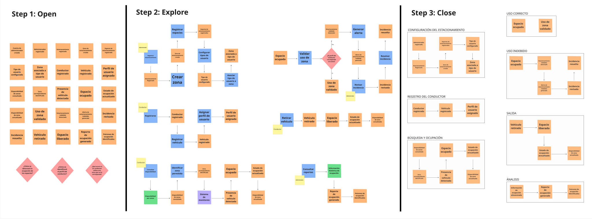
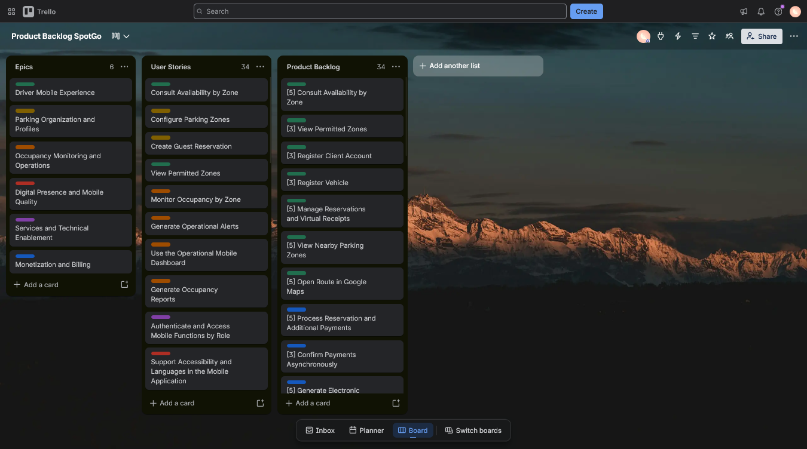
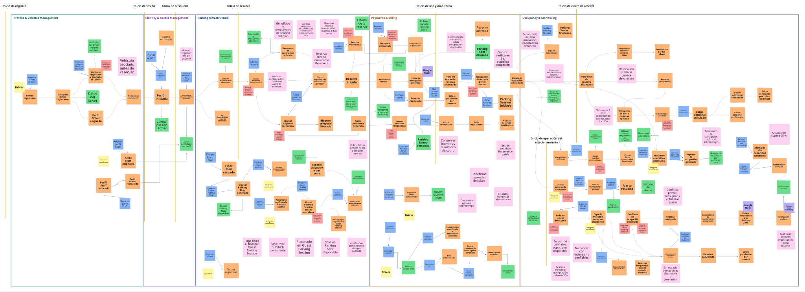
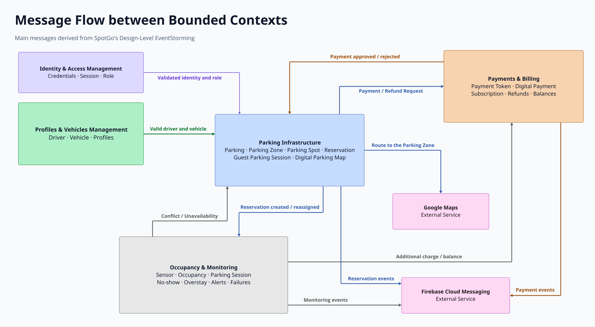
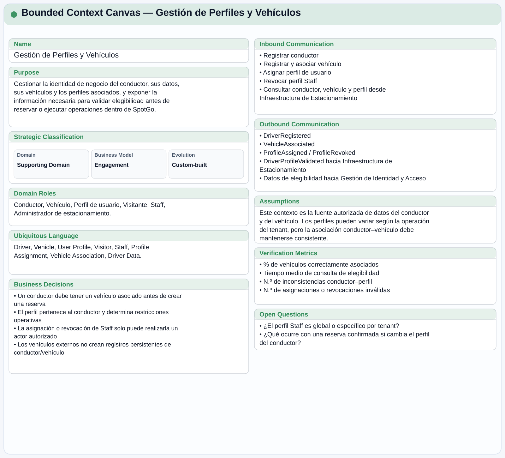
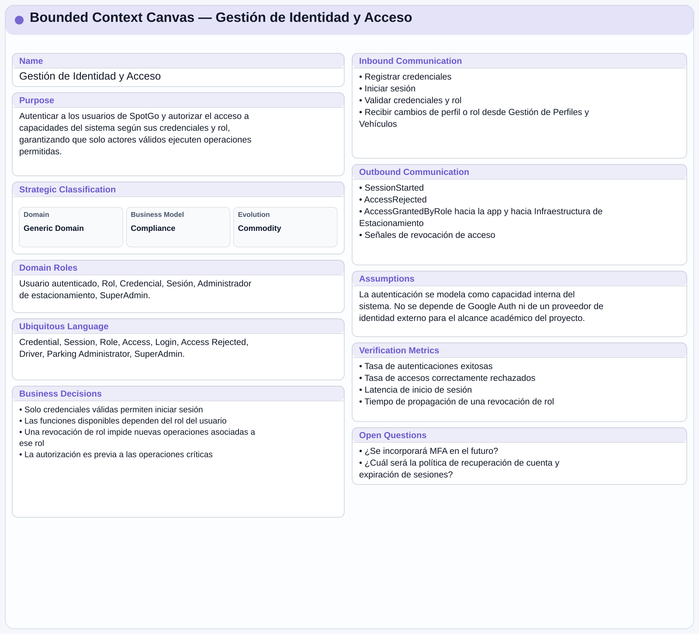
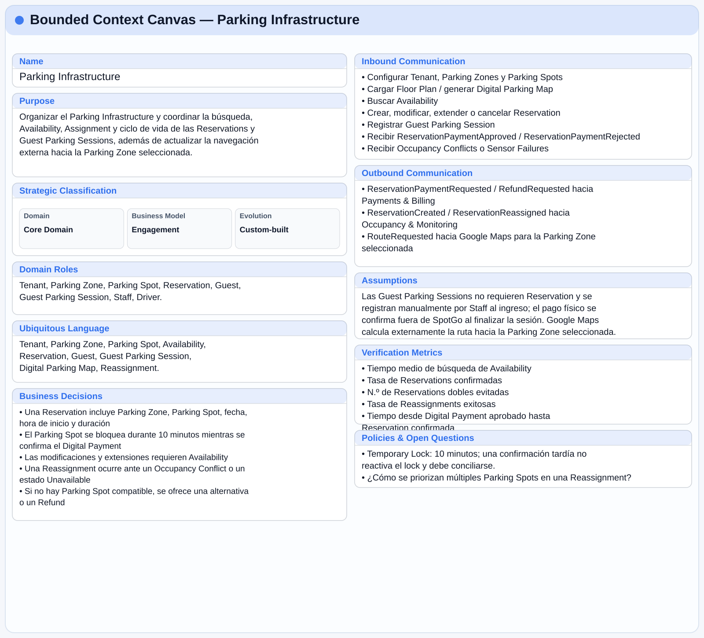
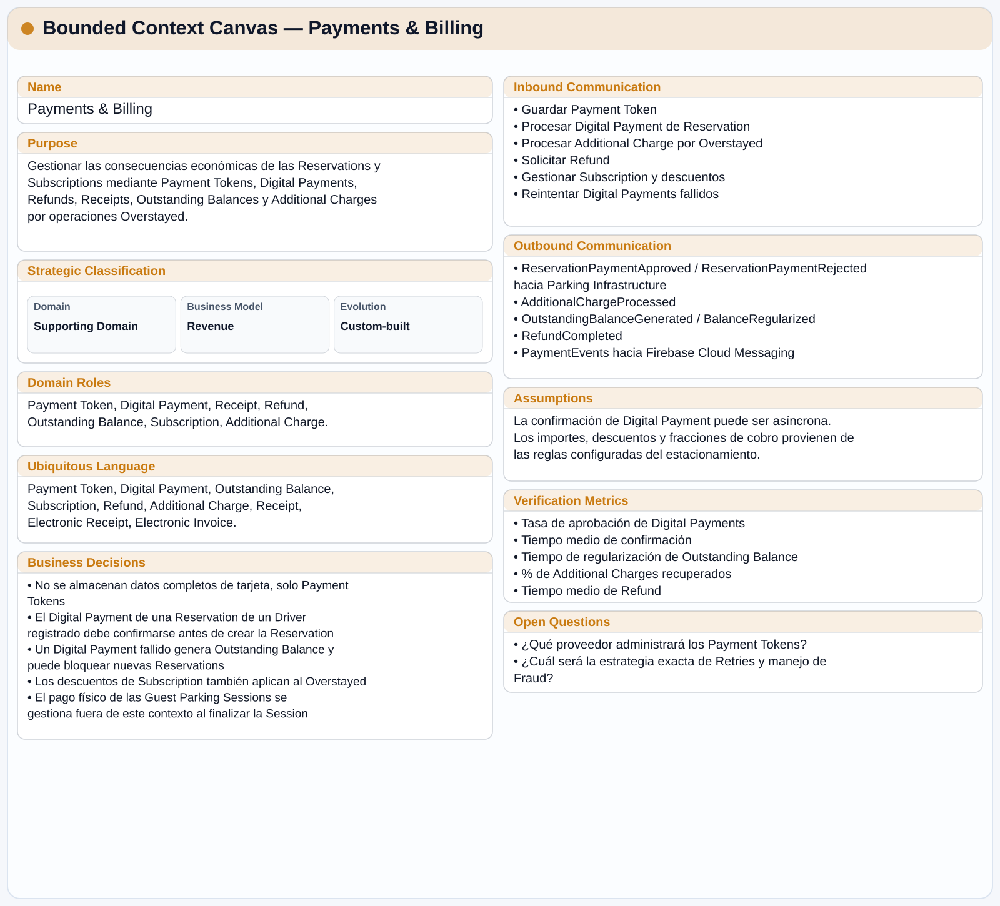
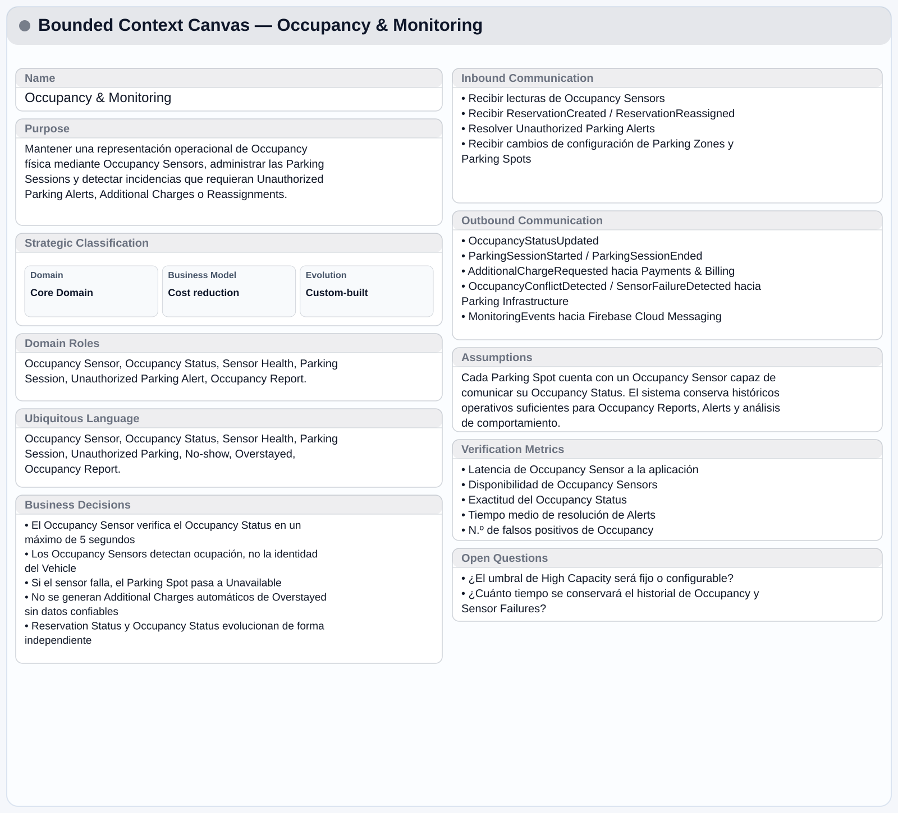

# Capítulo II: Requirements Development and Software Solution Design

## 2.1. Competidores

### 2.1.1. Análisis competitivo

**Competitive Analysis Landscape**

*¿Por qué llevar a cabo este análisis?*

Permite identificar cómo funcionan las soluciones actuales de estacionamiento, detectar sus fortalezas y limitaciones, y determinar oportunidades de diferenciación para SpotGo, especialmente en la organización por zonas, clasificación de usuarios y monitoreo de ocupación.

*Logos*

| SpotGo | Apparka | iPark | Parkopedia |
| --- | --- | --- | --- |
|  |  |  |  |

*Perfil*

|     | SpotGo | Apparka | iPark | Parkopedia |
| --- | --- | --- | --- | --- |
| Overview | Aplicación móvil y servicios backend para organizar estacionamientos por zonas y perfiles, consultar disponibilidad, reservar y pagar espacios, administrar suscripciones y comprobantes electrónicos, y permitir que el Driver abra la ruta hacia su destino en Google Maps. | Empresa peruana de gestión de estacionamientos con app para ubicación, disponibilidad, pagos, reservas y servicios empresariales. | Solución peruana en la nube para gestión digital de estacionamientos, pagos, registro vehicular y control operativo. | Plataforma global de datos de estacionamiento con información estática, disponibilidad dinámica, reservas, pagos e integraciones. |
| Ventaja competitiva | Integra clasificación por perfiles, sensores por Parking Spot, monitoreo actualizado, reservas, pagos, integración con Google Maps y apoyo operativo desde una experiencia móvil. | Amplia presencia en Perú, operación directa de estacionamientos y servicios digitales integrados. | Integra gestión administrativa, pagos digitales, control vehicular y aforo en tiempo real. | Cobertura global, gran volumen de datos y fuerte integración con vehículos y servicios de movilidad. |

*Perfil de marketing*

|     | SpotGo | Apparka | iPark | Parkopedia |
| --- | --- | --- | --- | --- |
| Mercado Objetivo | Operadores de estacionamientos de alta demanda y conductores que utilizan estos espacios. | Conductores urbanos que buscan optimizar tiempo en estacionar. | Operadores y empresas que administran estacionamientos. | Conductores, fabricantes de vehículos, operadores y servicios de movilidad. |
| Estrategias de Marketing | Pruebas piloto con operadores de estacionamientos y alianzas con centros comerciales, universidades y empresas. | Presencia física nacional, app móvil, servicios empresariales y alianzas con distintos tipos de establecimientos. | Venta B2B orientada a digitalización y mejora operativa. | Alianzas con fabricantes, integración mediante APIs y presencia internacional. |

*Perfil de producto*

|     | SpotGo | Apparka | iPark | Parkopedia |
| --- | --- | --- | --- | --- |
| Productos y Servicios | Aplicación móvil para disponibilidad por zonas, perfiles de usuario, reservas, pagos digitales, suscripciones, facturación electrónica e integración con Google Maps; incluye monitoreo por sensores, alertas, reportes y funciones operativas. | Ubicación, disponibilidad, pagos, reservas, abonados y administración de estacionamientos. | Registro vehicular, pagos, facturación, aforo y portal administrativo. | Datos de parking, disponibilidad, reservas, pagos y APIs. |
| Precios y costos | Modelo preliminar basado en suscripción para operadores de estacionamientos; los costos de implementación dependerán de los mecanismos de monitoreo requeridos. | Tarifas variables según estacionamiento, servicio o modalidad de abonado. | Modelo de suscripción con planes según capacidad y requerimientos. | Gratuito para usuarios finales; servicios B2B y licenciamiento de datos. |
| Canales de distribución | App móvil, Landing Page y servicios backend integrados con la infraestructura del estacionamiento. | App móvil, web y red física de estacionamientos. | Plataforma web, app e integraciones con dispositivos. | Web, app, APIs y sistemas integrados en vehículos. |

*Análisis SWOT*

|     | SpotGo | Apparka | iPark | Parkopedia |
| --- | --- | --- | --- | --- |
| Fortalezas | Organización por tipo de usuario, monitoreo por zonas y alertas integradas. | Presencia nacional, operación de estacionamientos y servicios digitales. | Gestión cloud, pagos digitales y aforo en tiempo real. | Cobertura global, datos dinámicos e integración vehicular. |
| Debilidades | Producto nuevo y aún en proceso de validación. | Menor enfoque en clasificación interna de usuarios por zonas. | Puede requerir mayor configuración e integración operativa. | Menor enfoque en gestión interna de zonas por usuario. |
| Oportunidades | Digitalización de estacionamientos de alta demanda. | Expansión de servicios digitales y empresariales. | Escalamiento hacia más operadores y verticales. | Mayor integración con movilidad conectada y vehículos. |
| Amenazas | Competidores consolidados con mayor infraestructura y alcance. | Nuevas soluciones digitales y plataformas globales. | Soluciones más simples o especializadas. | Competidores locales con enfoque operativo específico. |

### 2.1.2. Estrategias y tácticas frente a competidores

1. Organización por zonas según tipo de usuario.
   - SpotGo busca diferenciarse mediante la clasificación de conductores y la asignación de zonas específicas, facilitando una distribución más ordenada y con el objetivo de reducir posibles usos indebidos.

2. Monitoreo actualizado de ocupación.
   - La solución ofrecerá información actualizada sobre la disponibilidad por zonas, permitiendo a conductores y personal operativo tomar decisiones con mayor rapidez.

3. Gestión centralizada para administradores.
   - La aplicación móvil administrativa permitirá consultar ocupación, distribución de zonas e incidencias desde un único entorno, facilitando la supervisión operativa.

4. Experiencia de búsqueda enfocada en disponibilidad.
   - Los conductores podrán consultar qué zonas presentan disponibilidad y cuáles pueden utilizar según su clasificación, con el objetivo de reducir recorridos innecesarios.

5. Modelo modular y adaptable.
   - La solución podrá implementarse progresivamente según las necesidades y características de cada estacionamiento, buscando reducir las barreras de adopción.

6. Analítica para soporte de decisiones.
   - Los reportes de ocupación permitirán identificar patrones de uso, periodos de alta demanda y comportamiento de las diferentes zonas.

## 2.2. Entrevistas

### 2.2.1. Diseño de entrevistas

**Primer Segmento Objetivo (Administradores o personal operativo de estacionamiento)**

1. ¿Cuáles son los principales retos que enfrenta en la gestión del estacionamiento?
2. ¿Cómo organizan actualmente la distribución de espacios dentro del estacionamiento?
3. ¿De qué manera registran y diferencian a los usuarios como clientes o colaboradores?
4. ¿Qué situaciones ocurren cuando un vehículo ocupa un espacio que no le corresponde?
5. ¿Cómo monitorean la ocupación de las diferentes zonas del estacionamiento?
6. ¿Qué problemas se presentan con mayor frecuencia en horas de alta demanda?
7. ¿Qué dificultades enfrentan los vigilantes para mantener el orden?
8. ¿Qué herramientas o sistemas utilizan actualmente para la gestión del estacionamiento?
9. ¿Qué limitaciones o inconvenientes encuentran en el sistema actual?
10. ¿Cómo cree que la visualización en tiempo real de la ocupación podría ayudar en la gestión?
11. ¿Qué tipo de alertas o notificaciones considera necesarias para mejorar el control?
12. ¿Cómo influye el registro de usuarios en la organización del estacionamiento?
13. ¿Qué beneficios esperaría obtener de un sistema inteligente de estacionamiento?
14. ¿De qué manera considera que se podría reducir el tiempo de búsqueda de espacios?
15. ¿Cómo evaluaría la implementación de una solución como SpotGo en su entorno?

**Segundo Segmento Objetivo (Conductores y usuarios finales)**

1. ¿Cómo suele ser su experiencia al buscar estacionamiento en lugares concurridos?
2. ¿En qué tipos de lugares encuentra más dificultades para estacionar y por qué?
3. ¿Cuánto tiempo suele invertir en encontrar un espacio disponible?
4. ¿Qué siente o piensa cuando no logra encontrar estacionamiento rápidamente?
5. ¿Qué acciones suele tomar cuando no encuentra un espacio libre?
6. ¿Cómo describiría la organización de los estacionamientos que frecuenta?
7. ¿Qué tan fácil le resulta orientarse dentro de un estacionamiento grande?
8. ¿Cómo cree que una aplicación podría ayudarle durante la búsqueda de estacionamiento?
9. ¿Qué tipo de información le gustaría recibir antes de ingresar a un estacionamiento?
10. ¿Qué información le sería útil mientras busca un espacio dentro del lugar?
11. ¿Cómo prefiere visualizar la disponibilidad de espacios: por zonas o de otra forma?
12. ¿Qué opinión tiene sobre la existencia de zonas exclusivas dentro de un estacionamiento?
13. ¿Qué problemas ha tenido relacionados con la señalización dentro del estacionamiento?
14. ¿Cómo mejoraría su experiencia al momento de estacionar?
15. ¿Qué valor le daría a un sistema que reduzca el tiempo de búsqueda de espacios?

### 2.2.2. Registro de entrevistas

**Needfinding Interviews Link:** [https://upcedupe-my.sharepoint.com/:v:/g/personal/u20241e177_upc_edu_pe/IQBqZCnYsXk5TbTE0vg1_trYAcXeX9iY3VyxVWvInncaOEI?nav=eyJyZWZlcnJhbEluZm8iOnsicmVmZXJyYWxBcHAiOiJPbmVEcml2ZUZvckJ1c2luZXNzIiwicmVmZXJyYWxBcHBQbGF0Zm9ybSI6IldlYiIsInJlZmVycmFsTW9kZSI6InZpZXciLCJyZWZlcnJhbFZpZXciOiJNeUZpbGVzTGlua0NvcHkifX0&e=bKCoNf](https://upcedupe-my.sharepoint.com/:v:/g/personal/u20241e177_upc_edu_pe/IQBqZCnYsXk5TbTE0vg1_trYAcXeX9iY3VyxVWvInncaOEI?nav=eyJyZWZlcnJhbEluZm8iOnsicmVmZXJyYWxBcHAiOiJPbmVEcml2ZUZvckJ1c2luZXNzIiwicmVmZXJyYWxBcHBQbGF0Zm9ybSI6IldlYiIsInJlZmVycmFsTW9kZSI6InZpZXciLCJyZWZlcnJhbFZpZXciOiJNeUZpbGVzTGlua0NvcHkifX0&e=bKCoNf)

**Primer Segmento Objetivo (Administradores o personal operativo de estacionamiento)**

**Entrevista 1**

| Screenshot: |  |
| --- | --- |
| Inicia: | 00:00 |
| Duración:| 4:50 |
| Nombre completo: | Cecilia Lopez |
| Edad: | 31 años |
| Distrito: | Cercado de Lima |
| Resumen: | Cecilia nos indica que la gestión del estacionamiento se basa en organización manual y registro mediante boletas y tablas, sin asignación de zonas específicas, ya que los vehículos ocupan cualquier espacio disponible. El monitoreo se realiza con cámaras y control físico, y en horas de alta demanda surgen dificultades para movilizar vehículos debido al espacio reducido. Aunque el sistema actual funciona, depende en gran medida de la intervención manual, incluso solicitando llaves para reorganizar los autos. Considera que un sistema inteligente podría mejorar la organización, visibilidad y control, además de aportar beneficios para atraer más clientes. |

**Entrevista 2**

| Screenshot: |  |
| --- | --- |
| Inicia: | 04:50 |
| Duración:| 5:04 |
| Nombre completo: | Reinaldo Torres |
| Edad: | 42 años |
| Distrito: | Breña |
| Resumen: | Nos comenta que la gestión de su estacionamiento combina métodos manuales y digitales, registrando a los clientes sin asignación fija de espacios, ya que ocupan cualquier lugar disponible. El monitoreo se realiza mediante un aplicativo que permite control remoto, pero en horas de alta demanda surgen problemas de congestión y necesidad de movilizar vehículo. Él nos destaca que un sistema en tiempo real mejoraría significativamente la gestión, permitiendo mayor control y reducción de pérdidas económicas. También resalta la importancia de alertas, especialmente para pagos, y considera que la implementación de una solución inteligente sería beneficiosa, aunque requeriría capacitación del personal. |

**Entrevista 3**

| Screenshot: |  |
| --- | --- |
| Inicia: | 10:44 |
| Duración:| 6:18 |
| Nombre completo: | Juan Vega |
| Edad: | 30 años |
| Distrito: | La Victoria |
| Resumen: | La entrevista a Juan Vega, un administrador de estacionamientos de 30 años, expone las dificultades de una gestión basada en procesos manuales, registros en papel y vigilancia visual, lo que genera desorden en horas pico y un control ineficiente de los espacios reservados. Debido a la falta de un sistema en tiempo real, el personal debe realizar rondas a pie y vocear placas para gestionar la ocupación, una carga operativa que el administrador busca eliminar. En este contexto, la aplicación "SpotGo" es recibida con gran optimismo, ya que el uso de sensores para detectar ocupación y un mapa en vivo permitiría automatizar la supervisión de lugares, mejorar el control de pagos y proyectar una imagen mucho más profesional y organizada de la empresa. |

**Segundo Segmento Objetivo (Conductores y usuarios finales)**

**Entrevista 1**

| Screenshot: |  |
| --- | --- |
| Inicia: | 17:02 |
| Duración:| 3:51 |
| Nombre completo: | Emiliano Lozano |
| Edad: | 51 años |
| Distrito: | San Martin de Porres |
| Resumen: | Emiliano nos señala que, como taxista, cuenta con un espacio asignado dentro del estacionamiento, lo que facilita su experiencia y evita dificultades para encontrar lugar. La organización se apoya en señalización básica como carteles, y en algunos casos utilizan conos para asegurar sus espacios. En momentos de alta demanda, otros usuarios ocupan sus espacios, obligándolos a esperar o buscar alternativas. Además, señala que los clientes tienen más dificultades para estacionar. Considera que una solución tecnológica con señales o alertas podría mejorar la organización. |

**Entrevista 2**

| Screenshot: |  |
| --- | --- |
| Inicia: | 20:54 |
| Duración:| 7:06 |
| Nombre completo: | Angel Pariona |
| Edad: | 23 años |
| Distrito: | Lince |
| Resumen: | Angel menciona que encuentra difícil hallar estacionamiento debido a zonas no autorizadas o cocheras ocupadas, especialmente cerca de cines y parques de agua, demorando entre 10 a 15 minutos. Califica la organización actual como muy poco ordenada porque los vehículos no respetan los espacios y generan bloqueos ante la falta de fiscalización municipal. Ante la falta de espacio, da vueltas por las cuadras o se aleja un poco más, calificando la situación de frustrante por la pérdida de tiempo. Considera que una aplicación sería muy útil si le señala zonas libres, muestra la seguridad del lugar y permite reservar espacios. Sugiere medir mejor los tiempos y buscar estacionamiento en horas punta, valorando que un sistema así reduciría significativamente el tiempo de búsqueda en Lima. |

**Entrevista 3**

| Screenshot: |  |
| --- | --- |
| Inicia: | 28:00 |
| Duración:| 3:58 |
| Nombre completo: | Jorge Luis |
| Edad: | 26 |
| Distrito: | El Tambo |
| Resumen: | Jorge Luis mencionó que buscar estacionamiento en lugares concurridos suele ser complicado, ya que puede tomar varios minutos encontrar un espacio libre y esto genera estrés. También señaló que la falta de señalización y organización dificulta orientarse dentro de algunos estacionamientos. Considera que una aplicación que muestre la disponibilidad de espacios por zonas y guíe al conductor ayudaría a reducir el tiempo de búsqueda y mejorar la experiencia al estacionar. |

### 2.2.3. Análisis de entrevistas

**Primer Segmento Objetivo (Administradores o personal operativo de estacionamiento)**

Este segmento es clave porque son responsables de la organización, control y funcionamiento del estacionamiento. Las entrevistas realizadas evidencian cómo se gestionan actualmente estos espacios y las principales limitaciones que enfrentan, así como la oportunidad de mejora mediante soluciones tecnológicas.

*¿Quienes son?*
Se trata de administradores y personal operativo encargados de supervisar el estacionamiento y organizar el flujo de vehículos.
- Utilizan una combinación de métodos manuales y sistemas básicos (boletas, registros, aplicativos).
- Se encargan del control de ingresos, ocupación y organización de los vehículos.
- En muchos casos, deben intervenir directamente para reordenar los autos.

*¿Qué les preocupa y anhelan?*
- Desorden en la ocupación: No existen zonas definidas, los usuarios ocupan cualquier espacio disponible.
- Congestión en horas pico: Dificultad para movilizar vehículos en espacios reducidos.
- Dependencia de procesos manuales: Uso de boletas, registros y control físico. 
- Necesidad de control: Buscan mayor visibilidad sin tener que estar presentes todo el tiempo.
- Pérdidas operativas: Riesgo de errores en cobros o control del tiempo de permanencia.

*Requisitos del producto*
- Eficiente, permitiendo una mejor organización del estacionamiento.
- Clara y visual, mostrando la ocupación por zonas en tiempo real.
- Con alertas, para detectar uso indebido de espacios o eventos importantes.
- De fácil control remoto, para que el administrador supervise sin estar presente.
- Apoyo a la gestión, reduciendo la dependencia de procesos manuales.

**Segundo Segmento Objetivo (Conductores y usuarios finales (clientes))**

Este segmento es fundamental porque son quienes utilizan directamente el estacionamiento y experimentan los problemas al momento de buscar un espacio. Las entrevistas realizadas evidencian dificultades relacionadas con el tiempo de búsqueda, la organización del lugar y la falta de información clara, lo que impacta en su experiencia.

*¿Quienes son?*
Se trata de conductores que utilizan estacionamientos en centros comerciales, universidades u otros espacios concurridos.
- Buscan estacionar de forma rápida, segura y sencilla.
- Su experiencia varía según el nivel de congestión y organización del lugar.
- Dependen de la señalización, su conocimiento del lugar o apoyo del personal.
- En algunos casos, recurren a alternativas como estacionar en la calle.

*¿Qué les preocupa y anhelan?*
- Tiempo de búsqueda elevado: Puede tomar varios minutos encontrar un espacio, especialmente en horas pico.
- Congestión y desorden: Tráfico interno y mala organización en entradas, salidas o pisos.
- Falta de orientación: Dificultad para ubicarse dentro del estacionamiento o encontrar salidas.
- Información limitada: No conocen disponibilidad, tarifas o condiciones antes de ingresar.
- Estrés y frustración: Sensaciones negativas cuando no encuentran espacio rápidamente. 

*Requisitos del producto*
- Rápida y eficiente, reduciendo el tiempo de búsqueda de espacios.
- Visual y clara, mostrando disponibilidad por zonas o pisos.
- Informativa, incluyendo datos como espacios libres, tarifas y horarios.
- Fácil de usar, con una interfaz intuitiva que ayude a la orientación.
- Con apoyo en tiempo real, guiando al usuario dentro del estacionamiento.

## 2.3. Needfinding

### 2.3.1. User Personas

**Primer Segmento Objetivo (Administradores o personal operativo de estacionamiento)**

*Figura 2 (User Persona 1)*

**Segundo Segmento Objetivo (Conductores y usuarios finales)**

*Figura 3 (User Persona 2)*

### 2.3.2. User Task Matrix

**Primer Segmento Objetivo (Administradores o personal operativo de estacionamiento)**

*Figura 4 (User Task Matrix 1)*

**Segundo Segmento Objetivo (Conductores y usuarios finales)**

*Figura 5 (User Task Matrix 2)*

### 2.3.3. User Journey Mapping

**Primer Segmento Objetivo (Administradores o personal operativo de estacionamiento)**

*Figura 6 (User Journey Map 1)*

**Segundo Segmento Objetivo (Conductores y usuarios finales)**

*Figura 7 (User Journey Map 2)*

### 2.3.4. Empathy Mapping

**Primer Segmento Objetivo (Administradores o personal operativo de estacionamiento)**

*Figura 8 (Empathy Map 1)*

**Segundo Segmento Objetivo (Conductores y usuarios finales)**

*Figura 9 (Empathy Map 2)*

### 2.3.5. Big Picture EventStorming

Se utilizó la guía Step-by-Step Guide de Philippe Bourgau, proporcionada en la rúbrica del Final Problem Statement, para llevar a cabo el proceso de Big Picture Event Storming, siguiendo sus etapas:

- Open
- Explore
- Close

**Miro Board Link:** [https://miro.com/app/board/uXjVHoqrvyc=/](https://miro.com/app/board/uXjVHoqrvyc=/)

*Figura 10 (Big Picture EventStorming)*

### 2.3.6. Ubiquitous Language

- **Parking Spot (Espacio de estacionamiento):** Espacio físico individual dentro de un estacionamiento destinado a la ubicación de un solo vehículo.
- **Vehicle (Vehículo):** Medio de transporte asociado a un Driver, identificado mediante un registro de la cuenta y utilizado para ocupar un Parking Spot. Un Driver puede registrar varios Vehicles y seleccionarlos en sus Reservations. El Vehicle no almacena placas como dato permanente.
- **Parking Zone (Zona de estacionamiento):** Área del estacionamiento que agrupa múltiples *Parking Spots* y puede estar asociada a uno o más tipos de usuario definidos por la administración.
- **User Profile (Perfil de usuario):** Clasificación asignada a un Driver que determina las zonas del estacionamiento que puede utilizar. El perfil pertenece al Driver y puede representar categorías como *Visitor*, *Taxi Driver* o *Staff*; no pertenece al Vehicle.
- **Occupancy Status (Estado de ocupación):** Estado físico actual de un *Parking Spot*, utilizado para determinar su disponibilidad operativa. Puede ser *Available*, *Occupied* o *Unavailable*. El estado *Reserved* pertenece a la Reservation y no reemplaza el estado físico del espacio.
- **Reservation Status (Estado de reserva):** Estado comercial y operativo de una *Reservation*. Puede ser *Reserved*, *Active*, *Completed*, *Cancelled*, *No-show* u *Overstayed*.
- **Zone Assignment (Asignación de zona):** Proceso mediante el cual se determina qué *Parking Zone* corresponde a un conductor según su *User Profile*.
- **Unauthorized Parking (Estacionamiento indebido):** Situación que ocurre cuando un vehículo utiliza un *Parking Spot* o una *Parking Zone* sin una Reservation o Zone Assignment válida para su User Profile.
- **Occupancy Monitoring (Monitoreo de ocupación):** Proceso mediante el cual el sistema obtiene y mantiene actualizada, en un máximo de 5 segundos, la información sobre la ocupación de los espacios y zonas del estacionamiento a partir de sensores instalados en cada *Parking Spot*.

- **Occupancy Sensor (Sensor de ocupación):** Dispositivo instalado en un *Parking Spot* para detectar si el espacio está disponible u ocupado y comunicar el cambio de estado al sistema.
- **Sensor Health (Salud del sensor):** Estado operativo de un *Occupancy Sensor*, utilizado para identificar si el dispositivo comunica datos correctamente o requiere revisión. Cuando el sensor no comunica datos confiables, el *Occupancy Status* correspondiente es *Unavailable*.
- **Digital Parking Map (Mapa digital del estacionamiento):** Representación de la infraestructura del estacionamiento que identifica sus Parking Spots, Parking Zones, accesos y destinos de navegación.
- **Availability (Disponibilidad):** Información que indica la existencia de espacios libres dentro de una *Parking Zone*.
- **Reservation (Reserva):** Registro mediante el cual un Driver registrado o un conductor invitado obtiene el uso de un *Parking Spot* dentro de una *Parking Zone* en una fecha, hora de inicio y duración determinadas. Las Reservations de Drivers registrados se asocian con el Driver y un Vehicle de su cuenta, y requieren el Digital Payment correspondiente; una Guest Reservation es creada por un Parking Administrator para un conductor no registrado, requiere un pago físico mediante efectivo o POS fuera de SpotGo y conserva la placa ingresada manualmente únicamente dentro del registro de la Reservation.
- **Parking Session (Sesión de estacionamiento):** Registro de la ocupación real de un *Parking Spot*, iniciado cuando el sensor detecta ocupación durante una Reservation y finalizado cuando el sensor detecta la salida o el administrador cierra la operación.
- **Virtual Receipt (Comprobante virtual):** Confirmación digital de una reserva o pago que contiene la información necesaria para identificar la operación y el espacio asignado.
- **Check-in / Check-out (Ingreso / Salida):** Eventos que marcan el inicio y el final de la estadía de un vehículo en el estacionamiento. En este proyecto, la asociación entre la Reservation y el Vehicle se simula mediante la Reservation, mientras que los sensores solo confirman la ocupación física del Parking Spot.
- **Digital Payment (Pago digital):** Transacción económica realizada desde la aplicación móvil por un Driver registrado para pagar una estadía, una reserva o un servicio contratado.
- **Payment Token (Token de pago):** Referencia segura administrada por el servicio interno de pagos que permite reutilizar un método de pago autorizado sin almacenar los datos completos de la tarjeta.
- **Outstanding Balance (Saldo pendiente):** Importe que no pudo cobrarse mediante el Payment Token y que debe regularizarse antes de crear nuevas Reservations.
- **Subscription (Suscripción):** Plan de acceso periódico de SpotGo. Puede corresponder a *Free*, *Plus Monthly* por 30 días o *Plus Annual* por 12 meses, con descuentos fijos por operación, prioridad de reserva, acceso a zonas especiales y condiciones de renovación definidas para cada plan. *Free* aplica 0 %, *Plus Monthly* aplica 10 % y *Plus Annual* aplica 15 %.
- **Electronic Invoice (Comprobante electrónico):** Documento tributario generado a partir de una operación registrada, como un *Electronic Receipt* o una *Electronic Invoice*.
- **Nearby Parking Zones (Parking Zones cercanas):** Parking Zones que SpotGo muestra alrededor de la ubicación del Driver mediante la integración con Google Maps API.
- **External Navigation Link (Enlace de navegación externa):** Enlace que abre Google Maps con una Parking Zone como destino para que la aplicación de Google Maps calcule y muestre la ruta.
- **Unauthorized Parking Alert (Alerta por estacionamiento indebido):** Notificación generada cuando un Parking Spot aparece ocupado sin una Reservation válida. La alerta identifica el Parking Spot y el momento del evento, pero no identifica automáticamente el Vehicle.
- **Dashboard (Panel de control):** Interfaz utilizada por administradores y personal operativo para consultar la ocupación, gestionar zonas, identificar incidencias y revisar información relacionada con el estacionamiento.
- **Occupancy Report (Reporte de ocupación):** Información histórica o resumida sobre la utilización de los espacios y zonas del estacionamiento, utilizada para apoyar decisiones operativas.
- **Parking Administrator (Administrador de estacionamiento):** Usuario encargado de gestionar la configuración, supervisión y organización de las zonas y usuarios del estacionamiento.
- **Tenant (Cliente B2B):** Estacionamiento o entidad operativa registrada en SpotGo, con su propia configuración de zonas, perfiles, usuarios y facturación del servicio.
- **SuperAdmin (Administrador de plataforma):** Usuario encargado de registrar *Tenants*, administrar configuraciones de clientes B2B y consultar la facturación asociada al servicio de SpotGo.
- **Driver (Conductor):** Usuario registrado que administra su User Profile y sus Vehicles, consulta disponibilidad, crea Reservations y consulta Parking Zones cercanas.
- **Guest Driver (Conductor invitado):** Conductor no registrado para quien un Parking Administrator crea una Guest Reservation. No tiene una cuenta ni un Vehicle persistente en SpotGo.
- **Guest Reservation (Reserva para conductor invitado):** Reservation creada por un Parking Administrator para un Guest Driver después de recibir el pago físico mediante efectivo o POS. El pago se realiza fuera de SpotGo y la Reservation conserva la placa ingresada manualmente únicamente como parte de su registro.

## 2.4. Requirements specification

La especificación de requisitos de SpotGo se construye a partir de la problemática, las entrevistas, los User Personas, el Ubiquitous Language y las hipótesis definidas en los capítulos anteriores. Su propósito es traducir las necesidades de los conductores y del personal de estacionamiento en comportamientos verificables del producto.

El producto principal es una aplicación móvil con experiencias diferenciadas para los siguientes actores:

- **Driver:** consulta la disponibilidad por Parking Zone e identifica las zonas que puede utilizar según su User Profile.
- **Parking Administrator:** configura Parking Zones y perfiles, supervisa el Occupancy Status, atiende incidencias y consulta Occupancy Reports desde la aplicación móvil.
- **SuperAdmin:** registra Tenants B2B y habilita la configuración inicial de nuevos estacionamientos.
- **Public Visitor:** consulta la propuesta de valor en la Landing Page y accede al destino oficial de la aplicación móvil sin autenticarse.
- **Developer:** implementa los servicios RESTful, integra los sensores de ocupación y desarrolla las capacidades técnicas que permiten sincronizar la aplicación móvil, conservar información local y documentar los contratos de integración.

La solución también contempla una Landing Page estática como producto digital de apoyo para comunicar la propuesta de valor de SpotGo. La Landing Page no reemplaza la aplicación móvil ni se considera parte del flujo operativo del estacionamiento.

El alcance funcional se concentra en la organización por zonas, la clasificación de Drivers mediante User Profiles, el registro de Vehicles, la visualización actualizada de disponibilidad, el monitoreo de ocupación, las alertas por uso indebido y los reportes operativos. También incluye Guest Reservations para conductores no registrados, cuyo pago se realiza físicamente al Parking Administrator mediante efectivo o POS fuera de SpotGo; Reservations para Drivers registrados, Digital Payments, Subscriptions, Electronic Invoices y la consulta de Parking Zones cercanas mediante Google Maps, con apertura de la ruta en la aplicación de Google Maps.

El Occupancy Monitoring se realizará mediante un *Occupancy Sensor* instalado en cada *Parking Spot*. La solución debe operar en estacionamientos interiores y exteriores y comunicar los cambios de *Occupancy Status*, dejándolos disponibles para la aplicación móvil en un máximo de 5 segundos. Cada *Parking Spot* tendrá capacidad para un solo vehículo y cada *Vehicle* podrá mantener como máximo un *Parking Spot* activo. Los sensores únicamente detectan si el espacio está ocupado; no identifican el vehículo que lo ocupa. No se utilizarán OCR, inteligencia artificial ni lectura automática de placas. Para una Guest Reservation, el Parking Administrator ingresa manualmente la placa y el dato se conserva únicamente en el registro de esa Reservation.

Las Reservations se crean para un *Parking Spot* específico dentro de una *Parking Zone*, con fecha, hora de inicio y duración. Para una Reservation de un Driver registrado, el Digital Payment debe aprobarse antes de asignar el Reservation Status *Reserved*. Para una Guest Reservation, el Parking Administrator confirma previamente el pago físico recibido mediante efectivo o POS; SpotGo no procesa esa transacción. El Driver puede llegar en cualquier momento dentro del periodo reservado; si el sensor mantiene un Sensor Health operativo y nunca registra ocupación durante todo ese periodo, la Reservation se marca como *No-show* y se devuelve el importe pagado cuando corresponda. Una llegada tardía no modifica la hora final ni el importe de la Reservation.

La duración mínima de una Reservation corresponde a una fracción de cobro configurada por el estacionamiento. No existe una duración máxima global, pero la hora final debe permanecer dentro del horario operativo del estacionamiento. Una Reservation puede crearse como máximo 3 días calendario antes de su hora de inicio y no puede solaparse con otra Reservation o Parking Spot activo del mismo Vehicle. Durante el proceso de pago, el espacio seleccionado mantiene un bloqueo temporal para evitar asignaciones simultáneas.

La ocupación física y la reserva se controlan como estados independientes. El Occupancy Status puede ser *Available*, *Occupied* o *Unavailable*, mientras que el Reservation Status puede ser *Reserved*, *Active*, *Completed*, *Cancelled*, *No-show* u *Overstayed*. Si el Driver se retira antes de la hora final, el Parking Spot puede quedar físicamente *Available*, pero la Reservation continúa protegida hasta su finalización y no genera devolución.

Al superar la hora final de la Reservation se aplica una tolerancia de 5 minutos. Si el Parking Spot continúa ocupado después de la tolerancia, el sistema calcula el sobretiempo según la fracción configurada por el estacionamiento y, cuando la Reservation pertenece a un Driver registrado con un Payment Token autorizado, realiza el cobro adicional mediante el servicio interno de pagos. Los descuentos fijos definidos para cada Subscription también se aplican a estos cobros. Si el cobro falla, se registra un Outstanding Balance, se notifica al Driver, se permiten nuevos intentos con el mismo u otro método y se bloquean nuevas Reservations hasta regularizarlo.

Cuando el sensor registra la salida del vehículo, la Parking Session se cierra. Al concluir la Reservation, el sistema marca su Reservation Status como *Completed* si no existe sobretiempo pendiente; si existió sobretiempo, conserva el registro del cobro adicional y completa la operación cuando el saldo correspondiente queda regularizado.

Las Reservations pueden cancelarse, modificarse o extenderse según la disponibilidad. Una cancelación antes del inicio devuelve el importe pagado cuando corresponda; una cancelación después del inicio o una salida anticipada no genera devolución. Una modificación actualiza el horario o espacio únicamente cuando la nueva asignación es válida y cualquier diferencia de precio queda confirmada. Una extensión no puede afectar una Reservation posterior. Si un espacio reservado está ocupado antes del inicio o por una estadía excedida, el sistema busca un Parking Spot disponible y compatible, notifica al Driver y actualiza la Reservation, el Virtual Receipt y el destino disponible para abrirlo en Google Maps. Si no existe una alternativa, se ofrecen otros estacionamientos o la cancelación con devolución completa cuando exista un importe pagado.

Los conductores no registrados no generan cuentas ni Vehicles persistentes por sí mismos. El Parking Administrator debe recibir el pago físico mediante efectivo o POS, crearles una Guest Reservation, ingresar manualmente la placa y asignarles un Parking Spot y un periodo de uso autorizado, sin utilizar espacios ya reservados. SpotGo no procesa ni almacena los datos de esa transacción física; la placa se conserva únicamente en la Reservation. Las incidencias de sensores marcan el espacio como *Unavailable*, bloquean nuevas Reservations y requieren resolución administrativa; las Reservations afectadas se reasignan o reciben devolución completa cuando exista un importe pagado.

Los planes se organizan como *Free*, *Plus Monthly* y *Plus Annual*. Free permite reservar sin descuento (0 %) y sin zonas especiales. Plus Monthly ofrece prioridad para nuevas Reservations, acceso a zonas especiales y un descuento fijo del 10 % por reserva y por fracción u hora. La prioridad se aplica entre solicitudes que todavía no fueron confirmadas y no desplaza Reservations ya pagadas. Plus Annual conserva esos beneficios y aplica un descuento fijo del 15 % por reserva y por fracción u hora. Estos porcentajes representan descuentos por operación y se aplican también al sobretiempo; no se acumulan con otro descuento de la misma operación.

El sistema envía notificaciones por inicio próximo, inicio y finalización de Reservation, sobretiempo, reasignaciones, pagos exitosos o fallidos, devoluciones y saldos pendientes. Las acciones realizadas por un Parking Administrator se conservan en una bitácora de auditoría con el usuario, la acción, la fecha, la hora y los datos modificados.

De acuerdo con las decisiones de alcance ya establecidas, no se incluyen en esta versión las integraciones municipales ni un panel web administrativo independiente.

Las User Stories de SpotGo se organizan por capacidades funcionales, técnicas y de investigación para mantener claridad, trazabilidad y verificabilidad. La Landing Page se mantiene como producto digital complementario y el resto de capacidades operativas, comerciales y administrativas se especifica para la aplicación móvil y sus servicios backend. La tabla de trazabilidad al final de esta sección relaciona las capacidades del producto con los requisitos definidos.

### 2.4.1. User Stories

Las siguientes User Stories especifican los requisitos funcionales, técnicos y de investigación del alcance mobile-first. Cada historia se relaciona con una Epic, tiene una prioridad de negocio y contiene criterios de aceptación comprobables. La prioridad **High** identifica capacidades directamente vinculadas con los Business Goals; **Medium** corresponde a capacidades de soporte; y **Low** corresponde a documentación o capacidades complementarias.

Los criterios de aceptación se expresan con la estructura Gherkin **Given - When - Then**, se redactan en tiempo presente y tercera persona, y describen resultados observables sin fijar detalles innecesarios de interfaz. Las Technical Stories utilizan el rol Developer cuando la capacidad no tiene interacción directa con un usuario final. Las Spike Stories expresan una investigación que debe cerrarse con resultados documentados y evidencia suficiente para reducir la incertidumbre.

**Epics**

| Epic ID | Title | Description |
| --- | --- | --- |
| E1 | Driver Mobile Experience | Mobile capabilities that allow the Driver to register, check Availability, view nearby Parking Zones, make Reservations and pay for a service, and open an external route in Google Maps. |
| E2 | Parking Organization and Profiles | Configuration of Parking Spots, Parking Zones, User Profiles, registered Vehicles, and Guest Reservations by the Parking Administrator. |
| E3 | Occupancy Monitoring and Operations | Monitoring of Occupancy Status through sensors per Parking Spot, an operational dashboard, Unauthorized Parking alerts, and Occupancy Reports. |
| E4 | Digital Presence and Mobile Quality | Static Landing Page, accessibility, and internationalization of SpotGo's digital products. |
| E5 | Services and Technical Enablement | RESTful services, sensor integration, authentication, local persistence, synchronization, documentation, and technical validations required for the mobile application. |
| E6 | Monetization and Billing | Reservations for registered Drivers, Digital Payments, additional charges, refunds, Subscriptions, asynchronous confirmations, electronic receipts, and B2C and B2B billing consultation. |

**User Stories**

***US01 - Consult Availability by Zone***

| Field | Specification |
| --- | --- |
| Story ID | US01 |
| User | Driver |
| Priority | High |
| Epic | E1 - Driver Mobile Experience |
| Title | Consult Availability by Zone |
| Description | **As a** Driver, **I want** to consult current Availability by Parking Zone, **so that** I can identify where a Parking Spot may be available. |
| Acceptance Criteria | **Scenario 1: Zone with availability** **Given** a Parking Zone contains at least one Parking Spot with Occupancy Status *Available*, operational Sensor Health, and no active Reservation **When** the Driver requests current Availability **Then** the application reports the number of available Parking Spots and the time of the latest update.  **Scenario 2: Zone without availability** **Given** all Parking Spots in a Parking Zone are *Occupied*, have a Reservation with Reservation Status *Reserved* or *Active*, or are *Unavailable* **When** the Driver requests current Availability **Then** the application informs the Driver that the zone has no available Parking Spots and does not offer *Unavailable* spots for reservation.  **Scenario 3: Manual refresh** **Given** the Driver is viewing previously synchronized Availability **When** the Driver requests an information update **Then** the application retrieves the latest available status and displays the time of the new update. |

***US02 - Configure Parking Zones***

| Field | Specification |
| --- | --- |
| Story ID | US02 |
| User | Parking Administrator |
| Priority | High |
| Epic | E2 - Parking Organization and Profiles |
| Title | Configure Parking Zones |
| Description | **As a** Parking Administrator, **I want** to create Parking Zones, associate them with User Profiles and configure their operating rules, **so that** the parking facility can organize its Parking Spots and apply consistent reservation and billing conditions. |
| Acceptance Criteria | **Scenario 1: Valid zone configuration** **Given** Parking Spots are registered and the zone data is valid **When** the Parking Administrator creates a Parking Zone and associates the selected Parking Spots **Then** the system saves the relationship between the zone, its spots, and the authorized User Profiles.  **Scenario 2: Conflicting spot assignment** **Given** a Parking Spot already belongs to another Parking Zone **When** the Parking Administrator attempts to save it in a new zone **Then** the system identifies the conflict and does not save the new relationship until the assignment is resolved.  **Scenario 3: Operating rules configuration** **Given** the Parking Administrator provides a valid operating schedule and a positive billing fraction unit **When** the administrator saves the rules for the Parking Zone or parking facility **Then** the system only allows Reservations within operating hours and calculates additional time using the configured fraction. |

***US03 - Create Guest Reservation***

| Field | Specification |
| --- | --- |
| Story ID | US03 |
| User | Parking Administrator |
| Priority | High |
| Epic | E2 - Parking Organization and Profiles |
| Title | Create Guest Reservation |
| Description | **As a** Parking Administrator, **I want** to create a Reservation for a driver who arrives without a registered SpotGo account after receiving the physical payment, **so that** the driver can use an authorized Parking Spot without creating a persistent Driver or Vehicle record or processing the payment in SpotGo. |
| Acceptance Criteria | **Scenario 1: Valid guest reservation** **Given** an unregistered driver arrives at the parking facility, the Parking Administrator is authorized to operate, receives the cash or POS payment outside SpotGo, and an available Parking Spot exists **When** the Parking Administrator selects the Parking Spot, defines the authorized period, and manually enters the license plate **Then** the system creates a Guest Reservation, retains the license plate only in the Reservation record, does not create a Driver account or persistent Vehicle, and does not process the physical transaction.  **Scenario 2: Reserved or unavailable spot conflict** **Given** the requested Parking Spot has an active Reservation or is *Unavailable* **When** the Parking Administrator attempts to create the Guest Reservation **Then** the system rejects the operation and requests that an available Parking Spot be selected.  **Scenario 3: Required guest data** **Given** required data for the period, Parking Spot, license plate, or physical payment confirmation is missing for the Guest Reservation **When** the Parking Administrator attempts to confirm the operation **Then** the system rejects the Reservation and leaves the existing records unchanged. |

***US04 - View Permitted Zones***

| Field | Specification |
| --- | --- |
| Story ID | US04 |
| User | Driver |
| Priority | High |
| Epic | E1 - Driver Mobile Experience |
| Title | View Permitted Zones |
| Description | **As a** Driver, **I want** to know which Parking Zones are permitted for my User Profile, **so that** I can use only the areas assigned to my category. |
| Acceptance Criteria | **Scenario 1: Profile with permitted zones** **Given** the Driver has an active User Profile and associated Parking Zones exist **When** the application retrieves the profile information **Then** the system returns the permitted zones together with their current Availability.  **Scenario 2: No permitted zone available** **Given** the Driver has no permitted Parking Zone with Availability **When** the application retrieves the corresponding zones **Then** the system informs the Driver that there is no availability in the authorized zones and excludes unauthorized zones. |

***US05 - Monitor Occupancy by Zone***

| Field | Specification |
| --- | --- |
| Story ID | US05 |
| User | Parking Administrator |
| Priority | High |
| Epic | E3 - Occupancy Monitoring and Operations |
| Title | Monitor Occupancy by Zone |
| Description | **As a** Parking Administrator, **I want** to monitor the Occupancy Status of Parking Spots grouped by Parking Zone, **so that** I can supervise the current operation of the parking facility. |
| Acceptance Criteria | **Scenario 1: Current monitoring data** **Given** the *Occupancy Sensors* transmit the current status of the *Parking Spots* in an indoor or outdoor parking facility **When** the Parking Administrator requests current monitoring data **Then** the system groups the information by *Parking Zone* and displays the Occupancy Status (*Available*, *Occupied*, or *Unavailable*) and the Reservation Status of each spot separately when applicable.  **Scenario 2: Occupancy change within the maximum time** **Given** an *Occupancy Sensor* installed in a *Parking Spot* detects an occupancy change **When** the system receives the sensor event **Then** it updates the Occupancy Status, recalculates the Availability of the related Parking Zone, and makes the information available to the mobile application within a maximum of 5 seconds.  **Scenario 3: Sensor unavailable** **Given** an *Occupancy Sensor* stops transmitting reliable data **When** the system detects the incident **Then** it marks the Parking Spot as *Unavailable*, blocks new Reservations, prevents automatic charges based on unreliable readings, notifies the Parking Administrator, and starts reviewing affected Reservations. |

***US06 - Generate Operational Alerts***

| Field | Specification |
| --- | --- |
| Story ID | US06 |
| User | Parking Administrator |
| Priority | High |
| Epic | E3 - Occupancy Monitoring and Operations |
| Title | Generate Operational Alerts |
| Description | **As a** Parking Administrator, **I want** to receive alerts about unauthorized parking and critical capacity conditions, **so that** I can review incidents and react before the operation is affected. |
| Acceptance Criteria | **Scenario 1: Unauthorized or unvalidated occupancy detected** **Given** a Parking Spot has Occupancy Status *Occupied* and no Reservation authorizes its use **When** the system validates the occupancy against the registered authorizations **Then** it creates an Unauthorized Parking Alert with the Parking Zone, Parking Spot, and event time, classifies it as unvalidated occupancy, and does not attempt to identify the vehicle through images or license plate data.  **Scenario 2: Reservation conflict detected** **Given** a future Reservation is assigned to a Parking Spot that remains occupied by a previous Parking Session **When** the system detects the conflict **Then** it starts searching for an available and compatible Parking Spot, retains the incident record, and notifies the Parking Administrator and Driver when the reassignment or alternative is confirmed.  **Scenario 3: High capacity detected** **Given** total parking facility occupancy exceeds 95 percent of the operational Parking Spots available for use **When** the system evaluates the occupancy level **Then** it creates a critical High Capacity alert and makes it available to the Parking Administrator.  **Scenario 4: Alert resolution** **Given** a pending operational alert exists **When** the Parking Administrator records that the incident was reviewed **Then** the system changes the alert status to resolved and retains its history. |

***US07 - Use the Operational Mobile Dashboard***

| Field | Specification |
| --- | --- |
| Story ID | US07 |
| User | Parking Administrator |
| Priority | High |
| Epic | E3 - Occupancy Monitoring and Operations |
| Title | Use the Operational Mobile Dashboard |
| Description | **As a** Parking Administrator, **I want** to consult a centralized operational summary and live occupancy map in the mobile application, **so that** I can review occupancy, Availability and pending incidents in one place. |
| Acceptance Criteria | **Scenario 1: Current operational summary** **Given** the Parking Administrator has authorized access and operational data exists **When** the administrator requests the current summary **Then** the system returns the total number of Parking Spots, Availability by Parking Zone, active Reservations, outstanding balances, and pending operational alerts.  **Scenario 2: Color-coded zone detail** **Given** the Parking Administrator requests information for a specific Parking Zone **When** the system processes the request **Then** it returns the zone occupancy map with Parking Spots differentiated by Occupancy Status, Reservation Status, and Sensor Health, and allows the view to be filtered by User Profile or Parking Zone.  **Scenario 3: Administrative audit** **Given** the Parking Administrator modifies a configuration, assignment, Reservation, or incident **When** the system confirms the operation **Then** it records the user, action, date, time, and previous and new data in the audit log. |

***US08 - Generate Occupancy Reports***

| Field | Specification |
| --- | --- |
| Story ID | US08 |
| User | Parking Administrator |
| Priority | Medium |
| Epic | E3 - Occupancy Monitoring and Operations |
| Title | Generate Occupancy Reports |
| Description | **As a** Parking Administrator, **I want** to consult Occupancy Reports grouped by period and Parking Zone, **so that** I can identify usage patterns and support operational decisions. |
| Acceptance Criteria | **Scenario 1: Period with historical data** **Given** records of Occupancy Status, Reservations, and Parking Sessions exist for the requested period **When** the Parking Administrator generates the Occupancy Report **Then** the system groups the data by Parking Zone and period and reports usage patterns, unused Reservations, overstays, and recorded incidents.  **Scenario 2: Period without data** **Given** no records exist for the requested period **When** the Parking Administrator generates the Occupancy Report **Then** the system informs the administrator that no data is available and does not infer nonexistent values. |

***US09 - Authenticate and Access Mobile Functions by Role***

| Field | Specification |
| --- | --- |
| Story ID | US09 |
| User | Driver, Parking Administrator or SuperAdmin |
| Priority | Medium |
| Epic | E5 - Services and Technical Enablement |
| Title | Authenticate and Access Mobile Functions by Role |
| Description | **As a** Driver, Parking Administrator or SuperAdmin, **I want** to access SpotGo with my authorized account, **so that** I can use only the capabilities related to my role. |
| Acceptance Criteria | **Scenario 1: Valid access** **Given** the account is active and the credentials are valid **When** the user requests access to SpotGo **Then** the system authenticates the user, creates a valid session, and enables the capabilities associated with the user's role.  **Scenario 2: Invalid or expired access** **Given** the credentials are invalid or the session is no longer valid **When** the user requests access to protected information **Then** the system rejects the request and does not provide occupancy, profile, or restricted-zone data. |

***US10 - Support Accessibility and Languages in the Mobile Application***

| Field | Specification |
| --- | --- |
| Story ID | US10 |
| User | Driver or Parking Administrator |
| Priority | Medium |
| Epic | E4 - Digital Presence and Mobile Quality |
| Title | Support Accessibility and Languages in the Mobile Application |
| Description | **As a** Driver or Parking Administrator, **I want** the mobile application to support accessibility and Spanish/English language options, **so that** I can use SpotGo according to my needs and language preference. |
| Acceptance Criteria | **Scenario 1: Language selection** **Given** the user selects Spanish or English as the application language **When** the application loads the product information **Then** it displays the domain texts and statuses in the selected language and uses Spanish as the fallback when no translation exists.  **Scenario 2: Assistive technology** **Given** the user uses assistive technology **When** the user consults the content and actions in the mobile application **Then** the application exposes accessible names, understandable statuses, and a logical navigation order. |

***US11 - Communicate the Value Proposition on the Landing Page***

| Field | Specification |
| --- | --- |
| Story ID | US11 |
| User | Public Visitor |
| Priority | Medium |
| Epic | E4 - Digital Presence and Mobile Quality |
| Title | Communicate the Value Proposition on the Landing Page |
| Description | **As a** Public Visitor, **I want** to understand the problem, value proposition and main capabilities of SpotGo through a fast static Landing Page, **so that** I can evaluate the product and access the mobile application. |
| Acceptance Criteria | **Scenario 1: Public content** **Given** the Public Visitor accesses the public Landing Page **When** the content loads **Then** the page communicates the problem, value proposition, and main capabilities of SpotGo without requiring authentication.  **Scenario 2: Mobile viewport** **Given** the Public Visitor accesses the Landing Page from a mobile device **When** the visitor views the Landing Page **Then** the content remains legible, adapts to the available size, and maintains clear access to information about the mobile application. |

***US12 - Navigate from the Landing Page to the Mobile Product***

| Field | Specification |
| --- | --- |
| Story ID | US12 |
| User | Public Visitor |
| Priority | Medium |
| Epic | E4 - Digital Presence and Mobile Quality |
| Title | Navigate from the Landing Page to the Mobile Product |
| Description | **As a** Public Visitor, **I want** to navigate between the sections of the Landing Page and reach the mobile product destination, **so that** I can continue from product information to the application. |
| Acceptance Criteria | **Scenario 1: Section navigation** **Given** the Public Visitor requests an available Landing Page section **When** the navigation is processed **Then** the system directs the visitor to the corresponding content without losing the page context.  **Scenario 2: Mobile product destination** **Given** the Public Visitor requests access to the mobile product **When** the access link is processed **Then** the Landing Page directs the visitor to the official download or access destination for the mobile application. |

***US13 - Register Client Account***

| Field | Specification |
| --- | --- |
| Story ID | US13 |
| User | Driver |
| Priority | High |
| Epic | E1 - Driver Mobile Experience |
| Title | Register Client Account |
| Description | **As a** Driver, **I want** to create an account in the SpotGo mobile application, **so that** I can use the parking services. |
| Acceptance Criteria | **Scenario 1: Successful registration** **Given** the Driver provides the required personal data and an unregistered email address **When** the Driver submits the registration request **Then** the system creates the active account and assigns the User Profile *Visitor* by default.  **Scenario 2: Existing email or invalid data** **Given** the email address is already registered or required data is missing **When** the Driver submits the registration request **Then** the system rejects the operation, reports the cause, and does not create a duplicate account. |

***US14 - Register B2B Tenant***

| Field | Specification |
| --- | --- |
| Story ID | US14 |
| User | SuperAdmin |
| Priority | High |
| Epic | E2 - Parking Organization and Profiles |
| Title | Register B2B Tenant |
| Description | **As a** SuperAdmin, **I want** to register a parking facility as a Tenant, **so that** its administrator can configure and operate SpotGo for that facility. |
| Acceptance Criteria | **Scenario 1: Successful Tenant registration** **Given** the SuperAdmin provides the required information for an unregistered parking facility and the Parking Administrator's data **When** the SuperAdmin confirms the Tenant registration **Then** the system creates the Tenant, enables its initial configuration, and sends an access invitation to the registered Parking Administrator.  **Scenario 2: Missing required information** **Given** the parking facility name or another required field is missing **When** the SuperAdmin attempts to confirm the registration **Then** the system rejects the operation and does not create the incomplete Tenant. |

***US15 - Assign Staff Profile***

| Field | Specification |
| --- | --- |
| Story ID | US15 |
| User | Parking Administrator |
| Priority | High |
| Epic | E2 - Parking Organization and Profiles |
| Title | Assign Staff Profile |
| Description | **As a** Parking Administrator, **I want** to assign or revoke the Staff User Profile for a registered Driver, **so that** the Driver can access the restricted Parking Zones defined for staff with any Vehicle associated with the account. |
| Acceptance Criteria | **Scenario 1: Assign Staff profile** **Given** the Driver has a registered account and the Parking Administrator is authorized to modify profiles **When** the administrator assigns the User Profile *Staff* to the Driver **Then** the system updates the Driver's profile and applies the zones permitted for Staff to the Driver's Reservations.  **Scenario 2: Revoke Staff profile** **Given** a Driver has the User Profile *Staff* active **When** the Parking Administrator revokes that profile **Then** the system returns the Driver to the default User Profile *Visitor* and removes Staff-exclusive authorizations. |

***US16 - Upload Parking Floor Plan***

| Field | Specification |
| --- | --- |
| Story ID | US16 |
| User | Parking Administrator |
| Priority | Medium |
| Epic | E2 - Parking Organization and Profiles |
| Title | Upload Parking Floor Plan |
| Description | **As a** Parking Administrator, **I want** to upload the Floor Plan of the parking facility, **so that** the system can use it as the basis for a Digital Parking Map. |
| Acceptance Criteria | **Scenario 1: Valid Floor Plan** **Given** the Parking Administrator selects a valid PNG or JPG image file **When** the administrator submits it for configuration **Then** the system accepts the file and makes it available for the map generation process.  **Scenario 2: Invalid format** **Given** the selected file is a PDF, text document, or unsupported format **When** the Parking Administrator attempts to submit it **Then** the system rejects the file and informs the administrator that the format is invalid. |

***US17 - Generate Digital Parking Map***

| Field | Specification |
| --- | --- |
| Story ID | US17 |
| User | Parking Administrator |
| Priority | Medium |
| Epic | E2 - Parking Organization and Profiles |
| Title | Generate Digital Parking Map |
| Description | **As a** Parking Administrator, **I want** the system to process the uploaded Floor Plan, **so that** it can initialize the Digital Parking Map, Parking Spots and Parking Zones. |
| Acceptance Criteria | **Scenario 1: Map generation** **Given** a valid Floor Plan exists and the Parking Administrator has defined the required infrastructure **When** the Parking Administrator starts the generation **Then** the system creates the base map, registers the defined Parking Spots, and initializes them with Occupancy Status *Available* until operational data is received.  **Scenario 2: Unclear Floor Plan** **Given** the Floor Plan information is insufficient to configure the parking facility elements **When** the Parking Administrator starts the generation **Then** the system does not publish an incomplete map, reports the limitation, and allows the administrator to continue with manual configuration. |

***US18 - Manage Reservations and Virtual Receipts***

| Field | Specification |
| --- | --- |
| Story ID | US18 |
| User | Driver |
| Priority | High |
| Epic | E1 - Driver Mobile Experience |
| Title | Manage Reservations and Virtual Receipts |
| Description | **As a** Driver, **I want** to reserve a Parking Spot within a permitted Parking Zone and manage the reservation during its lifecycle, **so that** I can use the assigned space for my registered Vehicle and receive updated operation records. |
| Acceptance Criteria | **Scenario 1: Successful reservation** **Given** the Driver has a registered Vehicle and a valid payment method, a permitted Parking Zone exists, and that zone contains an *Available* Parking Spot with operational Sensor Health **When** the Driver selects the Vehicle, chooses the Parking Zone, selects the Parking Spot, specifies a valid date, start time, and duration, and completes the Digital Payment **Then** the system creates the Reservation with Reservation Status *Reserved*, blocks the space for other Drivers, and generates a Virtual Receipt with the zone, space, selected Vehicle, and validity period.  **Scenario 2: Vehicle required** **Given** the Driver has no Vehicle registered in the account **When** the Driver attempts to start a Reservation **Then** the system does not allow the Driver to continue and requests that a Vehicle be registered before selecting a space.  **Scenario 3: Space no longer available** **Given** the selected Parking Spot is no longer *Available* or was reserved by another Driver before the Reservation is confirmed **When** the Driver attempts to finalize the operation **Then** the system releases any temporary lock, does not create a Reservation for that space, and informs the Driver that another alternative must be selected.  **Scenario 4: Payment rejected** **Given** the internal payment service rejects the Reservation's Digital Payment **When** the system receives the operation result **Then** it releases the temporary lock, does not confirm the Reservation, and does not generate the Virtual Receipt.  **Scenario 5: No-show and refund** **Given** a paid Reservation has operational Sensor Health and the sensor never records Occupancy Status *Occupied* during the entire reserved period **When** the reserved period ends **Then** the system marks the Reservation as *No-show*, releases the Parking Spot, and refunds the amount paid.  **Scenario 6: Late arrival within the reserved period** **Given** a Reservation has Reservation Status *Reserved* and the Driver arrives after the start time but before the end time **When** the Occupancy Sensor records occupancy of the Parking Spot **Then** the system changes the Reservation to *Active*, records the Parking Session, and preserves the original end time and amount.  **Scenario 7: Cancellation before start** **Given** a paid Reservation has not started yet **When** the Driver requests its cancellation **Then** the system changes the Reservation Status to *Cancelled*, releases the space, and refunds the amount paid.  **Scenario 8: Reservation modification or extension** **Given** the Driver requests a change to the schedule, space, or duration of a Reservation **When** the new assignment is valid, compatible with the User Profile, and does not affect later Reservations **Then** the system updates the Reservation, recalculates any price difference, and generates an updated Virtual Receipt before confirming the change.  **Scenario 9: Reservation reassigned** **Given** a Reservation is assigned to a Parking Spot occupied before its start or by an overstayed Parking Session **When** the system confirms an available and compatible alternative **Then** it updates the Reservation, Virtual Receipt, and destination Parking Zone that the Driver can open in Google Maps, and notifies the Driver.  **Scenario 10: No compatible alternative** **Given** a Reservation must be reassigned and no compatible Parking Spot is available **When** the system processes the conflict **Then** it offers alternative parking facilities or cancels the Reservation with a full refund.  **Scenario 11: Early departure** **Given** an active Parking Session detects that the Driver left the Parking Spot before the end time **When** the Occupancy Sensor records the space as *Available* **Then** the system keeps the Reservation protected until its end time, does not issue a refund, and does not allow another Driver to reserve that space during the active period.  **Scenario 12: One active Parking Spot per Vehicle** **Given** the Vehicle already has an active Parking Spot or Reservation **When** the Driver attempts to obtain a second assignment **Then** the system rejects the new assignment and maintains at most one active Parking Spot for that Vehicle. |

***US19 - Process Reservation and Additional Payments***

| Field | Specification |
| --- | --- |
| Story ID | US19 |
| User | Driver |
| Priority | High |
| Epic | E6 - Monetization and Billing |
| Title | Process Reservation and Additional Payments |
| Description | **As a** Driver, **I want** to pay for my Reservation and any additional parking time through a saved payment method, **so that** SpotGo can confirm my space and settle the actual duration of my Parking Session. |
| Acceptance Criteria | **Scenario 1: Saved payment method** **Given** the Driver adds and authorizes a payment method through the internal payment service **When** the internal service confirms the authorization **Then** the system stores the Payment Token associated with the Driver's profile, does not store the complete payment method data, and makes it available for future operations.  **Scenario 2: Successful reservation payment** **Given** the Driver has a valid request for a selected Parking Spot and an authorized Payment Token **When** the Driver confirms the Digital Payment through the internal payment service **Then** the system records the transaction as approved, confirms the Reservation, notifies the Driver of the result, and allows the Virtual Receipt to be generated.  **Scenario 3: Rejected reservation payment** **Given** the internal payment service rejects the Reservation's Digital Payment **When** the system receives the operation result **Then** it records the payment as failed, informs the Driver, releases the temporary lock, and does not confirm the Reservation or the selected Parking Spot.  **Scenario 4: Additional time after tolerance** **Given** a Parking Session remains *Occupied* after the Reservation's end time and the 5-minute tolerance period **When** the system calculates the additional time **Then** it marks the Reservation as *Overstayed*, generates a charge according to the fraction configured by the parking facility, and applies the fixed discount corresponding to the Driver's active Subscription.  **Scenario 5: Successful additional charge** **Given** an additional charge has been calculated and the Payment Token is authorized **When** the internal service confirms the transaction **Then** it records the charge as approved, updates the payment history, notifies the Driver of the result, and generates the corresponding electronic receipt.  **Scenario 6: Failed additional charge** **Given** the internal payment service cannot complete the additional charge through the Payment Token **When** the system receives the failed result **Then** it records an Outstanding Balance, notifies the Driver, allows a retry with the same or another payment method, and blocks new Reservations until the balance is regularized. |

***US20 - Manage Subscription Plans***

| Field | Specification |
| --- | --- |
| Story ID | US20 |
| User | Driver |
| Priority | Medium |
| Epic | E6 - Monetization and Billing |
| Title | Manage Subscription Plans |
| Description | **As a** Driver, **I want** to consult, select and manage the Free, Plus Monthly and Plus Annual Subscription plans, **so that** I can obtain the benefits that match my parking usage. |
| Acceptance Criteria | **Scenario 1: Free Plan** **Given** the Driver selects the *Free* plan **When** the system activates the plan **Then** it allows the Driver to consult Availability, search for parking, and reserve spaces at the regular rate, applies a 0% discount per operation, and does not enable special Parking Zones.  **Scenario 2: Plus Monthly Plan** **Given** the Driver selects the *Plus Monthly* plan and the Digital Payment is approved **When** the system confirms the purchase **Then** it activates the Subscription for 30 days, prioritizes the Driver's Reservations, enables access to special Parking Zones, and applies a fixed 10% discount to Reservations and per-fraction or hourly charges.  **Scenario 3: Plus Annual Plan** **Given** the Driver selects the *Plus Annual* plan and the Digital Payment is approved **When** the system confirms the purchase **Then** it activates the Subscription for 12 months, retains the Plus Monthly benefits, enables access to special Parking Zones, and applies a fixed 15% discount to Reservations and per-fraction or hourly charges.  **Scenario 4: Subscription discount on overstay** **Given** the Driver has an active Subscription and incurs an overstay charge **When** the system calculates the additional amount **Then** it applies 0%, 10%, or 15% according to the active plan before processing the charge, without applying another discount to the same operation.  **Scenario 5: Change or cancel plan** **Given** the Driver has an active plan **When** the Driver requests to change, upgrade, or cancel its renewal **Then** the system validates the payment and availability conditions, preserves the benefits through the applicable date, and does not create a canceled renewal. |

***US21 - View Digital Receipts***

| Field | Specification |
| --- | --- |
| Story ID | US21 |
| User | Driver |
| Priority | Medium |
| Epic | E6 - Monetization and Billing |
| Title | View Digital Receipts |
| Description | **As a** Driver, **I want** to consult my payment history and obtain my Virtual Receipts and Electronic Invoices, **so that** I can track my parking operations and expenses. |
| Acceptance Criteria | **Scenario 1: Download receipt** **Given** the Driver has a Reservation, Parking Session, Subscription, or additional charge recorded in the history **When** the Driver requests the receipt **Then** the system allows the Driver to view its data and download a PDF copy.  **Scenario 2: Send receipt by email** **Given** the Driver views a transaction with an available Virtual Receipt or Electronic Invoice **When** the Driver requests that it be sent to the registered email address **Then** the system sends the associated document and retains the operation in the history.  **Scenario 3: Refund or outstanding balance** **Given** an operation has an associated refund or Outstanding Balance **When** the Driver views the history **Then** the system displays the adjustment status, corresponding amount, and relationship with the original operation. |

***US22 - Manage B2B Billing***

| Field | Specification |
| --- | --- |
| Story ID | US22 |
| User | Parking Administrator |
| Priority | Medium |
| Epic | E6 - Monetization and Billing |
| Title | Manage B2B Billing |
| Description | **As a** Parking Administrator, **I want** to consult the invoices for the SpotGo service and update the Tenant's tax information, **so that** I can control the B2B billing of my parking facility. |
| Acceptance Criteria | **Scenario 1: Consult SaaS invoices** **Given** the Parking Administrator has an active Tenant and SpotGo service invoices exist **When** the administrator requests the B2B billing history **Then** the system displays the available invoices with their status, date, and amount.  **Scenario 2: Update tax information** **Given** the Parking Administrator is authorized to modify the Tenant's tax information **When** the administrator updates the RUC or address with valid information **Then** the system saves the new data and uses it for future B2B invoices. |

***US23 - Watch Product Promotional Video***

| Field | Specification |
| --- | --- |
| Story ID | US23 |
| User | Public Visitor |
| Priority | Low |
| Epic | E4 - Digital Presence and Mobile Quality |
| Title | Watch Product Promotional Video |
| Description | **As a** Public Visitor, **I want** to watch a promotional video on the Landing Page, **so that** I can understand SpotGo through an example of its operation. |
| Acceptance Criteria | **Scenario 1: Video available** **Given** the Public Visitor accesses the audiovisual section of the Landing Page and the resource is available **When** the visitor requests playback **Then** the video is presented within the page.  **Scenario 2: Video unavailable** **Given** the audiovisual resource cannot be loaded **When** the section is displayed **Then** the Landing Page presents a static visual alternative and maintains access to the rest of the content. |

***US24 - Switch Landing Page Language***

| Field | Specification |
| --- | --- |
| Story ID | US24 |
| User | Public Visitor |
| Priority | Medium |
| Epic | E4 - Digital Presence and Mobile Quality |
| Title | Switch Landing Page Language |
| Description | **As a** Public Visitor, **I want** to switch the Landing Page between Spanish and English, **so that** I can understand the product information in my preferred language. |
| Acceptance Criteria | **Scenario 1: Switch to English** **Given** the Landing Page is displayed in Spanish and an English translation exists **When** the Public Visitor selects English **Then** the available content switches to English without losing the section being viewed.  **Scenario 2: Switch back to Spanish** **Given** the Landing Page is displayed in English **When** the Public Visitor selects Spanish **Then** the available content returns to Spanish without reloading the entire navigation. |

***US25 - View Nearby Parking Zones***

| Field | Specification |
| --- | --- |
| Story ID | US25 |
| User | Driver |
| Priority | High |
| Epic | E1 - Driver Mobile Experience |
| Title | View Nearby Parking Zones |
| Description | **As a** Driver, **I want** to view nearby Parking Zones through the Google Maps API, **so that** I can identify parking alternatives around my current location. |
| Acceptance Criteria | **Scenario 1: Nearby zones available** **Given** the Driver grants location permission and Parking Zones are registered in the queried area **When** the Driver requests nearby Parking Zones **Then** SpotGo displays the nearby Parking Zones through the Google Maps API integration, together with the available Availability information.  **Scenario 2: Location permission denied** **Given** the Driver does not grant location permission **When** the Driver requests nearby Parking Zones **Then** the application informs the Driver that a location is required or allows the map to be viewed without automatically centering it.  **Scenario 3: No nearby zone or service error** **Given** no nearby Parking Zones exist or the Google Maps API does not respond **When** the Driver requests the information **Then** the application informs the Driver of the situation and does not display nonexistent locations. |

***US26 - Open Route in Google Maps***

| Field | Specification |
| --- | --- |
| Story ID | US26 |
| User | Driver |
| Priority | High |
| Epic | E1 - Driver Mobile Experience |
| Title | Open Route in Google Maps |
| Description | **As a** Driver, **I want** to open the selected Parking Zone in Google Maps, **so that** Google Maps can calculate the route from my location to the parking facility. |
| Acceptance Criteria | **Scenario 1: Open external route** **Given** the Driver has a selected Parking Zone with a valid location **When** the Driver requests to open the route **Then** SpotGo opens Google Maps with the Parking Zone as the destination and does not calculate an internal route within the parking facility.  **Scenario 2: Google Maps unavailable** **Given** the Google Maps application is not installed or cannot be opened **When** the Driver requests the route **Then** SpotGo offers a compatible web link or informs the Driver that external navigation cannot be opened.  **Scenario 3: Destination updated** **Given** the selected Parking Zone is no longer available or its configured location changes **When** the system confirms the new destination **Then** the application informs the Driver of the change and generates a new link to the valid Parking Zone. |

***US27 - Register Vehicle***

| Field | Specification |
| --- | --- |
| Story ID | US27 |
| User | Driver |
| Priority | High |
| Epic | E1 - Driver Mobile Experience |
| Title | Register Vehicle |
| Description | **As a** Driver, **I want** to register a Vehicle from my account, **so that** I can select it when I make a Reservation. |
| Acceptance Criteria | **Scenario 1: Successful vehicle registration** **Given** the Driver has an active account and provides the required Vehicle information **When** the Driver saves the registration from the vehicle view **Then** the system creates the Vehicle, associates it with the Driver, and makes it available for selection in a Reservation. The Vehicle does not store the license plate as permanent data.  **Scenario 2: Invalid or duplicated vehicle** **Given** required information is missing or the Vehicle is already associated with the Driver's account **When** the Driver attempts to save the registration **Then** the system rejects the operation, reports the cause, and preserves the existing records. |

***TS01 - Synchronize Mobile Data through RESTful Services***

| Field | Specification |
| --- | --- |
| Story ID | TS01 |
| User | Developer |
| Priority | High |
| Epic | E5 - Services and Technical Enablement |
| Title | Synchronize Mobile Data through RESTful Services |
| Description | **As a** Developer, **I want** RESTful services to expose zones, profiles, vehicles, occupancy, Reservations, Parking Sessions, Digital Payments and billing data, **so that** the mobile application can synchronize the information required by each actor. |
| Acceptance Criteria | **Scenario 1: Authorized operational request** **Given** the mobile application sends a valid and authorized request for zones, Availability, Vehicles, Reservations, Parking Sessions, or operational statuses **When** the service processes the request **Then** it responds with the current information, including Occupancy Status, Reservation Status, and Sensor Health when applicable, using a consistent schema for mobile consumption.  **Scenario 2: Transaction and billing request** **Given** the mobile application sends a valid and authorized request concerning a Digital Payment, Payment Token, Subscription, Outstanding Balance, or Electronic Invoice **When** the service processes the request **Then** it responds with the current operation status and its relationship with the corresponding Driver or Tenant.  **Scenario 3: Invalid or unauthorized request** **Given** the request contains invalid data or is not authorized **When** the service processes it **Then** it responds with an identifiable error and does not expose protected information. |

***TS02 - Persist and Synchronize Data on the Mobile Device***

| Field | Specification |
| --- | --- |
| Story ID | TS02 |
| User | Developer |
| Priority | Medium |
| Epic | E5 - Services and Technical Enablement |
| Title | Persist and Synchronize Data on the Mobile Device |
| Description | **As a** Developer, **I want** the mobile application to retain the last synchronized information locally, **so that** users can consult the most recent known data during temporary connectivity interruptions. |
| Acceptance Criteria | **Scenario 1: Temporary loss of connectivity** **Given** the application has previously synchronized data and there is temporarily no connection **When** the user consults Availability or permitted zones **Then** the application offers the last known information together with its update time and identifies it as potentially outdated.  **Scenario 2: Connectivity restored** **Given** the connection to the services is restored **When** the application runs synchronization **Then** it updates the local information with the most recent data without duplicating records or retaining obsolete states when a newer version exists. |

***TS03 - Document the RESTful Service Contract***

| Field | Specification |
| --- | --- |
| Story ID | TS03 |
| User | Developer |
| Priority | Low |
| Epic | E5 - Services and Technical Enablement |
| Title | Document the RESTful Service Contract |
| Description | **As a** Developer, **I want** the active RESTful services to have documented requests and responses, **so that** the mobile application team can integrate them consistently. |
| Acceptance Criteria | **Scenario 1: Complete endpoint documentation** **Given** active product endpoints exist **When** the Developer consults the OpenAPI/Swagger documentation **Then** the Developer finds the verbs, parameters, responses, errors, and examples corresponding to each endpoint.  **Scenario 2: Contract example** **Given** the Developer executes a valid request with the example data from the documentation **When** the service processes the request **Then** the response conforms to the documented contract and shows a verifiable result. |

***TS04 - Generate Electronic Billing***

| Field | Specification |
| --- | --- |
| Story ID | TS04 |
| User | Developer |
| Priority | High |
| Epic | E6 - Monetization and Billing |
| Title | Generate Electronic Billing |
| Description | **As a** Developer, **I want** the billing service to generate and update the applicable Electronic Invoice for approved Digital Payments, additional digital charges and refunds, **so that** SpotGo can provide a consistent fiscal record for each registered Driver operation. |
| Acceptance Criteria | **Scenario 1: Generate Electronic Receipt** **Given** an approved Digital Payment exists and the Driver provides a valid DNI **When** the billing service processes the operation **Then** it generates and associates an *Electronic Receipt* with the payment and the corresponding Reservation or Parking Session.  **Scenario 2: Generate Electronic Invoice** **Given** the requester requires an *Electronic Invoice* and provides a valid RUC **When** the billing service processes the approved Digital Payment **Then** it generates an *Electronic Invoice* and associates it with the provided tax information.  **Scenario 3: Additional charge or refund** **Given** a Reservation or Parking Session generates an approved additional charge or an authorized refund **When** the billing service processes the adjustment **Then** it generates or updates the associated electronic receipt, retains the relationship with the original operation, and reflects the adjusted amount. |

***TS05 - Confirm Payments Asynchronously***

| Field | Specification |
| --- | --- |
| Story ID | TS05 |
| User | Developer |
| Priority | High |
| Epic | E6 - Monetization and Billing |
| Title | Confirm Payments Asynchronously |
| Description | **As a** Developer, **I want** to process asynchronous payment notifications for registered Driver Reservations, Subscriptions, additional digital charges and refunds, **so that** SpotGo can keep Digital Payments, Reservation Status, Parking Sessions and billing records consistent without processing Guest Reservation payments. |
| Acceptance Criteria | **Scenario 1: Reservation payment succeeded event** **Given** the internal payment service sends an approved payment notification with a valid identifier for a Reservation belonging to a registered Driver **When** the backend processes the event **Then** it updates the transaction to approved, confirms the Reservation, allows the receipt to be generated, and notifies the Driver.  **Scenario 2: Additional charge succeeded event** **Given** the internal payment service sends an approved additional charge notification with a valid identifier **When** the backend processes the event **Then** it records the charge, updates the Parking Session history, and allows the associated electronic receipt to be generated.  **Scenario 3: Payment failed event** **Given** the internal payment service sends a rejected payment notification with a valid identifier **When** the backend processes the event **Then** it updates the transaction to failed, records an Outstanding Balance when applicable, does not confirm the pending operation if it is a Reservation, and notifies the Driver.  **Scenario 4: Refund event** **Given** the internal payment service confirms an authorized refund for a Reservation belonging to a registered Driver **When** the backend processes the event **Then** it updates the transaction, retains the relationship with the original operation, and makes the refund status available to the Driver. |

***SP01 - Validate Sensor-Based Occupancy Monitoring***

| Field | Specification |
| --- | --- |
| Story ID | SP01 |
| User | Developer |
| Priority | High |
| Epic | E5 - Services and Technical Enablement |
| Title | Validate Sensor-Based Occupancy Monitoring |
| Description | **As a** Developer, **I want** to validate Occupancy Sensors installed in every Parking Spot, **so that** SpotGo can receive reliable Occupancy Status updates within a maximum of 5 seconds in indoor and outdoor parking facilities without claiming to identify the vehicle. |
| Acceptance Criteria | **Scenario 1: Sensor validation** **Given** *Occupancy Sensors* are installed in the test *Parking Spots* **When** the team performs tests in indoor and outdoor conditions **Then** it documents the sensors' accuracy, latency, connectivity, power, maintenance, and integration requirements, explicitly stating that they only detect physical occupancy.  **Scenario 2: Occupancy event integration** **Given** an *Occupancy Sensor* detects that a vehicle occupies or releases a *Parking Spot* **When** the backend processes the received event **Then** it updates the *Occupancy Status*, recalculates the Availability of the related *Parking Zone*, and makes the information available to the mobile application within a maximum of 5 seconds without identifying images, license plates, or the specific vehicle.  **Scenario 3: Sensor unavailable** **Given** an *Occupancy Sensor* stops communicating reliable data **When** the backend confirms the failure or disconnection **Then** it marks the Parking Spot as *Unavailable*, blocks new Reservations, and retains the incident for resolution by the Parking Administrator. |

***SP02 - Investigate the Mobile Synchronization Strategy***

| Field | Specification |
| --- | --- |
| Story ID | SP02 |
| User | Developer |
| Priority | Medium |
| Epic | E5 - Services and Technical Enablement |
| Title | Investigate the Mobile Synchronization Strategy |
| Description | **As a** Developer, **I want** to evaluate the local persistence and synchronization strategy for the mobile application, **so that** SpotGo can respond predictably to temporary connectivity interruptions. |
| Acceptance Criteria | **Scenario 1: Strategy evaluation** **Given** the application must query information in variable-connectivity contexts **When** the team tests the persistence and synchronization alternatives **Then** it documents the expected behavior during connection loss, recovery, and updates.  **Scenario 2: Evidence and decision** **Given** the technical test is complete **When** the team closes the spike **Then** it retains evidence of the prototype or test, the adopted decision, and the limitations to consider during implementation. |

**Traceability with Lean UX**

| Lean UX item | Related requirements |
| --- | --- |
| FA01 / HS01 - Monitoreo de ocupación por zonas | US05, TS01, TS02, SP01 |
| FA02 / HS02 - Registro de Drivers, perfiles y vehículos | US09, US13, US15, US27 |
| FA03 / HS03 - Asignación de zonas según tipo de usuario | US02, US04, US15, US16, US17 |
| FA04 / HS04 - Sistema de alertas operativas | US06, US07 |
| FA05 / HS05 - Panel de control para administradores | US07, US22 |
| FA06 / HS06 - Visualización de disponibilidad y Parking Zones cercanas | US01, US04, US18, US25, US26, TS01 |
| FA07 / HS07 - Reportes de ocupación | US08, TS03 |
| FA08 / HS08 - Reservas, pagos y confirmación de operaciones | US03, US18, US19, TS05 |
| FA09 / HS09 - Suscripciones y facturación electrónica | US20, US21, TS04 |
| FA10 / HS10 - Configuración de infraestructura y clientes B2B | US14, US16, US17 |

### 2.4.2. Impact Mapping

El Impact Mapping de SpotGo representa el alcance mobile-first y conecta los resultados esperados con los actores y requisitos priorizados. Los Business Goals son metas iniciales de validación; no representan resultados ya alcanzados. Se formulan con criterios SMART porque especifican una métrica, un valor objetivo, un contexto y un plazo.

Los actores se toman de los User Personas definidos previamente: **Carlos Ramirez**, de tipo *Guardian*, representa al Parking Administrator; y **Andres Salazar**, de tipo *Rational*, representa al Driver. Las relaciones del mapa siguen la secuencia Business Goal, Actor/Persona, Impact, Deliverable y User Story.

Para calcular BG02 y BG03 se utiliza una línea base registrada antes de iniciar los pilotos, que incluye el tiempo de búsqueda de los conductores y la cantidad de incidencias de estacionamiento indebido durante un periodo comparable. Así, los porcentajes planteados se verifican con datos observables y no solo con percepciones. Las capacidades de Reservation, Digital Payment, Subscription y Electronic Billing se relacionan con BG01 porque su validación requiere comprobar el recorrido móvil completo del Driver en los estacionamientos piloto.

| Business Goal | Actor / Persona | Impact | Deliverable | User Stories relacionadas |
| --- | --- | --- | --- | --- |
| **BG01:** Validar SpotGo en 3 estacionamientos piloto de alta afluencia durante los primeros 6 meses de operación. | Carlos Ramirez - Parking Administrator | Configura y opera el Tenant, la infraestructura, los perfiles, las Guest Reservations y la información de facturación de acuerdo con las reglas de cada estacionamiento. | Capacidades móviles para configurar infraestructura, Parking Zones, User Profiles, Guest Reservations y facturación B2B. | **US02:** Como Parking Administrator, deseo configurar las Parking Zones y asociarlas con perfiles, para organizar la operación del estacionamiento. **US03:** Como Parking Administrator, deseo crear Guest Reservations, para atender a conductores que llegan sin una cuenta registrada. **US15:** Como Parking Administrator, deseo asignar el User Profile Staff a un Driver, para controlar el acceso a zonas restringidas. **US16:** Como Parking Administrator, deseo cargar el Floor Plan, para configurar la infraestructura. **US17:** Como Parking Administrator, deseo generar el Digital Parking Map, para representar los espacios operativos. **US22:** Como Parking Administrator, deseo consultar la facturación B2B, para controlar el servicio contratado. |
| **BG01:** Validar SpotGo en 3 estacionamientos piloto de alta afluencia durante los primeros 6 meses de operación. | Andres Salazar - Driver | Se registra, registra su Vehicle y completa desde la app el recorrido de Reservation, Digital Payment o Subscription, Virtual Receipt y Electronic Invoice. | Experiencia móvil de registro de vehículo, reservas, pagos, suscripciones, comprobantes y confirmación de operaciones. | **US13:** Como Driver, deseo crear una cuenta, para utilizar los servicios de estacionamiento. **US27:** Como Driver, deseo registrar un Vehicle, para seleccionarlo al reservar. **US18:** Como Driver, deseo reservar un espacio y recibir un Virtual Receipt, para conocer mi asignación. **US19:** Como Driver, deseo pagar digitalmente, para completar la operación sin una caja física. **US20:** Como Driver, deseo administrar una Subscription, para usar el servicio durante su vigencia. **US21:** Como Driver, deseo consultar mis comprobantes, para controlar mis operaciones y gastos. **TS04:** Como Developer, deseo generar Electronic Invoices, para respaldar los pagos aprobados. **TS05:** Como Developer, deseo confirmar pagos de forma asíncrona, para mantener consistentes las operaciones. |
| **BG02:** Reducir en 20% el tiempo promedio de búsqueda reportado por los conductores en los estacionamientos piloto al finalizar el sexto mes, frente a la línea base. | Andres Salazar - Driver | Consulta información actualizada, identifica una zona permitida, revisa Parking Zones cercanas y abre una ruta externa en Google Maps, reduciendo recorridos innecesarios. | Vista móvil de Availability, sincronización, consulta de Parking Zones cercanas e integración con Google Maps. | **US01:** Como Driver, deseo consultar la Availability por zona, para identificar una zona con posibilidad de espacio. **US04:** Como Driver, deseo consultar mis zonas permitidas, para enfocar mi búsqueda en áreas que puedo utilizar. **US18:** Como Driver, deseo recibir la asignación de mi Reservation, para conocer mi destino. **US25:** Como Driver, deseo consultar Parking Zones cercanas, para identificar alternativas alrededor de mi ubicación. **US26:** Como Driver, deseo abrir una ruta en Google Maps, para llegar al estacionamiento seleccionado. **TS01:** Como Developer, deseo sincronizar Availability mediante servicios RESTful, para entregar datos consistentes a la aplicación móvil. **TS02:** Como Developer, deseo conservar datos sincronizados localmente, para responder ante interrupciones temporales. |
| **BG03:** Reducir en 15% las incidencias de estacionamiento indebido en los estacionamientos piloto al finalizar el sexto mes, frente a la línea base. | Carlos Ramirez - Parking Administrator | Monitorea el Occupancy Status proveniente de sensores, atiende alertas operativas y revisa patrones de uso. | Dashboard móvil con mapa de ocupación, alertas por Unauthorized Parking, alertas de High Capacity y Occupancy Reports. | **US05:** Como Parking Administrator, deseo monitorear el Occupancy Status por zona, para supervisar la operación. **US06:** Como Parking Administrator, deseo recibir alertas operativas, para revisar usos indebidos y alta capacidad. **US07:** Como Parking Administrator, deseo consultar un resumen operativo y mapa en vivo, para controlar ocupación y alertas. **US08:** Como Parking Administrator, deseo consultar Occupancy Reports, para apoyar decisiones operativas. **SP01:** Como Developer, deseo validar el monitoreo basado en sensores, para actualizar la ocupación en un máximo de 5 segundos. |

*Figura 11 (Impact Map)*

La figura presenta una vista ejecutiva de la relación entre los tres Business Goals, los User Personas, los cambios de comportamiento esperados, los entregables y las historias principales que los habilitan. La tabla desarrolla el detalle completo de las capacidades de pagos, reservas, suscripciones, facturación, consulta de Parking Zones cercanas e integración con Google Maps. El producto principal es la aplicación móvil y la Landing Page se mantiene como producto digital complementario.

### 2.4.3. Product Backlog

El Product Backlog ordena los requisitos por valor para el negocio y por contribución a los Business Goals. El orden no representa necesariamente la secuencia técnica de implementación. Por ese motivo, las historias de autenticación y soporte aparecen después de las capacidades que validan directamente la propuesta de valor. Las historias de la Landing Page se incluyen desde el Sprint 1, tal como solicita la rúbrica.

Los Story Points utilizan la escala de Fibonacci permitida por la rúbrica: 1, 2, 3, 5 y 8. Los Sprints representan una distribución inicial de trabajo basada en el valor de negocio y las dependencias funcionales.

| # Orden | User Story Id | Título | Story Points | Sprint |
| --- | --- | --- | ---: | --- |
| 1 | US01 | Consult Availability by Zone | 5 | Sprint 1 |
| 2 | US04 | View Permitted Zones | 3 | Sprint 1 |
| 3 | US13 | Register Client Account | 3 | Sprint 1 |
| 4 | US27 | Register Vehicle | 3 | Sprint 1 |
| 5 | US18 | Manage Reservations and Virtual Receipts | 5 | Sprint 1 |
| 6 | US25 | View Nearby Parking Zones | 5 | Sprint 2 |
| 7 | US26 | Open Route in Google Maps | 5 | Sprint 2 |
| 8 | US19 | Process Reservation and Additional Payments | 5 | Sprint 2 |
| 9 | TS05 | Confirm Payments Asynchronously | 3 | Sprint 2 |
| 10 | TS04 | Generate Electronic Billing | 5 | Sprint 2 |
| 11 | US20 | Manage Subscription Plans | 5 | Sprint 3 |
| 12 | US21 | View Digital Receipts | 2 | Sprint 3 |
| 13 | US02 | Configure Parking Zones | 5 | Sprint 1 |
| 14 | US03 | Create Guest Reservation | 3 | Sprint 1 |
| 15 | US14 | Register B2B Tenant | 3 | Sprint 1 |
| 16 | US16 | Upload Parking Floor Plan | 5 | Sprint 1 |
| 17 | US17 | Generate Digital Parking Map | 5 | Sprint 1 |
| 18 | US15 | Assign Staff Profile | 2 | Sprint 2 |
| 19 | SP01 | Validate Sensor-Based Occupancy Monitoring | 3 | Sprint 1 |
| 20 | US05 | Monitor Occupancy by Zone | 5 | Sprint 2 |
| 21 | US06 | Generate Operational Alerts | 3 | Sprint 2 |
| 22 | US07 | Use the Operational Mobile Dashboard | 5 | Sprint 2 |
| 23 | US08 | Generate Occupancy Reports | 3 | Sprint 3 |
| 24 | TS01 | Synchronize Mobile Data through RESTful Services | 5 | Sprint 1 |
| 25 | TS02 | Persist and Synchronize Data on the Mobile Device | 5 | Sprint 2 |
| 26 | US22 | Manage B2B Billing | 3 | Sprint 3 |
| 27 | US09 | Authenticate and Access Mobile Functions by Role | 3 | Sprint 2 |
| 28 | US11 | Communicate the Value Proposition on the Landing Page | 3 | Sprint 1 |
| 29 | US12 | Navigate from the Landing Page to the Mobile Product | 2 | Sprint 1 |
| 30 | US23 | Watch Product Promotional Video | 2 | Sprint 1 |
| 31 | US24 | Switch Landing Page Language | 3 | Sprint 1 |
| 32 | US10 | Support Accessibility and Languages in the Mobile Application | 3 | Sprint 3 |
| 33 | TS03 | Document the RESTful Service Contract | 2 | Sprint 3 |
| 34 | SP02 | Investigate the Mobile Synchronization Strategy | 3 | Sprint 1 |

La priorización pone al inicio las capacidades que permiten validar el valor principal de SpotGo: consultar disponibilidad, registrar el vehículo, reservar, pagar, llegar al espacio y comprobar la operación. Las historias de configuración e infraestructura se mantienen en los primeros sprints porque habilitan los flujos de Driver; las historias de autenticación y soporte aparecen después de las capacidades de valor, y las historias de la Landing Page se mantienen en el Sprint 1 como solicita la rúbrica. Las Spike Stories permanecen en el Sprint 1 porque reducen incertidumbre antes de fijar la solución de Occupancy Monitoring y la estrategia de sincronización móvil.

**Evidencia del Product Backlog en Trello**

La rúbrica solicita una captura del tablero y una referencia al URL público del Product Backlog.

**Trello Board Link:** [https://trello.com/invite/b/6aa6e46ebebf57986f7fcd37/ATTIc1ae2804c4145e3b8bfd53325b170b9bFBAEB587/product-backlog-spotgo](https://trello.com/invite/b/6aa6e46ebebf57986f7fcd37/ATTIc1ae2804c4145e3b8bfd53325b170b9bFBAEB587/product-backlog-spotgo)

*Figura 12 (Trello Board Evidence)*

La tabla anterior deja listo el contenido que debe reflejarse en la herramienta y permite comprobar la correspondencia entre el orden, los Story Points y los Sprints.

## 2.5. Strategic-Level Domain-Driven Design

En esta sección se aplica **Domain-Driven Design a nivel estratégico** para analizar y organizar el dominio de SpotGo. A partir del EventStorming se identifican las principales áreas de responsabilidad del sistema, sus relaciones y los Bounded Contexts que permiten separar el dominio en modelos con límites y responsabilidades claras.

### 2.5.1. EventStorming

Para comprender el comportamiento del dominio de SpotGo y representar de manera visual los principales procesos del sistema, se aplicó la técnica de **EventStorming**. Esta permitió identificar los eventos de dominio, comandos, políticas, actores, modelos de lectura y servicios externos involucrados en las diferentes situaciones que ocurren durante el uso y administración de un estacionamiento.

El modelado se desarrolló de manera incremental hasta obtener un **Design-Level EventStorming**, en el cual se representan los principales flujos de SpotGo. Entre ellos se encuentran el registro del Driver y su Vehicle, la autenticación y validación de acceso, la búsqueda de disponibilidad, la creación y gestión de Reservations, el procesamiento de Digital Payments, la administración de Subscriptions y la configuración de la infraestructura del estacionamiento.

Asimismo, se modeló el comportamiento operativo relacionado con la ocupación de los Parking Spots mediante sensores. Esto permite representar situaciones como el inicio y finalización de una Parking Session, detección de No-show, sobretiempo, fallas de sensores, conflictos de ocupación, reasignaciones de espacios y generación de alertas. Además, se incluyeron las integraciones con **Google Maps** para la navegación hacia la Parking Zone seleccionada y con el **Servicio de notificaciones** para comunicar eventos relevantes al usuario.

A partir del análisis de los eventos, comandos y políticas representados en el EventStorming se identificaron cinco principales áreas de responsabilidad dentro del dominio: **Profiles & Vehicles Management**, **Identity & Access Management**, **Parking Infrastructure**, **Payments & Billing** y **Occupancy & Monitoring**. Estos grupos sirven como base para el posterior descubrimiento de los Bounded Contexts y el modelado de los mensajes intercambiados entre ellos.

**Miro Board Link:** [https://miro.com/app/board/uXjVHoqrvyc=/](https://miro.com/app/board/uXjVHoqrvyc=/)

*Figura 13. Design-Level EventStorming*

#### *2.5.1.1. Candidate Context Discovery*

A partir del **Design-Level EventStorming** se agruparon los eventos, comandos, políticas y responsabilidades relacionadas para identificar posibles límites dentro del dominio de SpotGo. Este análisis permitió reconocer cinco contextos candidatos, cada uno con responsabilidades y reglas de negocio diferenciadas.

| Contexto candidato | Responsabilidad principal | Clasificación |
| --- | --- | --- |
| **Profiles & Vehicles Management** | Gestionar los datos del Driver, sus Vehicles y los perfiles asociados. | Supporting Domain |
| **Identity & Access Management** | Gestionar credenciales, sesiones y autorización según el rol del usuario. | Generic Domain |
| **Parking Infrastructure** | Gestionar Parking Zones, Parking Spots, disponibilidad y el ciclo de las Reservations. | Core Domain |
| **Payments & Billing** | Gestionar pagos digitales, Payment Tokens, devoluciones, saldos y Subscriptions. | Supporting Domain |
| **Occupancy & Monitoring** | Monitorear la ocupación de los espacios mediante sensores y gestionar incidencias operativas. | Core Domain |

Los contextos **Parking Infrastructure** y **Occupancy & Monitoring** fueron clasificados como **Core Domain**, debido a que concentran las capacidades más relacionadas con la propuesta de valor de SpotGo: la asignación organizada de espacios y el monitoreo de su ocupación.

Por otro lado, **Profiles & Vehicles Management** y **Payments & Billing** cumplen funciones de soporte para completar los principales procesos del sistema, mientras que **Identity & Access Management** se considera un **Generic Domain**, ya que la autenticación y autorización son capacidades comunes en distintos sistemas de software.

También se identificaron capacidades como Reservations, Guest Reservations, Subscriptions, navegación y notificaciones. Sin embargo, no fueron consideradas Bounded Contexts independientes: las Reservations forman parte de Parking Infrastructure, las Subscriptions pertenecen a Payments & Billing y Google Maps junto con el Servicio de notificaciones se mantienen como servicios externos.

#### *2.5.1.2. Domain Message Flows Modeling*

A partir de los Bounded Contexts identificados se modelaron los principales mensajes que intercambian entre sí. El objetivo de este diagrama es mostrar cómo colaboran los contextos de SpotGo sin repetir todo el flujo temporal del EventStorming.

**Parking Infrastructure** actúa como uno de los principales puntos de coordinación. Para crear y gestionar una Reservation recibe información de **Profiles & Vehicles Management** y **Identity & Access Management**, permitiendo validar al Driver, su Vehicle y sus permisos.

Cuando una Reservation requiere un pago digital, Parking Infrastructure envía la solicitud a **Payments & Billing**, que responde indicando si el pago fue aprobado o rechazado. Una vez creada o reasignada la Reservation, la información se comunica a **Occupancy & Monitoring**, encargado de supervisar la ocupación física del Parking Spot mediante sensores.

Occupancy & Monitoring también puede informar sobre conflictos de ocupación, espacios no disponibles o sobretiempo. En este último caso, puede solicitar a Payments & Billing el procesamiento de un cobro adicional.

Además, SpotGo utiliza **Google Maps** para la navegación hacia la Parking Zone seleccionada y un **Servicio de notificaciones** para comunicar eventos relacionados con reservas, pagos y monitoreo.

Los principales mensajes entre contextos son:

| Origen | Mensaje | Destino |
| --- | --- | --- |
| Profiles & Vehicles Management | Valid driver and vehicle | Parking Infrastructure |
| Identity & Access Management | Validated identity and role | Parking Infrastructure |
| Parking Infrastructure | Payment / Refund Request | Payments & Billing |
| Payments & Billing | Payment approved / rejected | Parking Infrastructure |
| Parking Infrastructure | Reservation created / reassigned | Occupancy & Monitoring |
| Occupancy & Monitoring | Conflict / Unavailability | Parking Infrastructure |
| Occupancy & Monitoring | Additional charge / balance | Payments & Billing |
| Parking Infrastructure | Route to the Parking Zone | Google Maps |
| Parking Infrastructure, Payments & Billing, and Occupancy & Monitoring | Monitoring events / Reservation events / Payment events | Notification Service |

Este modelo permite mantener separadas las responsabilidades de cada Bounded Context y hacer explícitas las dependencias necesarias para completar los principales procesos de SpotGo.

*Figura 14. Domain Message Flows Modeling*

#### *2.5.1.3. Bounded Context Canvases*

A partir de los cinco Bounded Contexts identificados se elaboraron sus respectivos **Bounded Context Canvases**. Estos permiten definir de forma más clara el propósito, responsabilidades, lenguaje ubicuo, reglas de negocio, comunicaciones y dependencias de cada contexto dentro de SpotGo.

***Profiles & Vehicles Management***

Este contexto administra la información del **Driver**, sus **Vehicles** y los perfiles asociados. Su responsabilidad es mantener estos datos disponibles para que otros contextos puedan validar si un conductor y su vehículo se encuentran habilitados para realizar determinadas operaciones.

Se clasifica como **Supporting Domain**, ya que brinda soporte a los procesos principales del sistema, especialmente a la creación de Reservations y a la validación de usuarios.

*Figura 15. Profiles & Vehicles Management Bounded Context Canvas*

***Identity & Access Management***

Este contexto se encarga de la autenticación y autorización de los usuarios de SpotGo. Administra credenciales, sesiones y roles para determinar qué operaciones puede realizar cada usuario dentro del sistema.

Se clasifica como **Generic Domain**, debido a que la gestión de identidad y acceso es una capacidad común presente en diferentes sistemas de software.

*Figura 16. Identity & Access Management Bounded Context Canvas*

***Parking Infrastructure***

Este contexto administra la estructura del estacionamiento, incluyendo **Parking Zones**, **Parking Spots**, disponibilidad, mapa digital y el ciclo de las **Reservations** y **Guest Reservations**.

Se considera un **Core Domain**, ya que concentra capacidades centrales de SpotGo como la búsqueda de espacios, asignación de Parking Spots, creación y modificación de Reservations y reasignaciones cuando existe algún conflicto de disponibilidad.

Además, se comunica con Payments & Billing para procesar pagos, con Occupancy & Monitoring para conocer el estado operativo de los espacios y con Google Maps para la navegación hacia la Parking Zone seleccionada.

*Figura 17. Parking Infrastructure Bounded Context Canvas*

***Payments & Billing***

Este contexto administra las operaciones financieras de SpotGo, incluyendo **Payment Tokens**, **Digital Payments**, devoluciones, cobros adicionales, saldos pendientes, comprobantes y **Subscriptions**.

Se clasifica como **Supporting Domain**, ya que permite completar los procesos comerciales asociados a las Reservations. Una de sus reglas principales es que SpotGo no almacena los datos completos de las tarjetas, sino identificadores seguros de pago.

*Figura 18. Payments & Billing Bounded Context Canvas*

***Occupancy & Monitoring***

Este contexto supervisa la ocupación física de los **Parking Spots** mediante sensores y administra las **Parking Sessions**. También permite detectar situaciones como No-show, sobretiempo, fallas de sensores, conflictos de ocupación y otras incidencias operativas.

Se considera un **Core Domain**, debido a que el monitoreo de la disponibilidad y ocupación constituye una de las capacidades principales de SpotGo.

En este contexto se mantiene una separación entre el estado de una Reservation y el estado físico del Parking Spot. Los sensores detectan únicamente si el espacio se encuentra ocupado o disponible, sin identificar automáticamente qué Vehicle lo está utilizando.

*Figura 19. Occupancy & Monitoring Bounded Context Canvas*

En conjunto, estos canvases permiten establecer límites claros entre las responsabilidades de cada Bounded Context y sirven como base para el posterior diseño de la arquitectura de software de SpotGo.

#### *2.5.2. Context Mapping*

#### *2.5.3. Software Architecture*

#### ***2.5.3.1. Software Architecture Context Level Diagrams***

#### ***2.5.3.2. Software Architecture Container Level Diagrams***

#### ***2.5.3.3. Software Architecture Deployment Diagrams***

## 2.6. Tactical-Level Domain-Driven Design
