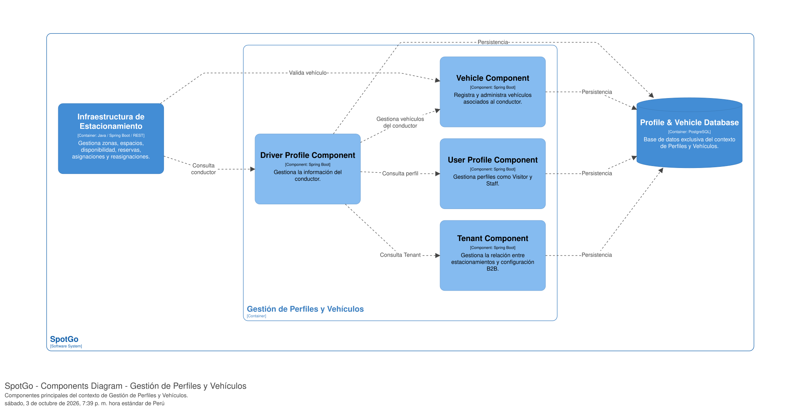
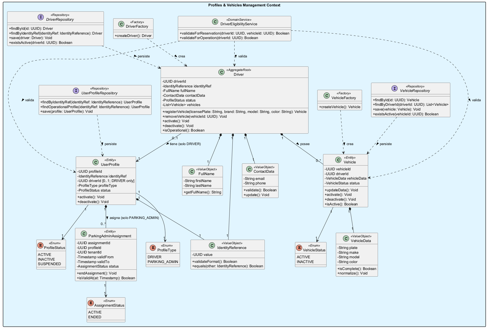
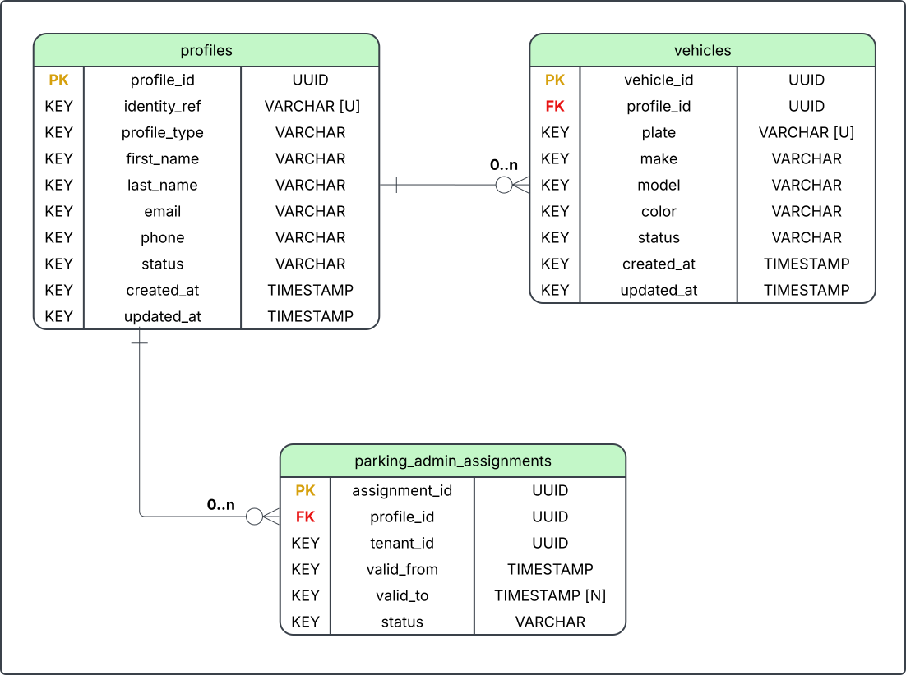

### 2.6.1. Bounded Context: Profiles & Vehicles Management

Profiles & Vehicles Management es un bounded context de soporte que concentra la información de negocio de los Parking Driver (Conductores), sus vehículos y los perfiles operativos asociados a una identidad autenticada. Su objetivo es ofrecer a los demás contextos una referencia confiable sobre la elegibilidad del Parking Driver y la relación entre una persona y sus vehículos. El contexto no administra credenciales, sesiones de acceso, reservas, pagos ni datos persistentes de Guests.

Un Guest puede utilizar el estacionamiento mediante una Guest Parking Session creada y cerrada manualmente por Parking Admin (Administradores). Por ese motivo, el Guest no crea un Parking Driver, User Profile, Vehicle ni Reservation dentro de este contexto. Del mismo modo, el contexto no contiene un perfil Visitor: los perfiles persistentes considerados por SpotGo son los de Parking Driver y Parking Admin.

#### *2.6.1.1. Domain Layer*

La capa de dominio representa las reglas que determinan cuándo un Parking Driver tiene un perfil válido y un Vehicle disponible para iniciar una operación que requiera identificación. La autenticación y la autorización pertenecen a Identity & Access Management; este contexto solo conserva la referencia de la identidad y publica el resultado de las validaciones propias de sus datos.

| Elemento | Tipo | Responsabilidad y reglas principales | Atributos u operaciones relevantes |
| --- | --- | --- | --- |
| Parking Driver | Aggregate Root | Representa al Parking Driver registrado y sus datos de perfil. Solo un Parking Driver registrado puede tener información persistente en este contexto. | driverId, identityRef, datos personales y de contacto, estado; register(), updateData(), activate(), deactivate(). |
| Vehicle | Entity | Representa un vehículo asociado a un Parking Driver. Un Parking Driver puede registrar varios vehículos, pero cada Vehicle pertenece a un único Parking Driver. | vehicleId, driverId, placa registrada, marca, modelo, color y estado; updateData(), activate(), deactivate(). |
| User Profile | Entity | Representa el perfil operativo asociado a una identidad. Su tipo puede ser Parking Driver o Parking Admin. No admite el tipo Visitor y no almacena credenciales. | profileId, identityRef, profileType, estado, fechas de creación y actualización; changeStatus(), isOperational(). |
| Parking Admin Assignment | Entity | Registra la asignación de un perfil Parking Admin a un Tenant mediante una referencia externa. El Tenant es administrado por Parking Infrastructure. | assignmentId, profileId, tenantId, vigencia y estado; assign(), endAssignment(), isValidAt(). |
| Profile Type | Enumeration | Define los tipos de perfil persistente permitidos en SpotGo. | Parking Driver, Parking Admin. |
| Profile Status | Enumeration | Controla la disponibilidad operativa del perfil. | ACTIVE, INACTIVE, SUSPENDED. |
| Vehicle Status | Enumeration | Controla si el vehículo puede ser utilizado en nuevas operaciones. | ACTIVE, INACTIVE. |
| Identity Reference | Value Object | Encapsula el identificador de la cuenta administrada por Identity & Access Management. | identityRef; validateFormat(), equals(). |
| Vehicle Data | Value Object | Agrupa los datos descriptivos y de identificación del vehículo sin incluir información de autenticación. | placa, marca, modelo, color; isComplete(), normalize(). |
| Contact Data | Value Object | Agrupa los datos de contacto del Parking Driver y evita que cada entidad defina su propio formato. | correo, teléfono; validate(), update(). |
| Parking Driver Factory | Factory | Crea un Parking Driver con las invariantes mínimas de identidad y datos obligatorios. | createDriver(). |
| Vehicle Factory | Factory | Crea un Vehicle asociado a un Parking Driver activo. | createVehicle(). |
| Parking Driver Eligibility Service | Domain Service | Verifica que el Parking Driver esté activo, que su User Profile sea operativo y que el Vehicle solicitado le pertenezca y esté activo. | validateForReservation(driverId, vehicleId), validateForOperation(). |
| Parking Driver Repository | Repository Interface | Define la persistencia de los Parking Driver sin acoplar el dominio a PostgreSQL. | findById(), findByIdentityRef(), save(), existsActive(). |
| Vehicle Repository | Repository Interface | Define la persistencia y consulta de vehículos por Parking Driver. | findById(), findByDriverId(), save(), existsActive(). |
| User Profile Repository | Repository Interface | Define la persistencia de perfiles Parking Driver y Parking Admin. | findByIdentityRef(), findOperationalProfile(), save(). |

Las reglas de asociación con Parking Infrastructure se exponen mediante contratos y eventos. Profiles & Vehicles Management no decide si un espacio está disponible ni si un vehículo ya ocupa un espacio; únicamente valida la propiedad y el estado del Vehicle. La regla de un solo espacio activo por Vehicle se aplica en Parking Infrastructure al crear o activar una Reservation o Parking Session.

#### *2.6.1.2. Interface Layer*

La Interface Layer recibe solicitudes del API Gateway y eventos provenientes de Identity & Access Management. Los controladores verifican el formato de la solicitud y delegan la ejecución a la Application Layer; no contienen las reglas de elegibilidad ni acceden directamente a los repositorios.

| Componente de interfaz | Canal | Responsabilidad | Operaciones o mensajes |
| --- | --- | --- | --- |
| Parking Driver Profile Controller | REST/HTTPS | Gestiona el alta, consulta, actualización y cambio de estado del perfil de Parking Driver. | Registrar Parking Driver, consultar perfil, actualizar datos y desactivar perfil. |
| Vehicle Controller | REST/HTTPS | Gestiona los vehículos pertenecientes a un Parking Driver. | Registrar Vehicle, listar vehículos, actualizar datos, activar o desactivar Vehicle. |
| User Profile Controller | REST/HTTPS | Consulta y administra el User Profile de una identidad autorizada. | Consultar perfil operativo y actualizar su estado. |
| Parking Admin Assignment Controller | REST/HTTPS | Registra o finaliza asignaciones de perfiles Parking Admin a un Tenant. | Asignar Parking Admin, consultar asignaciones y finalizar asignación. |
| Eligibility Controller | REST/HTTPS interno | Expone una consulta para que Parking Infrastructure valide Parking Driver y Vehicle antes de crear una Reservation. | Validar elegibilidad y devolver resultado con referencias de Parking Driver y Vehicle. |
| Identity Event Consumer | Evento asíncrono | Recibe la validación, asignación de rol o suspensión de una identidad para sincronizar la referencia mínima del perfil. | IdentityValidated, RoleAssigned, AccountSuspended. |
| Profile Event Publisher | Evento asíncrono | Publica cambios que otros contextos necesitan conocer sin compartir la base de datos. | DriverProfileCreated, DriverProfileValidated, VehicleRegistered, VehicleDeactivated, ParkingAdminProfileAssigned. |

Las respuestas no exponen credenciales, tokens ni información de pago. Cuando la solicitud se origina en la aplicación móvil, Flutter consume la API REST; las capacidades específicas de Android pueden invocarse mediante una integración nativa en Kotlin sin modificar el modelo de dominio.

#### *2.6.1.3. Application Layer*

La Application Layer coordina los casos de uso del contexto. Cada command handler obtiene los agregados necesarios, invoca servicios de dominio, persiste los cambios y publica los eventos resultantes. Los event handlers actualizan el modelo local o notifican a otros contextos, pero no reemplazan la autorización administrada por Identity & Access Management.

| Command | Command Handler | Resultado |
| --- | --- | --- |
| Register Parking Driver | Register Parking Driver Handler | Crea un Parking Driver y su User Profile de tipo Parking Driver después de validar la referencia de identidad. |
| Update Parking Driver Profile | Update Parking Driver Profile Handler | Actualiza datos personales o de contacto conservando la identidad del Parking Driver. |
| Register Vehicle | Register Vehicle Handler | Crea un Vehicle asociado a un Parking Driver activo y publica VehicleRegistered. |
| Update Vehicle | Update Vehicle Handler | Actualiza los datos descriptivos del Vehicle sin modificar reservas existentes. |
| Activate or Deactivate Vehicle | Change Vehicle Status Handler | Cambia el estado del Vehicle y publica el cambio para futuras validaciones. |
| Provision Parking Admin Profile | Provision Parking Admin Profile Handler | Crea un perfil Parking Admin y una Parking Admin Assignment para un tenantId referenciado externamente, después de validar la identidad y el rol recibido; no modifica un Parking Driver. |
| End Parking Admin Assignment | End Parking Admin Assignment Handler | Finaliza la asignación sin eliminar el historial de auditoría. |
| Validate Parking Driver Eligibility | Validate Parking Driver Eligibility Handler | Comprueba Parking Driver, User Profile y Vehicle, y devuelve un resultado consumible por Parking Infrastructure. |

| Domain Event | Event Handler o consumidor relacionado | Acción |
| --- | --- | --- |
| IdentityValidated | Identity Validated Handler | Habilita la sincronización o actualización de la referencia de identidad. |
| RoleAssigned | Role Assignment Handler | Sincroniza el rol recibido y, si corresponde a Parking Admin, habilita la provisión o actualización del perfil Parking Admin sin crear ni modificar un Parking Driver. |
| AccountSuspended | Account Suspended Handler | Marca como no operativo el perfil asociado, sin borrar su historial. |
| DriverProfileCreated | Profile Notification Handler | Registra la disponibilidad del nuevo Parking Driver para consultas internas. |
| DriverProfileValidated | Parking Eligibility Publisher | Informa a Parking Infrastructure que la referencia del Parking Driver y sus datos mínimos son válidos. |
| VehicleRegistered | Parking Reference Publisher | Publica la referencia del Vehicle para que pueda ser seleccionada en una Reservation. |
| VehicleDeactivated | Parking Reference Publisher | Informa que el Vehicle no debe utilizarse en nuevas operaciones. Las operaciones existentes se revisan según sus propias reglas. |
| ParkingAdminProfileAssigned | Tenant Administration Publisher | Comunica una asignación vigente al flujo administrativo correspondiente. |

Un evento de VehicleDeactivated no cancela por sí solo una Reservation confirmada, porque la decisión de cancelación o reasignación pertenece a Parking Infrastructure y debe considerar el estado de la operación. Esta separación evita que un contexto de soporte modifique directamente el ciclo de vida de una Reservation.

#### *2.6.1.4. Infrastructure Layer*

La Infrastructure Layer implementa los puertos definidos por el dominio y la aplicación. La implementación base utiliza Java y Spring Boot para la API y los procesos de aplicación, PostgreSQL para la persistencia independiente del contexto y un mecanismo de mensajería asíncrona compatible con los contratos de SpotGo.

| Componente de infraestructura | Implementación propuesta | Responsabilidad |
| --- | --- | --- |
| Parking Driver Repository Implementation | Java, Spring Boot y PostgreSQL | Persiste y consulta Parking Driver, aplicando las restricciones internas del contexto. |
| Vehicle Repository Implementation | Java, Spring Boot y PostgreSQL | Persiste Vehicles y verifica su asociación con un Parking Driver. |
| User Profile Repository Implementation | Java, Spring Boot y PostgreSQL | Persiste perfiles Parking Driver y Parking Admin sin guardar credenciales. |
| Identity Context Client | Cliente REST/HTTPS | Consulta o valida referencias de identidad y roles en Identity & Access Management. |
| Tenant Reference Adapter | Cliente REST o consumidor de eventos | Verifica que un tenantId utilizado en Parking Admin Assignment corresponda a un Tenant vigente, sin crear una clave foránea entre bases. |
| Event Publisher | Adaptador de mensajería | Publica eventos de perfil y vehículo con identificadores, versión de contrato y fecha de emisión. |
| Profiles & Vehicles Database | PostgreSQL | Mantiene las tablas propias del contexto y sus índices. |
| Security Boundary | Spring Security en el backend y tokens emitidos por IAM | Protege los endpoints sin duplicar la gestión de credenciales. |

El contexto conservará únicamente identificadores de otros bounded contexts, como identityRef y tenantId. Esas referencias son lógicas: su integridad se valida mediante contratos de integración, no mediante foreign keys en PostgreSQL. Los datos de Guest no se almacenan como registros de este contexto; solo pueden circular en un flujo administrativo de Parking Infrastructure sin convertirse en un perfil persistente.

#### *2.6.1.5. Bounded Context Software Architecture Component Level Diagrams*

El diagrama de componentes de Profiles & Vehicles Management deberá mostrar el límite del bounded context, sus componentes internos, la base de datos propia y las dependencias con Identity & Access Management y Parking Infrastructure. La aplicación móvil Flutter y el cliente Android nativo en Kotlin deben aparecer como consumidores externos a través del API Gateway, no como componentes del dominio.

*Figura 25 (Profiles & Vehicles Management Component Level Diagram)*

| Componente que debe representarse | Responsabilidad | Dependencias principales |
| --- | --- | --- |
| Parking Driver Profile Component | Ejecuta casos de uso de Parking Driver y expone el perfil operativo. | Parking Driver Profile Controller, Parking Driver Repository. |
| Vehicle Component | Ejecuta casos de uso de Vehicle y su asociación con Parking Driver. | Vehicle Controller, Vehicle Repository. |
| User Profile Component | Administra perfiles Parking Driver y Parking Admin. | User Profile Controller, User Profile Repository, Identity Context Client. |
| Parking Admin Assignment Component | Gestiona la asignación de Parking Admin a un tenantId. | Parking Admin Assignment Controller, User Profile Repository, Tenant Reference Adapter. |
| Parking Driver Eligibility Component | Orquesta la validación de Parking Driver, perfil y Vehicle para una operación. | Eligibility Controller, Parking Driver Eligibility Service, repositorios. |
| Profiles & Vehicles Database | Persiste el modelo del contexto. | Implementaciones de repositorio. |
| Identity & Access Management Adapter | Obtiene el estado mínimo de la identidad y el rol. | REST/HTTPS y eventos de identidad. |
| Profile Event Publisher | Publica cambios de perfiles y vehículos. | Broker o canal de eventos asíncronos. |

Las relaciones visuales deben indicar que los controladores llaman a la Application Layer, los manejadores utilizan la Domain Layer, los repositorios acceden únicamente a Profiles & Vehicles Database y los adaptadores se comunican con otros contextos mediante contratos. No debe aparecer un componente Visitor ni una base de datos compartida.

#### *2.6.1.6. Bounded Context Software Architecture Code Level Diagrams*

La vista de código debe concentrarse en la Domain Layer y mostrar las clases, interfaces y enumeraciones que sostienen las reglas del contexto. Para que el diagrama sea verificable, se recomienda utilizar la notación de visibilidad + para operaciones públicas, - para atributos privados y # para elementos protegidos. Los tipos y nombres siguientes constituyen la especificación textual que acompañará al diagrama.

#### ***2.6.1.6.1. Bounded Context Domain Layer Class Diagrams***

*Figura 26 (Profiles & Vehicles Management Domain Layer Class Diagram)*

| Clase, interfaz o enumeración | Atributos principales | Métodos principales | Relaciones |
| --- | --- | --- | --- |
| Parking Driver | -driverId, -identityRef, -contactData, -status | +register(), +updateData(), +activate(), +deactivate(), +isOperational() | Aggregate Root; se relaciona con Vehicle y User Profile. |
| Vehicle | -vehicleId, -driverId, -vehicleData, -status | +updateData(), +activate(), +deactivate(), +isActive() | Entity; pertenece a un Parking Driver. |
| UserProfile | -profileId, -identityRef, -profileType, -status | +changeStatus(), +isOperational() | Entity; puede asociarse a Parking Driver o a Parking Admin Assignment. |
| ParkingAdminAssignment | -assignmentId, -profileId, -tenantId, -validFrom, -validTo, -status | +assign(), +endAssignment(), +isValidAt() | Entity; tenantId es una referencia externa a Parking Infrastructure. |
| IdentityReference | -value | +validateFormat(), +equals() | Value Object utilizado por Parking Driver y UserProfile. |
| VehicleData | -plate, -make, -model, -color | +isComplete(), +normalize() | Value Object utilizado por Vehicle. |
| ContactData | -email, -phone | +validate(), +update() | Value Object utilizado por Parking Driver. |
| ProfileType | Parking Driver, Parking Admin | — | Enumeration utilizada por UserProfile. |
| ProfileStatus | ACTIVE, INACTIVE, SUSPENDED | — | Enumeration utilizada por UserProfile y Parking Driver. |
| VehicleStatus | ACTIVE, INACTIVE | — | Enumeration utilizada por Vehicle. |
| DriverFactory | — | +createDriver() | Factory; crea Parking Driver con invariantes iniciales. |
| VehicleFactory | — | +createVehicle() | Factory; crea Vehicle para un Parking Driver válido. |
| DriverEligibilityService | — | +validateForReservation(), +validateForOperation() | Domain Service; consulta Parking Driver, UserProfile y Vehicle. |
| DriverRepository | — | +findById(), +findByIdentityRef(), +save(), +existsActive() | Repository Interface implementada en Infrastructure Layer. |
| VehicleRepository | — | +findById(), +findByDriverId(), +save(), +existsActive() | Repository Interface implementada en Infrastructure Layer. |
| UserProfileRepository | — | +findByIdentityRef(), +findOperationalProfile(), +save() | Repository Interface implementada en Infrastructure Layer. |

| Relación | Multiplicidad y dirección | Significado |
| --- | --- | --- |
| Parking Driver — Vehicle | Parking Driver 1 a Vehicle 0..*; navegación desde Parking Driver hacia Vehicle | Un Parking Driver puede tener cero o varios vehículos registrados. |
| Parking Driver — UserProfile | Parking Driver 1 a UserProfile 1; navegación desde Parking Driver hacia su perfil de Parking Driver | Cada Parking Driver creado por el registro público tiene un perfil Parking Driver operativo, salvo que este se encuentre inactivo o suspendido. |
| UserProfile — ParkingAdminAssignment | UserProfile Parking Admin 1 a ParkingAdminAssignment 0..*; navegación desde el perfil Parking Admin | Un perfil Parking Admin puede tener asignaciones en distintos periodos o Tenants; un perfil Parking Driver no participa en esta relación. |
| DriverEligibilityService ..> Parking Driver | Dependencia dirigida | El servicio valida el estado del Parking Driver. |
| DriverEligibilityService ..> Vehicle | Dependencia dirigida | El servicio valida la propiedad y el estado del Vehicle. |
| DriverRepository ..> Parking Driver | Implementación de persistencia | El repositorio trabaja con el agregado Parking Driver. |
| VehicleRepository ..> Vehicle | Implementación de persistencia | El repositorio trabaja con la entidad Vehicle. |

#### ***2.6.1.6.2. Bounded Context Database Design Diagram***

El diseño de base de datos representa únicamente la persistencia de Profiles & Vehicles Management. El modelo físico utiliza una tabla `profiles` para los perfiles de Parking Driver y Parking Admin, mientras que la distinción del dominio se conserva mediante `profile_type`. Las relaciones internas pueden usar foreign keys; las referencias a Identity & Access Management y Parking Infrastructure se modelan como identificadores lógicos y no como foreign keys entre bases de datos independientes.

*Figura 27 (Profiles & Vehicles Management Database Design Diagram)*

| Tabla | Columnas principales | Restricciones y relaciones |
| --- | --- | --- |
| profiles | profile_id, identity_ref, profile_type, first_name, last_name, email, phone, status, created_at, updated_at | profile_id PK; identity_ref UNIQUE NOT NULL; profile_type solo Parking Driver o Parking Admin; no existe valor VISITOR; status restringido a ACTIVE, INACTIVE o SUSPENDED. |
| vehicles | vehicle_id, profile_id, plate, make, model, color, status, created_at, updated_at | vehicle_id PK; profile_id FK a profiles y debe corresponder a un perfil Parking Driver; plate UNIQUE cuando tenga valor; status restringido a ACTIVE o INACTIVE. |
| parking_admin_assignments | assignment_id, profile_id, tenant_id, valid_from, valid_to, status | assignment_id PK; profile_id FK a profiles y debe corresponder a un perfil Parking Admin; tenant_id es referencia lógica a Parking Infrastructure; valid_to no puede ser menor que valid_from. |

| Relación de datos | Cardinalidad | Regla |
| --- | --- | --- |
| profiles — vehicles | 1 a 0..* | Todo Vehicle persistente pertenece a un perfil con profile_type Parking Driver. |
| profiles — parking_admin_assignments | 1 a 0..* | Solo los perfiles Parking Admin pueden tener asignaciones; las asignaciones conservan su historial y se consulta cuál está vigente. |
| identity_ref — Identity & Access Management | Referencia externa | Se valida por API o evento; no se crea FK entre bases de datos. |
| tenant_id — Parking Infrastructure | Referencia externa | Se valida contra Tenant; el Tenant no se duplica en esta base. |

El esquema no incluye tablas de Guests, Guest Parking Sessions, credenciales, tokens de pago ni reservas. Esta exclusión hace visible en el diseño de datos la frontera del bounded context y evita que una sesión de invitado se convierta accidentalmente en un perfil persistente.
