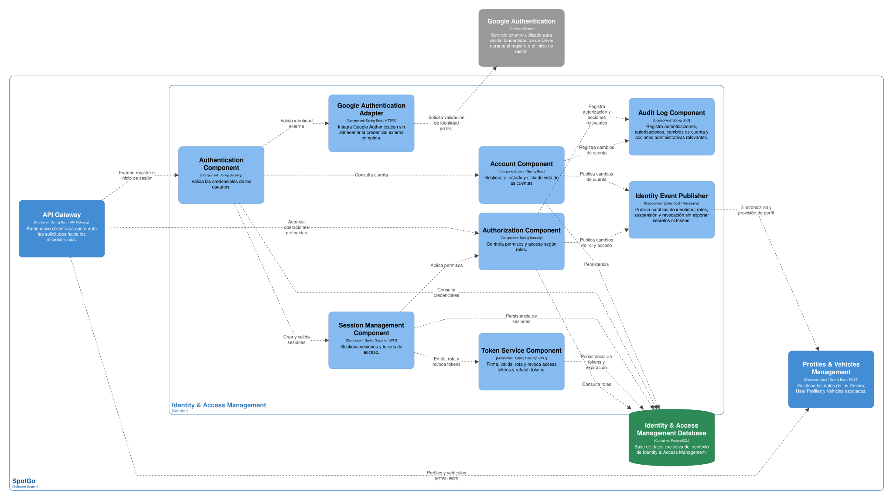
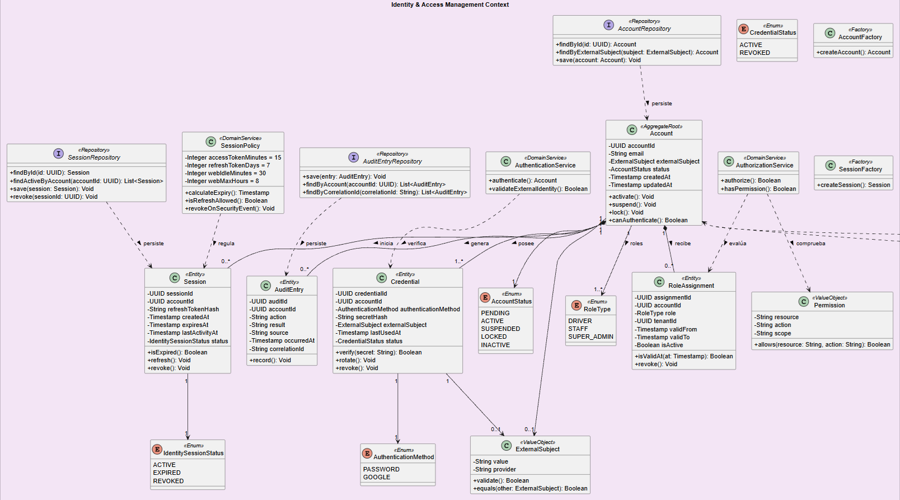

### 2.6.2. Bounded Context: Identity & Access Management

Identity & Access Management es un bounded context genérico que administra la identidad digital, la autenticación, las sesiones y la autorización de los usuarios de SpotGo. Su responsabilidad termina en comprobar quién es la persona y qué rol puede ejercer; no administra los datos de Driver, los Vehicles, la infraestructura del estacionamiento, las reservas ni las operaciones de pago.

El modelo considera los roles Driver, Staff y SuperAdmin. Un Guest no requiere una cuenta para utilizar el estacionamiento y, por tanto, no se crea una identidad persistente para una Guest Parking Session. Los perfiles de negocio se mantienen en Profiles & Vehicles Management y se relacionan con este contexto mediante identityRef. El registro público crea únicamente cuentas de Driver; las cuentas de Staff y SuperAdmin se provisionan internamente.

#### *2.6.2.1. Domain Layer*

La capa de dominio define las invariantes de la cuenta y el ciclo de vida de las sesiones. Las credenciales se almacenan de forma protegida o se representan mediante una referencia a un proveedor de identidad; nunca se modela la contraseña en texto plano ni se comparte el token de autenticación con otros bounded contexts.

| Elemento | Tipo | Responsabilidad y reglas principales | Atributos u operaciones relevantes |
| --- | --- | --- | --- |
| Account | Aggregate Root | Representa la identidad autenticable de un usuario. Controla su estado y los roles asignados. | accountId, externalSubject, estado, fechas de creación y actualización; activate(), suspend(), lock(), canAuthenticate(). |
| Credential | Entity | Representa el método con el que se autentica una Account. Puede ser local o una referencia a Google Authentication. | credentialId, accountId, authenticationMethod, secretHash o externalSubject, lastUsedAt; verify(), rotate(), revoke(). |
| Session | Entity | Representa una sesión de acceso emitida para una Account. Controla expiración, renovación, revocación y actividad. | sessionId, accountId, refreshTokenHash, createdAt, expiresAt, lastActivityAt, status; isExpired(), refresh(), revoke(). |
| Role Assignment | Entity | Vincula una Account con un rol autorizado y su vigencia. | assignmentId, accountId, roleType, tenantId opcional, validFrom, validTo, status; isValidAt(). |
| Audit Entry | Entity | Registra acciones relevantes de autenticación, autorización y administración. No contiene secretos ni tokens completos. | auditId, accountId, action, result, occurredAt, source, correlationId; record(). |
| Role Type | Enumeration | Define los roles reconocidos por el sistema. | DRIVER, STAFF, SUPER_ADMIN. |
| Account Status | Enumeration | Define el estado de la cuenta para autenticar o autorizar operaciones. | PENDING, ACTIVE, SUSPENDED, LOCKED, INACTIVE. |
| Authentication Method | Enumeration | Identifica el mecanismo utilizado para acreditar la identidad. | PASSWORD, GOOGLE. |
| Session Status | Enumeration | Define el estado del acceso emitido. | ACTIVE, EXPIRED, REVOKED. |
| Permission | Value Object | Representa una capacidad derivada de un rol y de un recurso. | resource, action, scope; allows(). |
| External Subject | Value Object | Encapsula el identificador emitido por un proveedor de identidad externo. | value, provider; validate(), equals(). |
| Account Factory | Factory | Crea una Account con un estado inicial válido y sin credenciales expuestas. | createAccount(). |
| Session Factory | Factory | Crea una Session con expiraciones y metadatos de seguridad. | createSession(). |
| Authentication Service | Domain Service | Verifica las credenciales o la identidad externa y determina si la Account puede iniciar sesión. | authenticate(), validateExternalIdentity(). |
| Authorization Service | Domain Service | Comprueba si una Account tiene el rol y el alcance necesarios para ejecutar una acción. | authorize(), hasPermission(). |
| Session Policy | Domain Service | Aplica la expiración, rotación, revocación y duración máxima de las sesiones. | calculateExpiry(), isRefreshAllowed(), revokeOnSecurityEvent(). |
| Account Repository | Repository Interface | Define la persistencia de las cuentas y sus estados. | findById(), findByExternalSubject(), save(). |
| Session Repository | Repository Interface | Define la persistencia de sesiones revocables y sus metadatos. | findById(), findActiveByAccount(), save(), revoke(). |
| Audit Entry Repository | Repository Interface | Define la persistencia de eventos de auditoría. | save(), findByAccount(), findByCorrelationId(). |

Las identidades y roles se validan antes de permitir operaciones administrativas o de Driver. El registro público de Driver coordina la creación de la Account con su Driver Profile en Profiles & Vehicles Management. En cambio, una Account activa no convierte a una persona en Staff: el rol STAFF, su Staff Profile y su asignación a un Tenant deben provisionarse mediante una acción interna autorizada. El contexto tampoco administra la autorización de una Guest Parking Session como si el Guest fuera un usuario autenticado.

#### *2.6.2.2. Interface Layer*

La Interface Layer expone operaciones de autenticación y administración de acceso, y recibe aserciones o notificaciones del proveedor de identidad. Los controladores retornan tokens y resultados de autorización, pero no entregan credenciales ni datos internos de las cuentas.

| Componente de interfaz | Canal | Responsabilidad | Operaciones o mensajes |
| --- | --- | --- | --- |
| Authentication Controller | REST/HTTPS | Inicia la autenticación de una Account y devuelve el resultado de acceso. | Iniciar sesión local, autenticar con Google y cerrar sesión. |
| Session Controller | REST/HTTPS | Administra la renovación y revocación de sesiones. | Renovar token, consultar sesión propia y revocar sesiones. |
| Account Administration Controller | REST/HTTPS | Permite a SuperAdmin administrar cuentas y asignaciones de rol. | Activar, suspender o bloquear cuenta; asignar o revocar rol. |
| Authorization Controller | REST/HTTPS interno | Responde consultas de autorización realizadas por otros contextos. | Validar identityRef, roleType y alcance de Tenant. |
| External Identity Consumer | Evento o callback HTTPS | Recibe la respuesta de Google Authentication y la convierte en una identidad interna. | ExternalIdentityValidated, ExternalIdentityRejected. |
| Security Event Consumer | Evento asíncrono | Recibe eventos de seguridad que requieren revocar sesiones o bloquear una cuenta. | CredentialChanged, AccountCompromised, AccountSuspended. |
| Identity Event Publisher | Evento asíncrono | Publica cambios de identidad y de autorización para los contextos consumidores. | IdentityValidated, RoleAssigned, AccountSuspended, AccessRevoked. |

La aplicación móvil Flutter utiliza Authentication Controller y Session Controller mediante HTTPS. En Android, Kotlin puede administrar la integración nativa con mecanismos seguros del sistema operativo, pero la decisión de autorización continúa en el backend. La aplicación web administrativa utiliza los mismos contratos y se somete a la expiración por inactividad definida para sesiones administrativas.

#### *2.6.2.3. Application Layer*

La Application Layer coordina los casos de uso de identidad. Los handlers validan las credenciales mediante Authentication Service, aplican la política de sesión, persisten el resultado y publican eventos con información mínima. La autorización de una operación de negocio se consulta mediante un contrato, sin exponer la base de datos de IAM.

| Command | Command Handler | Resultado |
| --- | --- | --- |
| Register Driver Account | Register Driver Account Handler | Crea una Account activa con Role Assignment DRIVER y coordina la creación del Driver Profile; este flujo público no permite crear roles STAFF o SUPER_ADMIN. |
| Authenticate Account | Authenticate Account Handler | Verifica el método de autenticación, crea una Session y emite los tokens correspondientes. |
| Authenticate with Google | External Identity Authentication Handler | Valida la aserción de Google y vincula o recupera una Account sin guardar la credencial externa completa. |
| Refresh Session | Refresh Session Handler | Rota el refresh token, actualiza la actividad y genera un nuevo token de acceso si la sesión sigue vigente. |
| Revoke Session | Revoke Session Handler | Revoca la sesión indicada y evita su renovación posterior. |
| Provision Staff Account | Provision Staff Account Handler | Crea o activa una Account para Staff después de una acción autorizada de SuperAdmin. |
| Assign Role | Assign Role Handler | Agrega una Role Assignment con el alcance permitido. |
| Suspend Account | Suspend Account Handler | Suspende o bloquea una Account, revoca sus sesiones y publica el cambio. |
| Authorize Operation | Authorize Operation Handler | Evalúa Account, Role Assignment, recurso y acción, y devuelve una decisión de autorización. |

| Domain Event | Event Handler o consumidor relacionado | Acción |
| --- | --- | --- |
| IdentityValidated | Profiles Identity Handler | Permite a Profiles & Vehicles Management validar la referencia de identidad asociada a un perfil. |
| RoleAssigned | Profiles & Vehicles Management / Parking Authorization Handler | Informa a los contextos autorizados el rol y alcance vigentes para sincronizar la autorización o la provisión del perfil correspondiente. |
| SessionStarted | Audit Event Handler | Registra el inicio de sesión y su correlationId sin almacenar el token completo. |
| SessionExpired | Session Cleanup Handler | Marca la sesión como vencida e impide su renovación. |
| AccessRejected | Security Audit Handler | Registra el intento no autorizado y, si corresponde, incrementa el contador de protección. |
| AccountSuspended | Profiles Status Handler | Solicita que el perfil de negocio asociado deje de considerarse operativo. |
| AccessRevoked | Context Security Handler | Permite que los consumidores invaliden referencias locales de autorización. |

La política de sesión se aplica en cada renovación y no solo en el cliente. El cierre de sesión, el cambio de credenciales, la suspensión de la cuenta o un evento de seguridad revocan el refresh token. La expiración del token de acceso no elimina la Account ni su historial de auditoría.

#### *2.6.2.4. Infrastructure Layer*

La infraestructura se implementará con Java y Spring Boot, utilizando capacidades de Spring Security para la cadena de autenticación y autorización. PostgreSQL almacenará cuentas, sesiones, asignaciones y auditorías en una base independiente. Los tokens se firmarán y validarán en el backend, y los secretos se protegerán mediante hash o referencias seguras.

| Componente de infraestructura | Implementación propuesta | Responsabilidad |
| --- | --- | --- |
| Authentication Adapter | Spring Security y servicios de autenticación internos | Ejecuta la verificación de credenciales y la integración con los mecanismos de seguridad del backend. |
| Google Identity Adapter | Cliente HTTPS para Google Authentication | Valida la identidad externa y traduce el resultado a External Subject. |
| Token Service | Proveedor de tokens firmado | Emite access tokens de 15 minutos y refresh tokens de siete días con rotación. |
| Session Repository Implementation | Java, Spring Boot y PostgreSQL | Persiste sesiones revocables, fechas de expiración y última actividad. |
| Account Repository Implementation | Java, Spring Boot y PostgreSQL | Persiste Account, Credential y Role Assignment. |
| Audit Repository Implementation | Java, Spring Boot y PostgreSQL | Persiste acciones relevantes con correlationId y resultado. |
| Authorization Interceptor | Spring Security | Verifica token, rol, alcance y permisos antes de ejecutar los controladores. |
| Identity Event Publisher | Adaptador de mensajería | Publica cambios de identidad sin enviar secretos ni tokens completos. |
| Identity Database | PostgreSQL | Mantiene la persistencia autónoma de IAM y sus índices de consulta. |

La expiración operativa se configura con access token de 15 minutos, refresh token de siete días y rotación obligatoria. Para la aplicación web administrativa, la sesión se invalida después de 30 minutos de inactividad y no puede superar ocho horas. Estos valores se pueden parametrizar sin cambiar las clases de dominio. Las auditorías se conservan según la política transversal de cinco años, mientras que la expiración de una sesión no elimina automáticamente los registros de auditoría.

#### *2.6.2.5. Bounded Context Software Architecture Component Level Diagrams*

El diagrama de componentes deberá mostrar la frontera de Identity & Access Management, sus componentes de seguridad, la base de datos y sus relaciones con Profiles & Vehicles Management, Parking Infrastructure y los clientes Flutter, Android nativo en Kotlin y web. Google Authentication debe representarse como dependencia externa. Guest no debe aparecer como un componente de autenticación.

*Figura 28 (Identity & Access Management Component Level Diagram)*

| Componente que debe representarse | Responsabilidad | Dependencias principales |
| --- | --- | --- |
| Authentication Component | Coordina la verificación de credenciales y de identidades externas. | Authentication Controller, Authentication Service, Google Identity Adapter. |
| Session Management Component | Crea, renueva, expira y revoca sesiones y tokens. | Session Controller, Session Policy, Session Repository. |
| Authorization Component | Evalúa roles, permisos y alcance de Tenant. | Authorization Controller, Authorization Service, Account Repository. |
| Account Component | Administra ciclo de vida de Account, Credential y Role Assignment. | Account Administration Controller, repositorios de identidad. |
| Audit Log Component | Registra eventos de autenticación, autorización y administración. | Audit Event Handler, Audit Entry Repository. |
| Token Service Component | Firma y valida tokens, aplicando los tiempos de expiración. | Authentication Component, Session Management Component. |
| Identity Database | Persiste cuentas, sesiones y auditoría. | Implementaciones de repositorio. |
| Google Authentication | Servicio externo para validar la identidad del usuario. | Google Identity Adapter mediante HTTPS. |
| Identity Event Publisher | Distribuye cambios de identidad y permisos. | Canal de mensajería asíncrona. |

Las relaciones visuales deben indicar que los clientes acceden por el API Gateway, que los controladores delegan en la Application Layer y que la Domain Layer aplica las invariantes. Los demás bounded contexts consumen validaciones o eventos, pero no acceden directamente a Identity Database.

#### *2.6.2.6. Bounded Context Software Architecture Code Level Diagrams*

La vista de código debe mostrar el modelo de dominio de identidad, sus interfaces de repositorio y los servicios que protegen el ciclo de vida de Account y Session. La notación recomendada utiliza + para miembros públicos, - para atributos privados y # para elementos protegidos. Los tokens y valores secretos deben mostrarse como referencias o hashes, nunca como datos completos.

#### ***2.6.2.6.1. Bounded Context Domain Layer Class Diagrams***

*Figura 29 (Identity & Access Management Domain Layer Class Diagram)*

| Clase, interfaz o enumeración | Atributos principales | Métodos principales | Relaciones |
| --- | --- | --- | --- |
| Account | -accountId, -externalSubject, -status, -createdAt, -updatedAt | +activate(), +suspend(), +lock(), +canAuthenticate() | Aggregate Root; contiene o coordina Credential y Role Assignment. |
| Credential | -credentialId, -accountId, -authenticationMethod, -secretHash, -externalSubject, -lastUsedAt, -status | +verify(), +rotate(), +revoke() | Entity; pertenece a Account y no expone secretos. |
| Session | -sessionId, -accountId, -refreshTokenHash, -createdAt, -expiresAt, -lastActivityAt, -status | +isExpired(), +refresh(), +revoke() | Entity; pertenece a Account y se relaciona con Session Policy. |
| RoleAssignment | -assignmentId, -accountId, -roleType, -tenantId, -validFrom, -validTo, -status | +isValidAt(), +revoke() | Entity; tenantId puede ser referencia externa a Parking Infrastructure. |
| AuditEntry | -auditId, -accountId, -action, -result, -source, -occurredAt, -correlationId | +record() | Entity; registra hechos de seguridad. |
| Permission | -resource, -action, -scope | +allows() | Value Object derivado del rol y del recurso. |
| ExternalSubject | -value, -provider | +validate(), +equals() | Value Object utilizado por Credential o Account. |
| RoleType | DRIVER, STAFF, SUPER_ADMIN | — | Enumeration utilizada por RoleAssignment. |
| AccountStatus | PENDING, ACTIVE, SUSPENDED, LOCKED, INACTIVE | — | Enumeration utilizada por Account. |
| AuthenticationMethod | PASSWORD, GOOGLE | — | Enumeration utilizada por Credential. |
| SessionStatus | ACTIVE, EXPIRED, REVOKED | — | Enumeration utilizada por Session. |
| AccountFactory | — | +createAccount() | Factory de Account. |
| SessionFactory | — | +createSession() | Factory de Session con expiraciones seguras. |
| AuthenticationService | — | +authenticate(), +validateExternalIdentity() | Domain Service que verifica identidad. |
| AuthorizationService | — | +authorize(), +hasPermission() | Domain Service que evalúa permisos y alcance. |
| SessionPolicy | -accessTokenMinutes, -refreshTokenDays, -webIdleMinutes, -webMaxHours | +calculateExpiry(), +isRefreshAllowed(), +revokeOnSecurityEvent() | Domain Service para expiración y revocación. |
| AccountRepository | — | +findById(), +findByExternalSubject(), +save() | Repository Interface implementada en Infrastructure Layer. |
| SessionRepository | — | +findById(), +findActiveByAccount(), +save(), +revoke() | Repository Interface implementada en Infrastructure Layer. |
| AuditEntryRepository | — | +save(), +findByAccount(), +findByCorrelationId() | Repository Interface implementada en Infrastructure Layer. |

| Relación | Multiplicidad y dirección | Significado |
| --- | --- | --- |
| Account — Credential | Account 1 a Credential 1..* | Una Account puede tener uno o varios métodos de autenticación autorizados. |
| Account — Session | Account 1 a Session 0..* | Una Account puede acumular sesiones activas o históricas. |
| Account — RoleAssignment | Account 1 a RoleAssignment 0..* | Los roles se mantienen con vigencia y alcance. |
| Account — AuditEntry | Account 1 a AuditEntry 0..* | Las acciones relevantes de la cuenta se auditan. |
| AuthenticationService ..> Credential | Dependencia dirigida | El servicio verifica el método de autenticación. |
| AuthorizationService ..> RoleAssignment | Dependencia dirigida | El servicio determina si existe un rol vigente. |
| SessionPolicy ..> Session | Dependencia dirigida | La política calcula expiración y revocación. |
| AccountRepository ..> Account | Implementación de persistencia | El repositorio trabaja con Account. |
| SessionRepository ..> Session | Implementación de persistencia | El repositorio trabaja con Session. |

#### ***2.6.2.6.2. Bounded Context Database Design Diagram***

Identity Database es independiente de las bases de datos de los demás bounded contexts. Las foreign keys se aplican solo dentro de esta base; identityRef, tenantId o correlationId utilizados por otros contextos no se convierten en relaciones físicas entre bases.

*Figura 30 (Identity & Access Management Database Design Diagram)*

| Tabla | Columnas principales | Restricciones y relaciones |
| --- | --- | --- |
| accounts | account_id, external_subject, status, created_at, updated_at | account_id PK; external_subject UNIQUE cuando tenga valor; status restringido a PENDING, ACTIVE, SUSPENDED, LOCKED o INACTIVE. |
| credentials | credential_id, account_id, authentication_method, secret_hash, external_subject, last_used_at, status | credential_id PK; account_id FK a accounts; al menos secret_hash o external_subject según el método; nunca se almacena una contraseña en texto plano. |
| role_assignments | assignment_id, account_id, role_type, tenant_id, valid_from, valid_to, status | assignment_id PK; account_id FK a accounts; role_type restringido a DRIVER, STAFF o SUPER_ADMIN; tenant_id es referencia lógica. |
| sessions | session_id, account_id, refresh_token_hash, created_at, expires_at, last_activity_at, status, revoked_at | session_id PK; account_id FK a accounts; refresh_token_hash UNIQUE; expires_at mayor que created_at; status ACTIVE, EXPIRED o REVOKED. |
| audit_entries | audit_id, account_id, action, result, source, occurred_at, correlation_id | audit_id PK; account_id FK nullable para intentos sin identidad válida; no se guardan tokens completos ni secretos. |

| Relación de datos | Cardinalidad | Regla |
| --- | --- | --- |
| accounts — credentials | 1 a 1..* | Cada método de autenticación pertenece a una Account. |
| accounts — role_assignments | 1 a 0..* | Una Account puede tener roles con vigencias y alcances distintos. |
| accounts — sessions | 1 a 0..* | Las sesiones pueden expirar o revocarse sin eliminar la cuenta. |
| accounts — audit_entries | 1 a 0..* | Los eventos de una cuenta se conservan según la política de retención. |
| tenant_id — Parking Infrastructure | Referencia externa | La validez del Tenant se comprueba mediante API o eventos; no existe FK entre bases. |

Las tablas de IAM no incluyen vehículos, reservas, Guest Parking Sessions, datos de tarjeta ni comprobantes. La retención de audit_entries sigue el plazo transversal de cinco años, mientras que las sesiones vencidas pueden depurarse según la política de seguridad sin eliminar los registros necesarios para auditoría.
