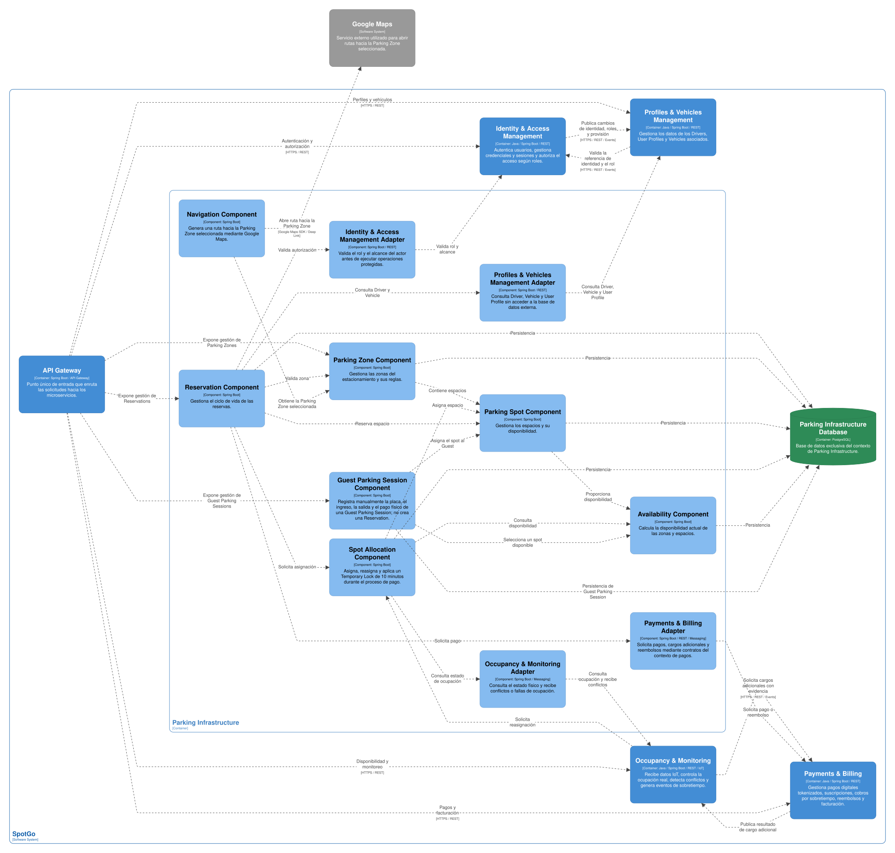
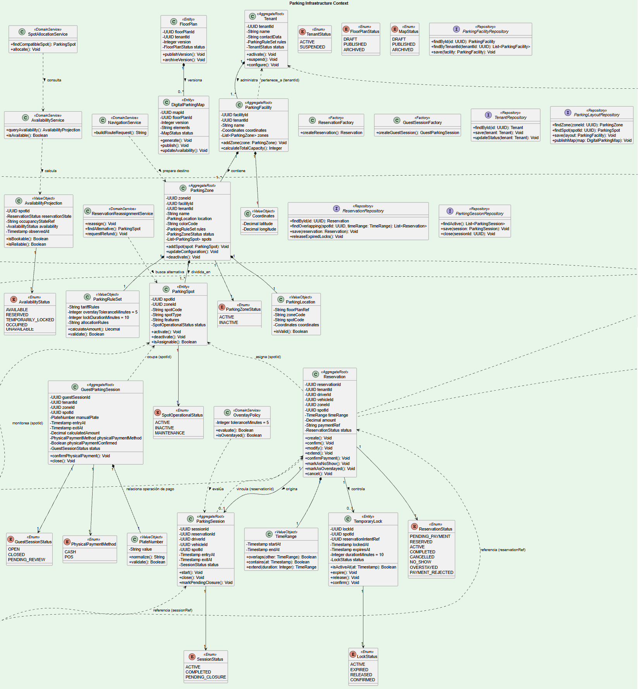

### 2.6.3. Bounded Context: Parking Infrastructure

Parking Infrastructure es el bounded context principal de la operación del estacionamiento. Administra los Tenants, el plano y mapa digital, las Parking Zones, los Parking Spots, la disponibilidad, las Reservations, las Parking Sessions de Drivers registrados y las Guest Parking Sessions. También coordina la asignación, modificación, extensión, cancelación y reasignación de espacios.

Este contexto es dueño del ciclo de vida de Reservation y Parking Session. Occupancy & Monitoring aporta lecturas y estados físicos de sensores, pero no administra estas entidades ni infiere la identidad de un vehículo. Payments & Billing procesa los pagos digitales y emite los comprobantes; Parking Infrastructure solo conserva las referencias necesarias para relacionar una operación económica con una Reservation o una sesión.

Las Reservations corresponden exclusivamente a Drivers registrados y se asocian con un Vehicle persistente y un Parking Spot específico. En cambio, una Guest Parking Session se registra manualmente por Staff, conserva únicamente la placa ingresada durante la atención, no tiene Reservation ni Driver asociado y utiliza un pago físico en efectivo o POS confirmado fuera de SpotGo.

#### *2.6.3.1. Domain Layer*

La capa de dominio concentra las reglas de asignación y disponibilidad. El estado físico reportado por los sensores y el estado de la Reservation se mantienen como conceptos independientes. La disponibilidad que consulta un usuario se obtiene combinando la configuración del Parking Spot, la Reservation, el Temporary Lock y la última información confiable recibida desde Occupancy & Monitoring.

| Elemento | Tipo | Responsabilidad y reglas principales | Atributos u operaciones relevantes |
| --- | --- | --- | --- |
| Tenant | Aggregate Root | Representa la organización o unidad operativa que administra uno o más estacionamientos. Es dueño de la configuración administrativa del servicio. | tenantId, nombre, estado, datos de contacto y reglas; activate(), suspend(), configure(). |
| Parking Facility | Aggregate Root | Representa una instalación física administrada por un Tenant y agrupa sus Parking Zones. | facilityId, tenantId, nombre, coordenadas y estado; addZone(), calculateTotalCapacity(). |
| Parking Zone | Aggregate Root | Agrupa Parking Spots y define una zona operativa dentro de una Parking Facility. | zoneId, facilityId, tenantId, nombre, ubicación, reglas de acceso y estado; addSpot(), updateConfiguration(), deactivate(). |
| Parking Spot | Entity | Representa un espacio físico identificable dentro de una Parking Zone. | spotId, zoneId, código, tipo, características, estado operativo; activate(), deactivate(), isAssignable(). |
| Floor Plan | Entity | Representa el plano base del estacionamiento y sus versiones. | floorPlanId, tenantId, versión, archivo o referencia, estado; publishVersion(), archiveVersion(). |
| Digital Parking Map | Entity | Proyección navegable de zonas, spots y elementos del plano para la aplicación. | mapId, floorPlanId, versión, elementos y estado; generate(), publish(), updateAvailability(). |
| Reservation | Aggregate Root | Representa una reserva de un Driver para un Parking Spot en un intervalo definido. Requiere elegibilidad de Driver y Vehicle y aprobación del pago digital. | reservationId, tenantId, driverId, vehicleId, zoneId, spotId, timeRange, amount, status, paymentRef; create(), confirm(), modify(), extend(), cancel(), markNoShow(), markOverstayed(). |
| Parking Session | Aggregate Root | Representa la sesión operativa de un Driver registrado vinculada con una Reservation y su Vehicle. | sessionId, reservationId, driverId, vehicleId, spotId, entryAt, exitAt, status; start(), close(), markPendingClosure(). |
| Guest Parking Session | Aggregate Root | Representa la atención manual de un Guest. No contiene Driver, Vehicle persistente ni Reservation. | guestSessionId, tenantId, zoneId, spotId, manualPlate, entryAt, exitAt, calculatedAmount, physicalPaymentMethod, physicalPaymentConfirmed, status; open(), calculateAmount(), confirmPhysicalPayment(), close(). |
| Time Range | Value Object | Define el intervalo solicitado para una Reservation y permite verificar solapamientos. | startAt, endAt, duration; overlaps(), contains(), extend(). |
| Parking Location | Value Object | Identifica la ubicación de una zona o spot dentro de un plano. | floorPlanRef, zoneCode, spotCode, coordinates; isValid(). |
| Temporary Lock | Entity | Representa el bloqueo persistente de un spot durante el pago digital. Su duración base es de 10 minutos y mantiene su propio ciclo de vida para evitar asignaciones simultáneas. | lockId, spotId, reservationIntentRef, lockedAt, expiresAt, status; isActiveAt(), expire(), release(), confirm(). |
| Plate Number | Value Object | Representa la placa digitada manualmente para una Guest Parking Session. No crea un Vehicle persistente. | value; normalize(), validate(). |
| Parking Rule Set | Value Object | Agrupa reglas de disponibilidad, tolerancia de sobretiempo, tarifa y criterios de asignación. | tariffRules, fiveMinuteOverstayTolerance, lockDuration, allocationRules; calculateAmount(), validate(). |
| Availability Projection | Value Object | Resume la disponibilidad consultable combinando reservas, locks y el último estado físico recibido. | spotId, reservationState, occupancyStateRef, availability, observedAt; isBookable(), isReliable(). |
| Reservation Status | Enumeration | Define el ciclo de vida de una Reservation. PENDING_PAYMENT es una transición interna mientras existe el lock. | PENDING_PAYMENT, RESERVED, ACTIVE, COMPLETED, CANCELLED, NO_SHOW, OVERSTAYED, PAYMENT_REJECTED. |
| Session Status | Enumeration | Define el ciclo de vida de una Parking Session de Driver. | ACTIVE, COMPLETED, PENDING_CLOSURE. |
| Guest Session Status | Enumeration | Define el ciclo de vida de una Guest Parking Session. | OPEN, CLOSED, PENDING_REVIEW. |
| Spot Operational Status | Enumeration | Define si un spot puede administrarse o asignarse. | ACTIVE, INACTIVE, MAINTENANCE. |
| Availability Status | Enumeration | Define el resultado consultable de disponibilidad, sin reemplazar Occupancy Status. | AVAILABLE, RESERVED, TEMPORARILY_LOCKED, OCCUPIED, UNAVAILABLE. |
| Reservation Factory | Factory | Crea una Reservation después de validar Tenant, Zone, Spot, Driver, Vehicle y Time Range. | createReservation(). |
| Guest Session Factory | Factory | Crea una Guest Parking Session con placa manual y datos de atención administrativa. | createGuestSession(). |
| Spot Allocation Service | Domain Service | Selecciona un Parking Spot compatible, respetando disponibilidad y la regla de un solo spot activo por Vehicle. | findCompatibleSpot(), allocate(). |
| Availability Service | Domain Service | Calcula la disponibilidad a partir de datos propios y de la proyección confiable de Occupancy & Monitoring. | queryAvailability(), isAvailable(). |
| Reservation Reassignment Service | Domain Service | Reasigna una Reservation cuando el spot se vuelve no disponible o entra en conflicto. | reassign(), findAlternative(), requestRefund(). |
| Overstay Policy | Domain Service | Aplica cinco minutos de tolerancia y determina cuándo corresponde solicitar un cobro adicional. | evaluate(), isOverstayed(). |
| Navigation Service | Domain Service | Prepara la solicitud de ruta hacia una Parking Zone seleccionada. Google Maps ejecuta la navegación externa. | buildRouteRequest(). |
| Tenant Repository | Repository Interface | Define la persistencia de Tenant. | findById(), save(), updateStatus(). |
| Parking Layout Repository | Repository Interface | Define la persistencia de Parking Zones, Parking Spots, planos y mapas. | findZone(), findSpot(), save(), publishMap(). |
| Reservation Repository | Repository Interface | Define la persistencia de Reservations y sus locks. | findById(), findOverlapping(), save(), releaseExpiredLocks(). |
| Parking Session Repository | Repository Interface | Define la persistencia de Parking Sessions y Guest Parking Sessions. | findActive(), save(), close(). |

Las reglas esenciales del contexto son las siguientes:

| Regla | Aplicación |
| --- | --- |
| Reserva para Driver | Solo un Driver validado y con Vehicle activo puede iniciar una Reservation. |
| Pago previo | La Reservation queda en PENDING_PAYMENT mientras existe el Temporary Lock y pasa a RESERVED únicamente después de recibir ReservationPaymentApproved. |
| Temporary Lock | El lock dura 10 minutos; al vencerse libera el spot. El sistema debe impedir más de un Temporary Lock activo para el mismo Parking Spot durante periodos solapados. Una confirmación tardía no reactiva el lock y debe conciliarse con Payments & Billing. |
| Modificación y extensión | Solo se permiten si el nuevo intervalo y el spot son compatibles con la disponibilidad. |
| Conflicto físico | Una lectura confiable de Occupancy & Monitoring puede iniciar una reasignación o marcar el spot como no disponible, pero no identifica el vehículo. |
| Guest | La atención se modela como Guest Parking Session, con placa manual y pago físico confirmado por Staff; no crea Reservation, Driver ni Vehicle. |
| Sobretiempo | Después de cinco minutos de tolerancia, se solicita a Payments & Billing el cálculo o procesamiento del cargo adicional según la evidencia disponible. |

#### *2.6.3.2. Interface Layer*

Los controladores REST reciben solicitudes de la aplicación móvil, de la aplicación web administrativa y de procesos internos. Los consumidores asíncronos reciben resultados de Payments & Billing, validaciones de identidad y eventos de Occupancy & Monitoring. La capa valida autorización, formato y versionado del contrato, y luego delega los casos de uso.

| Componente de interfaz | Canal | Responsabilidad | Operaciones o mensajes |
| --- | --- | --- | --- |
| Tenant Administration Controller | REST/HTTPS | Administra la configuración básica de Tenant y sus reglas según el alcance autorizado. | Crear Tenant únicamente mediante SuperAdmin; actualizar configuración, activar o suspender operación y consultar datos. |
| Parking Layout Controller | REST/HTTPS | Administra Parking Zones, Parking Spots, Floor Plans y Digital Parking Maps. | Crear zona, configurar spot, publicar plano y consultar mapa digital. |
| Availability Controller | REST/HTTPS | Expone la disponibilidad de spots para Drivers y administradores. | Consultar disponibilidad por zona, intervalo, características y estado. |
| Reservation Controller | REST/HTTPS | Gestiona Reservations de Drivers registrados. | Crear intención, modificar, extender, cancelar y consultar Reservation. |
| Parking Session Controller | REST/HTTPS | Gestiona el inicio y cierre de Parking Sessions de Drivers. | Iniciar sesión, registrar salida, consultar operación activa y solicitar cierre administrativo. |
| Guest Parking Session Controller | REST/HTTPS | Permite a Staff registrar y cerrar atenciones de Guests. | Abrir sesión, ingresar placa manual, calcular importe, confirmar efectivo o POS y cerrar sesión. |
| Navigation Controller | REST/HTTPS | Construye solicitudes de navegación hacia una Parking Zone seleccionada. | Solicitar ruta y devolver enlace o parámetros para Google Maps. |
| Driver Eligibility Consumer | REST interno o evento | Recibe la validación de Driver y Vehicle desde Profiles & Vehicles Management. | DriverProfileValidated, VehicleRegistered, VehicleDeactivated. |
| Payment Outcome Consumer | Evento asíncrono | Recibe los resultados del proveedor interno para una Reservation y los reembolsos relacionados. | ReservationPaymentApproved, ReservationPaymentRejected, RefundCompleted. |
| Occupancy Event Consumer | Evento asíncrono | Recibe cambios físicos, fallas y conflictos de sensores. | OccupancyStatusUpdated, SensorFailureDetected, OccupancyConflictDetected. |
| Parking Event Publisher | Evento asíncrono | Publica los cambios que necesitan Payments & Billing y Occupancy & Monitoring. | ReservationPaymentRequested, ReservationCreated, ReservationReassigned, ParkingSessionStarted, ParkingSessionCompleted, AdditionalChargeRequested, RefundRequested, GuestParkingSessionClosed. |

Las operaciones de Guest Parking Session se restringen a Staff mediante Identity & Access Management. El cliente Flutter y la aplicación Android nativa en Kotlin utilizan el mismo contrato REST; Kotlin solo complementa las capacidades específicas de Android.

#### *2.6.3.3. Application Layer*

La Application Layer coordina los casos de uso centrales. Los handlers controlan transacciones, idempotencia, publicación de eventos y consistencia del Temporary Lock. Las reglas de selección, sobretiempo y reasignación se ejecutan en servicios de dominio para que también puedan reutilizarse desde procesos asíncronos.

| Command | Command Handler | Resultado |
| --- | --- | --- |
| Configure Tenant | Configure Tenant Handler | Crea un Tenant cuando la solicitud proviene de SuperAdmin o actualiza sus reglas cuando la realiza un actor autorizado. |
| Configure Parking Zone | Configure Parking Zone Handler | Crea o modifica una Parking Zone y sus Parking Spots. |
| Publish Digital Parking Map | Publish Digital Map Handler | Genera una versión consultable del mapa digital a partir del Floor Plan. |
| Query Availability | Query Availability Handler | Devuelve la disponibilidad por zona, intervalo y características solicitadas. |
| Create Reservation Intent | Create Reservation Intent Handler | Valida Driver y Vehicle, selecciona un spot y crea un Temporary Lock de 10 minutos. |
| Confirm Reservation Payment | Confirm Reservation Payment Handler | Convierte la intención en Reservation RESERVED cuando el pago aprobado corresponde al lock vigente. |
| Modify Reservation | Modify Reservation Handler | Cambia intervalo o características cuando no se rompe la disponibilidad. |
| Extend Reservation | Extend Reservation Handler | Extiende el intervalo después de validar la disponibilidad adicional. |
| Cancel Reservation | Cancel Reservation Handler | Cancela la Reservation y solicita reembolso cuando la regla de negocio lo indique. |
| Reassign Reservation | Reassign Reservation Handler | Busca un spot alternativo compatible o solicita cancelación y reembolso si no existe alternativa. |
| Start Parking Session | Start Parking Session Handler | Inicia la Parking Session de un Driver vinculada con su Reservation y spot. |
| Close Parking Session | Close Parking Session Handler | Registra salida y completa la Parking Session. |
| Register Guest Parking Session | Register Guest Session Handler | Abre una sesión manual con placa, spot y hora de entrada, sin Reservation. |
| Close Guest Parking Session | Close Guest Session Handler | Registra salida, calcula el monto y confirma el pago físico antes del cierre. |
| Evaluate Overstay | Evaluate Overstay Handler | Aplica la tolerancia de cinco minutos y solicita un cargo adicional solo con evidencia suficiente. |
| Request Navigation | Request Navigation Handler | Construye la solicitud para Google Maps con una Parking Zone como destino, sin asumir que Google Maps pertenece al contexto. |

| Domain Event | Event Handler o consumidor relacionado | Acción |
| --- | --- | --- |
| ReservationPaymentRequested | Reservation Payment Request Handler | Envía a Payments & Billing la solicitud de pago digital y la referencia del Temporary Lock. |
| ReservationCreated | Occupancy Expectation Publisher | Notifica a Occupancy & Monitoring que una Reservation confirmada debe considerarse como expectativa para su Parking Spot y periodo. |
| ReservationPaymentApproved | Reservation Confirmation Handler | Confirma la Reservation si el lock continúa vigente y el resultado es idempotente. |
| ReservationPaymentRejected | Reservation Rejection Handler | Rechaza la intención, libera el spot y publica el resultado. |
| LateReservationPaymentApproved | Payment Reconciliation Handler | No reactiva una Reservation vencida; inicia conciliación, reembolso o revisión. |
| ReservationModified | Availability Projection Handler | Actualiza la información de disponibilidad y notifica los cambios necesarios. |
| ReservationReassigned | Occupancy Expectation Handler | Informa a Occupancy & Monitoring el nuevo spot esperado. |
| ParkingSessionStarted | Occupancy Expectation Handler | Registra la expectativa operativa para el spot, sin transferir la propiedad de la sesión. |
| OccupancyConflictDetected | Conflict Resolution Handler | Evalúa reasignación, indisponibilidad o compensación según la evidencia. |
| AdditionalChargeRequested | Payment Charge Handler | Solicita a Payments & Billing el procesamiento de un cargo adicional. |
| RefundRequested | Refund Request Handler | Solicita a Payments & Billing el reembolso correspondiente. |
| GuestParkingSessionClosed | Guest Session History Handler | Publica el cierre para reportes y auditoría, sin crear una operación digital. |

El handler de ReservationPaymentApproved debe comprobar reservationId, paymentId, lockId, importe, versión de contrato y expiración del lock antes de confirmar. Esta comprobación evita que un mensaje duplicado o tardío reserve un spot que ya fue liberado y asignado a otra persona.

#### *2.6.3.4. Infrastructure Layer*

La implementación propuesta utiliza Java y Spring Boot para la API, los command handlers y los consumidores de eventos, y PostgreSQL para la base de datos de Parking Infrastructure. El contexto se integra con los demás mediante REST/HTTPS y mensajería asíncrona, y utiliza un adaptador externo para solicitar rutas a Google Maps.

| Componente de infraestructura | Implementación propuesta | Responsabilidad |
| --- | --- | --- |
| Tenant Repository Implementation | Java, Spring Boot y PostgreSQL | Persiste Tenants y su configuración. |
| Layout Repository Implementation | Java, Spring Boot y PostgreSQL | Persiste zonas, spots, planos y mapas digitales. |
| Reservation Repository Implementation | Java, Spring Boot y PostgreSQL | Persiste Reservations, intervalos, estados y referencias de pago. |
| Parking Session Repository Implementation | Java, Spring Boot y PostgreSQL | Persiste Parking Sessions y Guest Parking Sessions. |
| Temporary Lock Scheduler | Proceso de aplicación y PostgreSQL | Detecta expiresAt, libera locks vencidos y publica su resultado de forma idempotente. |
| Profiles Context Client | Cliente REST/HTTPS o consumidor de eventos | Valida Driver, Vehicle y estado de elegibilidad antes de una Reservation. |
| Identity Context Client | Cliente REST/HTTPS o filtro de seguridad | Valida identidad, rol y alcance para operaciones de Driver o Staff. |
| Payments Context Client | Cliente REST/HTTPS y adaptador de eventos | Solicita pago, cobro adicional o reembolso y recibe el resultado del proveedor interno. |
| Occupancy Context Adapter | Consumidor de eventos | Actualiza la Availability Projection con estados físicos y conflictos confiables. |
| Google Maps Adapter | Cliente HTTPS | Traduce una solicitud de ruta a Google Maps y devuelve el enlace o resultado permitido. |
| Event Publisher | Adaptador de mensajería | Publica cambios de Reservation, Session y solicitudes económicas. |
| Parking Infrastructure Database | PostgreSQL | Mantiene tablas independientes, índices por intervalo y registros de operación. |

El Temporary Lock se almacena con lockedAt, expiresAt y status, y debe estar protegido por una restricción única parcial o una validación transaccional equivalente que impida dos locks activos para el mismo spot y periodo. La liberación automática no elimina el historial: cambia el estado y deja evidencia de la expiración. El historial de Reservations y sesiones se conserva cinco años como mínimo propuesto, sujeto a retención legal, reclamos o auditorías.

#### *2.6.3.5. Bounded Context Software Architecture Component Level Diagrams*

El diagrama de componentes deberá representar Parking Infrastructure como un contenedor autónomo dentro del backend, con su base de datos PostgreSQL y adaptadores para Profiles & Vehicles Management, Identity & Access Management, Payments & Billing, Occupancy & Monitoring y Google Maps. La aplicación Flutter y la aplicación Android nativa en Kotlin deben situarse fuera del bounded context y acceder a través del API Gateway.

*Figura 31 (Parking Infrastructure Component Level Diagram)*

| Componente que debe representarse | Responsabilidad | Dependencias principales |
| --- | --- | --- |
| Tenant Component | Administra Tenant y las reglas de operación. | Tenant Administration Controller, Tenant Repository. |
| Parking Zone Component | Administra zonas, características y agrupación de spots. | Parking Layout Controller, Layout Repository. |
| Parking Spot Component | Administra la configuración y estado operativo de cada spot. | Layout Repository, Availability Component. |
| Floor Plan Component | Gestiona versiones del plano base. | Layout Repository, Digital Parking Map Component. |
| Digital Parking Map Component | Genera la representación consultable del estacionamiento. | Floor Plan Component, Occupancy Adapter. |
| Availability Component | Calcula y expone disponibilidad combinada. | Availability Service, Reservation Repository, Occupancy Context Adapter. |
| Reservation Component | Ejecuta el ciclo de vida de Reservations de Drivers. | Reservation Controller, Spot Allocation Component, Payments Adapter. |
| Guest Parking Session Component | Registra y cierra sesiones manuales de Guests. | Guest Parking Session Controller, Parking Session Repository. |
| Parking Session Component | Gestiona sesiones de Drivers vinculadas a Reservations. | Parking Session Controller, Reservation Component. |
| Spot Allocation Component | Busca spots compatibles y aplica la regla de un solo spot activo por Vehicle. | Profiles Client, Availability Component, Reservation Component. |
| Conflict and Reassignment Component | Resuelve conflictos de disponibilidad y reasignaciones. | Occupancy Adapter, Reservation Reassignment Service, Payments Adapter. |
| Navigation Component | Prepara solicitudes hacia Google Maps. | Navigation Controller, Google Maps Adapter. |
| Parking Infrastructure Database | Persiste el modelo y el historial del contexto. | Implementaciones de repositorio. |

Las relaciones deben mostrar que Guest Parking Session Component no llama a Payments & Billing para procesar una transacción digital: el Staff confirma efectivo o POS fuera del flujo de pagos digitales. También debe mostrarse que Occupancy & Monitoring envía eventos de estado y conflicto, pero no administra Parking Session ni modifica directamente una Reservation.

#### *2.6.3.6. Bounded Context Software Architecture Code Level Diagrams*

La vista de código debe concentrarse en los agregados y servicios de dominio que gobiernan la asignación de espacios, las reservas y las sesiones. Deben diferenciarse Reservation, Parking Session y Guest Parking Session, porque representan procesos con actores, datos y reglas diferentes. La notación recomendada utiliza + para operaciones públicas, - para atributos privados y # para elementos protegidos.

#### ***2.6.3.6.1. Bounded Context Domain Layer Class Diagrams***

*Figura 32 (Parking Infrastructure Domain Layer Class Diagram)*

| Clase, interfaz o enumeración | Atributos principales | Métodos principales | Relaciones |
| --- | --- | --- | --- |
| Tenant | -tenantId, -name, -status, -contactData, -rules | +activate(), +suspend(), +configure() | Aggregate Root; administra la configuración operativa. |
| ParkingZone | -zoneId, -tenantId, -name, -location, -status | +addSpot(), +updateConfiguration(), +deactivate() | Aggregate Root; agrupa Parking Spot. |
| ParkingSpot | -spotId, -zoneId, -code, -features, -operationalStatus | +activate(), +deactivate(), +isAssignable() | Entity perteneciente a ParkingZone. |
| FloorPlan | -floorPlanId, -tenantId, -version, -reference, -status | +publishVersion(), +archiveVersion() | Entity; se relaciona con DigitalParkingMap. |
| DigitalParkingMap | -mapId, -floorPlanId, -version, -elements, -status | +generate(), +publish(), +updateAvailability() | Entity o proyección navegable del plano. |
| Reservation | -reservationId, -tenantId, -driverId, -vehicleId, -zoneId, -spotId, -timeRange, -amount, -status, -paymentRef | +create(), +confirm(), +modify(), +extend(), +cancel(), +markNoShow(), +markOverstayed() | Aggregate Root; se relaciona con TemporaryLock y ParkingSession. |
| ParkingSession | -sessionId, -reservationId, -driverId, -vehicleId, -spotId, -entryAt, -exitAt, -status | +start(), +close(), +markPendingClosure() | Aggregate Root; deriva de una Reservation confirmada. |
| GuestParkingSession | -guestSessionId, -tenantId, -zoneId, -spotId, -manualPlate, -entryAt, -exitAt, -calculatedAmount, -physicalPaymentMethod, -physicalPaymentConfirmed, -status | +open(), +calculateAmount(), +confirmPhysicalPayment(), +close() | Aggregate Root; no se relaciona con Driver, Vehicle ni Reservation. |
| TimeRange | -startAt, -endAt | +overlaps(), +contains(), +extend() | Value Object de Reservation. |
| ParkingLocation | -floorPlanRef, -zoneCode, -spotCode, -coordinates | +isValid() | Value Object de Zone y Spot. |
| TemporaryLock | -lockId, -spotId, -reservationIntentRef, -lockedAt, -expiresAt, -status | +isActiveAt(), +expire(), +release(), +confirm() | Entity asociada a la intención de Reservation y persistida para controlar exclusión temporal. |
| PlateNumber | -value | +normalize(), +validate() | Value Object exclusivo de GuestParkingSession. |
| ParkingRuleSet | -tariffRules, -overstayTolerance, -lockDuration, -allocationRules | +calculateAmount(), +validate() | Value Object usado por Tenant y servicios de dominio. |
| AvailabilityProjection | -spotId, -reservationState, -occupancyStateRef, -availability, -observedAt | +isBookable(), +isReliable() | Value Object construido con datos propios y un evento externo. |
| ReservationStatus | PENDING_PAYMENT, RESERVED, ACTIVE, COMPLETED, CANCELLED, NO_SHOW, OVERSTAYED, PAYMENT_REJECTED | — | Enumeration de Reservation. |
| SessionStatus | ACTIVE, COMPLETED, PENDING_CLOSURE | — | Enumeration de ParkingSession. |
| GuestSessionStatus | OPEN, CLOSED, PENDING_REVIEW | — | Enumeration de GuestParkingSession. |
| SpotOperationalStatus | ACTIVE, INACTIVE, MAINTENANCE | — | Enumeration de ParkingSpot. |
| AvailabilityStatus | AVAILABLE, RESERVED, TEMPORARILY_LOCKED, OCCUPIED, UNAVAILABLE | — | Enumeration de AvailabilityProjection. |
| ReservationFactory | — | +createReservation() | Factory; crea Reservation con invariantes válidas. |
| GuestSessionFactory | — | +createGuestSession() | Factory; crea sesión manual de Guest. |
| SpotAllocationService | — | +findCompatibleSpot(), +allocate() | Domain Service de asignación. |
| AvailabilityService | — | +queryAvailability(), +isAvailable() | Domain Service de consulta. |
| ReservationReassignmentService | — | +reassign(), +findAlternative(), +requestRefund() | Domain Service de resolución de conflictos. |
| OverstayPolicy | -toleranceMinutes | +evaluate(), +isOverstayed() | Domain Service que usa tolerancia de cinco minutos. |
| NavigationService | — | +buildRouteRequest() | Domain Service que prepara la integración con Google Maps. |
| ReservationRepository | — | +findById(), +findOverlapping(), +save(), +releaseExpiredLocks() | Repository Interface. |
| ParkingSessionRepository | — | +findActive(), +save(), +close() | Repository Interface de sesiones. |
| ParkingLayoutRepository | — | +findZone(), +findSpot(), +save(), +publishMap() | Repository Interface de infraestructura física. |

| Relación | Multiplicidad y dirección | Significado |
| --- | --- | --- |
| Tenant — ParkingZone | Tenant 1 a ParkingZone 1..* | Un Tenant administra una o más zonas operativas. |
| ParkingZone — ParkingSpot | ParkingZone 1 a ParkingSpot 1..* | Cada spot pertenece a una zona. |
| FloorPlan — DigitalParkingMap | FloorPlan 1 a DigitalParkingMap 0..* | Un plano puede tener varias versiones de mapa digital. |
| Reservation — TemporaryLock | Reservation 1 a TemporaryLock 0..1 | Una intención de reserva puede tener un lock temporal. |
| Reservation — ParkingSession | Reservation 1 a ParkingSession 0..1 | Una Reservation confirmada puede originar una sesión. |
| Reservation — GuestParkingSession | Sin relación | Una sesión de Guest no es una Reservation. |
| Driver — Reservation | Referencia externa dirigida | driverId identifica un Driver validado por Profiles & Vehicles Management. |
| Vehicle — Reservation | Referencia externa dirigida | vehicleId identifica el Vehicle elegido; la propiedad se valida antes de reservar. |
| ParkingSpot — Reservation | ParkingSpot 1 a Reservation 0..* en distintos intervalos | Un spot puede reservarse en intervalos no superpuestos. |
| OccupancyStatus — AvailabilityProjection | Referencia de evento dirigida | Occupancy aporta estado físico; Parking calcula disponibilidad. |
| Payments — Reservation | Referencia de eventos dirigida | Payments informa aprobación, rechazo o reembolso. |

#### ***2.6.3.6.2. Bounded Context Database Design Diagram***

Parking Infrastructure Database contiene la configuración física y los procesos de reserva y sesión. Las foreign keys se aplican a relaciones internas. profile_id, vehicle_id y payment_ref son referencias lógicas a otros bounded contexts y no crean foreign keys entre bases.

*Figura 33 (Parking Infrastructure Database Design Diagram)*

| Tabla | Columnas principales | Restricciones y relaciones |
| --- | --- | --- |
| tenants | tenant_id, name, status, contact_data, rules, created_at, updated_at | tenant_id PK; status restringido a ACTIVE o SUSPENDED. |
| parking_facilities | facility_id, tenant_id, name, coordinates, status, created_at, updated_at | facility_id PK; tenant_id FK a tenants; una instalación pertenece a un Tenant. |
| parking_zones | zone_id, facility_id, tenant_id, name, location, color_code, status, created_at, updated_at | zone_id PK; facility_id FK a parking_facilities; tenant_id FK a tenants; una zona pertenece a una Parking Facility y conserva el Tenant para el alcance operativo. |
| parking_spots | spot_id, zone_id, code, spot_type, features, operational_status | spot_id PK; zone_id FK a parking_zones; code UNIQUE dentro de zone_id. |
| floor_plans | floor_plan_id, tenant_id, version, file_reference, status, published_at | floor_plan_id PK; tenant_id FK a tenants; combinación tenant_id y version UNIQUE. |
| digital_parking_maps | map_id, floor_plan_id, version, elements, status, generated_at | map_id PK; floor_plan_id FK a floor_plans; una versión publicada por plano. |
| parking_rules | rules_id, tenant_id, tariff_rules, overstay_tolerance_minutes, lock_duration_minutes, allocation_rules | rules_id PK; tenant_id FK a tenants; lock_duration_minutes = 10 como valor inicial propuesto; overstay_tolerance_minutes = 5. |
| reservations | reservation_id, tenant_id, profile_id, vehicle_id, zone_id, spot_id, start_at, end_at, amount, status, payment_ref, lock_status, locked_at, lock_expires_at, created_at, updated_at | reservation_id PK; tenant_id, zone_id y spot_id FK internas; profile_id debe corresponder a un perfil DRIVER y vehicle_id es referencia externa; intervalos no superpuestos para un spot en estados activos; lock_status, locked_at y lock_expires_at representan el Temporary Lock; status restringido a PENDING_PAYMENT, RESERVED, ACTIVE, COMPLETED, CANCELLED, NO_SHOW, OVERSTAYED o PAYMENT_REJECTED. |
| parking_sessions | session_id, reservation_id, profile_id, vehicle_id, spot_id, entry_at, exit_at, status | session_id PK; reservation_id FK a reservations; spot_id FK a parking_spots; status restringido a ACTIVE, COMPLETED o PENDING_CLOSURE; profile_id debe corresponder a un perfil DRIVER y vehicle_id es referencia externa; no más de una sesión activa por vehicle_id según regla de negocio. |
| guest_parking_sessions | guest_session_id, tenant_id, zone_id, spot_id, manual_plate, entry_at, exit_at, calculated_amount, physical_payment_method, physical_payment_confirmed, status | guest_session_id PK; tenant_id, zone_id y spot_id FK internas; status restringido a OPEN, CLOSED o PENDING_REVIEW; no contiene driver_id, vehicle_id, reservation_id ni payment_id digital. |

La Availability Projection se implementa como una vista o proyección materializada derivada de `parking_spots`, `reservations` y los eventos de Occupancy & Monitoring. No constituye una tabla física ni una relación 1:1 persistente.

| Relación de datos | Cardinalidad | Regla |
| --- | --- | --- |
| tenants — parking_facilities | 1 a 1..* | Un Tenant administra una o varias instalaciones físicas. |
| parking_facilities — parking_zones | 1 a 1..* | Una Parking Facility contiene una o varias Parking Zones. |
| tenants — parking_zones | 1 a 1..* | El Tenant se conserva como alcance operativo de las zonas. |
| parking_zones — parking_spots | 1 a 1..* | Los spots tienen código único dentro de su zona. |
| parking_spots — reservations | 1 a 0..* | Las reservas para un spot no pueden solaparse cuando están activas. |
| reservations — parking_sessions | 1 a 0..1 | Una Reservation puede generar una Parking Session. |
| parking_spots — guest_parking_sessions | 1 a 0..* | Un spot puede tener sesiones de Guest en distintos momentos. |
| profile_id, vehicle_id — Profiles & Vehicles Management | Referencias externas | profile_id identifica un perfil DRIVER y vehicle_id identifica el Vehicle; la validez se comprueba mediante API o eventos; no hay FK externa. |
| payment_ref — Payments & Billing | Referencia externa | El resultado se confirma mediante eventos del proveedor interno. |

La tabla guest_parking_sessions deja explícita la diferencia entre la atención de un Guest y una Reservation digital. El historial de reservas y sesiones se retiene por cinco años como política base propuesta, sin eliminar registros asociados a reclamos, auditorías o incidentes abiertos.
