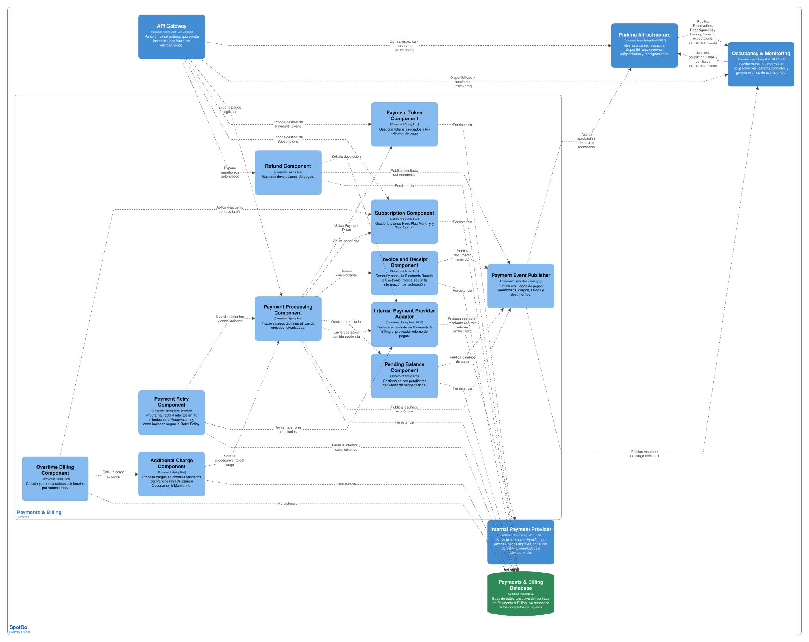

### 2.6.4. Bounded Context: Payments & Billing

Payments & Billing es un bounded context de soporte que concentra las operaciones económicas digitales de SpotGo. Administra tokens de pago, pagos de Reservations y suscripciones, cargos adicionales por sobretiempo, saldos pendientes, reembolsos y comprobantes. El proveedor de pagos es interno a la solución y se integra mediante un contrato que permite procesar operaciones de forma idempotente y recibir confirmaciones asíncronas.

El contexto no procesa los pagos físicos de Guests. En una Guest Parking Session, el Staff registra la placa, calcula el monto y confirma que recibió efectivo o POS fuera del flujo de pago digital. Payments & Billing solo procesa operaciones digitales de Drivers registrados, como el pago de una Reservation, una suscripción o un cargo adicional autorizado por las reglas de SpotGo.

Los comprobantes se generan a partir de los datos de facturación disponibles. Cuando el usuario proporciona DNI se genera un Electronic Receipt y cuando proporciona RUC se genera un Electronic Invoice. El modelo no almacena el número completo de una tarjeta ni otros datos financieros sensibles; utiliza Payment Token y referencias del proveedor interno.

#### *2.6.4.1. Domain Layer*

La capa de dominio separa la intención de pago, el resultado del proveedor, la facturación y las obligaciones pendientes. Una Reservation no se considera confirmada solo por haber iniciado un pago: Parking Infrastructure debe recibir ReservationPaymentApproved y verificar que el Temporary Lock continúe vigente.

| Elemento | Tipo | Responsabilidad y reglas principales | Atributos u operaciones relevantes |
| --- | --- | --- | --- |
| Digital Payment | Aggregate Root | Representa una operación de pago digital solicitada por SpotGo. Controla su estado, importe, token autorizado, referencia y resultado idempotente. | paymentId, paymentTokenId, operationType, ownerRef, amount, currency, status, providerOperationRef, idempotencyKey; initiate(), approve(), reject(), markPending(). |
| Payment Token | Entity | Representa un medio tokenizado que puede utilizarse sin conservar datos completos de tarjeta. | tokenId, ownerRef, providerTokenRef, brand, lastFour, expirationMonth, expirationYear, status; activate(), revoke(), isUsable(). |
| Subscription | Aggregate Root | Representa la suscripción de un Driver y sus beneficios aplicables. | subscriptionId, driverId, plan, startAt, endAt, status, discountRules; activate(), pause(), cancel(), appliesAt(). |
| Additional Charge | Entity | Representa un cargo adicional solicitado por una Reservation o Parking Session de un Driver registrado, por ejemplo por sobretiempo. | chargeId, reservationRef, sessionRef, amount, reason, evidenceRef, status; authorize(), process(), reject(). |
| Outstanding Balance | Aggregate Root | Representa una obligación pendiente después de un pago fallido o un cargo no regularizado. | balanceId, ownerRef, sourceRef, amount, dueAt, status; create(), addAmount(), regularize(), blockNewReservation(). |
| Refund | Entity | Representa un reembolso solicitado por cancelación, falta de spot compatible o aprobación tardía. | refundId, paymentId, amount, reason, status, providerOperationRef; request(), approve(), complete(), fail(). |
| Receipt | Entity | Representa el comprobante virtual de una operación aprobada. | receiptId, paymentId, ownerRef, amount, issuedAt, status; issue(), void(). |
| Electronic Receipt | Entity | Especialización de Receipt para operaciones asociadas a DNI. | receiptId, dni, series, number, taxData; issue(), validate(). |
| Electronic Invoice | Entity | Especialización de Receipt para operaciones asociadas a RUC. | receiptId, ruc, businessName, series, number, taxData; issue(), validate(). |
| Billing Tax Data | Value Object | Agrupa los datos requeridos para elegir y generar el tipo de comprobante. | documentType, documentNumber, legalName, address; validate(), determineDocumentType(). |
| Payment Status | Enumeration | Define el ciclo de vida de un Digital Payment. | INITIATED, PENDING, APPROVED, REJECTED, CANCELLED, RECONCILIATION_REQUIRED. |
| Payment Operation Type | Enumeration | Identifica la finalidad de la operación. | RESERVATION, SUBSCRIPTION, ADDITIONAL_CHARGE, REFUND. |
| Payment Attempt Status | Enumeration | Identifica el resultado de cada intento frente al proveedor interno. | STARTED, SUCCESS, TRANSIENT_FAILURE, DEFINITIVE_FAILURE, UNKNOWN. |
| Subscription Status | Enumeration | Define el ciclo de vida de una Subscription. | ACTIVE, PAUSED, EXPIRED, CANCELLED, PAST_DUE. |
| Balance Status | Enumeration | Define el estado de una Outstanding Balance. | OPEN, PARTIALLY_PAID, REGULARIZED, WRITTEN_OFF. |
| Billing Document Type | Enumeration | Define el comprobante de acuerdo con el documento del usuario. | ELECTRONIC_RECEIPT, ELECTRONIC_INVOICE. |
| Payment Provider Gateway | Domain Port | Define el contrato para solicitar cobros, consultar resultados y solicitar reembolsos al proveedor interno. | authorize(), queryStatus(), refund(), cancel(). |
| Payment Processing Service | Domain Service | Coordina el importe, token, idempotencia y transición de estado del pago. | process(), classifyResult(), reconcile(). |
| Retry Policy | Domain Service | Decide cuándo un fallo puede reintentarse y calcula la próxima ventana. | shouldRetry(), nextAttemptAt(), maxAttempts(). |
| Billing Service | Domain Service | Genera Receipt, Electronic Receipt o Electronic Invoice a partir de la operación aprobada. | issueReceipt(), issueElectronicDocument(). |
| Overtime Billing Service | Domain Service | Evalúa el cargo adicional recibido desde Parking Infrastructure y solicita su procesamiento. | createAdditionalCharge(), processAdditionalCharge(). |
| Subscription Service | Domain Service | Aplica beneficios vigentes sin modificar la tarifa base administrada por Parking Infrastructure. | calculateBenefit(), activateSubscription(), cancelSubscription(). |
| Digital Payment Repository | Repository Interface | Define la persistencia de pagos y sus estados. | findById(), findByIdempotencyKey(), save(), updateStatus(). |
| Payment Token Repository | Repository Interface | Define la persistencia de tokens y su revocación. | findUsable(), save(), revoke(). |
| Billing Repository | Repository Interface | Define la persistencia de comprobantes y datos de facturación. | save(), findByPaymentId(), voidDocument(). |
| Balance Repository | Repository Interface | Define la persistencia y regularización de saldos. | findOpenByOwner(), save(), regularize(). |

**Política de reintentos del proveedor interno**

La política se aplica únicamente a errores transitorios. Cada intento utiliza la misma clave de idempotencia de la operación y un número de intento distinto, de modo que una respuesta duplicada no produzca un segundo cobro. Antes de reintentar, el sistema consulta el estado de la operación cuando el resultado anterior sea desconocido.

| Tipo de operación | Intento inicial y reintentos | Condición para detener | Resultado terminal |
| --- | --- | --- | --- |
| Pago de Reservation | Intento inicial inmediato; reintentos a los 30 segundos, 2 minutos y 5 minutos. Máximo de cuatro intentos dentro del Temporary Lock de 10 minutos. | Se alcanza el máximo, vence el lock o aparece un rechazo definitivo. | ReservationPaymentRejected, liberación del spot y, si existiera aprobación tardía, conciliación y posible Refund. |
| Suscripción | Intento inicial inmediato; reintentos a 1 hora, 6 horas y 24 horas. | Se alcanza el máximo o el proveedor informa un rechazo definitivo. | Subscription PAST_DUE y notificación al Driver; no se crea un cobro duplicado. |
| Additional Charge | Intento inicial al recibirse la solicitud; reintentos a 1 hora, 6 horas y 24 horas. | Se alcanza el máximo, existe rechazo definitivo o la evidencia de ocupación deja de ser confiable. | Outstanding Balance OPEN y bloqueo de nuevas Reservations según la regla de negocio. |
| Refund | Solicitud inicial inmediata; ante resultado UNKNOWN se consulta el estado cada 15 minutos durante un máximo de 24 horas. | Se confirma el resultado, se alcanza el plazo o el proveedor requiere revisión. | Refund COMPLETED o RECONCILIATION_REQUIRED para revisión operativa. |
| Guest Parking Session | No aplica. | El pago físico se confirma manualmente por Staff. | El resultado se conserva en Parking Infrastructure; no se crea Digital Payment. |

Los errores de token inválido, fondos insuficientes, operación cancelada, fraude o rechazo explícito no se reintentan automáticamente. Los errores de red, timeout, indisponibilidad temporal y respuestas 5xx sí pueden reintentarse. Si la respuesta es desconocida, primero se consulta el proveedor interno usando providerOperationRef o idempotencyKey para evitar repetir una operación que pudo haber sido aprobada.

#### *2.6.4.2. Interface Layer*

La Interface Layer expone las operaciones económicas de Drivers y recibe solicitudes de los demás contextos. Las solicitudes de pago, cargo adicional y reembolso pueden procesarse de forma asíncrona, por lo que el controlador devuelve una referencia de operación y el resultado definitivo se comunica mediante eventos.

| Componente de interfaz | Canal | Responsabilidad | Operaciones o mensajes |
| --- | --- | --- | --- |
| Digital Payment Controller | REST/HTTPS | Inicia y consulta pagos digitales de Drivers. | Registrar token, iniciar pago de Reservation, consultar estado y listar operaciones propias. |
| Payment Token Controller | REST/HTTPS | Administra referencias tokenizadas de pago. | Registrar, consultar, activar o revocar Payment Token. |
| Subscription Controller | REST/HTTPS | Gestiona suscripciones y sus estados. | Crear, consultar, pausar, reactivar o cancelar Subscription. |
| Billing Controller | REST/HTTPS | Recibe datos de facturación y expone comprobantes. | Registrar DNI o RUC, emitir Receipt, consultar o invalidar documento. |
| Refund Controller | REST/HTTPS interno | Inicia o consulta reembolsos autorizados por Parking Infrastructure. | Solicitar Refund y consultar resultado. |
| Reservation and Refund Consumer | Evento asíncrono | Recibe solicitudes de pago y reembolso originadas en Parking Infrastructure. | ReservationPaymentRequested, RefundRequested. |
| Additional Charge Consumer | Evento asíncrono | Recibe cargos adicionales validados por reglas de ocupación y parking. | AdditionalChargeRequested. |
| Payment Provider Notification Consumer | Evento o callback interno | Recibe confirmaciones, rechazos o cambios del proveedor interno. | ProviderPaymentApproved, ProviderPaymentRejected, ProviderRefundUpdated. |
| Payment Event Publisher | Evento asíncrono | Publica resultados económicos para los contextos consumidores y el Driver. | ReservationPaymentApproved, ReservationPaymentRejected, AdditionalChargeProcessed, OutstandingBalanceGenerated, BalanceRegularized, RefundCompleted, RefundReconciliationRequired, ElectronicDocumentIssued. |

Los endpoints no aceptan datos completos de tarjeta ni permiten que una Guest inicie una transacción digital. La aplicación móvil Flutter y sus integraciones nativas en Kotlin reciben únicamente el resultado necesario para mostrar el estado de la operación y el comprobante permitido.

#### *2.6.4.3. Application Layer*

La Application Layer coordina las transiciones de pago y facturación. Los command handlers validan el contexto de la solicitud, aplican Retry Policy, invocan Payment Provider Gateway, persisten cada intento y publican el evento final. El resultado del pago no modifica directamente Reservation: Parking Infrastructure consume ReservationPaymentApproved y aplica sus propias reglas.

| Command | Command Handler | Resultado |
| --- | --- | --- |
| Register Payment Token | Register Payment Token Handler | Persiste un token del proveedor interno sin almacenar datos completos de tarjeta. |
| Start Reservation Payment | Start Reservation Payment Handler | Crea Digital Payment con idempotencyKey y envía la solicitud al proveedor interno. |
| Process Provider Result | Process Provider Result Handler | Clasifica la respuesta, actualiza el estado y publica ReservationPaymentApproved o ReservationPaymentRejected cuando la operación corresponde a una Reservation. |
| Process Subscription Payment | Process Subscription Payment Handler | Procesa la cuota de una Subscription y aplica la política de reintentos. |
| Process Additional Charge | Process Additional Charge Handler | Procesa un cargo autorizado por Parking Infrastructure y crea Outstanding Balance si no se regulariza. |
| Request Refund | Request Refund Handler | Solicita un reembolso y conserva su relación con el pago original. |
| Reconcile Payment | Reconcile Payment Handler | Consulta al proveedor interno para resolver respuestas UNKNOWN o aprobaciones tardías. |
| Generate Billing Document | Generate Billing Document Handler | Determina Electronic Receipt por DNI o Electronic Invoice por RUC y emite el documento. |
| Regularize Outstanding Balance | Regularize Outstanding Balance Handler | Registra un pago aprobado y cambia el saldo a REGULARIZED. |
| Apply Subscription Benefit | Apply Subscription Benefit Handler | Calcula el beneficio vigente para el cargo aplicable sin alterar la regla tarifaria del parking. |

| Domain Event | Event Handler o consumidor relacionado | Acción |
| --- | --- | --- |
| ReservationPaymentRequested | Reservation Payment Handler | Inicia el Digital Payment asociado a reservationId, lockId y paymentRef. |
| ProviderPaymentApproved | Approved Payment Handler | Valida idempotencia, registra el pago aprobado y publica ReservationPaymentApproved cuando la operación corresponde a una Reservation. |
| ProviderPaymentRejected | Rejected Payment Handler | Registra rechazo, determina si es definitivo o transitorio y publica el resultado correspondiente. |
| ReservationPaymentApproved | Parking Payment Consumer | Parking Infrastructure confirma Reservation si el Temporary Lock sigue vigente. |
| ReservationPaymentRejected | Parking Payment Consumer | Parking Infrastructure libera el spot y cambia el estado de la intención. |
| AdditionalChargeRequested | Additional Charge Handler | Verifica evidencia y crea el Digital Payment o Outstanding Balance correspondiente. |
| AdditionalChargeProcessed | Additional Charge Notification Handler | Informa a Parking Infrastructure y conserva el resultado del cargo adicional. |
| OutstandingBalanceGenerated | Balance Notification Handler | Informa al contexto de identidad o al canal de usuario que existe una obligación pendiente. |
| BalanceRegularized | Reservation Eligibility Consumer | Permite que el contexto correspondiente vuelva a considerar al Driver para nuevas Reservations. |
| RefundRequested | Refund Handler | Solicita el reembolso y publica RefundCompleted o RefundReconciliationRequired. |
| RefundCompleted | Refund Notification Handler | Informa el resultado final del reembolso y conserva su relación con el pago original. |
| RefundReconciliationRequired | Refund Reconciliation Handler | Envía la operación a revisión cuando el proveedor no permite confirmar el resultado automáticamente. |
| ElectronicDocumentIssued | Billing Notification Handler | Pone el comprobante a disposición del Driver y conserva su trazabilidad. |

Una respuesta aprobada después del vencimiento del Temporary Lock no confirma una Reservation automáticamente. Reconcile Payment consulta el estado, relaciona el resultado con la operación original y, si el espacio ya fue liberado, inicia Refund o Reconciliation Required según corresponda.

#### *2.6.4.4. Infrastructure Layer*

La infraestructura se implementará con Java y Spring Boot, PostgreSQL y adaptadores de mensajería. El proveedor de pagos se modela como una integración interna, por lo que la solución controla el contrato de autorización, consulta de estado, reembolso e idempotencia sin acoplar el dominio a una marca externa.

| Componente de infraestructura | Implementación propuesta | Responsabilidad |
| --- | --- | --- |
| Internal Payment Provider Adapter | Cliente REST/HTTPS o mensajería interna | Traduce Payment Provider Gateway al contrato del proveedor de pagos de SpotGo. |
| Provider Notification Adapter | Consumidor de eventos o callback interno | Verifica y transforma confirmaciones o cambios de estado del proveedor. |
| Payment Repository Implementation | Java, Spring Boot y PostgreSQL | Persiste Digital Payment y sus transiciones. |
| Payment Attempt Repository Implementation | Java, Spring Boot y PostgreSQL | Persiste cada intento, error clasificado y próxima fecha de reintento. |
| Idempotency Store | PostgreSQL o almacenamiento transaccional del contexto | Garantiza que una misma operación no produzca cobros duplicados. |
| Payment Retry Scheduler | Proceso de aplicación | Ejecuta reintentos de errores transitorios respetando ventanas y límites. |
| Token Repository Implementation | Java, Spring Boot y PostgreSQL | Persiste referencias tokenizadas y su revocación. |
| Billing Repository Implementation | Java, Spring Boot y PostgreSQL | Persiste comprobantes y datos de facturación permitidos. |
| Balance Repository Implementation | Java, Spring Boot y PostgreSQL | Persiste saldos pendientes y su regularización. |
| Payment Event Publisher | Adaptador de mensajería | Publica resultados aprobados, rechazados, reembolsos y saldos. |
| Payments & Billing Database | PostgreSQL | Mantiene la persistencia autónoma del contexto. |

La retención base de pagos, comprobantes, reembolsos, cargos y saldos es de cinco años. Los Payment Token se conservan mientras estén activos y pueden revocarse o depurarse cuando ya no sean necesarios para conciliación; los registros de operación e idempotencia se mantienen durante el periodo de auditoría. Ningún plazo de retención elimina una operación vinculada a un reclamo o investigación abierta.

#### *2.6.4.5. Bounded Context Software Architecture Component Level Diagrams*

El diagrama de componentes deberá mostrar Payments & Billing como un contenedor independiente con sus componentes de procesamiento, tokenización, suscripciones, cargos, saldos, reembolsos y facturación. Debe aparecer el proveedor interno de pagos como una dependencia de infraestructura, sin representar datos completos de tarjeta ni incluir el pago físico de Guests dentro del contenedor.

*Figura 34 (Payments & Billing Component Level Diagram)*

| Componente que debe representarse | Responsabilidad | Dependencias principales |
| --- | --- | --- |
| Payment Processing Component | Coordina Digital Payment, intentos, idempotencia y estados. | Digital Payment Controller, Payment Processing Service, Internal Payment Provider Adapter. |
| Payment Token Component | Administra tokens y su ciclo de vida. | Payment Token Controller, Payment Token Repository. |
| Subscription Component | Administra suscripciones y beneficios. | Subscription Controller, Subscription Service, Payment Processing Component. |
| Additional Charge Component | Recibe y procesa cargos adicionales validados. | Additional Charge Consumer, Overtime Billing Service. |
| Pending Balance Component | Crea, consulta y regulariza Outstanding Balance. | Balance Repository, Regularize Balance Handler. |
| Invoice and Receipt Component | Genera Receipt, Electronic Receipt o Electronic Invoice. | Billing Controller, Billing Service, Billing Repository. |
| Refund Component | Coordina solicitudes, consultas y resultados de Refund. | Refund Controller, Internal Payment Provider Adapter. |
| Payment Retry Component | Programa reintentos transitorios y conciliaciones. | Retry Policy, Payment Attempt Repository, Internal Payment Provider Adapter. |
| Payments & Billing Database | Persiste operaciones económicas y auditoría del contexto. | Implementaciones de repositorio. |
| Internal Payment Provider | Procesa pagos digitales y responde al contrato interno. | Internal Payment Provider Adapter. |

Las relaciones deben mostrar que Parking Infrastructure solicita pagos y recibe eventos de resultado, que Occupancy & Monitoring solo puede iniciar un Additional Charge mediante un evento validado y que las Guest Parking Sessions no llaman a Payment Processing Component. También debe representarse la publicación de ReservationPaymentApproved, ReservationPaymentRejected, RefundCompleted y OutstandingBalanceGenerated.

#### *2.6.4.6. Bounded Context Software Architecture Code Level Diagrams*

La vista de código debe mostrar las clases de dominio que separan pago, facturación, reembolso y saldo pendiente. También debe mostrar Payment Provider Gateway y Retry Policy como puertos o servicios del dominio, de manera que el proveedor interno pueda cambiar su implementación sin modificar las reglas centrales.

#### ***2.6.4.6.1. Bounded Context Domain Layer Class Diagrams***

*Figura 35 (Payments & Billing Domain Layer Class Diagram)*

| Clase, interfaz o enumeración | Atributos principales | Métodos principales | Relaciones |
| --- | --- | --- | --- |
| DigitalPayment | -paymentId, -paymentTokenId, -operationType, -ownerRef, -amount, -currency, -status, -providerOperationRef, -idempotencyKey | +initiate(), +approve(), +reject(), +markPending(), +requiresReconciliation() | Aggregate Root; se relaciona con PaymentToken, PaymentAttempt, Receipt y Refund. |
| PaymentAttempt | -attemptId, -paymentId, -number, -startedAt, -finishedAt, -status, -errorCode, -nextAttemptAt | +start(), +markSuccess(), +markTransientFailure(), +markDefinitiveFailure() | Entity perteneciente a DigitalPayment. |
| PaymentToken | -tokenId, -ownerRef, -providerTokenRef, -brand, -lastFour, -expirationMonth, -expirationYear, -status | +activate(), +revoke(), +isUsable() | Entity; referencia el token interno del proveedor. |
| Subscription | -subscriptionId, -driverId, -plan, -startAt, -endAt, -status, -discountRules | +activate(), +pause(), +cancel(), +appliesAt() | Aggregate Root; driverId es referencia a Profiles & Vehicles Management. |
| AdditionalCharge | -chargeId, -reservationRef, -sessionRef, -amount, -reason, -evidenceRef, -status | +authorize(), +process(), +reject() | Entity; se origina en una solicitud de Parking Infrastructure. |
| OutstandingBalance | -balanceId, -ownerRef, -sourceRef, -amount, -dueAt, -status | +create(), +addAmount(), +regularize(), +blockNewReservation() | Aggregate Root; puede bloquear nuevas Reservations. |
| Refund | -refundId, -paymentId, -amount, -reason, -status, -providerOperationRef | +request(), +approve(), +complete(), +fail() | Entity relacionada con DigitalPayment. |
| Receipt | -receiptId, -paymentId, -ownerRef, -amount, -issuedAt, -status | +issue(), +void() | Entity base de comprobantes. |
| ElectronicReceipt | -receiptId, -dni, -series, -number, -taxData | +issue(), +validate() | Especialización de Receipt para DNI. |
| ElectronicInvoice | -receiptId, -ruc, -businessName, -series, -number, -taxData | +issue(), +validate() | Especialización de Receipt para RUC; comparte receiptId con el comprobante base. |
| BillingTaxData | -documentType, -documentNumber, -legalName, -address | +validate(), +determineDocumentType() | Value Object de facturación. |
| PaymentStatus | INITIATED, PENDING, APPROVED, REJECTED, CANCELLED, RECONCILIATION_REQUIRED | — | Enumeration de DigitalPayment. |
| PaymentOperationType | RESERVATION, SUBSCRIPTION, ADDITIONAL_CHARGE, REFUND | — | Enumeration de la operación. |
| PaymentAttemptStatus | STARTED, SUCCESS, TRANSIENT_FAILURE, DEFINITIVE_FAILURE, UNKNOWN | — | Enumeration de PaymentAttempt. |
| SubscriptionStatus | ACTIVE, PAUSED, EXPIRED, CANCELLED, PAST_DUE | — | Enumeration de Subscription. |
| BalanceStatus | OPEN, PARTIALLY_PAID, REGULARIZED, WRITTEN_OFF | — | Enumeration de OutstandingBalance. |
| BillingDocumentType | ELECTRONIC_RECEIPT, ELECTRONIC_INVOICE | — | Enumeration de Receipt. |
| PaymentProviderGateway | — | +authorize(), +queryStatus(), +refund(), +cancel() | Domain Port implementado por Internal Payment Provider Adapter. |
| PaymentProcessingService | — | +process(), +classifyResult(), +reconcile() | Domain Service de pagos. |
| RetryPolicy | -reservationLockMinutes, -maxAttempts, -backoffSchedule | +shouldRetry(), +nextAttemptAt(), +maxAttempts() | Domain Service de reintentos. |
| BillingService | — | +issueReceipt(), +issueElectronicDocument() | Domain Service de comprobantes. |
| OvertimeBillingService | — | +createAdditionalCharge(), +processAdditionalCharge() | Domain Service de cargos adicionales. |
| SubscriptionService | — | +calculateBenefit(), +activateSubscription(), +cancelSubscription() | Domain Service de suscripciones. |
| DigitalPaymentRepository | — | +findById(), +findByIdempotencyKey(), +save(), +updateStatus() | Repository Interface. |
| PaymentTokenRepository | — | +findUsable(), +save(), +revoke() | Repository Interface. |
| BillingRepository | — | +save(), +findByPaymentId(), +voidDocument() | Repository Interface. |
| BalanceRepository | — | +findOpenByOwner(), +save(), +regularize() | Repository Interface. |

| Relación | Multiplicidad y dirección | Significado |
| --- | --- | --- |
| DigitalPayment — PaymentToken | Cada DigitalPayment utiliza 0..1 PaymentToken; un PaymentToken puede asociarse con 0..* DigitalPayments | El token autorizado puede reutilizarse en varias operaciones mientras permanezca activo. |
| DigitalPayment — PaymentAttempt | DigitalPayment 1 a PaymentAttempt 1..* | Cada operación conserva el historial de intentos. |
| DigitalPayment — Receipt | DigitalPayment 1 a Receipt 0..1 | Un pago aprobado puede emitir un comprobante. |
| DigitalPayment — Refund | DigitalPayment 1 a Refund 0..* | Una operación puede originar uno o más reembolsos controlados. |
| Subscription — DigitalPayment | Subscription 1 a DigitalPayment 0..* | Las cuotas se procesan como operaciones de pago. |
| OutstandingBalance — DigitalPayment | OutstandingBalance 1 a DigitalPayment 0..* | Un saldo puede regularizarse mediante pagos posteriores. |
| PaymentProcessingService ..> PaymentProviderGateway | Dependencia dirigida | El servicio utiliza el puerto del proveedor interno. |
| RetryPolicy ..> PaymentAttempt | Dependencia dirigida | La política determina si se crea otro intento. |
| BillingService ..> BillingTaxData | Dependencia dirigida | El servicio determina el tipo de comprobante. |
| PaymentProviderGateway ..> InternalPaymentProviderAdapter | Implementación dirigida | Infrastructure Layer implementa el puerto de dominio. |

#### ***2.6.4.6.2. Bounded Context Database Design Diagram***

Payments & Billing Database persiste únicamente operaciones digitales y sus documentos. Los identificadores de Driver, Reservation y Parking Session se almacenan como referencias de integración. Una Guest Parking Session queda fuera del flujo digital y no se almacena como Digital Payment. No se incluyen datos completos de tarjeta y no se crean foreign keys hacia bases de otros bounded contexts.

*Figura 36 (Payments & Billing Database Design Diagram)*

| Tabla | Columnas principales | Restricciones y relaciones |
| --- | --- | --- |
| payment_tokens | token_id, owner_ref, provider_token_ref, brand, last_four, expiration_month, expiration_year, status, created_at, revoked_at | token_id PK; provider_token_ref UNIQUE; no almacena número completo de tarjeta ni código de seguridad. |
| digital_payments | payment_id, payment_token_id, operation_type, owner_ref, amount, currency, status, provider_operation_ref, idempotency_key, created_at, approved_at | payment_id PK; payment_token_id FK a payment_tokens; idempotency_key UNIQUE; status restringido al ciclo de PaymentStatus; provider_operation_ref UNIQUE cuando tenga valor. |
| payment_attempts | attempt_id, payment_id, attempt_number, started_at, finished_at, status, error_code, next_attempt_at | attempt_id PK; payment_id FK a digital_payments; combinación payment_id y attempt_number UNIQUE. |
| subscriptions | subscription_id, driver_id, plan, start_at, end_at, status, discount_rules | subscription_id PK; driver_id es referencia externa; end_at no puede ser menor que start_at. |
| additional_charges | charge_id, reservation_ref, session_ref, amount, reason, evidence_ref, status, created_at | charge_id PK; reservation_ref y session_ref son referencias externas; al menos una fuente operativa debe estar presente. |
| outstanding_balances | balance_id, owner_ref, source_ref, amount, due_at, status, created_at, regularized_at | balance_id PK; owner_ref y source_ref son referencias lógicas; amount no negativo. |
| refunds | refund_id, payment_id, amount, reason, status, provider_operation_ref, requested_at, completed_at | refund_id PK; payment_id FK a digital_payments; amount no supera el importe elegible del pago según regla de negocio. |
| billing_documents | document_id, payment_id, document_type, document_number, series, legal_name, tax_data, issued_at, status | document_id PK; payment_id FK a digital_payments; document_type ELECTRONIC_RECEIPT o ELECTRONIC_INVOICE; número único por serie. |
| payment_idempotency_records | idempotency_key, payment_id, request_hash, first_seen_at, last_seen_at, result_reference | idempotency_key PK; request_hash permite detectar una misma clave usada con datos distintos; funciona como registro de deduplicación de la operación. |

| Relación de datos | Cardinalidad | Regla |
| --- | --- | --- |
| digital_payments — payment_attempts | 1 a 1..* | Cada intento pertenece a una operación. |
| digital_payments — refunds | 1 a 0..* | Los reembolsos se trazan al pago original. |
| digital_payments — billing_documents | 1 a 0..1 | Un pago aprobado genera como máximo el documento principal correspondiente. |
| payment_tokens — digital_payments | 1 a 0..* mediante payment_token_id | Un token puede reutilizarse mientras esté activo y autorizado. |
| driver_id — Profiles & Vehicles Management | Referencia externa | Identifica al Driver sin crear FK entre bases. |
| reservation_ref — Parking Infrastructure | Referencia externa | Relaciona la operación económica con Reservation. |
| session_ref — Parking Infrastructure | Referencia externa | Relaciona el cargo con Parking Session cuando corresponda. |

La base conserva payment_attempts para auditar la política de reintentos y resolver respuestas UNKNOWN. La retención de operaciones, documentos y saldos es de cinco años como política base propuesta, y se prolonga cuando exista un reclamo, una auditoría o una obligación de conciliación pendiente.
