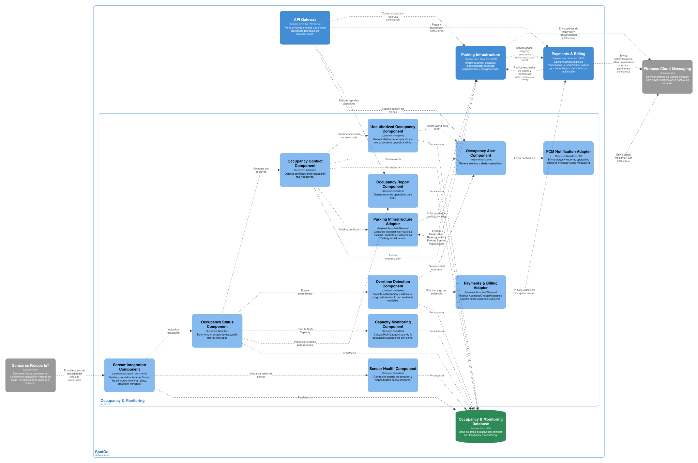
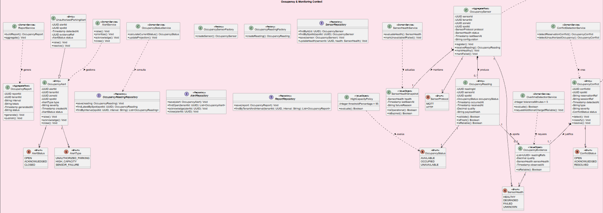

### 2.6.5. Bounded Context: Occupancy & Monitoring

Occupancy & Monitoring es un bounded context principal que recibe y procesa la información de los sensores instalados en los Parking Spots. Su responsabilidad es mantener el estado físico de ocupación, supervisar la salud de los sensores, identificar conflictos, detectar condiciones de sobretiempo y generar alertas y reportes para la operación.

El sensor confirma si un espacio está disponible u ocupado, pero no identifica la placa ni el Vehicle que se encuentra en él. Por ello, este contexto no crea ni administra Drivers, Vehicles, Reservations o Parking Sessions. Parking Infrastructure conserva la propiedad de esas entidades y consume los eventos de ocupación para actualizar la disponibilidad, resolver conflictos o solicitar un cargo adicional cuando exista evidencia confiable.

Los estados de ocupación se mantienen independientes de los estados de Reservation. Un Parking Spot puede estar físicamente ocupado mientras una Reservation aparece como RESERVED, ACTIVE, COMPLETED o en otro estado; la diferencia se analiza como una condición operativa y no se corrige modificando automáticamente una entidad del otro contexto.

#### *2.6.5.1. Domain Layer*

La capa de dominio representa sensores, lecturas, estados físicos y reglas de monitoreo. Una lectura válida debe asociarse a un Occupancy Sensor conocido, a un Parking Spot configurado y a una marca de tiempo. Si el sensor deja de reportar dentro del umbral operativo o presenta una falla, el espacio se considera UNAVAILABLE hasta que la salud del sensor sea restablecida.

| Elemento | Tipo | Responsabilidad y reglas principales | Atributos u operaciones relevantes |
| --- | --- | --- | --- |
| Occupancy Sensor | Aggregate Root | Representa el sensor instalado y su relación con un Parking Spot. | sensorId, tenantId, zoneId, spotId, protocol, status, lastSeenAt, configuration; register(), receiveReading(), markHealthy(), markFailed(). |
| Occupancy Reading | Entity | Representa una medición de ocupación recibida del sensor. No contiene identidad de vehículo. | readingId, sensorId, spotId, occupancyStatus, occurredAt, receivedAt, quality, payloadHash; validate(), isFresh(), isReliable(). |
| Occupancy Status | Enumeration | Define el estado físico observable del Parking Spot. | AVAILABLE, OCCUPIED, UNAVAILABLE. |
| Sensor Health | Enumeration | Define la salud operativa del sensor. | HEALTHY, DEGRADED, FAILED, UNKNOWN. |
| Sensor Protocol | Enumeration | Identifica el canal de recepción de datos. | MQTT, HTTP. |
| Occupancy Conflict | Entity | Representa una diferencia entre el estado físico observado y la expectativa registrada para una Reservation o Parking Session. | conflictId, spotId, reservationRef, sessionRef, detectedAt, type, severity, status; detect(), classify(), resolve(). |
| Occupancy Alert | Entity | Representa una alerta operativa que requiere visualización o atención. | alertId, tenantId, zoneId, spotId, type, severity, createdAt, status; raise(), acknowledge(), close(). |
| Unauthorized Parking Alert | Entity | Especialización de Occupancy Alert para ocupación sin una expectativa válida de operación. | alertId, spotId, detectedAt, evidenceRef, status; raise(), resolve(). |
| High Capacity Policy | Value Object | Define la condición de alta capacidad del estacionamiento. En este avance, la alerta se activa cuando la ocupación supera el 95 por ciento. | thresholdPercentage = 95, evaluate(); el evento se genera cuando percentage > thresholdPercentage. |
| Sensor Health Snapshot | Value Object | Resume la última señal, calidad y fecha de comunicación de un sensor. | health, lastSeenAt, failureReason; isOperational(), isExpired(). |
| Occupancy Evidence | Value Object | Agrupa la información necesaria para evaluar confiabilidad sin identificar un vehículo. | readingRef, quality, sensorHealth, observedAt; isReliable(). |
| Occupancy Report | Aggregate Root | Representa un reporte o agregado de ocupación para la operación administrativa. | reportId, tenantId, interval, totals, generatedAt, status; generate(), publish(). |
| Occupancy Sensor Factory | Factory | Crea un sensor con spot, protocolo y configuración válidos. | createSensor(). |
| Occupancy Reading Factory | Factory | Crea una lectura normalizada a partir del mensaje MQTT o HTTP. | createReading(). |
| Occupancy Status Service | Domain Service | Determina el último estado físico confiable de un spot. | calculateCurrentStatus(), updateProjection(). |
| Sensor Health Service | Domain Service | Evalúa la frecuencia y calidad de comunicación del sensor. | evaluateHealth(), markUnavailableIfFailed(). |
| Conflict Detection Service | Domain Service | Compara la evidencia física con las expectativas recibidas de Parking Infrastructure. | detectReservationConflict(), detectUnauthorizedOccupancy(). |
| Overtime Detection Service | Domain Service | Evalúa sobretiempo con tolerancia de cinco minutos y sin inferir la identidad del vehículo. | evaluate(), requestAdditionalChargeIfReliable(). |
| Alert Service | Domain Service | Genera, prioriza y cierra alertas de ocupación, capacidad y fallas. | raise(), prioritize(), acknowledge(), close(). |
| Report Service | Domain Service | Construye reportes y agregados sin alterar las lecturas originales. | buildReport(), aggregate(). |
| Sensor Repository | Repository Interface | Define la persistencia y consulta de sensores. | findById(), findBySpotId(), save(), updateHealth(). |
| Occupancy Reading Repository | Repository Interface | Define la persistencia de lecturas y consultas históricas. | save(), findLatestBySpot(), findByInterval(). |
| Alert Repository | Repository Interface | Define la persistencia del ciclo de vida de alertas. | save(), findOpen(), acknowledge(), close(). |
| Report Repository | Repository Interface | Define la persistencia de reportes y agregados. | save(), findByTenantAndInterval(). |

Las reglas principales del modelo son:

| Regla | Aplicación |
| --- | --- |
| Frecuencia de sensor | El estado físico actualizado debe estar disponible para las consultas en un máximo de cinco segundos desde la recepción de una lectura válida. |
| Falla de sensor | Si no existe una lectura confiable o la salud del sensor es FAILED, el spot se reporta como UNAVAILABLE para fines de disponibilidad. |
| Sin identificación de vehículo | Las lecturas no contienen placa, driverId ni vehicleId. La asociación con una Reservation se realiza mediante referencias y reglas de conflicto, nunca por reconocimiento automático. |
| Estados independientes | Occupancy Status y Reservation Status se conservan separados y se relacionan mediante eventos. |
| Alta capacidad | En este avance se genera una condición de High Capacity cuando la ocupación supera el 95 por ciento de los Parking Spots operativos disponibles. |
| Cobro adicional | Solo se publica AdditionalChargeRequested cuando la evidencia es confiable y Parking Infrastructure confirma la relación operativa. |
| Retención | Las lecturas en bruto se conservan doce meses y los reportes agregados veinticuatro meses como política base propuesta, con suspensión ante incidentes o auditorías. |

#### *2.6.5.2. Interface Layer*

La Interface Layer recibe mensajes de los sensores por MQTT o HTTP y expone consultas para el monitoreo administrativo. También consume eventos de Parking Infrastructure para conocer reservas, reasignaciones y sesiones esperadas, pero no modifica esas entidades directamente.

| Componente de interfaz | Canal | Responsabilidad | Operaciones o mensajes |
| --- | --- | --- | --- |
| Sensor Event Consumer | MQTT/HTTP | Recibe mensajes de ocupación y los transforma en comandos de aplicación. | OccupancyReadingReceived. |
| Sensor Administration Controller | REST/HTTPS | Registra sensores, consulta su salud y administra su configuración. | Registrar sensor, asignar spot, consultar estado, desactivar sensor. |
| Occupancy Monitoring Controller | REST/HTTPS | Expone el estado actual y la disponibilidad física observada. | Consultar estado por tenant, zona o spot. |
| Alert Controller | REST/HTTPS | Permite a Staff consultar, reconocer y cerrar alertas. | Listar alertas, reconocer, cerrar y consultar severidad. |
| Occupancy Report Controller | REST/HTTPS | Expone reportes y agregados para el dashboard administrativo. | Generar, consultar y filtrar reportes por intervalo. |
| Parking Event Consumer | Evento asíncrono | Recibe expectativas operativas sin asumir propiedad de Reservation o Parking Session. | ReservationCreated, ReservationReassigned, ParkingSessionStarted, ParkingSessionCompleted. |
| Monitoring Event Publisher | Evento asíncrono | Publica estados, fallas, conflictos y solicitudes de cargos adicionales. | OccupancyStatusUpdated, SensorFailureDetected, OccupancyConflictDetected, AdditionalChargeRequested. |
| Notification Adapter | Evento o API interna | Envía alertas operativas mediante Firebase Cloud Messaging cuando corresponda. | HighCapacityReached, UnauthorizedParkingDetected, SensorFailureDetected. |

La aplicación móvil Flutter y la aplicación web administrativa consultan el estado a través del API Gateway. La integración nativa en Kotlin puede recibir capacidades específicas de Android, pero no cambia el formato de Occupancy Status ni incorpora identificación automática del vehículo.

#### *2.6.5.3. Application Layer*

La Application Layer normaliza los mensajes, valida su idempotencia, actualiza el estado físico y publica eventos. Cuando una lectura supera el umbral de frescura o la salud del sensor empeora, los handlers marcan el spot como no disponible para las consultas de ocupación. Las decisiones de reasignación, cierre de Reservation o cobro final se ejecutan en los contextos propietarios.

| Command | Command Handler | Resultado |
| --- | --- | --- |
| Register Occupancy Sensor | Register Sensor Handler | Registra un sensor asociado con Tenant, Zone y Spot mediante referencias válidas. |
| Process Occupancy Reading | Process Occupancy Reading Handler | Normaliza el mensaje MQTT o HTTP, valida idempotencia y actualiza el estado físico. |
| Evaluate Sensor Health | Evaluate Sensor Health Handler | Determina HEALTHY, DEGRADED, FAILED o UNKNOWN según comunicación y calidad. |
| Mark Sensor Failure | Mark Sensor Failure Handler | Marca el sensor como FAILED, el spot como UNAVAILABLE y publica el evento correspondiente. |
| Detect Occupancy Conflict | Detect Occupancy Conflict Handler | Compara lectura confiable con la expectativa de Parking Infrastructure y crea Occupancy Conflict. |
| Detect Unauthorized Occupancy | Detect Unauthorized Occupancy Handler | Genera una alerta cuando existe ocupación sin una expectativa operativa válida, sin identificar al vehículo. |
| Evaluate Overstay | Evaluate Overstay Handler | Aplica cinco minutos de tolerancia y solicita cargo adicional únicamente con evidencia confiable. |
| Evaluate High Capacity | Evaluate High Capacity Handler | Calcula el porcentaje de ocupación y genera alerta si supera 95 por ciento. |
| Resolve Occupancy Alert | Resolve Occupancy Alert Handler | Registra reconocimiento y cierre por personal autorizado. |
| Generate Occupancy Report | Generate Occupancy Report Handler | Construye un reporte del intervalo solicitado sin modificar lecturas históricas. |

| Domain Event | Event Handler o consumidor relacionado | Acción |
| --- | --- | --- |
| OccupancyReadingReceived | Process Occupancy Reading Handler | Recibe una lectura externa, valida su formato e idempotencia y actualiza el estado físico. |
| ReservationCreated | Reservation Expectation Handler | Registra la expectativa de ocupación para el spot y periodo, usando reservationId como referencia. |
| ReservationReassigned | Reservation Expectation Handler | Actualiza la expectativa del spot anterior y del nuevo spot. |
| ParkingSessionStarted | Session Expectation Handler | Relaciona la expectativa operativa con el spot sin transferir la propiedad de Parking Session. |
| ParkingSessionCompleted | Session Expectation Handler | Retira o cierra la expectativa operativa asociada con el spot cuando termina la sesión. |
| OccupancyStatusUpdated | Parking Availability Consumer | Parking Infrastructure actualiza su Availability Projection. |
| SensorFailureDetected | Parking Availability Consumer | Parking Infrastructure considera el spot UNAVAILABLE y revisa posibles Reservations afectadas. |
| OccupancyConflictDetected | Parking Conflict Consumer | Parking Infrastructure analiza reasignación, indisponibilidad o alerta. |
| UnauthorizedParkingDetected | Alert Notification Handler | Envía una alerta a Staff mediante el canal configurado. |
| HighCapacityReached | Capacity Notification Handler | Publica la condición para el dashboard y las notificaciones operativas. |
| AdditionalChargeRequested | Payment Charge Consumer | Payments & Billing procesa el cargo si la solicitud contiene evidencia suficiente. |
| OccupancyReportGenerated | Report Distribution Handler | Pone el reporte a disposición del dashboard administrativo. |

El handler de Overtime Detection no crea ni cierra una Parking Session. Solo emite una solicitud de cargo con reservationRef o sessionRef, evidencia, instante observado y nivel de confiabilidad. Parking Infrastructure y Payments & Billing deciden si la operación es válida y cómo se procesa.

#### *2.6.5.4. Infrastructure Layer*

La infraestructura utiliza Java y Spring Boot para la API y los procesos de aplicación, PostgreSQL para el almacenamiento independiente y adaptadores MQTT/HTTP para recibir mensajes de sensores. La mensajería asíncrona distribuye los eventos a Parking Infrastructure, Payments & Billing y al servicio de notificaciones.

| Componente de infraestructura | Implementación propuesta | Responsabilidad |
| --- | --- | --- |
| Sensor MQTT Adapter | Cliente MQTT | Recibe lecturas del canal IoT y las transforma a OccupancyReadingReceived. |
| Sensor HTTP Adapter | Endpoint REST/HTTPS | Recibe lecturas cuando el sensor o gateway utiliza HTTP. |
| Sensor Integration Component | Java, Spring Boot | Unifica protocolos, valida origen, normaliza payload y aplica idempotencia. |
| Sensor Repository Implementation | Java, Spring Boot y PostgreSQL | Persiste configuración, estado y última comunicación de sensores. |
| Occupancy Reading Repository Implementation | Java, Spring Boot y PostgreSQL | Persiste lecturas y consultas por spot o intervalo. |
| Sensor Health Monitor | Proceso programado | Detecta ausencia de lecturas y cambia el estado a FAILED o UNKNOWN según la política. |
| Conflict Detection Adapter | Consumidor de eventos | Mantiene expectativas de Reservations y Parking Sessions recibidas desde Parking Infrastructure. |
| Alert Repository Implementation | Java, Spring Boot y PostgreSQL | Persiste alertas, severidad, reconocimiento y cierre. |
| Report Repository Implementation | Java, Spring Boot y PostgreSQL | Persiste reportes y agregados de ocupación. |
| Monitoring Event Publisher | Adaptador de mensajería | Distribuye cambios de estado, fallas, conflictos y cargos solicitados. |
| FCM Notification Adapter | Firebase Cloud Messaging | Envía notificaciones de alta capacidad, conflictos o fallas a destinatarios autorizados. |
| Occupancy & Monitoring Database | PostgreSQL | Mantiene la persistencia propia del contexto y sus índices temporales. |

El monitor de salud debe comprobar que una lectura no supere el intervalo operativo de cinco segundos y distinguir una falla de comunicación de una lectura OCCUPIED o AVAILABLE válida. Cuando no pueda garantizarse la confiabilidad, la proyección operativa del spot pasa a UNAVAILABLE. La eliminación de lecturas en bruto se realiza después de doce meses como política base propuesta; los reportes agregados se conservan veinticuatro meses y los incidentes abiertos suspenden la depuración.

#### *2.6.5.5. Bounded Context Software Architecture Component Level Diagrams*

El diagrama de componentes deberá mostrar el límite de Occupancy & Monitoring, la entrada de sensores mediante MQTT/HTTP, los componentes internos de estado, salud, conflictos, sobretiempo, alertas y reportes, y la base de datos PostgreSQL propia. También deberá mostrar las dependencias asíncronas con Parking Infrastructure y Payments & Billing, además de la integración con Firebase Cloud Messaging.

*Figura 37 (Occupancy & Monitoring Component Level Diagram)*

| Componente que debe representarse | Responsabilidad | Dependencias principales |
| --- | --- | --- |
| Sensor Integration Component | Recibe MQTT/HTTP, normaliza lecturas y aplica idempotencia. | MQTT Adapter, HTTP Adapter, Process Occupancy Reading Handler. |
| Occupancy Status Component | Mantiene el último estado físico confiable por spot. | Occupancy Status Service, Reading Repository. |
| Sensor Health Component | Supervisa comunicación, calidad y fallas. | Sensor Health Service, Sensor Repository, Health Monitor. |
| Occupancy Conflict Component | Compara la ocupación con expectativas de Reservation o Session. | Parking Event Consumer, Conflict Detection Service. |
| Unauthorized Occupancy Component | Genera alertas para ocupación sin expectativa válida. | Occupancy Conflict Component, Alert Service. |
| Overtime Detection Component | Evalúa sobretiempo y publica solicitudes de cargo con evidencia. | Parking Event Consumer, Overtime Detection Service, Payments & Billing Adapter. |
| Occupancy Alert Component | Prioriza, notifica, reconoce y cierra alertas. | Alert Controller, Alert Repository, FCM Adapter. |
| Capacity Monitoring Component | Calcula el porcentaje de ocupación y la condición mayor al 95 por ciento. | Occupancy Status Component, Alert Service. |
| Occupancy Report Component | Genera reportes para Staff. | Report Controller, Report Service, Report Repository. |
| Occupancy & Monitoring Database | Persiste sensores, lecturas, conflictos, alertas y reportes. | Implementaciones de repositorio. |
| Parking Infrastructure Adapter | Consume eventos y publica OccupancyStatusUpdated o conflictos. | Canal de mensajería asíncrona. |
| Payments & Billing Adapter | Publica AdditionalChargeRequested hacia Payments & Billing cuando existe evidencia suficiente. | Canal de mensajería asíncrona. |

Las relaciones visuales deben indicar que el sensor no envía placa, driverId ni vehicleId, y que el contexto no llama directamente a la base de datos de Parking Infrastructure. El flujo de sobretiempo debe terminar en una solicitud de cargo, no en un cobro automático dentro de Occupancy & Monitoring.

#### *2.6.5.6. Bounded Context Software Architecture Code Level Diagrams*

La vista de código debe representar el modelo físico de ocupación y los servicios que convierten lecturas en estados, conflictos, alertas y reportes. Debe quedar explícito que ParkingSession no es una entidad propietaria de este bounded context. La notación recomendada utiliza + para operaciones públicas, - para atributos privados y # para elementos protegidos.

#### ***2.6.5.6.1. Bounded Context Domain Layer Class Diagrams***

*Figura 38 (Occupancy & Monitoring Domain Layer Class Diagram)*

| Clase, interfaz o enumeración | Atributos principales | Métodos principales | Relaciones |
| --- | --- | --- | --- |
| OccupancySensor | -sensorId, -tenantId, -zoneId, -spotId, -protocol, -status, -lastSeenAt, -configuration | +register(), +receiveReading(), +markHealthy(), +markFailed() | Aggregate Root; pertenece a un spot mediante referencias de infraestructura. |
| OccupancyReading | -readingId, -sensorId, -spotId, -occupancyStatus, -occurredAt, -receivedAt, -quality, -payloadHash | +validate(), +isFresh(), +isReliable() | Entity perteneciente al historial del sensor; no identifica Vehicle. |
| SensorHealthSnapshot | -health, -lastSeenAt, -failureReason | +isOperational(), +isExpired() | Value Object de salud del sensor. |
| OccupancyEvidence | -readingRefs, -quality, -sensorHealth, -observedAt | +isReliable() | Value Object usado por conflictos y sobretiempo; puede agrupar una o varias lecturas. |
| OccupancyConflict | -conflictId, -spotId, -reservationRef, -sessionRef, -detectedAt, -type, -severity, -status | +detect(), +classify(), +resolve() | Entity; referencias externas a Parking Infrastructure. |
| OccupancyAlert | -alertId, -tenantId, -zoneId, -spotId, -type, -severity, -createdAt, -status | +raise(), +acknowledge(), +close() | Entity de monitoreo. |
| UnauthorizedParkingAlert | -alertId, -spotId, -detectedAt, -evidenceRef, -status | +raise(), +resolve() | Especialización de OccupancyAlert. |
| HighCapacityPolicy | -thresholdPercentage = 95 | +evaluate() | Value Object; genera High Capacity cuando la ocupación supera el umbral. |
| OccupancyReport | -reportId, -tenantId, -interval, -totals, -generatedAt, -status | +generate(), +publish() | Aggregate Root de reportes. |
| OccupancyStatusService | — | +calculateCurrentStatus(), +updateProjection() | Domain Service de estado físico. |
| SensorHealthService | — | +evaluateHealth(), +markUnavailableIfFailed() | Domain Service de salud. |
| ConflictDetectionService | — | +detectReservationConflict(), +detectUnauthorizedOccupancy() | Domain Service de conflictos. |
| OvertimeDetectionService | -toleranceMinutes | +evaluate(), +requestAdditionalChargeIfReliable() | Domain Service; usa tolerancia de cinco minutos. |
| AlertService | — | +raise(), +prioritize(), +acknowledge(), +close() | Domain Service de alertas. |
| ReportService | — | +buildReport(), +aggregate() | Domain Service de reportes. |
| OccupancySensorFactory | — | +createSensor() | Factory de OccupancySensor. |
| OccupancyReadingFactory | — | +createReading() | Factory de OccupancyReading. |
| OccupancyStatus | AVAILABLE, OCCUPIED, UNAVAILABLE | — | Enumeration del estado físico. |
| SensorHealth | HEALTHY, DEGRADED, FAILED, UNKNOWN | — | Enumeration de salud. |
| SensorProtocol | MQTT, HTTP | — | Enumeration de protocolo. |
| ConflictStatus | OPEN, ACKNOWLEDGED, RESOLVED | — | Enumeration de OccupancyConflict. |
| AlertStatus | OPEN, ACKNOWLEDGED, CLOSED | — | Enumeration de OccupancyAlert. |
| SensorRepository | — | +findById(), +findBySpotId(), +save(), +updateHealth() | Repository Interface. |
| OccupancyReadingRepository | — | +save(), +findLatestBySpot(), +findByInterval() | Repository Interface. |
| AlertRepository | — | +save(), +findOpen(), +acknowledge(), +close() | Repository Interface. |
| ReportRepository | — | +save(), +findByTenantAndInterval() | Repository Interface. |

| Relación | Multiplicidad y dirección | Significado |
| --- | --- | --- |
| OccupancySensor — OccupancyReading | OccupancySensor 1 a OccupancyReading 0..* | Un sensor produce muchas lecturas históricas. |
| OccupancySensor — SensorHealthSnapshot | OccupancySensor 1 a SensorHealthSnapshot 1 | El sensor mantiene una vista de salud actual. |
| OccupancyReading — OccupancyEvidence | OccupancyReading 1 a OccupancyEvidence 0..1 | Una lectura puede aportar evidencia evaluable. |
| OccupancyConflict — OccupancyEvidence | OccupancyConflict 1 a OccupancyEvidence 1..* | Un conflicto se justifica con lecturas confiables. |
| OccupancyAlert — UnauthorizedParkingAlert | Generalización | Una alerta de ocupación no autorizada es un tipo de alerta operativa. |
| HighCapacityPolicy ..> OccupancyStatus | Dependencia dirigida | La política calcula el porcentaje según estados físicos. |
| OvertimeDetectionService ..> OccupancyEvidence | Dependencia dirigida | Solo solicita cargos con evidencia confiable. |
| OccupancyStatusService ..> OccupancyReadingRepository | Dependencia dirigida | Consulta la última lectura válida. |
| OccupancyConflict ..> Reservation | Referencia externa dirigida | reservationRef identifica una Reservation sin crear FK entre bases. |
| OccupancyConflict ..> ParkingSession | Referencia externa dirigida | sessionRef identifica una sesión sin transferir su propiedad. |
| OccupancyStatusUpdated ..> Parking Infrastructure | Evento dirigido | Comunica el estado físico para Availability Projection. |

#### ***2.6.5.6.2. Bounded Context Database Design Diagram***

Occupancy & Monitoring Database almacena sensores, lecturas, estados de salud, conflictos, alertas y reportes. Las relaciones internas utilizan foreign keys. tenant_id, zone_id, spot_id, reservation_ref y session_ref son referencias de integración; no se crean foreign keys hacia las bases de Parking Infrastructure.

*Figura 39 (Occupancy & Monitoring Database Design Diagram)*

| Tabla | Columnas principales | Restricciones y relaciones |
| --- | --- | --- |
| occupancy_sensors | sensor_id, tenant_id, zone_id, spot_id, protocol, status, last_seen_at, configuration, installed_at | sensor_id PK; tenant_id, zone_id y spot_id son referencias lógicas; protocol MQTT o HTTP; un sensor ACTIVE por Parking Spot. |
| occupancy_readings | reading_id, sensor_id, spot_id, occupancy_status, occurred_at, received_at, quality, payload_hash | reading_id PK; sensor_id FK a occupancy_sensors; occupancy_status AVAILABLE u OCCUPIED; UNAVAILABLE se deriva de Sensor Health en la proyección operativa; payload_hash e instante permiten idempotencia; no contiene placa ni vehicle_id. |
| sensor_health_events | health_event_id, sensor_id, health, reason, observed_at, recovered_at | health_event_id PK; sensor_id FK a occupancy_sensors; conserva transiciones de salud para auditoría. |
| occupancy_conflicts | conflict_id, spot_id, reservation_ref, session_ref, conflict_type, severity, evidence_refs, detected_at, status | conflict_id PK; spot_id es referencia lógica; reservation_ref y session_ref son opcionales y externos; evidence_refs conserva una o varias referencias a lecturas; status OPEN, ACKNOWLEDGED o RESOLVED. |
| occupancy_alerts | alert_id, tenant_id, zone_id, spot_id, alert_type, severity, evidence_ref, created_at, acknowledged_at, closed_at, status | alert_id PK; referencias de tenant, zone y spot son lógicas; status OPEN, ACKNOWLEDGED o CLOSED. |
| capacity_snapshots | snapshot_id, tenant_id, zone_id, occupied_count, total_count, percentage, observed_at | snapshot_id PK; tenant_id y zone_id son referencias lógicas; zone_id puede ser NULL cuando el snapshot representa al Tenant completo; percentage se calcula de occupied_count y total_count. |
| occupancy_reports | report_id, tenant_id, interval_start, interval_end, totals, generated_at, status | report_id PK; tenant_id es referencia lógica; interval_end mayor que interval_start. |

| Relación de datos | Cardinalidad | Regla |
| --- | --- | --- |
| occupancy_sensors — occupancy_readings | 1 a 0..* | Cada lectura pertenece a un sensor registrado. |
| occupancy_sensors — sensor_health_events | 1 a 0..* | Las transiciones de salud se conservan como historial. |
| occupancy_readings — occupancy_conflicts | Referencia lógica | Una o varias lecturas confiables pueden justificar un conflicto. |
| occupancy_alerts — occupancy_conflicts | 1 a 0..* | Una alerta puede agrupar conflictos relacionados. |
| tenant_id, zone_id, spot_id — Parking Infrastructure | Referencias externas | Se validan mediante configuración o eventos; no hay FK entre bases. |
| reservation_ref, session_ref — Parking Infrastructure | Referencias externas opcionales | Solo identifican la expectativa operativa; no convierten la entidad en propiedad de Occupancy. |

El historial de occupancy_readings se conserva doce meses y los reportes o snapshots agregados veinticuatro meses como política base propuesta. Las alertas, conflictos y registros relacionados con incidentes abiertos se conservan hasta su resolución y durante el plazo de auditoría aplicable. No se registra una placa como resultado del sensor.
