# Capítulo III: Solution UI/UX Design

## 3.1. Product design

### 3.1.1. Style Guidelines

Las Style Guidelines de SpotGo establecen los criterios visuales y de interacción que deberán utilizarse durante el desarrollo de la Landing Page y de la aplicación móvil.

El objetivo es contar con un lenguaje visual centralizado que permita que todos los componentes mantengan una apariencia consistente, independientemente de la pantalla o funcionalidad en la que sean utilizados.

#### 3.1.1.1. General Style Guidelines

**Branding**

La identidad visual de SpotGo busca transmitir una imagen de tecnología, orden, confianza y eficiencia. Debido a que el producto está relacionado con la gestión y búsqueda de estacionamientos, la interfaz debe permitir identificar rápidamente información como disponibilidad, ocupación, ubicación y estado de las Reservations.

El lenguaje visual evita una apariencia excesivamente decorativa y prioriza componentes funcionales, información resumida y jerarquía visual.

El nombre SpotGo representa la idea de encontrar y utilizar un espacio de estacionamiento de manera rápida, por lo que la identidad se asocia con conceptos como; disponibilidad, movimiento, ubicación, rapidez, organización, tecnología.

*Figura 40 (SpotGo Logo)*

**Typography**

Se utilizará Plus Jakarta Sans como familia tipográfica principal. La tipografía se empleará de manera consistente en títulos, textos, botones, etiquetas, estados y metadatos.

Se propone la siguiente jerarquía:

*Figura 41 (SpotGo Tipography)*

**Colors**

La paleta implementa un Dark Design System diseñado para reducir la fatiga visual del Driver (Conductores) en entornos de baja luminosidad, priorizando el contraste para identificar rápidamente el estado del estacionamiento:

* **#0F0D17 (Base):** Fondo oscuro profundo que evita deslumbramientos y permite que los colores semánticos resalten.   
* **#FFD84D (Action):** Color ámbar utilizado para los botones de acción principales.   
* **#263044 (Blocks):** Azul grisáceo apagado que manda los espacios ocupados a un segundo plano visual, reduciendo distracciones.   
* **#44E38B (Available):** Verde de alto contraste para que el Driver ubique los espacios libres de inmediato.
* **#FF5D68 (Error/Unavailable):** Rojo destinado a comunicar errores del sistema o espacios físicos inhabilitados.   
* **#F7F5FA (Text):** Blanco para el contenido principal sobre fondos oscuros; el contraste se verifica en cada combinación de texto y superficie.

*Figura 42 (SpotGo Palette)*

**Spacing**

La propuesta utiliza una escala de espaciado basada en 4 unidades: 4, 8, 12, 16, 24, 32 y 48. Los espacios de 4 y 8 separan elementos relacionados, como un icono y su etiqueta; 12 y 16 organizan controles y contenido dentro de tarjetas; 24, 32 y 48 separan grupos y secciones. La proximidad distingue información relacionada y la repetición mantiene un ritmo visual consistente.

En web, estos valores se expresan en píxeles CSS; en Android nativo, en dp; y en Flutter, en píxeles lógicos. Se proponen márgenes laterales mínimos de 16 en pantallas móviles y de 24 en desktop, ajustados al ancho disponible. Los componentes deben conservar espacio suficiente para textos traducidos y errores de validación.

**Tono de comunicación y lenguaje**

| Dimensión | Decisión | Aplicación |
| --- | --- | --- |
| Divertido / Serio | Serio | Comunicar disponibilidad, reservas y pagos con precisión, sin bromas en operaciones o incidencias. |
| Formal / Casual | Formal y directo | Utilizar frases breves y vocabulario comprensible, evitando tecnicismos internos. |
| Respetuoso / Irreverente | Respetuoso | Explicar errores sin culpar al usuario y ofrecer una acción de recuperación. |
| Entusiasta / Sereno | Sereno | Confirmar resultados y advertir incidencias sin exageraciones ni mensajes alarmistas. |

La interfaz utiliza English (en_US) por defecto y Latin American Spanish (es_419) como alternativa. Las etiquetas mantienen el mismo significado entre idiomas. Por ejemplo, ante un conflicto de disponibilidad: “This spot is no longer available. Choose another spot.” / “Este espacio ya no está disponible. Selecciona otro espacio.” Los mensajes identifican la situación y el siguiente paso; no exponen detalles de infraestructura.

**Mobile Style Guidelines**

La aplicación móvil integra una parte Android nativa con Kotlin y otra con Flutter. Ambas partes comparten tipografía, paleta, espaciado y significado de los estados. La implementación adapta las unidades al entorno: dp para dimensiones y sp para texto en Android, y píxeles lógicos con soporte de escalado de texto en Flutter. La propuesta parte de texto de cuerpo de 16 sp o su equivalente y áreas de interacción de al menos 48 dp o píxeles lógicos, separadas para reducir selecciones accidentales.

Driver utiliza navegación inferior con Explore, Reservations, Payments y Profile; Parking Admin utiliza Dashboard, Occupancy, Alerts y More. Los formularios presentan etiquetas persistentes, errores junto al campo y acciones de recuperación. Las pantallas de reservas y pagos muestran el espacio, horario, importe y resultado antes de continuar. El contenido respeta las áreas seguras del dispositivo y debe seguir siendo utilizable con texto ampliado.

La ocupación, el estado de reserva y la salud del sensor se muestran por separado. Available, Occupied y Unavailable describen la ocupación física; Reserved identifica una reserva y no sustituye esa información. Se utilizan etiquetas, iconos y contraste, además del color, para que el usuario pueda interpretar los estados. La consistencia entre plataformas facilita el aprendizaje y la identificación de las acciones principales.

### 3.1.2. Information Architecture

Esta sección define la organización del contenido del Landing Page y la aplicación de SpotGo mediante sistemas de organización, etiquetado, búsqueda y navegación que reducen la carga cognitiva. La arquitectura prioriza las necesidades de dos perfiles principales: Driver, enfocados en buscar, consultar disponibilidad y reservar espacios; y Parking Admin, centrados en administrar y monitorear los estacionamientos.

#### 3.1.2.1. Organization Systems

En esta sección se definen los sistemas de organización que se plantearán para SpotGo, considerando tanto el Landing Page como las aplicaciones destinadas a Driver y Parking Admin. El objetivo será estructurar la información de manera clara y facilitar el acceso a las funcionalidades principales.

**Organización visual del contenido:**

- **De forma jerárquica (Visual Hierarchy):** Se utilizará principalmente en las interfaces de la aplicación, priorizando la información más relevante para cada usuario. En el caso del Driver, se dará mayor importancia a la disponibilidad, ubicación y precio de los estacionamientos. Para los Parking Admin, se priorizarán indicadores como ocupación, disponibilidad, reservas y estado de las zonas.

- **Organización secuencial (Step-by-step):** Se aplicará en procesos que requieran completar diferentes etapas, principalmente en el flujo de reserva de un estacionamiento. El usuario podrá seleccionar una zona, revisar la disponibilidad, seleccionar un espacio, confirmar la reserva y realizar el pago.

- **Organización matricial:** Se utilizará principalmente en las vistas de monitoreo y análisis para Parking Admin. La información podrá visualizarse considerando diferentes variables como zonas, espacios, estados de ocupación y periodos de tiempo.

**Esquemas de categorización:**

- **Según audiencia (Audience-based):** Se aplicará principalmente en el Landing Page, diferenciando el contenido dirigido a **Driver** y **Parking Admin**.

- **Por tópicos:** Se utilizará para agrupar funcionalidades como Reservations, Payments, Vehicles, Parking Zones, Monitoring, Reports y Settings.

- **Cronológico:** Se utilizará para organizar información relacionada con Reservations, Payments, Parking History y Reports, permitiendo consultar los registros de acuerdo con fechas o periodos.

- **Por estado:** Los Parking Spots se clasifican según su Occupancy Status: **Available, Occupied o Unavailable**. Las Reservations se organizan por su Reservation Status, como **Pending Payment, Reserved, Active, Completed, Cancelled, No-show, Overstayed o Payment Rejected**. Ambas dimensiones se muestran por separado: un espacio físicamente Available puede seguir protegido por una Reservation vigente y no estar disponible para una nueva reserva.

#### 3.1.2.2. Labelling Systems

En esta sección se definen las etiquetas que se plantearán para representar la información y funcionalidades de SpotGo. Estas etiquetas buscarán ser cortas, directas y consistentes, permitiendo que los usuarios comprendan rápidamente el propósito de cada sección o acción.

Para el segmento de **Driver**, se utilizarán etiquetas relacionadas con las principales acciones del usuario:

- **Explore:** búsqueda y exploración de estacionamientos.
- **Reservations:** consulta y gestión de reservas.
- **Payments:** gestión de pagos.
- **Profile:** información y configuración del usuario.
- **Vehicles:** administración de vehículos registrados.

Para el segmento de **Parking Admin**, se utilizarán etiquetas orientadas a la gestión del estacionamiento:

- **Dashboard:** vista general de la operación.
- **Occupancy:** consulta de ocupación física, reservas asociadas y salud de sensores.
- **Alerts:** consulta y gestión de incidencias operativas.
- **More:** acceso a las demás funciones administrativas.
- **Parking Zones:** administración de zonas.
- **Parking Spots:** administración de espacios.
- **Reservations:** gestión de reservas.
- **Reports:** consulta de información y métricas.
- **Settings:** configuración del sistema.

Asimismo, se utilizarán etiquetas consistentes para representar el Occupancy Status de los espacios:

- **Available**
- **Occupied**
- **Unavailable**

La etiqueta **Reserved** se utiliza exclusivamente para el Reservation Status. La vista presenta por separado la ocupación física, el estado de la reserva y el Sensor Health; una lectura de ocupación no identifica al Driver ni al Vehicle.

Las etiquetas de las acciones utilizarán términos directos como **Reserve**, **View Details**, **Get Directions**, **Confirm** y **Cancel**, evitando textos extensos que puedan dificultar la comprensión de las acciones.

#### 3.1.2.3. SEO Tags and Meta Tags

En esta sección se definen los SEO Tags y Meta Tags que se plantearán para el Landing Page de SpotGo. Estos elementos estarán orientados a comunicar claramente la propuesta de valor del producto y facilitar su posicionamiento en motores de búsqueda.

**Landing Page**

- **Title:** `SpotGo | Smart Parking`
- **Description:** `Find and reserve available parking with SpotGo, while Parking Admin manage spaces, monitor occupancy and optimize parking operations.`
- **Keywords:** `smart parking, parking reservation, parking availability, parking management, Parking Admin, parking spaces`
- **Author:** `SpotGo Team`

**For Driver**

- **Title:** `SpotGo for Driver | Find and Reserve Parking`
- **Description:** `Find available parking spaces, check availability and reserve your spot with SpotGo.`
- **Keywords:** `find parking, parking reservation, available parking, smart parking`
- **Author:** `SpotGo Team`

**For Parking Admin**

- **Title:** `SpotGo for Parking Admin | Smart Parking Management`
- **Description:** `Manage parking spaces, monitor occupancy and optimize parking operations with SpotGo.`
- **Keywords:** `parking management, Parking Admin, occupancy monitoring, parking operations`
- **Author:** `SpotGo Team`

La estructura de la Landing Page se organizará alrededor de contenidos dirigidos a **Driver** y **Parking Admin**, además de las secciones **How it works, Pricing y FAQ**.

**ASO Elements de las aplicaciones móviles**

Los siguientes valores constituyen la propuesta de metadatos para la aplicación móvil que integra Kotlin nativo y Flutter. Su publicación se ajustará a las funcionalidades disponibles en la versión entregada y a los campos admitidos por cada tienda.

| Elemento | English (en_US), idioma predeterminado | Latin American Spanish (es_419) |
| --- | --- | --- |
| App Title | SpotGo: Smart Parking | SpotGo: Estacionamiento |
| App Keywords | parking, reservations, availability, parking management, occupancy | estacionamiento, reservas, disponibilidad, gestión, ocupación |
| App Subtitle | Find parking. Manage spaces. | Encuentra y gestiona espacios. |
| App Description | SpotGo connects drivers and parking administrators. Drivers can check parking availability, manage vehicles, reserve spaces and review their payments and receipts. Parking administrators can monitor occupancy, manage zones, review alerts and record guest parking sessions. Sign in with your SpotGo email and password or continue with Google; administrative access is provisioned by the organization. | SpotGo conecta a conductores y administradores de estacionamientos. Los conductores pueden consultar disponibilidad, gestionar vehículos, reservar espacios y revisar sus pagos y comprobantes. Los administradores pueden monitorear la ocupación, gestionar zonas, revisar alertas y registrar sesiones de invitados. Ingresa con tu correo y contraseña de SpotGo o continúa con Google; el acceso administrativo es habilitado por la organización. |

App Keywords expresa los términos de búsqueda del producto; App Subtitle resume su beneficio y App Description explica las funciones y el acceso según el rol. Estos metadatos son una propuesta de diseño y no una evidencia de publicación en una app store.

#### 3.1.2.4. Searching Systems

En esta sección se definen los mecanismos de búsqueda que se plantearán en SpotGo para facilitar que los usuarios encuentren rápidamente la información que necesitan.

Para el segmento de **Driver**, el sistema de búsqueda estará principalmente orientado a encontrar estacionamientos disponibles. Se planteará una búsqueda mediante mapa que permita visualizar las **Parking Zones** cercanas y consultar información relacionada con su disponibilidad.

La búsqueda podrá complementarse con filtros que permitan reducir los resultados según las necesidades del usuario:

- **Distance:** para encontrar estacionamientos cercanos.
- **Price:** para establecer un rango de precio.
- **Availability:** para mostrar espacios disponibles.
- **Services:** para buscar estacionamientos según los servicios ofrecidos.
- **Operating Hours:** para considerar el horario de funcionamiento.

Los resultados de búsqueda se plantearán mediante tarjetas y elementos visuales dentro del mapa, mostrando información relevante como nombre del estacionamiento, distancia, precio, disponibilidad y ubicación.

Para los **Parking Admin**, las consultas se realizan dentro de cada sección administrativa. En **Occupancy** se proponen filtros por Parking Zone, Occupancy Status, Reservation Status y Sensor Health. En **Alerts**, los filtros corresponden al tipo de incidencia, severidad y estado de resolución; en los registros y reportes, al periodo y la zona. Los resultados muestran el identificador del espacio o registro, sus estados y la última actualización. **Dashboard, Occupancy, Alerts y More** son destinos de navegación y no filtros de búsqueda.

#### 3.1.2.5. Navigation Systems

En esta sección se definen los sistemas de navegación que se plantearán para guiar a los usuarios a través del Landing Page y las aplicaciones de SpotGo, permitiéndoles acceder a las funcionalidades necesarias de acuerdo con sus objetivos.

**Navegación del Landing Page:**

- **Global Navigation:** Se planteará una barra de navegación superior con accesos a las principales secciones: **For Driver, For Parking Admin, How it works, Pricing y FAQ**.
- **Section Navigation:** Los elementos de navegación permitirán desplazarse hacia las diferentes secciones del Landing Page sin necesidad de abandonar la página.
- **Call To Action:** Se utilizarán botones como **Open App** para dirigir al usuario hacia la experiencia principal del producto.
- **Mobile Navigation:** En dispositivos móviles se planteará un menú desplegable que permitirá acceder a las diferentes secciones manteniendo una interfaz limpia y aprovechando el espacio reducido de la pantalla.

**Navegación de la aplicación para Driver:**

- **Bottom Navigation:** Se planteará una barra de navegación inferior con acceso a las principales funcionalidades: **Explore, Reservations, Payments y Profile**.
- **Contextual Navigation:** Dentro de cada sección se incluirán acciones relacionadas con el contexto del usuario, como **Reserve, View Details, Get Directions y Cancel**.
- **Reservation Flow:** El proceso de reserva utilizará navegación secuencial para guiar al Driver desde la selección del estacionamiento hasta la confirmación de la reserva y el pago.

**Navegación de la aplicación para Parking Admin:**

- **Bottom Navigation:** La aplicación móvil utiliza una barra inferior con **Dashboard, Occupancy, Alerts y More**, consistente con los wireframes y mock-ups de Parking Admin.
- **Dashboard Navigation:** El Dashboard funcionará como punto de entrada para visualizar información general y acceder rápidamente a las principales funciones de administración.
- **Contextual Navigation:** Las acciones de administración estarán disponibles directamente desde las vistas correspondientes, permitiendo consultar una zona, revisar sus espacios o analizar información relacionada con la ocupación.

Finalmente, la navegación mantendrá una estructura consistente entre las diferentes interfaces, utilizando etiquetas claras, jerarquía visual y patrones de interacción similares para facilitar el aprendizaje del sistema.

### 3.1.3. Landing Page UI Design

#### 3.1.3.1. Landing Page Wireframe

*Figura 43 (Wireframe de la landing page)*
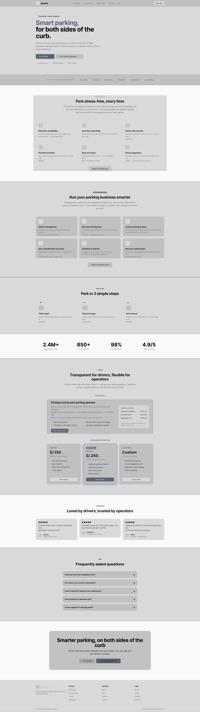

#### 3.1.3.2. Landing Page Mock-up

*Figura 44 (Mock-up de la landing page)*
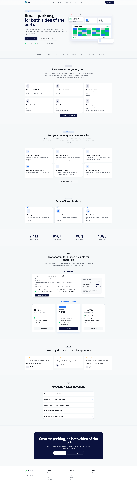

### 3.1.4. Applications UX/UI Design

Esta sección presenta la propuesta de experiencia e interfaz para las aplicaciones móviles de SpotGo dirigidas a Driver y Parking Admin. Los wireframes describen la organización y jerarquía de los elementos; los mock-ups muestran su apariencia visual; y los diagramas resumen las secuencias de interacción y las rutas principales de cada perfil. El repositorio incluye todas las pantallas principales de ambos perfiles, mientras que aquí se muestran únicamente ejemplos representativos.

#### 3.1.4.1. Applications Wireframes

Los wireframes de baja fidelidad permiten revisar la estructura de cada pantalla y la ubicación de sus controles antes de evaluar el tratamiento visual final. Para Driver, se incluyen ejemplos de acceso, exploración del mapa, consulta y reserva de una zona, gestión de reservas, pagos, vehículos y comprobantes. Para Parking Admin, se muestran ejemplos del dashboard, alertas, zonas, sesiones de invitados, mapa digital y facturación.

**Driver Wireframes**

*Figura 45 (Wireframe de inicio de sesión para Driver)*

*Figura 46 (Wireframe para explorar estacionamientos disponibles)*

*Figura 47 (Wireframe con el detalle de una zona y la acción de reserva)*

*Figura 48 (Wireframe para consultar las reservas del Driver)*

*Figura 49 (Wireframe de la sección de pagos)*

*Figura 50 (Wireframe para administrar vehículos registrados)*

*Figura 51 (Wireframe para consultar comprobantes y facturas)*

**Parking Admin Wireframes**

*Figura 52 (Wireframe del dashboard administrativo)*

*Figura 53 (Wireframe de alertas operativas)*
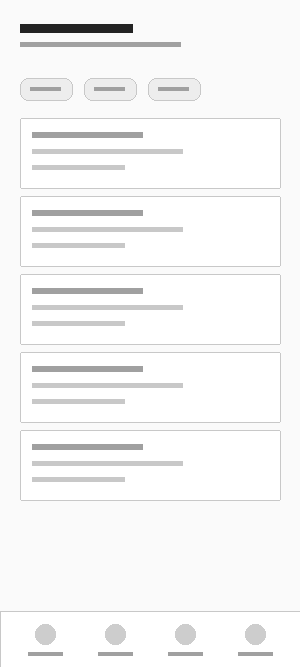

*Figura 54 (Wireframe para administrar zonas de estacionamiento)*
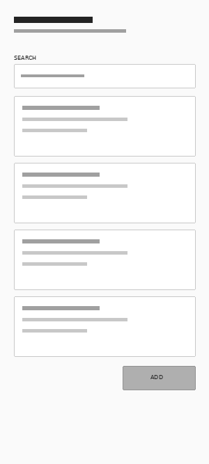

*Figura 55 (Wireframe de sesiones de estacionamiento para invitados)*
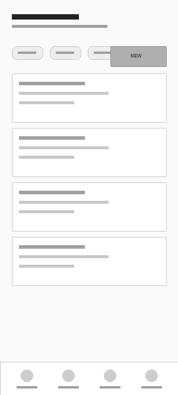

*Figura 56 (Wireframe del mapa digital del estacionamiento)*
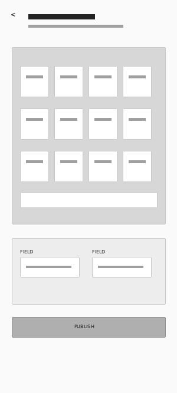

*Figura 57 (Wireframe de facturación para clientes empresariales)*
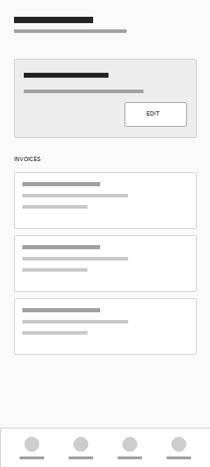

#### 3.1.4.2. Applications Wireflow Diagrams

Los wireflows combinan pantallas esquemáticas con conexiones para mostrar el orden de navegación y las decisiones disponibles dentro de una tarea. Los seis diagramas siguientes cubren los principales escenarios de acceso, gestión de vehículos, reservas y pagos para Driver, así como infraestructura, operaciones, invitados, reportes y facturación para Parking Admin.

**Driver Wireflows**

*Figura 58 (Wireflow de acceso y administración de vehículos para Driver)*

*Figura 59 (Wireflow de reservas y pagos para Driver)*

*Figura 60 (Wireflow de planes, suscripciones y documentos para Driver)*

**Parking Admin Wireflows**

*Figura 61 (Wireflow de infraestructura y zonas de estacionamiento para Parking Admin)*

*Figura 62 (Wireflow de operaciones y sesiones de invitados para Parking Admin)*

*Figura 63 (Wireflow de reportes y facturación para Parking Admin)*

#### 3.1.4.3. Applications Mock-ups

Los mock-ups aplican la identidad visual de SpotGo a las pantallas y permiten apreciar la jerarquía, los componentes y la presentación de la información en cada aplicación. Se presentan las mismas áreas funcionales seleccionadas en los wireframes para facilitar la comparación entre estructura y propuesta visual.

**Driver Mock-ups**

*Figura 64 (Mock-up de inicio de sesión para Driver)*

*Figura 65 (Mock-up para explorar estacionamientos disponibles)*

*Figura 66 (Mock-up con el detalle de una zona y la acción de reserva)*

*Figura 67 (Mock-up para consultar las reservas del Driver)*

*Figura 68 (Mock-up de la sección de pagos)*

*Figura 69 (Mock-up para administrar vehículos registrados)*

*Figura 70 (Mock-up para consultar comprobantes y facturas)*

**Parking Admin Mock-ups**

*Figura 71 (Mock-up del dashboard administrativo)*
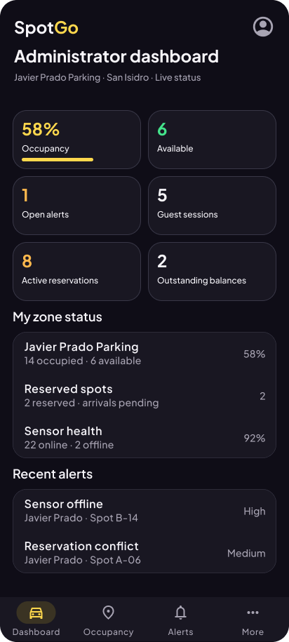

*Figura 72 (Mock-up de alertas operativas de la zona asignada)*
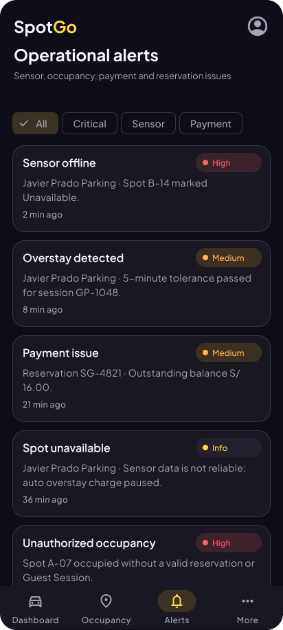

*Figura 73. Mock-up de la zona de estacionamiento asignada.*
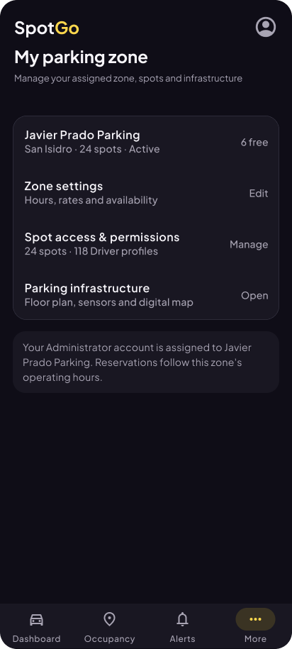

*Figura 74 (Mock-up de sesiones de estacionamiento para invitados de la zona asignada)*
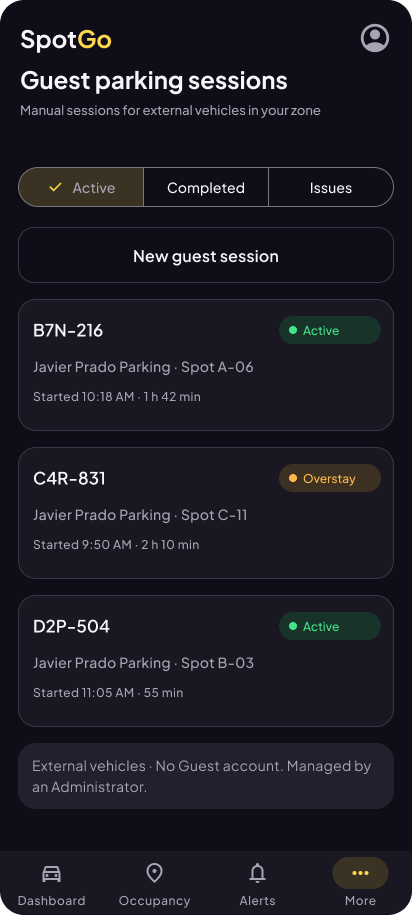

*Figura 75 (Mock-up del mapa digital del estacionamiento)*
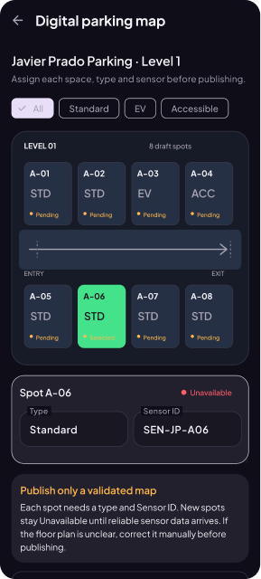

*Figura 76 (Mock-up de facturación para clientes empresariales)*
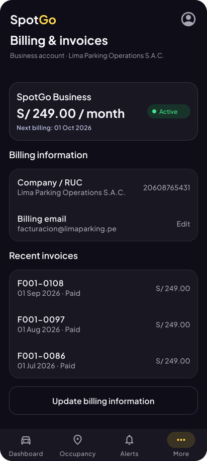

#### 3.1.4.4. Applications User Flow Diagrams

Los user flows ofrecen una vista de alto nivel de los objetivos, decisiones y recorridos posibles de cada perfil. El flujo de Driver abarca el uso de la aplicación móvil para encontrar y reservar estacionamiento y gestionar servicios asociados. El flujo de Parking Admin representa las tareas de supervisión y administración de la operación.

*Figura 77 (User flow de la aplicación para Driver)*

*Figura 78 (User flow de la aplicación para Parking Admin)*

#### 3.1.4.5. Applications Prototypes

Los prototipos interactivos de SpotGo permiten validar la navegación y los principales flujos definidos para los perfiles Driver y Parking Admin.

- **Driver Prototype:** [https://www.figma.com/proto/sQ2XbvLctkCFweIj0w0SjQ/SpotGo-Design?node-id=1-4&p=f&t=fXxztYJQpDayYoxc-0&scaling=min-zoom&content-scaling=fixed&starting-point-node-id=73%3A2736](https://www.figma.com/proto/sQ2XbvLctkCFweIj0w0SjQ/SpotGo-Design?node-id=1-4&p=f&t=fXxztYJQpDayYoxc-0&scaling=min-zoom&content-scaling=fixed&starting-point-node-id=73%3A2736)

- **Parking Admin Prototype:** [https://www.figma.com/proto/sQ2XbvLctkCFweIj0w0SjQ/SpotGo-Design?node-id=1-5&p=f&t=fXxztYJQpDayYoxc-0&scaling=min-zoom&content-scaling=fixed&starting-point-node-id=65%3A5626](https://www.figma.com/proto/sQ2XbvLctkCFweIj0w0SjQ/SpotGo-Design?node-id=1-5&p=f&t=fXxztYJQpDayYoxc-0&scaling=min-zoom&content-scaling=fixed&starting-point-node-id=65%3A5626)
