# Capítulo III: Solution UI/UX Design
## 3.1. Product design
### 3.1.1. Style Guidelines
Las Style Guidelines de SpotGo establecen los criterios visuales y de interacción que deberán utilizarse durante el desarrollo de la Landing Page y de la aplicación móvil.

El objetivo es contar con un lenguaje visual centralizado que permita que todos los componentes mantengan una apariencia consistente, independientemente de la pantalla o funcionalidad en la que sean utilizados.
#### 3.1.1.1. General Style Guidelines

**Branding**

La identidad visual de SpotGo busca transmitir una imagen de tecnología, orden, confianza y eficiencia. Debido a que el producto está relacionado con la gestión y búsqueda de estacionamientos, la interfaz debe permitir identificar rápidamente información como disponibilidad, ocupación, ubicación y estado de las Reservations.

El lenguaje visual evita una apariencia excesivamente decorativa y prioriza componentes funcionales, información resumida y jerarquía visual.

El nombre SpotGo representa la idea de encontrar y utilizar un espacio de estacionamiento de manera rápida, por lo que la identidad se asocia con conceptos como; disponibilidad, movimiento, ubicación, rapidez, organización, tecnología.

**Typography**

Se utilizara Plus Jakarta Sans como familia tipográfica principal. La tipografía se empleará de manera consistente en títulos, textos, botones, etiquetas, estados y metadatos.

Se propone la siguiente jerarquía:

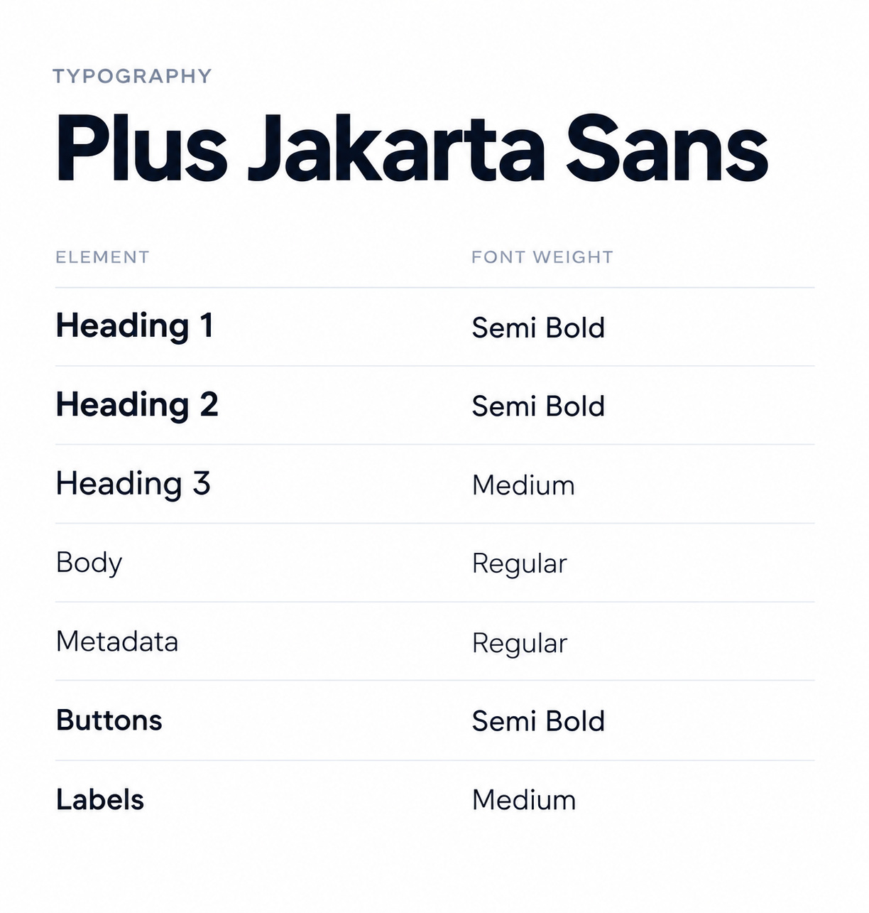

**Colors**

La paleta implementa un Dark Design System diseñado para reducir la fatiga visual del Parking Driver (Conductores) en entornos de baja luminosidad, priorizando el contraste para identificar rápidamente el estado del estacionamiento:

* **#0F0D17 (Base):** Fondo oscuro profundo que evita deslumbramientos y permite que los colores semánticos resalten.   
* **#FFD84D (Action):** Color ámbar utilizado para los botones de acción principales.   
* **#263044 (Blocks):** Azul grisáceo apagado que manda los espacios ocupados a un segundo plano visual, reduciendo distracciones.   
* **#44E38B (Available):** Verde de alto contraste para que el Parking Driver ubique los espacios libres de inmediato.
* **#FF5D68 (Error/Unavailable):** Rojo destinado a comunicar errores del sistema o espacios físicos inhabilitados.   
* **#F7F5FA (Text):** Blanco que garantiza la máxima legibilidad de los datos en la pantalla móvil sobre los fondos oscuros.   

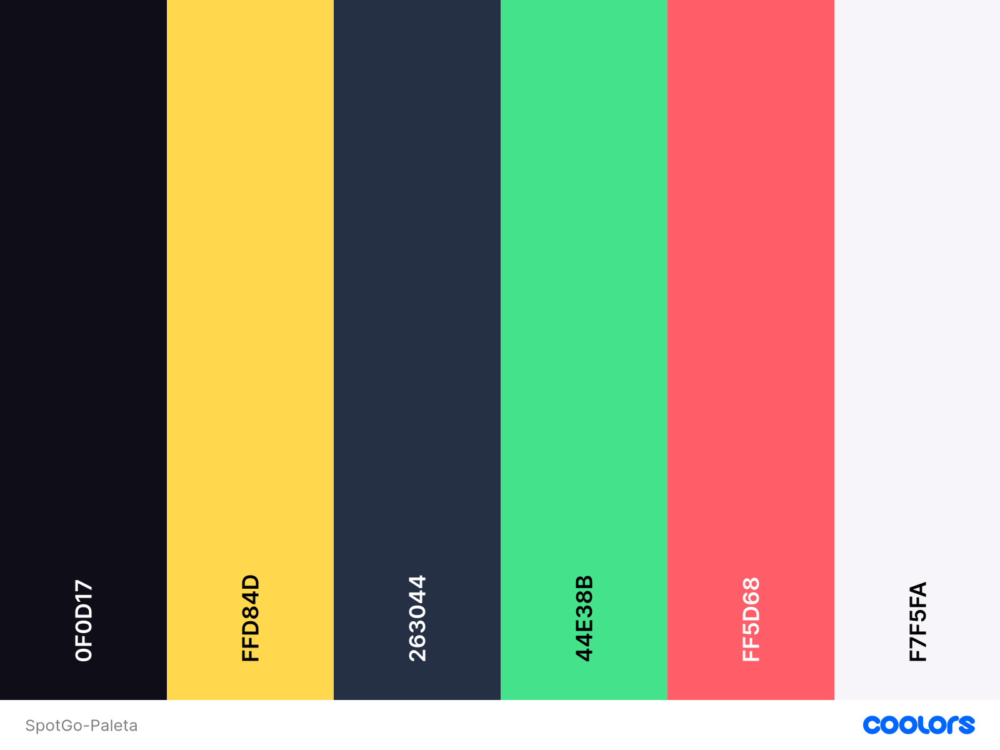

### 3.1.2. Information Architecture

Esta sección define la organización del contenido del Landing Page y la aplicación de SpotGo mediante sistemas de organización, etiquetado, búsqueda y navegación que reducen la carga cognitiva. La arquitectura prioriza las necesidades de dos perfiles principales: Parking Driver, enfocados en buscar, consultar disponibilidad y reservar espacios; y Parking Admin (Administradores), centrados en administrar y monitorear los estacionamientos.

### 3.1.2.1. Organization Systems

En esta sección se definen los sistemas de organización que se plantearán para SpotGo, considerando tanto el Landing Page como las aplicaciones destinadas a Parking Driver y Parking Admin. El objetivo será estructurar la información de manera clara y facilitar el acceso a las funcionalidades principales.

**Organización visual del contenido:**

- **De forma jerárquica (Visual Hierarchy):** Se utilizará principalmente en las interfaces de la aplicación, priorizando la información más relevante para cada usuario. En el caso del Parking Driver, se dará mayor importancia a la disponibilidad, ubicación y precio de los estacionamientos. Para los Parking Admin, se priorizarán indicadores como ocupación, disponibilidad, reservas y estado de las zonas.

- **Organización secuencial (Step-by-step):** Se aplicará en procesos que requieran completar diferentes etapas, principalmente en el flujo de reserva de un estacionamiento. El usuario podrá seleccionar una zona, revisar la disponibilidad, seleccionar un espacio, confirmar la reserva y realizar el pago.

- **Organización matricial:** Se utilizará principalmente en las vistas de monitoreo y análisis para Parking Admin. La información podrá visualizarse considerando diferentes variables como zonas, espacios, estados de ocupación y periodos de tiempo.

**Esquemas de categorización:**

- **Según audiencia (Audience-based):** Se aplicará principalmente en el Landing Page, diferenciando el contenido dirigido a **Parking Driver** y **Parking Admin**.

- **Por tópicos:** Se utilizará para agrupar funcionalidades como Reservations, Payments, Vehicles, Parking Zones, Monitoring, Reports y Settings.

- **Cronológico:** Se utilizará para organizar información relacionada con Reservations, Payments, Parking History y Reports, permitiendo consultar los registros de acuerdo con fechas o periodos.

- **Por estado:** Se utilizará para clasificar los Parking Spots según estados como **Available, Occupied, Reserved y Unavailable**, facilitando la identificación de la situación actual de cada espacio.

### 3.1.2.2. Labelling Systems

En esta sección se definen las etiquetas que se plantearán para representar la información y funcionalidades de SpotGo. Estas etiquetas buscarán ser cortas, directas y consistentes, permitiendo que los usuarios comprendan rápidamente el propósito de cada sección o acción.

Para el segmento de **Parking Driver**, se utilizarán etiquetas relacionadas con las principales acciones del usuario:

- **Explore:** búsqueda y exploración de estacionamientos.
- **Reservations:** consulta y gestión de reservas.
- **Payments:** gestión de pagos.
- **Profile:** información y configuración del usuario.
- **Vehicles:** administración de vehículos registrados.

Para el segmento de **Parking Admin**, se utilizarán etiquetas orientadas a la gestión del estacionamiento:

- **Dashboard:** vista general de la operación.
- **Monitoring:** monitoreo de los estacionamientos.
- **Parking Zones:** administración de zonas.
- **Parking Spots:** administración de espacios.
- **Reservations:** gestión de reservas.
- **Reports:** consulta de información y métricas.
- **Settings:** configuración del sistema.

Asimismo, se utilizarán etiquetas consistentes para representar los estados de los espacios:

- **Available**
- **Occupied**
- **Reserved**
- **Unavailable**

Las etiquetas de las acciones utilizarán términos directos como **Reserve**, **View Details**, **Get Directions**, **Confirm** y **Cancel**, evitando textos extensos que puedan dificultar la comprensión de las acciones.

### 3.1.2.3. SEO Tags and Meta Tags

En esta sección se definen los SEO Tags y Meta Tags que se plantearán para el Landing Page de SpotGo. Estos elementos estarán orientados a comunicar claramente la propuesta de valor del producto y facilitar su posicionamiento en motores de búsqueda.

**Landing Page**

- **Title:** `SpotGo | Smart Parking`
- **Description:** `Find and reserve available parking with SpotGo, while Parking Admin manage spaces, monitor occupancy and optimize parking operations.`
- **Keywords:** `smart parking, parking reservation, parking availability, parking management, Parking Admin, parking spaces`
- **Author:** `SpotGo Team`

**For Parking Driver**

- **Title:** `SpotGo for Parking Driver | Find and Reserve Parking`
- **Description:** `Find available parking spaces, check availability and reserve your spot with SpotGo.`
- **Keywords:** `find parking, parking reservation, available parking, smart parking`
- **Author:** `SpotGo Team`

**For Parking Admin**

- **Title:** `SpotGo for Parking Admin | Smart Parking Management`
- **Description:** `Manage parking spaces, monitor occupancy and optimize parking operations with SpotGo.`
- **Keywords:** `parking management, Parking Admin, occupancy monitoring, parking operations`
- **Author:** `SpotGo Team`

La estructura de la Landing Page se organizará alrededor de contenidos dirigidos a **Parking Driver** y **Parking Admin**, además de las secciones **How it works, Pricing y FAQ**.

### 3.1.2.4. Searching Systems

En esta sección se definen los mecanismos de búsqueda que se plantearán en SpotGo para facilitar que los usuarios encuentren rápidamente la información que necesitan.

Para el segmento de **Parking Driver**, el sistema de búsqueda estará principalmente orientado a encontrar estacionamientos disponibles. Se planteará una búsqueda mediante mapa que permita visualizar las **Parking Zones** cercanas y consultar información relacionada con su disponibilidad.

La búsqueda podrá complementarse con filtros que permitan reducir los resultados según las necesidades del usuario:

- **Distance:** para encontrar estacionamientos cercanos.
- **Price:** para establecer un rango de precio.
- **Availability:** para mostrar espacios disponibles.
- **Services:** para buscar estacionamientos según los servicios ofrecidos.
- **Operating Hours:** para considerar el horario de funcionamiento.

Los resultados de búsqueda se plantearán mediante tarjetas y elementos visuales dentro del mapa, mostrando información relevante como nombre del estacionamiento, distancia, precio, disponibilidad y ubicación.

Para los **Parking Admin**, el sistema de búsqueda estará orientado a localizar información dentro del entorno administrativo. Se plantearán filtros por **Dashboard, Live Map, Alerts, More**, permitiendo consultar rápidamente información operacional.

### 3.1.2.5. Navigation Systems

En esta sección se definen los sistemas de navegación que se plantearán para guiar a los usuarios a través del Landing Page y las aplicaciones de SpotGo, permitiéndoles acceder a las funcionalidades necesarias de acuerdo con sus objetivos.

**Navegación del Landing Page:**

- **Global Navigation:** Se planteará una barra de navegación superior con accesos a las principales secciones: **For Parking Driver, For Parking Admin, How it works, Pricing y FAQ**.
- **Section Navigation:** Los elementos de navegación permitirán desplazarse hacia las diferentes secciones del Landing Page sin necesidad de abandonar la página.
- **Call To Action:** Se utilizarán botones como **Open App** para dirigir al usuario hacia la experiencia principal del producto.
- **Mobile Navigation:** En dispositivos móviles se planteará un menú desplegable que permitirá acceder a las diferentes secciones manteniendo una interfaz limpia y aprovechando el espacio reducido de la pantalla.

**Navegación de la aplicación para Parking Driver:**

- **Bottom Navigation:** Se planteará una barra de navegación inferior con acceso a las principales funcionalidades: **Explore, Reservations, Payments y Profile**.
- **Contextual Navigation:** Dentro de cada sección se incluirán acciones relacionadas con el contexto del usuario, como **Reserve, View Details, Get Directions y Cancel**.
- **Reservation Flow:** El proceso de reserva utilizará navegación secuencial para guiar al Parking Driver desde la selección del estacionamiento hasta la confirmación de la reserva y el pago.

**Navegación de la aplicación para Parking Admin:**

- **Sidebar Navigation:** Se planteará un menú lateral para acceder a las principales funciones administrativas, como **Dashboard, Live Map, Alerts, More**.
- **Dashboard Navigation:** El Dashboard funcionará como punto de entrada para visualizar información general y acceder rápidamente a las principales funciones de administración.
- **Contextual Navigation:** Las acciones de administración estarán disponibles directamente desde las vistas correspondientes, permitiendo consultar una zona, revisar sus espacios o analizar información relacionada con la ocupación.

Finalmente, la navegación mantendrá una estructura consistente entre las diferentes interfaces, utilizando etiquetas claras, jerarquía visual y patrones de interacción similares para facilitar el aprendizaje del sistema.

### 3.1.3. Applications UX/UI Design

Esta sección presenta la propuesta de experiencia e interfaz para las aplicaciones móviles de SpotGo dirigidas a Parking Driver y Parking Admin. Los wireframes describen la organización y jerarquía de los elementos; los mock-ups muestran su apariencia visual; y los diagramas resumen las secuencias de interacción y las rutas principales de cada perfil. El repositorio incluye todas las pantallas principales de ambos perfiles, mientras que aquí se muestran únicamente ejemplos representativos.

#### 3.1.3.1. Applications Wireframes

Los wireframes de baja fidelidad permiten revisar la estructura de cada pantalla y la ubicación de sus controles antes de evaluar el tratamiento visual final. Para Parking Driver, se incluyen ejemplos de acceso, exploración del mapa, consulta y reserva de una zona, gestión de reservas, pagos, vehículos y comprobantes. Para Parking Admin, se muestran ejemplos del dashboard, alertas, zonas, sesiones de invitados, mapa digital y facturación.

**Parking Driver (Conductores)**

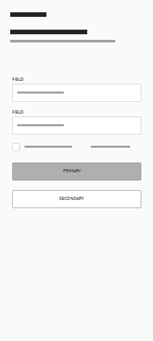

*Figura 40 (Wireframe de inicio de sesión para Parking Driver)*

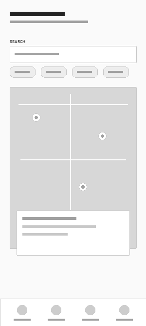

*Figura 41 (Wireframe para explorar estacionamientos disponibles)*

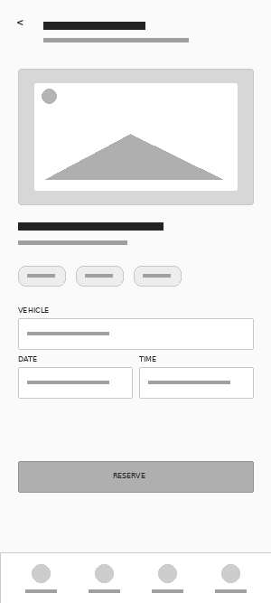

*Figura 42 (Wireframe con el detalle de una zona y la acción de reserva)*

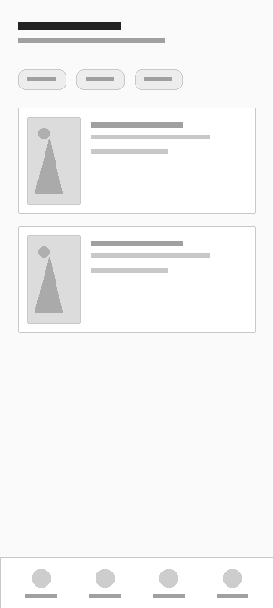

*Figura 43 (Wireframe para consultar las reservas del Parking Driver)*

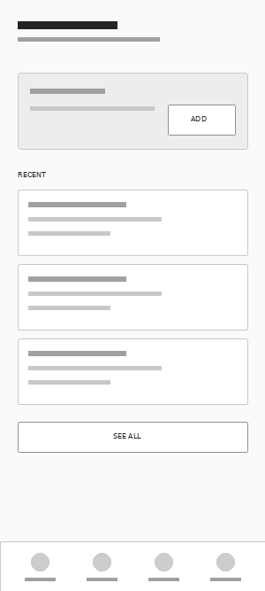

*Figura 44 (Wireframe de la sección de pagos)*

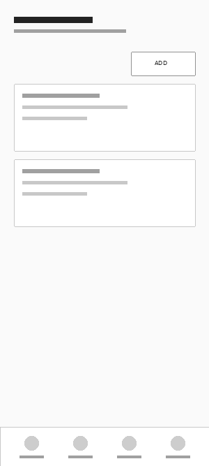

*Figura 45 (Wireframe para administrar vehículos registrados)*

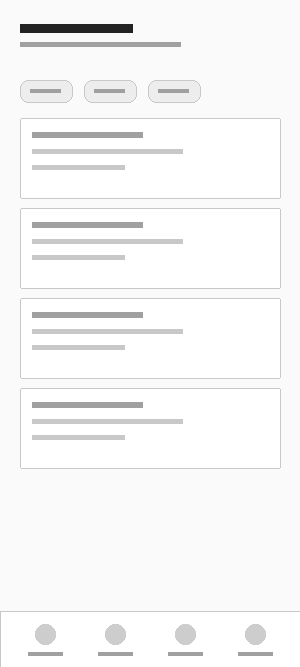

*Figura 46 (Wireframe para consultar comprobantes y facturas)*

**Parking Admin (Administradores)**

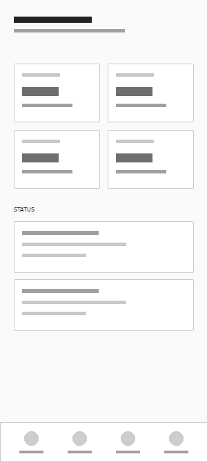

*Figura 47 (Wireframe del dashboard administrativo)*

*Figura 48 (Wireframe de alertas operativas)*

*Figura 49 (Wireframe para administrar zonas de estacionamiento)*

*Figura 50 (Wireframe de sesiones de estacionamiento para invitados)*

*Figura 51 (Wireframe del mapa digital del estacionamiento)*

*Figura 52 (Wireframe de facturación para clientes empresariales)*

#### 3.1.3.2. Applications Wireflow Diagrams

Los wireflows combinan pantallas esquemáticas con conexiones para mostrar el orden de navegación y las decisiones disponibles dentro de una tarea. Los seis diagramas siguientes cubren los principales escenarios de acceso, gestión de vehículos, reservas y pagos para Parking Driver, así como infraestructura, operaciones, invitados, reportes y facturación para Parking Admin.

**Parking Driver (Conductores)**

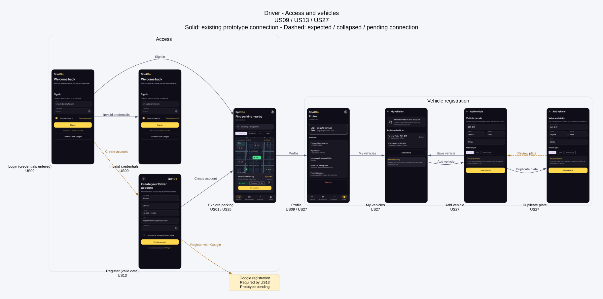

*Figura 53 (Wireflow de acceso y administración de vehículos para Parking Driver)*

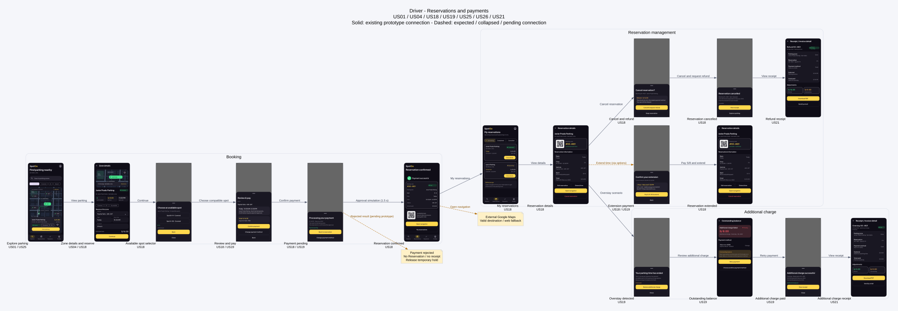

*Figura 54 (Wireflow de reservas y pagos para Parking Driver)*

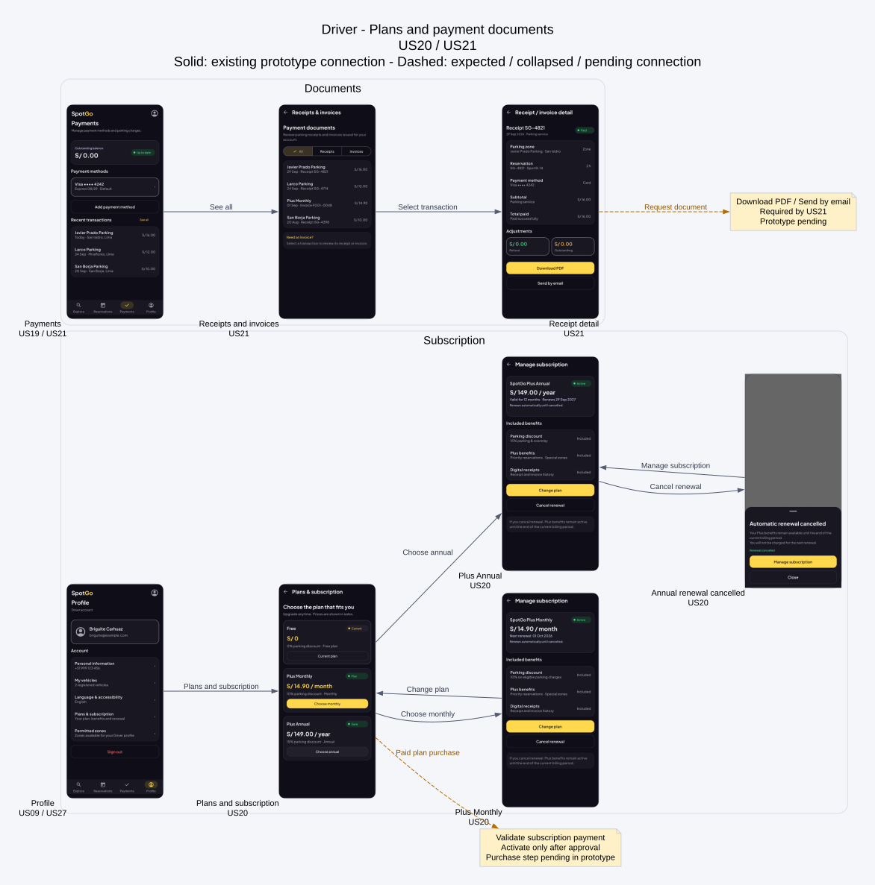

*Figura 55 (Wireflow de planes, suscripciones y documentos para Parking Driver)*

**Parking Admin (Administradores)**

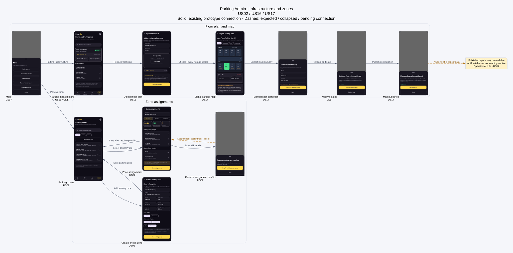

*Figura 56 (Wireflow de infraestructura y zonas de estacionamiento para Parking Admin)*

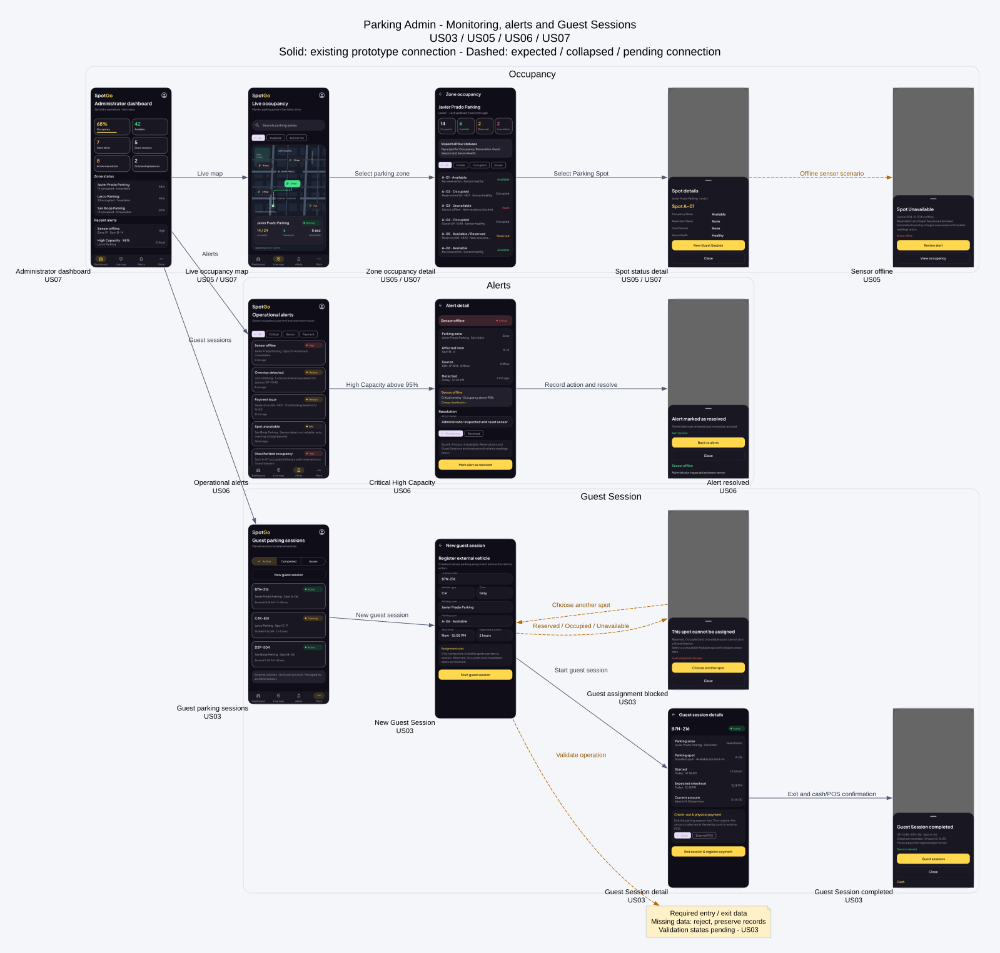

*Figura 57 (Wireflow de operaciones y sesiones de invitados para Parking Admin)*

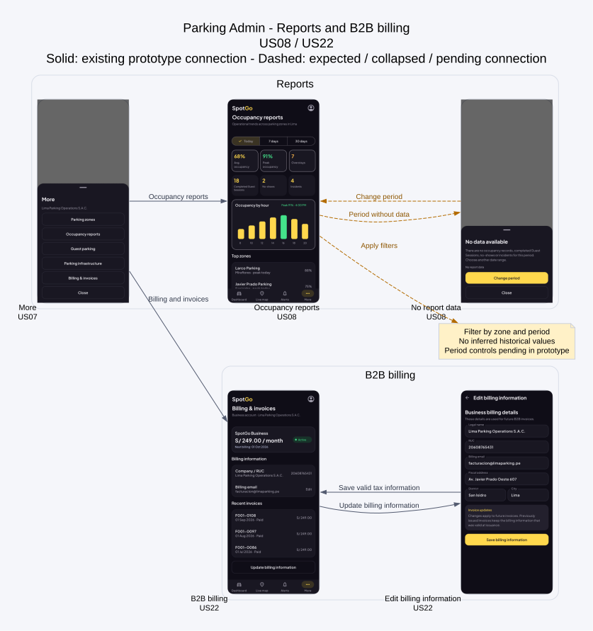

*Figura 58 (Wireflow de reportes y facturación para Parking Admin)*

#### 3.1.3.3. Applications Mock-ups

Los mock-ups aplican la identidad visual de SpotGo a las pantallas y permiten apreciar la jerarquía, los componentes y la presentación de la información en cada aplicación. Se presentan las mismas áreas funcionales seleccionadas en los wireframes para facilitar la comparación entre estructura y propuesta visual.

**Parking Driver (Conductores)**

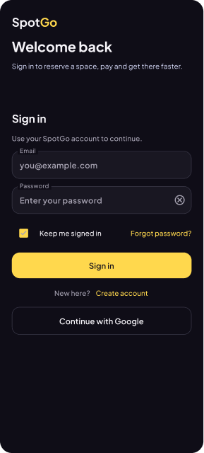

*Figura 59 (Mock-up de inicio de sesión para Parking Driver)*

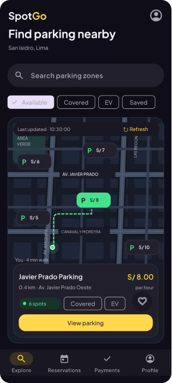

*Figura 60 (Mock-up para explorar estacionamientos disponibles)*

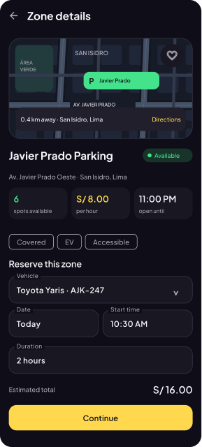

*Figura 61 (Mock-up con el detalle de una zona y la acción de reserva)*

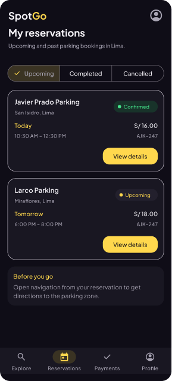

*Figura 62 (Mock-up para consultar las reservas del Parking Driver)*

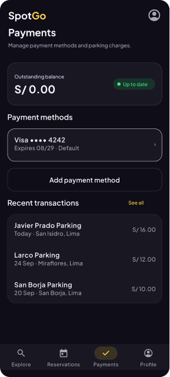

*Figura 63 (Mock-up de la sección de pagos)*

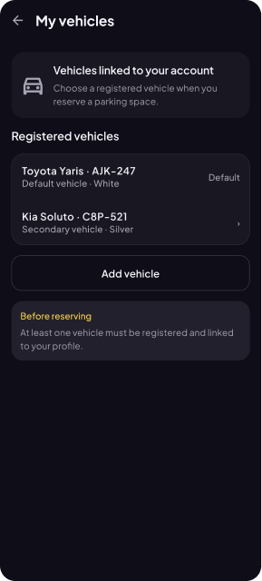

*Figura 64 (Mock-up para administrar vehículos registrados)*

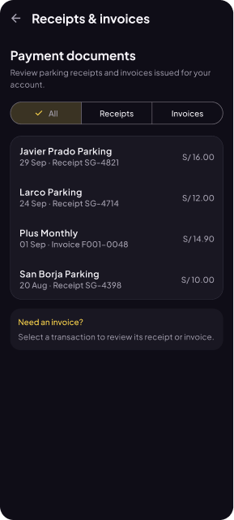

*Figura 65 (Mock-up para consultar comprobantes y facturas)*

**Parking Admin (Administradores)**

*Figura 66 (Mock-up del dashboard administrativo)*

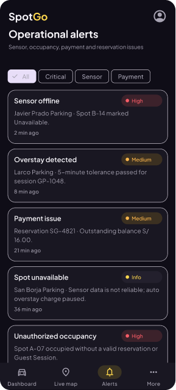

*Figura 67 (Mock-up de alertas operativas)*

*Figura 68 (Mock-up para administrar zonas de estacionamiento)*

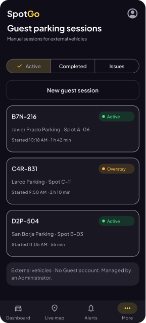

*Figura 69 (Mock-up de sesiones de estacionamiento para invitados)*

*Figura 70 (Mock-up del mapa digital del estacionamiento)*

*Figura 71 (Mock-up de facturación para clientes empresariales)*

#### 3.1.3.4. Applications User Flow Diagrams

Los user flows ofrecen una vista de alto nivel de los objetivos, decisiones y recorridos posibles de cada perfil. El flujo de Parking Driver abarca el uso de la aplicación móvil para encontrar y reservar estacionamiento y gestionar servicios asociados. El flujo de Parking Admin representa las tareas de supervisión y administración de la operación.

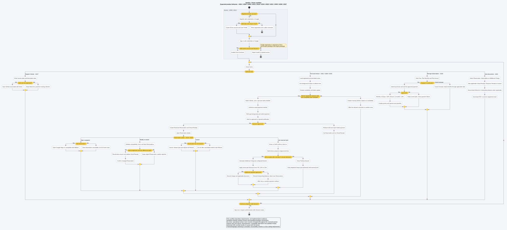

*Figura 72 (User flow de la aplicación para Parking Driver)*

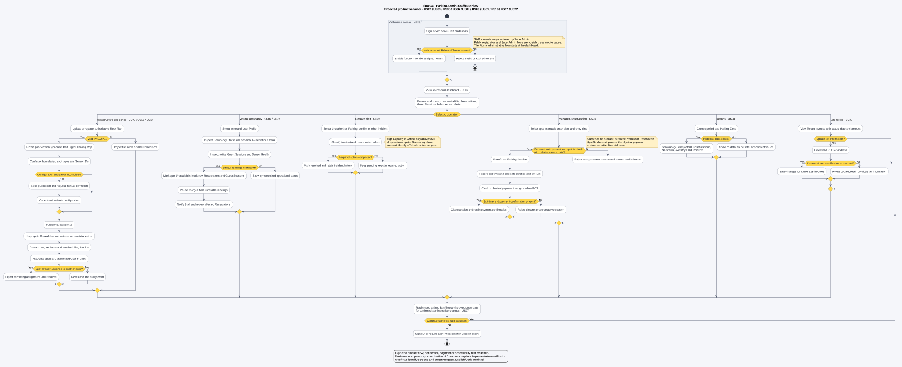

*Figura 73 (User flow de la aplicación para Parking Admin)*

#### 3.1.3.5. Applications Prototypes

Los prototipos interactivos de SpotGo permiten validar la navegación y los principales flujos definidos para los perfiles Parking Driver y Parking Admin.

- **Parking Driver Prototype:** [View interactive prototype](https://www.figma.com/proto/sQ2XbvLctkCFweIj0w0SjQ/SpotGo-Design?node-id=1-4&p=f&t=fXxztYJQpDayYoxc-0&scaling=min-zoom&content-scaling=fixed&starting-point-node-id=73%3A2736)

- **Parking Admin Prototype:** [View interactive prototype](https://www.figma.com/proto/sQ2XbvLctkCFweIj0w0SjQ/SpotGo-Design?node-id=1-5&p=f&t=fXxztYJQpDayYoxc-0&scaling=min-zoom&content-scaling=fixed&starting-point-node-id=65%3A5626)
