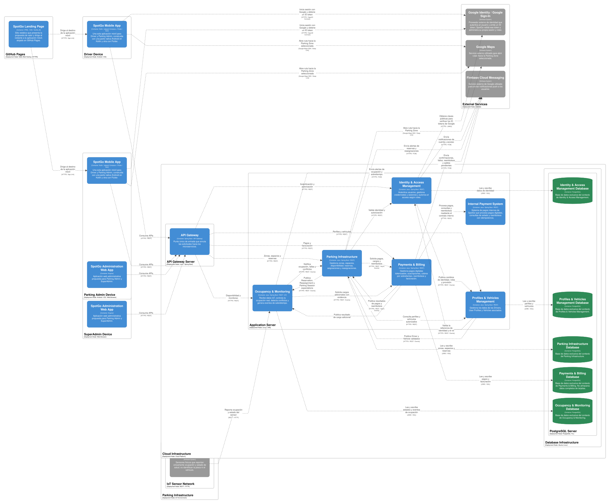

# Capítulo IV: Product Implementation & Validation

## 4. Product Implementation & Validation

### 4.1. Software Configuration Management

Para garantizar un desarrollo fluido, estandarizado y compatible entre todos los miembros del equipo Yachiqo, se ha definido el siguiente entorno de desarrollo para el ecosistema SpotGo:

#### 4.1.1. Software Development Environment Configuration

Se listan a continuación las herramientas utilizadas a lo largo de todo el ciclo de vida del proyecto, cubriendo desde la gestión de requisitos hasta el despliegue de componentes:

- **Project & Requirements Management:**
  - **Trello:** Herramienta SaaS para la gestión ágil del Product Backlog, Sprints y seguimiento de User Stories. [Referencia: trello.com](https://trello.com/)
  - **UXPressia:** Herramienta SaaS para la elaboración de mapas de empatía, Journey Maps y User Personas. [Referencia: uxpressia.com](https://uxpressia.com/)
- **Product UX/UI Design:**
  - **Figma:** Herramienta para la creación colaborativa de Wireframes, Mock-ups y Prototipos interactivos. [Referencia: figma.com](https://www.figma.com/)
- **Herramientas de Desarrollo (IDEs y Editores):**
  - **Android Studio:** IDE para desarrollar, compilar y ejecutar la parte Kotlin con Jetpack Compose y ensamblar la aplicación Android. [Descarga: Android Studio](https://developer.android.com/studio)
  - **Visual Studio Code:** Editor para la Landing Page y la parte Flutter de la misma aplicación móvil. [Descarga: Visual Studio Code](https://code.visualstudio.com/download)
  - **IntelliJ IDEA:** IDE optimizado para el desarrollo del Backend con Java y Spring Boot. [Descarga: jetbrains.com/idea](https://www.jetbrains.com/idea/)
- **Stack Tecnológico y Entorno de Ejecución:**
  - **Kotlin & Jetpack Compose:** Lenguaje y framework para la parte nativa de la aplicación móvil. [Referencia: Kotlin](https://kotlinlang.org/docs/home.html) y [Jetpack Compose](https://developer.android.com/develop/ui/compose/documentation)
  - **Flutter & Dart:** SDK y lenguaje para la parte Flutter de la misma aplicación. [Instalación: Flutter](https://docs.flutter.dev/install) y [Referencia: Dart](https://dart.dev/guides)
  - **Android SDK y Gradle Wrapper:** Herramientas de compilación e instalación. El proyecto Android configura SDK 37, Android 10/API 29 como mínimo y JDK 25 para el daemon de Gradle, según `app/build.gradle.kts` y `gradle/gradle-daemon-jvm.properties`; este JDK es independiente del utilizado por el backend. [Referencia: SDK Manager](https://developer.android.com/studio/intro/update#sdk-manager) y [Gradle Wrapper](https://docs.gradle.org/current/userguide/gradle_wrapper.html)
  - **HTML5 / CSS3 / JavaScript (Vanilla JS):** Stack base sin frameworks para la Landing Page pública. [Referencia: MDN Web Docs](https://developer.mozilla.org/en-US/docs/Web)
  - **Java Development Kit (JDK 26):** Entorno de compilación y ejecución del Backend en Spring Boot, alineado con `java.version` en `pom.xml`. [Referencia y descarga: OpenJDK 26](https://jdk.java.net/26/)
  - **Maven Wrapper:** Ejecuta las tareas de compilación y empaquetado del backend mediante `mvnw` o `mvnw.cmd`, sin exigir una instalación global de Maven. [Referencia: Maven Wrapper](https://maven.apache.org/wrapper/)
  - **PostgreSQL (en Neon):** Motor de base de datos relacional Serverless alojado en la nube en la plataforma Neon. [Referencia: neon.tech](https://neon.tech/)
- **Herramientas de Pruebas, Documentación y Despliegue:**
  - **Postman:** Plataforma para el testeo, verificación y ejecución de pruebas de integración sobre los endpoints de la API RESTful. [Descarga: postman.com](https://www.postman.com/downloads/)
  - **Swagger / OpenAPI:** Documentación interactiva de la API generada desde Spring Boot mediante Springdoc. [Referencia: Springdoc](https://springdoc.org/)
  - **Railway:** Plataforma para el alojamiento y despliegue del Backend. [Referencia: Railway](https://docs.railway.com/)
  - **GitHub Pages:** Hosting de la Landing Page estática. [Referencia: GitHub Pages](https://docs.github.com/en/pages)
  - **Git & GitHub:** Control de versiones, colaboración y repositorios de código fuente. [Descarga: Git](https://git-scm.com/downloads) y [Referencia: GitHub](https://docs.github.com/)

#### 4.1.2. Source Code Management

El código fuente del proyecto SpotGo se gestiona mediante **Git** como sistema de control de versiones distribuido y **GitHub** como plataforma de alojamientos y colaboración. La organización oficial del equipo es **Yachiqo** (`yachiqo-upc`), y los repositorios correspondientes al proyecto son:

- **Landing Page:** [https://github.com/yachiqo-upc/spotgo-landing.git](https://github.com/yachiqo-upc/spotgo-landing.git)
- **Mobile Application:** [https://github.com/yachiqo-upc/spotgo-mobile-app.git](https://github.com/yachiqo-upc/spotgo-mobile-app.git)
- **RESTful Web Services (Backend):** [https://github.com/yachiqo-upc/spotgo-backend.git](https://github.com/yachiqo-upc/spotgo-backend.git)

**Estrategia de Ramas (GitFlow)**
Se establece un flujo de trabajo estructurado basado en GitFlow para asegurar la estabilidad del software:
- `main`: Rama de producción. Almacena versiones estables, probadas y desplegadas.
- `develop`: Rama de integración continua donde se consolidan las funcionalidades antes de ser promovidas a producción.
- `feature/US[ID]-[nombre]`: Ramas cortas creadas desde `develop` para el trabajo de User Stories específicas (ej. `feature/US01-consult-availability`).
- `release/v[X.Y.Z]`: Ramas de preparación previas a un lanzamiento para realizar pruebas finales.
- `hotfix/[nombre]`: Ramas para corregir errores urgentes detectados en la rama `main`.

**Convenciones de Versionado y Commits**
- **Semantic Versioning (SemVer 2.0.0):** Etiquetado de versiones en `main` bajo el formato `vMAJOR.MINOR.PATCH` (ej. v1.0.0).
- **Conventional Commits 1.0.0:** Todos los commits deben emplear un formato claro (`tipo(alcance): descripción breve`), utilizando tipos como `feat`, `fix`, `docs`, `style`, `refactor` o `test` (ej. `feat(parking): add spot status endpoint`, `docs: add Parking Admin to chapter 2`).

#### 4.1.3. Source Code Style Guide & Conventions

Se establece el uso estricto del idioma **inglés (en_US)** para la denominación de archivos, clases, métodos, variables, tablas y comentarios dentro del código fuente. Se adoptan las siguientes guías de estilo:

- **Landing Page (HTML5 / CSS / Vanilla JS):** Se siguen la [W3Schools HTML Style Guide](https://www.w3schools.com/html/html5_syntax.asp) y la [Google HTML/CSS Style Guide](https://google.github.io/styleguide/htmlcssguide.html). Para JavaScript se adopta la [Google JavaScript Style Guide](https://google.github.io/styleguide/jsguide.html): `lowerCamelCase` para variables y funciones, `UpperCamelCase` para clases, `const` para referencias que no se reasignan y `let` cuando la reasignación es necesaria. Los archivos utilizan nombres descriptivos en minúsculas, los bloques mantienen una indentación consistente y se emplean módulos y funciones con responsabilidades definidas.
- **Mobile Application (Dart / Flutter & Kotlin / Jetpack Compose):**
  - Para Flutter/Dart, se sigue la [Effective Dart Guide](https://dart.dev/guides/language/effective-dart) (`lowerCamelCase` para variables y funciones, `PascalCase` para clases y widgets, `lowercase_with_underscores` para nombres de archivos).
  - Para Jetpack Compose, se aplica la [Kotlin Coding Conventions](https://kotlinlang.org/docs/coding-conventions.html) y las recomendaciones oficiales de arquitectura de Android.
- **Backend (Java / Spring Boot):** Cumplimiento de la [Google Java Style Guide](https://google.github.io/styleguide/javaguide.html). La arquitectura respeta la separación en capas (Controllers, Services, Repositories, Entities/DTOs) y las rutas RESTful utilizan sustantivos en plural y minúsculas separados por guiones (ej. `GET /api/v1/parking-zones`).
- **Criterios de Aceptación:** Uso de las [Gherkin Conventions](https://specflow.org/gherkin/gherkin-conventions-for-readable-specifications/) en inglés mediante la estructura `Given - When - Then`.

#### 4.1.4. Software Deployment Configuration

La Landing Page se publica en **GitHub Pages**, el Backend utiliza **Railway** y su conexión PostgreSQL se configura mediante **Neon**. La aplicación móvil combina Kotlin y Flutter y se entrega como un único artefacto Android para instalación o distribución. Los siguientes pasos describen la configuración necesaria a partir de los repositorios de la sección 4.1.2.

**Landing Page — GitHub Pages**

1. Clonar `spotgo-landing` y comprobar que `index.html`, `styles.css`, `main.js`, `assets/` e `i18n/` estén disponibles en la raíz del proyecto. Al ser un sitio estático con Vanilla JS, no requiere compilar un framework ni instalar dependencias con npm.
2. Revisar localmente desde un servidor HTTP, por ejemplo `python -m http.server 5500`, y abrir `http://localhost:5500`. El servidor permite cargar las traducciones mediante `fetch`; abrir directamente el archivo HTML no reproduce ese comportamiento.
3. Integrar la versión validada en `main`. En **Settings → Pages**, seleccionar **Deploy from a branch**, la rama **main** y la carpeta **/(root)**, y guardar la configuración. Este procedimiento sigue la [configuración de publicación de GitHub Pages](https://docs.github.com/en/pages/getting-started-with-github-pages/configuring-a-publishing-source-for-your-github-pages-site).
4. Comprobar la ejecución de la publicación y abrir [SpotGo Landing Page](https://yachiqo-upc.github.io/spotgo-landing/). Verificar navegación, diseño adaptable, carga de imágenes y traducciones; los recursos deben conservar rutas relativas compatibles con `/spotgo-landing/`.

**Backend — Railway y PostgreSQL**

1. Clonar `spotgo-backend`, instalar JDK 26 y comprobar `java -version`. Desde la raíz, empaquetar con `./mvnw.cmd -B -DskipTests package` en Windows o `./mvnw -B -DskipTests package` en Linux/macOS. El empaquetado genera `target/spotgo-1.0.0.jar` según el `pom.xml` actual; `-DskipTests` solo omite pruebas durante este paso y no constituye evidencia de validación.
2. Crear o seleccionar la base PostgreSQL de Neon que utilizará el servicio y obtener su host, nombre de base, usuario y contraseña. Preparar una URL JDBC con el formato `jdbc:postgresql://<host>/<database>?sslmode=require`; los valores reales se configuran como variables del servicio.
3. En Railway, crear un servicio desde el repositorio GitHub `yachiqo-upc/spotgo-backend`, seleccionar `main` y utilizar la raíz del repositorio. Para Railpack, definir `RAILPACK_JDK_VERSION=26`, ya que la versión se fija mediante esta variable según la [configuración de Java de Railpack](https://railpack.com/languages/java).
4. Configurar las variables siguientes, correspondientes a las propiedades del proyecto:

| Variable | Configuración o propósito |
| --- | --- |
| `RAILPACK_JDK_VERSION` | `26`, para compilar y ejecutar el backend con el JDK declarado. |
| `SPRING_PROFILES_ACTIVE` | `production`, para activar `application-production.properties`. |
| `SPRING_DATASOURCE_URL` | URL JDBC de la base PostgreSQL de Neon con SSL. |
| `SPRING_DATASOURCE_USERNAME` | Usuario autorizado de la base. |
| `SPRING_DATASOURCE_PASSWORD` | Contraseña del usuario, configurada como secreto. |
| `JWT_SECRET` | Secreto de firma de los tokens de SpotGo, configurado como secreto. |
| `PORT` | Puerto HTTP del servicio; `server.port` consume este valor. El puerto de destino del dominio debe coincidir. |
| `APP_PASSWORD_RESET_FROM_EMAIL` | Remitente autorizado para correos de recuperación. |
| `RESEND_API_KEY` | Credencial de envío cuando se habilita la recuperación por correo. |
| `RESEND_API_URL` | URL del servicio de correo; utiliza el valor predeterminado del proyecto si no se redefine. |
| `APP_SEEDER_RESET_BEFORE_SEED` | `false`, para conservar los registros existentes al iniciar. |
| `SPRING_JPA_HIBERNATE_DDL_AUTO` | `validate` sobre un esquema previamente inicializado; `create` se limita a una base vacía de demostración durante su inicialización. |

5. Preparar el esquema antes del primer arranque. El proyecto configura `ddl-auto=create` y contiene un seeder que también participa en `production`: para una base vacía de demostración se puede inicializar el esquema con `create` de forma controlada, y los arranques posteriores deben utilizar `validate` con el reinicio de datos desactivado. Una base con datos existentes requiere un esquema compatible antes de activar `validate`.
6. Configurar el comando de construcción `chmod +x mvnw && ./mvnw -B -DskipTests package` y el comando de inicio `java -jar target/spotgo-1.0.0.jar`. Si se cambia la versión del proyecto, actualizar también el nombre del JAR. Railway administra las [variables del servicio](https://docs.railway.com/variables) de forma independiente del repositorio.
7. Ejecutar el despliegue y revisar los logs de compilación, inicio y conexión PostgreSQL. Generar o utilizar el dominio público HTTPS y comprobar `/v3/api-docs`, `/swagger-ui/index.html` y una operación pública documentada. La [referencia del backend](https://spotgo-backend-yachiqo.up.railway.app/swagger-ui/index.html) permite consultar el contrato publicado; el funcionamiento de cada capacidad se evidencia en la sección de implementación correspondiente.

El procedimiento anterior utiliza la conexión configurada por el servicio Spring Boot actual. La arquitectura objetivo del capítulo II separa la persistencia en cinco bases lógicas dentro de una sola instancia PostgreSQL; al desplegar servicios independientes, cada contexto debe recibir únicamente las credenciales de su propia base. La URL de un servicio no demuestra por sí sola que toda esa distribución esté implementada.

**Mobile Application — Kotlin y Flutter**

1. Clonar `spotgo-mobile-app` y abrir la raíz del proyecto en Android Studio. Instalar Android SDK 37 y utilizar JDK 25 para Gradle, conforme a `gradle/gradle-daemon-jvm.properties`. Seleccionar un emulador o dispositivo Android 10/API 29 o superior y sincronizar el proyecto.
2. La parte Flutter se incorpora a la misma aplicación mediante un módulo [add-to-app](https://docs.flutter.dev/add-to-app). Cuando ese módulo esté integrado, ejecutar `flutter pub get` desde su directorio y verificar la dependencia en Gradle. Si se integra mediante AAR, ejecutar `flutter build aar` en el módulo y utilizar el repositorio generado siguiendo la [integración de Flutter en Android](https://docs.flutter.dev/add-to-app/android/project-setup). Las dos partes se empaquetan dentro del APK/AAB de la aplicación; el AAR no constituye una segunda aplicación.
3. Desde la raíz Android, generar la versión de prueba con `./gradlew.bat :app:assembleDebug`. El APK se obtiene en `app/build/outputs/apk/debug/app-debug.apk`. Para instalarlo en el dispositivo o emulador conectado, ejecutar `./gradlew.bat :app:installDebug`. En Linux/macOS se utiliza `./gradlew`.
4. Para una entrega release, configurar el almacén de claves, su alias y la firma mediante **Build → Generate Signed Bundle / APK** en Android Studio. Los secretos de firma se mantienen fuera del repositorio. Con la firma configurada, ejecutar `./gradlew.bat :app:assembleRelease` para el APK o `./gradlew.bat :app:bundleRelease` para el AAB; las salidas se conservan en `app/build/outputs/apk/release/` y `app/build/outputs/bundle/release/`, respectivamente.
5. Instalar el APK y comprobar el inicio y la navegación del producto. El AAB se utiliza para distribución mediante un servicio que genere los APK correspondientes y no se instala directamente en el dispositivo. Estas tareas siguen la documentación de [compilación de Android](https://developer.android.com/build/building-cmdline) y [firma de aplicaciones](https://developer.android.com/studio/publish/app-signing).

El repositorio Android inspeccionado contiene el host Kotlin/Compose. El paso de integración Flutter describe la configuración de la solución completa y debe ejecutarse cuando su módulo y dependencias estén disponibles en ese repositorio.

**Diagrama C4 de despliegue**

La vista de despliegue presenta la distribución propuesta de clientes, servicios, instancia PostgreSQL y sensores. Su explicación corresponde a la sección 2.5.3.3. Software Architecture Deployment Diagrams.

*Figura 79 (Diagrama C4 de despliegue)*

La planificación y las evidencias de implementación se organizan en [4.2. Landing Page & Mobile Application Implementation — Sprint 1](41-sprint-1.md).

### 4.2. Landing Page & Mobile Application Implementation

Esta sección presenta, para cada sprint, la planificación y las evidencias de desarrollo, pruebas, ejecución, documentación de servicios, despliegue y colaboración del equipo correspondientes a los productos digitales de SpotGo: la Landing Page, los servicios backend y la aplicación móvil. Cada sprint reúne los artefactos y resultados que permiten documentar el avance de la solución según su alcance.
