### 4.2. Landing Page & Mobile Application Implementation

Esta sección organiza la implementación de la Landing Page y la aplicación móvil por sprint. La letra *n* se reemplazará por el número del sprint correspondiente al registrar su planificación y sus evidencias.

#### 4.2.1. Sprint 1

Durante el primer sprint nos centramos en el desarrollo y despliegue de la Landing Page, distribuyendo sus secciones entre los integrantes del equipo. En ella presentamos SpotGo, sus funcionalidades, planes, medios de contacto y la organización. Además, alcanzamos un avance del 70 % en el despliegue del backend y mostramos las pantallas principales de la aplicación móvil.

##### 4.2.1.1. Sprint Planning 1

<table>
  <tr><td><strong>Sprint #</strong></td><td>Sprint 1</td></tr>
  <tr><th colspan="2" align="left">Sprint Planning Background</th></tr>
  <tr><td><strong>Date</strong></td><td>2026-10-05</td></tr>
  <tr><td><strong>Time</strong></td><td>5:00 PM</td></tr>
  <tr><td><strong>Location</strong></td><td>Reuni&#243;n virtual</td></tr>
  <tr><td><strong>Prepared By</strong></td><td>Nestor Rojas Tello</td></tr>
  <tr><td><strong>Attendees (to planning meeting)</strong></td><td>Ruiz Mideyros, Adrian / Rojas Tello, Nestor Alonso / Contreras Rojas, Cesar Jair / Carhuaz Centeno, Briguite Eryka / Cotrina Siclla, Sofia Alessandra.</td></tr>
  <tr><td><strong>Sprint 0 Review Summary</strong></td><td>No aplica, por ser el primer sprint.</td></tr>
  <tr><td><strong>Sprint 0 Retrospective Summary</strong></td><td>No aplica, por ser el primer sprint.</td></tr>
  <tr><th colspan="2" align="left">Sprint Goal &amp; User Stories</th></tr>
  <tr><td><strong>Sprint 1 Goal</strong></td><td>Desplegar la Landing Page (US11 y US12), alcanzar un avance del 70 % en el despliegue del backend y presentar las pantallas core de la aplicaci&#243;n m&#243;vil: autenticaci&#243;n y acceso por rol (US09), registro de cuenta (US13), consulta de disponibilidad y zonas permitidas (US01 y US04), gesti&#243;n de reservas y comprobantes virtuales (US18), pagos (US19), carga de plano, generaci&#243;n del mapa digital y configuraci&#243;n de zonas (US16, US17 y US02). Estas HU orientan tanto las pantallas core como los servicios backend que las respaldan. El cumplimiento se verificar&#225; mediante la Landing Page publicada, el porcentaje de funcionalidades backend desplegadas respecto al total previsto y la demostraci&#243;n de las pantallas core.</td></tr>
  <tr><td><strong>Sprint 1 Velocity</strong></td><td>39 Story Points como capacidad planificada para el Sprint 1, correspondientes a las 11 historias de usuario seleccionadas.</td></tr>
  <tr><td><strong>Sum of Story Points</strong></td><td>39 Story Points: 35 de las nueve HU seleccionadas y 4 de las HU de la Landing Page (US11 y US12), seg&#250;n las estimaciones del Product Backlog.</td></tr>
</table>

##### 4.2.1.2. Aspect Leaders and Collaborators

La Leadership-and-Collaboration Matrix (LACX) identifica al líder y los colaboradores de cada aspecto del Sprint 1 para facilitar la coordinación y comunicación del equipo. Se consideran la Landing Page, la autenticación y el registro, la disponibilidad, las reservas y pagos, y la configuración del estacionamiento.

**L (Leader)** identifica a quien coordina el aspecto y revisa sus entregables; **C (Collaborator)** identifica a quienes contribuyen a su desarrollo y validación. La siguiente distribución es una propuesta de trabajo para el equipo.

<table>
  <tr>
    <th align="left">Team Member (Last Name, First Name)</th>
    <th align="left">GitHub Username</th>
    <th align="center">Landing Page</th>
    <th align="center">Autenticación y registro</th>
    <th align="center">Disponibilidad y permisos</th>
    <th align="center">Reservas y pagos</th>
    <th align="center">Zonas, planos, mapa y dashboard</th>
  </tr>
  <tr>
    <td align="left">Ruiz Mideyros, Adrian</td>
    <td align="left">@AdrixRyz</td>
    <td align="center"><strong>L</strong></td>
    <td align="center">C</td>
    <td align="center">C</td>
    <td align="center">C</td>
    <td align="center">C</td>
  </tr>
  <tr>
    <td align="left">Rojas Tello, Nestor Alonso</td>
    <td align="left">@nes-ro</td>
    <td align="center">C</td>
    <td align="center"><strong>L</strong></td>
    <td align="center">C</td>
    <td align="center">C</td>
    <td align="center">C</td>
  </tr>
  <tr>
    <td align="left">Contreras Rojas, Cesar Jair</td>
    <td align="left">@CesarJrCR</td>
    <td align="center">C</td>
    <td align="center">C</td>
    <td align="center">C</td>
    <td align="center"><strong>L</strong></td>
    <td align="center">C</td>
  </tr>
  <tr>
    <td align="left">Carhuaz Centeno, Briguite Eryka</td>
    <td align="left">@briicarhuaz</td>
    <td align="center">C</td>
    <td align="center">C</td>
    <td align="center"><strong>L</strong></td>
    <td align="center">C</td>
    <td align="center">C</td>
  </tr>
  <tr>
    <td align="left">Cotrina Siclla, Sofia Alessandra</td>
    <td align="left">@IamAndreek</td>
    <td align="center">C</td>
    <td align="center">C</td>
    <td align="center">C</td>
    <td align="center">C</td>
    <td align="center"><strong>L</strong></td>
  </tr>
</table>

##### 4.2.1.3. Sprint Backlog 1

El Sprint Backlog 1 reúne las tareas necesarias para desarrollar las historias de usuario seleccionadas, indicando sus responsables y estado de avance.

**Trello link:** [https://trello.com/b/6aa6e46ebebf57986f7fcd37](https://trello.com/b/6aa6e46ebebf57986f7fcd37)

*Figura 74 (Trello Board Sprint 1)*

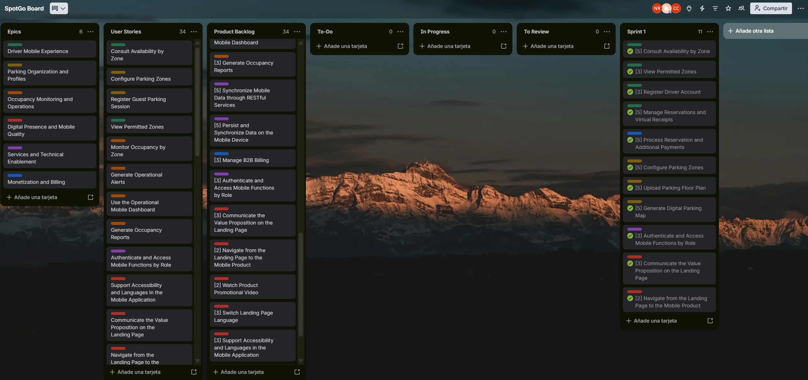

El siguiente desglose presenta las tareas del alcance realizado en el Sprint 1, con estado Completed. Los responsables se distribuyen según la matriz LACX. Las horas son estimaciones por tarea de entre 0,5 y 2 horas, según su dificultad, y no representan tiempos reales registrados ni una conversión directa de Story Points. Los Story Points se contabilizan una sola vez por HU; completar estas tareas de avance no equivale a completar las integraciones previstas para los siguientes sprints.

<table>
  <thead>
    <tr><th colspan="3">User Story</th><th colspan="6">Work-Item / Task</th></tr>
    <tr><th>Id</th><th>Title</th><th>Story Points</th><th>Id</th><th>Title</th><th>Description</th><th>Estimation (Hours)</th><th>Assigned To</th><th>Status</th></tr>
  </thead>
  <tbody>
    <tr>
      <td rowspan="2">US01</td><td rowspan="2">Consult Availability by Zone</td><td rowspan="2" align="center">5</td>
      <td>T01</td><td>Pantalla de disponibilidad</td><td>Mostrar espacios disponibles por zona y la fecha de actualizaci&#243;n.</td><td>1</td><td>@briicarhuaz</td><td>Completed</td>
    </tr>
    <tr>
      <td>T02</td><td>Consulta de disponibilidad</td><td>Desarrollar la consulta backend de disponibilidad prevista para este sprint.</td><td>2</td><td>@briicarhuaz</td><td>Completed</td>
    </tr>
    <tr>
      <td rowspan="2">US04</td><td rowspan="2">View Permitted Zones</td><td rowspan="2" align="center">2</td>
      <td>T03</td><td>Pantalla de zonas permitidas</td><td>Mostrar las zonas habilitadas para el perfil del Driver.</td><td>0.5</td><td>@briicarhuaz</td><td>Completed</td>
    </tr>
    <tr>
      <td>T04</td><td>Consulta de permisos</td><td>Implementar la consulta de zonas seg&#250;n el perfil del Driver.</td><td>1</td><td>@briicarhuaz</td><td>Completed</td>
    </tr>
    <tr>
      <td rowspan="2">US13</td><td rowspan="2">Register Driver Account</td><td rowspan="2" align="center">2</td>
      <td>T05</td><td>Pantalla de registro</td><td>Desarrollar el formulario de registro y sus mensajes de validaci&#243;n.</td><td>1</td><td>@nes-ro</td><td>Completed</td>
    </tr>
    <tr>
      <td>T06</td><td>Registro de cuenta</td><td>Implementar la creaci&#243;n de cuenta y perfil Driver reutilizando los mecanismos de IAM.</td><td>1.5</td><td>@nes-ro</td><td>Completed</td>
    </tr>
    <tr>
      <td rowspan="2">US18</td><td rowspan="2">Manage Reservations and Virtual Receipts</td><td rowspan="2" align="center">5</td>
      <td>T07</td><td>Pantallas de reservas</td><td>Presentar las vistas de creaci&#243;n y consulta de reservas.</td><td>1.5</td><td>@CesarJrCR</td><td>Completed</td>
    </tr>
    <tr>
      <td>T08</td><td>Comprobante virtual y servicios</td><td>Presentar el comprobante virtual y desarrollar el avance de servicios de reservas previsto para el sprint.</td><td>2</td><td>@CesarJrCR</td><td>Completed</td>
    </tr>
    <tr>
      <td rowspan="2">US19</td><td rowspan="2">Process Reservation and Additional Payments</td><td rowspan="2" align="center">5</td>
      <td>T09</td><td>Pantalla de pagos</td><td>Presentar el flujo de pago de reservas y cargos adicionales.</td><td>1.5</td><td>@CesarJrCR</td><td>Completed</td>
    </tr>
    <tr>
      <td>T10</td><td>Servicios de pago</td><td>Desarrollar el avance backend del procesamiento de pagos previsto para este sprint.</td><td>2</td><td>@CesarJrCR</td><td>Completed</td>
    </tr>
    <tr>
      <td rowspan="2">US02</td><td rowspan="2">Configure Parking Zones</td><td rowspan="2" align="center">5</td>
      <td>T11</td><td>Pantalla de zonas</td><td>Desarrollar la interfaz de configuraci&#243;n de zonas y sus reglas.</td><td>1.5</td><td>@IamAndreek</td><td>Completed</td>
    </tr>
    <tr>
      <td>T12</td><td>Configuraci&#243;n de zonas</td><td>Implementar el avance de servicios para registrar zonas y asociar espacios y perfiles.</td><td>2</td><td>@IamAndreek</td><td>Completed</td>
    </tr>
    <tr>
      <td rowspan="2">US16</td><td rowspan="2">Upload Parking Floor Plan</td><td rowspan="2" align="center">3</td>
      <td>T13</td><td>Pantalla de carga de plano</td><td>Desarrollar la selecci&#243;n y carga del plano del estacionamiento.</td><td>1</td><td>@IamAndreek</td><td>Completed</td>
    </tr>
    <tr>
      <td>T14</td><td>Validaci&#243;n del plano</td><td>Implementar la validaci&#243;n de formato y almacenamiento del plano.</td><td>1.5</td><td>@IamAndreek</td><td>Completed</td>
    </tr>
    <tr>
      <td rowspan="2">US17</td><td rowspan="2">Generate Digital Parking Map</td><td rowspan="2" align="center">5</td>
      <td>T15</td><td>Pantalla de mapa digital</td><td>Presentar la configuraci&#243;n del mapa digital a partir del plano cargado.</td><td>1.5</td><td>@IamAndreek</td><td>Completed</td>
    </tr>
    <tr>
      <td>T16</td><td>Generaci&#243;n del mapa</td><td>Desarrollar el avance de generaci&#243;n de zonas y espacios a partir del plano previsto para el sprint.</td><td>2</td><td>@IamAndreek</td><td>Completed</td>
    </tr>
    <tr>
      <td rowspan="2">US09</td><td rowspan="2">Authenticate and Access Mobile Functions by Role</td><td rowspan="2" align="center">3</td>
      <td>T17</td><td>Pantalla de acceso</td><td>Desarrollar la interfaz de inicio de sesi&#243;n y sus mensajes de error.</td><td>1</td><td>@nes-ro</td><td>Completed</td>
    </tr>
    <tr>
      <td>T18</td><td>Autenticaci&#243;n y autorizaci&#243;n</td><td>Implementar el avance de autenticaci&#243;n y acceso por rol previsto para el sprint.</td><td>2</td><td>@nes-ro</td><td>Completed</td>
    </tr>
    <tr>
      <td rowspan="2">US11</td><td rowspan="2">Communicate the Value Proposition on the Landing Page</td><td rowspan="2" align="center">3</td>
      <td>T19</td><td>Contenido y dise&#241;o adaptable</td><td>Implementar las secciones de SpotGo y revisar su presentaci&#243;n y accesibilidad.</td><td>2</td><td>@AdrixRyz</td><td>Completed</td>
    </tr>
    <tr>
      <td>T20</td><td>Despliegue de Landing Page</td><td>Publicar la Landing Page y comprobar su acceso p&#250;blico.</td><td>1</td><td>@AdrixRyz</td><td>Completed</td>
    </tr>
    <tr>
      <td rowspan="2">US12</td><td rowspan="2">Navigate from the Landing Page to the Mobile Product</td><td rowspan="2" align="center">1</td>
      <td>T21</td><td>Navegaci&#243;n entre secciones</td><td>Implementar los enlaces de navegaci&#243;n de la Landing Page.</td><td>0.5</td><td>@AdrixRyz</td><td>Completed</td>
    </tr>
    <tr>
      <td>T22</td><td>Acceso al producto m&#243;vil</td><td>Configurar el enlace al destino oficial del producto m&#243;vil.</td><td>0.5</td><td>@AdrixRyz</td><td>Completed</td>
    </tr>
    <tr><td colspan="2"><strong>Total de HU seleccionadas</strong></td><td align="center"><strong>39</strong></td><td colspan="6">11 HU y 22 tareas; 30.5 horas estimadas en total.</td></tr>
  </tbody>
</table>

##### 4.2.1.4. Development Evidence for Sprint Review

SpotGo reutiliza una base de código desarrollada en ciclos académicos anteriores. Los repositorios actuales `spotgo-landing` y `spotgo-backend` no conservan el historial de commits de ese desarrollo previo, por lo que no es posible presentar una relación de commits que permita trazar cada funcionalidad reutilizada hasta su implementación original.

##### 4.2.1.5. Testing Suite Evidence for Sprint Review

SpotGo reutiliza una base de código desarrollada en el ciclo académico anterior. Los repositorios actuales `spotgo-landing` y `spotgo-backend` no conservan el historial de ejecución ni los reportes de las pruebas realizadas durante ese desarrollo previo, por lo que no es posible presentar evidencias de testing correspondientes a la implementación original.

##### 4.2.1.6. Execution Evidence for Sprint Review

Durante este sprint, el equipo puso en funcionamiento la versión inicial de la **Landing Page**,y se presentó las **pantallas core de la aplicación móvil**..

##### Landing Page

*Figura 75 (SpotGo Landing Home)*

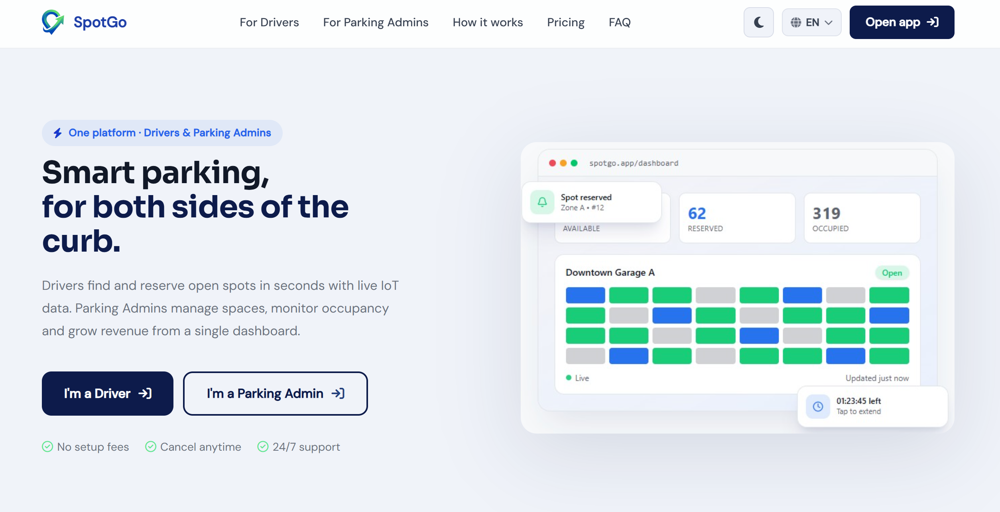

*Figura 76 (SpotGo Landing Drivers)*

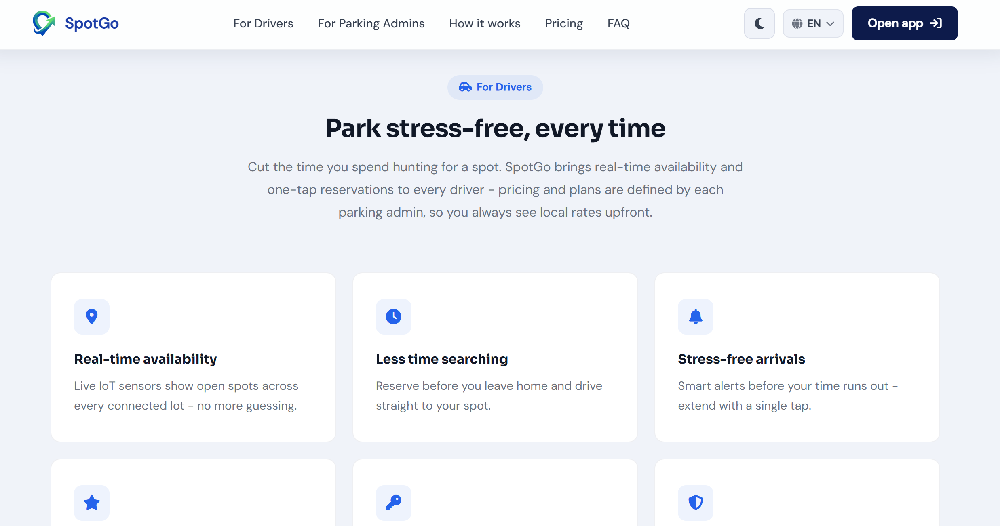

*Figura 77 (SpotGo Landing Admins)*

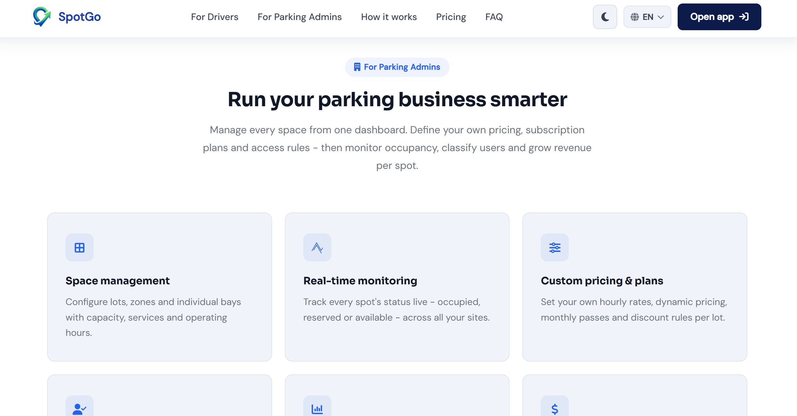

*Figura 78 (SpotGo Landing How Work)*

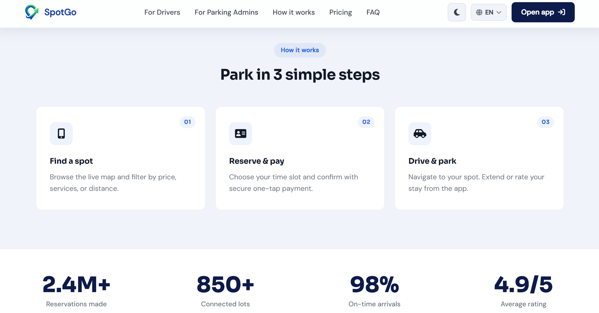

*Figura 79 (SpotGo Landing Pricing)*

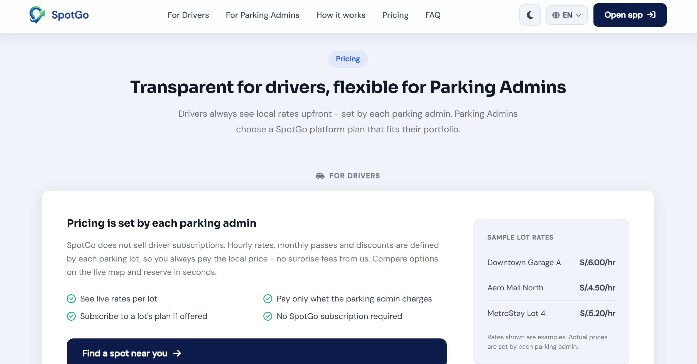

*Figura 80 (SpotGo Landing FAQ)*

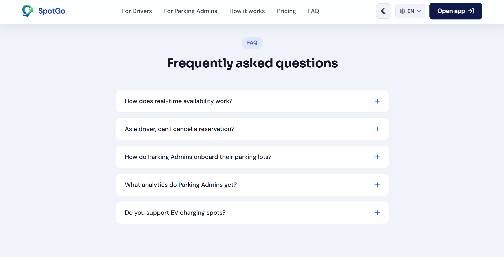

**Demonstration Video:** [https://upcedupe-my.sharepoint.com/:v:/g/personal/u20241e177_upc_edu_pe/IQDYdXQpcuFATYFoR1HYgMP_AQa4ZqLQcXEe6XCnQa2-WBY?nav=eyJyZWZlcnJhbEluZm8iOnsicmVmZXJyYWxBcHAiOiJPbmVEcml2ZUZvckJ1c2luZXNzIiwicmVmZXJyYWxBcHBQbGF0Zm9ybSI6IldlYiIsInJlZmVycmFsTW9kZSI6InZpZXciLCJyZWZlcnJhbFZpZXciOiJNeUZpbGVzTGlua0NvcHkifX0&e=rETy8f](https://upcedupe-my.sharepoint.com/:v:/g/personal/u20241e177_upc_edu_pe/IQDYdXQpcuFATYFoR1HYgMP_AQa4ZqLQcXEe6XCnQa2-WBY?nav=eyJyZWZlcnJhbEluZm8iOnsicmVmZXJyYWxBcHAiOiJPbmVEcml2ZUZvckJ1c2luZXNzIiwicmVmZXJyYWxBcHBQbGF0Zm9ybSI6IldlYiIsInJlZmVycmFsTW9kZSI6InZpZXciLCJyZWZlcnJhbFZpZXciOiJNeUZpbGVzTGlua0NvcHkifX0&e=rETy8f)

##### Pantallas Core

*Figura 81 (Driver-Explore Parking)*

*Figura 82 (Driver-Zone Details & Reserve)*

*Figura 83 (Driver-Payments)*

*Figura 84 (Parking Admin-Dashboard)*

*Figura 85 (Parking Admin-Live Occupancy)*

**Demonstration Video:** 

##### 4.2.1.7. Services Documentation Evidence for Sprint Review

<table>
  <tr><th align="left">Recurso</th><th align="left">Endpoint Base</th><th align="left">Acciones Implementadas</th></tr>
  <tr><td>Authentication</td><td><code>/api/v1/authentication</code></td><td>POST <code>/sign-up</code>, POST <code>/sign-in</code>, POST <code>/password-reset/request</code>, POST <code>/password-reset/confirm</code></td></tr>
  <tr><td>DetectedSpots</td><td><code>/api/v1/detectedSpots</code></td><td>GET, POST, PATCH <code>/{spotId}/status</code>, GET <code>/blueprint/{blueprintId}</code></td></tr>
  <tr><td>Receipts</td><td><code>/api/v1/receipts</code></td><td>GET, POST, GET <code>/{receiptId}</code>, DELETE <code>/{receiptId}</code></td></tr>
  <tr><td>Reservations</td><td><code>/api/v1/reservations</code></td><td>GET, POST, PATCH <code>/{reservationId}</code></td></tr>
  <tr><td>Users</td><td><code>/api/v1/users</code></td><td>GET, GET <code>/{userId}</code>, PATCH <code>/{userId}</code>, PATCH <code>/{userId}/password</code></td></tr>
  <tr><td>Employees</td><td><code>/api/v1/employees</code></td><td>GET, POST, PUT <code>/{employeeId}</code>, PATCH <code>/{employeeId}</code>, DELETE <code>/{employeeId}</code></td></tr>
  <tr><td>Blueprints</td><td><code>/api/v1/blueprints</code></td><td>GET, POST, PUT <code>/{blueprintId}</code>, PATCH <code>/{blueprintId}</code>, DELETE <code>/{blueprintId}</code>, GET <code>/parking/{parkingId}</code></td></tr>
  <tr><td>ClientReports</td><td><code>/api/v1/clientReports</code></td><td>GET, POST, PATCH <code>/{reportId}</code></td></tr>
  <tr><td>OccupancyByHour</td><td><code>/api/v1/occupancyByHour</code></td><td>GET</td></tr>
  <tr><td>WeeklyTrends</td><td><code>/api/v1/weeklyTrends</code></td><td>GET</td></tr>
  <tr><td>Parkings</td><td><code>/api/v1/parkings</code></td><td>GET, POST, GET <code>/{parkingId}</code>, PATCH <code>/{parkingId}</code></td></tr>
  <tr><td>Vehicles</td><td><code>/api/v1/vehicles</code></td><td>GET, POST, DELETE <code>/{vehicleId}</code>, PATCH <code>/{vehicleId}</code></td></tr>
  <tr><td>Analytics</td><td><code>/api/v1/analytics</code></td><td>GET</td></tr>
  <tr><td>Client Plans</td><td><code>/api/v1/clientPlans</code></td><td>GET, GET <code>/{clientPlanId}</code></td></tr>
  <tr><td>Subscriptions</td><td><code>/api/v1/subscriptions</code></td><td>GET, POST, GET <code>/{subscriptionId}</code>, PUT <code>/{subscriptionId}</code>, PATCH <code>/{subscriptionId}</code></td></tr>
  <tr><td>Favorites</td><td><code>/api/v1/favorites</code></td><td>GET, POST, DELETE <code>/{favoriteId}</code></td></tr>
</table>

*Figura 87 (POST /api/v1/authentication/sign-in — Inicio de sesión)*

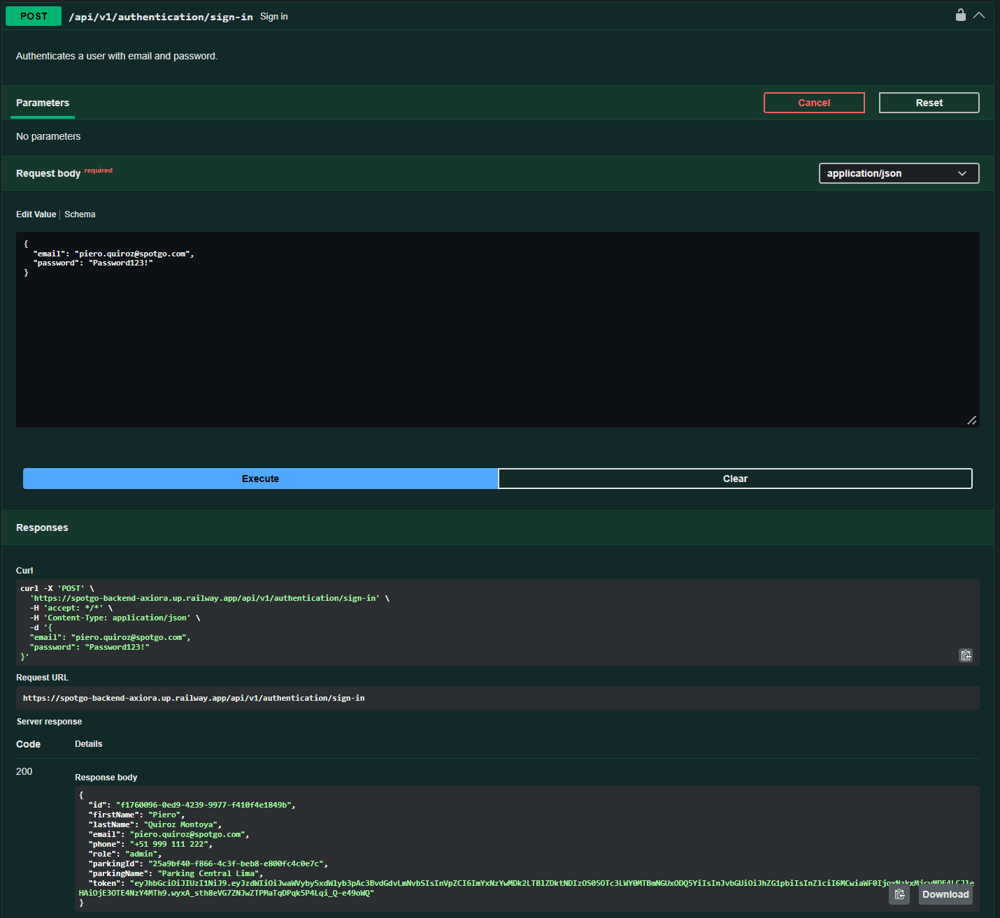

*Figura 88 (GET /api/v1/users — Listado de usuarios)*

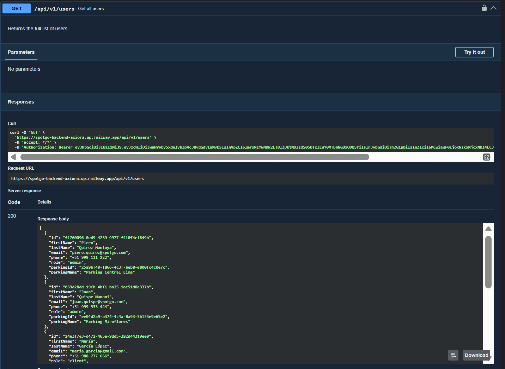

*Figura 89 (POST /api/v1/reservations — Crear una reserva)*

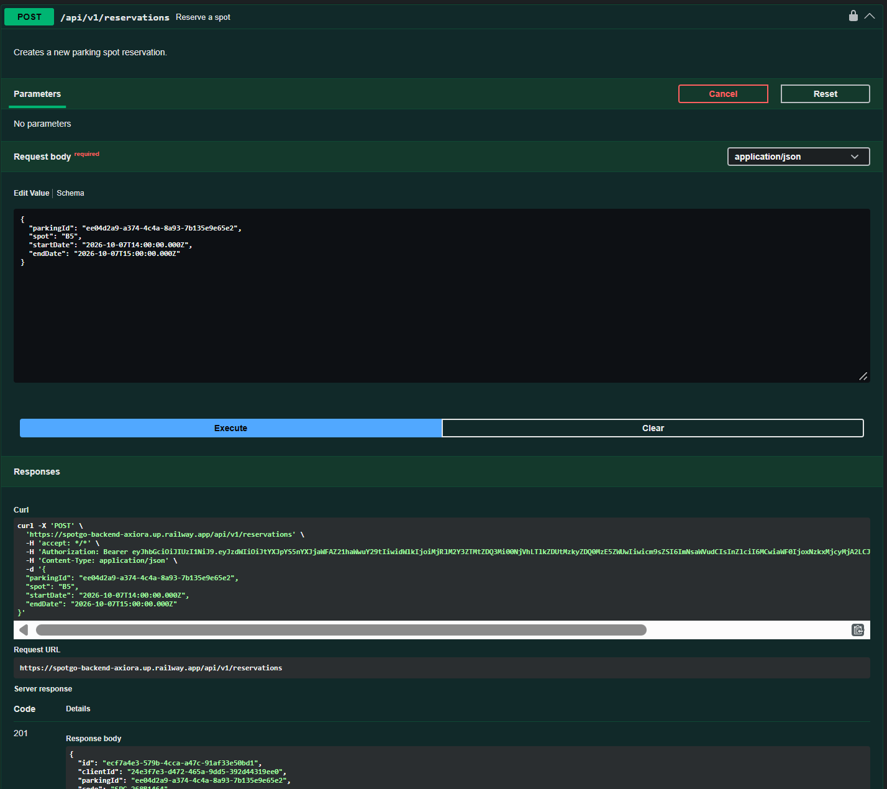

*Figura 90 (GET /api/v1/parkings — Listado de estacionamientos)*

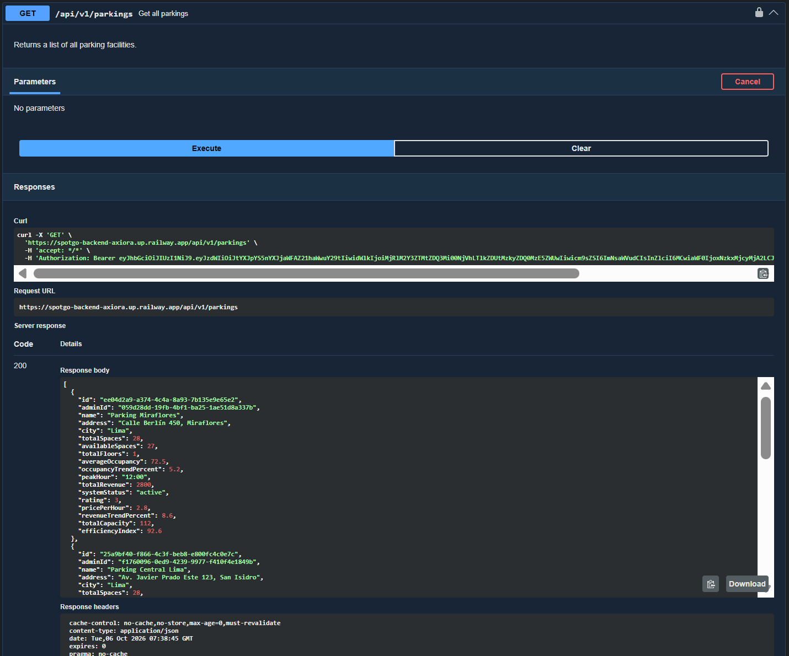

*Figura 91 (POST /api/v1/employees — Crear un empleado)*

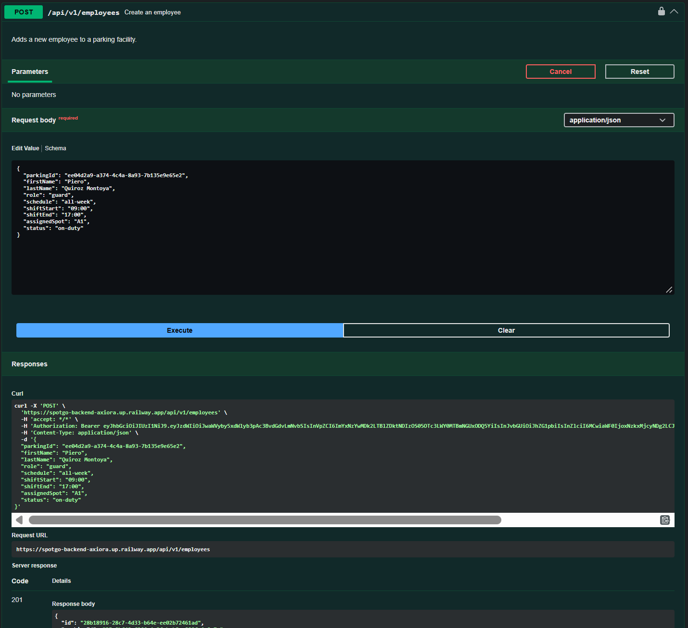

**Demonstration Video:** [https://upcedupe-my.sharepoint.com/:v:/g/personal/u20241e177_upc_edu_pe/IQDtFg7KDwEaQL5bcVnR_3VdAaywr1kmuIA_N8LNvtO27Lo?nav=eyJyZWZlcnJhbEluZm8iOnsicmVmZXJyYWxBcHAiOiJPbmVEcml2ZUZvckJ1c2luZXNzIiwicmVmZXJyYWxBcHBQbGF0Zm9ybSI6IldlYiIsInJlZmVycmFsTW9kZSI6InZpZXciLCJyZWZlcnJhbFZpZXciOiJNeUZpbGVzTGlua0NvcHkifX0&e=gVgLvI](https://upcedupe-my.sharepoint.com/:v:/g/personal/u20241e177_upc_edu_pe/IQDtFg7KDwEaQL5bcVnR_3VdAaywr1kmuIA_N8LNvtO27Lo?nav=eyJyZWZlcnJhbEluZm8iOnsicmVmZXJyYWxBcHAiOiJPbmVEcml2ZUZvckJ1c2luZXNzIiwicmVmZXJyYWxBcHBQbGF0Zm9ybSI6IldlYiIsInJlZmVycmFsTW9kZSI6InZpZXciLCJyZWZlcnJhbFZpZXciOiJNeUZpbGVzTGlua0NvcHkifX0&e=gVgLvI)

##### 4.2.1.8. Software Deployment Evidence for Sprint Review

##### 4.2.1.9. Team Collaboration Insights during Sprint
